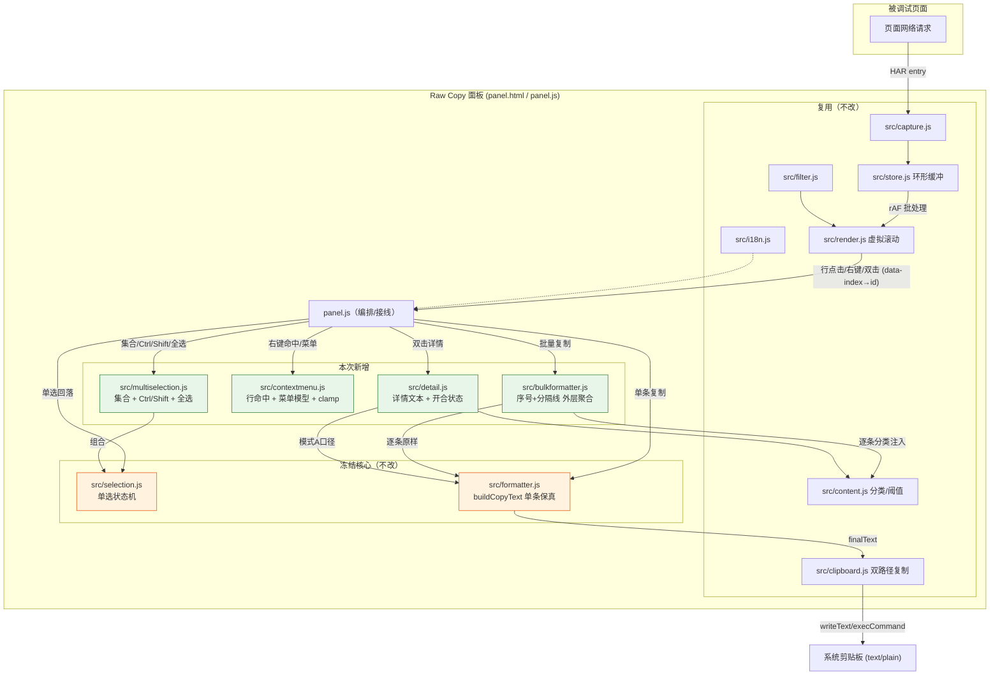

# Plan 契约总纲


<!-- source: butler/spec/在现有-raw-copy-chrome-edge-devtools-mv3-扩展-基础上做功能增/requirement.md -->

# 需求规格书 — 在现有 Raw Copy（Chrome/Edge DevTools MV3 扩展）基础上做功能增强

> slug: `在现有-raw-copy-chrome-edge-devtools-mv3-扩展-基础上做功能增`
> 版本: v1.0 ｜ 日期: 2026-10-02 ｜ 作者: butler-requirement-analyst（Phase ①）
> 上游：`req.txt`（v1.0 基线需求）+ 上一里程碑 `butler/spec/新建一个-chrome-edge-devtools-扩展-manifest-v3-在-devto/requirement.md`

---

## 需求背景（老板原话引用）

> 在现有 Raw Copy（Chrome/Edge DevTools MV3 扩展）基础上做功能增强。核心诉求：复制的入口与查看方式要更方便（用户反馈“复制按钮在下面，找起来还挺麻烦”）。
>
> 新增/变更需求：
> 1【右键菜单复制】请求列表每一行支持右键（context menu）：右键即选中该行并弹出上下文菜单，菜单项至少包含「复制请求 + 响应（原始）」；建议同时提供「仅复制请求」「仅复制响应」（原 P2，可一并实现）。菜单点击执行与现有复制按钮等价的复制逻辑（同样的纯文本原始格式、不美化 JSON、不改动响应体）。底部复制按钮可保留为补充，但右键必须是主要、易达入口。
> 2【多选复制】支持一次选中多条请求并批量复制：
>    - 交互：Ctrl/Cmd+点击 切换单行选中；Shift+点击 范围选择；保留现有单击选中与 ↑↓ 键导航（↑↓ 仍为单选移动）。提供「全选」「复制选中(N)」按钮或右键菜单项，N 为当前选中条数。
>    - 输出：多条请求依次拼接，每条之间要有清晰分隔（如分隔线/序号），且每条内容仍为「该条请求 + 该条响应」的原始纯文本（保持模式 A/B 语义）；不得把多条内容混淆成一条。
>    - 单选行为保持不变（现有单条复制格式逐字符不变）。
> 3【双击查看】在请求列表行上**双击**某条请求 → 打开该请求的完整明细视图（请求方法与 URL、请求头、请求体、响应状态码与状态文本、响应头、响应体），内容为原始文本（不美化 JSON、不改动响应体，与复制口径一致），便于不复制也能直接查看。可放在面板内详情区/抽屉/弹层；需可关闭并返回列表。单击仍为“选中”，双击才触发查看（避免与选中/多选冲突）。明细视图可提供「复制请求+响应」按钮（可选）。
> 4【兼容/保持】沿用现有技术约束：MV3、无第三方依赖、最小权限（仅 clipboardWrite，不新增 host/网络权限）、零网络传输、响应体字符级保真、大响应/二进制/Base64 处理规则不变。
>
> 重要：本需求**明确覆盖**原需求文档 req.txt 中的非目标“不复制全部请求 / 只复制当前选中的那一条请求，绝不附带其他请求”——用户现在主动要求多选复制；单条仍为默认与主要场景。请在规格中显式记录此变更。
>
> 需求原文见 req.txt（作为产品基础上下文，本增强在其上叠加）。

> [脱敏] 未检测到 API Key / Secret / Token 等敏感信息（原话未含 `[A-Za-z0-9_-]{20,}` 形式的密钥/令牌）。

### 基线上下文（req.txt 逐条保留要点，本增强在其上叠加）

- **基线目标**：在 DevTools 新增面板，实时展示当前页面网络请求列表；用户选中**任意一条**请求，一键复制该请求完整信息与响应结果；复制内容为纯文本，保留原始内容；不进行 JSON 美化/重新格式化/改变原始响应体。
- **基线非目标**（req.txt §3.2，逐条保留）：不复制全部请求；不自动上传数据到任何服务器；不自动发送给 AI；不做 JSON 美化/压缩/排序/语法高亮；不修改、拦截、阻断任何网络请求；不收集用户数据、不埋点、不遥测；不请求与功能无关的敏感权限。
- **基线目标用户**（§4）：前端开发、测试工程师、后端开发、技术支持。
- **基线功能需求**（§5）：5.1 DevTools 面板（名称 `Raw Copy`/`请求复制`，与 Elements/Console/Network 并列）；5.2 请求捕获（XHR/Fetch/Document/Script/Stylesheet/Image/Font/Media/WebSocket；默认全部 + 过滤；实时追加；内存最多保留最近 N 条默认 1000）；5.3 请求列表（方法/URL/状态码/资源类型/耗时/大小/时间；按 URL 搜索、按方法/状态码/资源类型过滤、点击选中、↑↓ 导航）；5.4 单条复制（「复制请求 + 响应（原始）」；可选「仅复制请求」「仅复制响应」「复制为 cURL」非必须）；5.5 复制内容要求（请求：方法/完整 URL/HTTP 版本/请求头原始顺序/请求体；响应：状态码/状态文本/响应头原始顺序/响应体；可选元信息：开始时间/总耗时/资源类型/MIME，放简单标题段不干扰正文）；5.6 复制格式（模式 A 简单格式化=默认；模式 B 纯原始模式）；5.7 明确禁止的格式化行为（不解析 JSON、不缩进/换行/排序、不压缩、不 `JSON.stringify` 对象、不改字符、不转 Markdown 代码块、不截断除用户配置或过大提示）；5.8 大响应与二进制处理（超阈值如 10MB 提示；二进制 `[Binary content omitted: ...]`；Base64 文本类 MIME 尝试 UTF-8 解码否则 `[Base64 content omitted: ...]`）；5.9 剪贴板与提示（成功 Toast/状态栏，失败提示原因，不经网络传输）。
- **基线交互流程**（§6）：打开 DevTools → 进入 Raw Copy 面板 → 列表实时显示 → 搜索/过滤 → 点击选中 → 点击复制 → 剪贴板获得完整纯文本 → 粘贴给 AI。
- **基线技术实现建议**（§7，逐条保留）：MV3；`devtools_page` 注册；`chrome.devtools.panels.create` 创建面板；`chrome.devtools.network.onRequestFinished.addListener` + HAR entry；HAR entry 缓存在内存数组；原生 JS，无第三方框架；不需要 background service worker；不需要 content script。权限最小：仅 `clipboardWrite`，不申请 `<all_urls>`/`host_permissions`/`tabs`/`webRequest`/`declarativeNetRequest`，无网络请求代码。复制：优先 `navigator.clipboard.writeText`，失败降级 `document.execCommand('copy')`，内存拼接不经服务器。HAR 映射：`request.method`/`url`/`headers`/`postData.text`，`response.status`/`statusText`/`headers`/`content.text`/`encoding`/`mimeType`，`time`/`startedDateTime`；headers 按序 `name: value`；`encoding === "base64"` 按 MIME 判断是否解码；不解析 JSON。
- **基线安全与隐私**（§8）：数据仅在 DevTools 内存；关闭 DevTools 数据销毁；不收集/存储/传输；无服务器/分析/遥测/广告；不请求敏感权限；建议开源 MIT/Apache-2.0；提供隐私政策页面。
- **基线非功能需求**（§9，逐条保留）：性能（捕获不影响页面性能；列表虚拟滚动，1000 条不卡顿）；兼容（最新版 Chrome 和 Edge）；体积（扩展包 < 200KB）；依赖（零第三方运行时依赖）；界面语言（中文优先，可预留英文）；可靠性（复制成功率 100%，异常有提示）。
- **基线验收标准**（§10，逐条保留）：①装扩展开 DevTools 见新面板；②访问网站列表实时显示；③列表支持搜索/过滤/点击选中；④复制内容含请求方法/URL/请求头/请求体 + 响应状态码/响应头/响应体；⑤复制内容不包含其他请求；⑥JSON 响应体与原始完全一致（无额外缩进/换行/排序）；⑦复制过程不发网络请求；⑧权限清单无 `<all_urls>`/`host_permissions`/`webRequest`；⑨大响应与二进制按需求处理；⑩复制成功有明确提示。
- **基线交付物**（§11，逐条保留）：完整源码；打包后的扩展 ZIP；安装说明；使用说明；隐私政策页面；测试用例；如开源提供 LICENSE。
- **基线里程碑**（§12，逐条保留）：M1 面板框架；M2 捕获与列表；M3 单条复制 + 原始文本拼接；M4 搜索、过滤、大响应处理；M5 测试、打包、隐私政策、交付。
- **基线复制输出示例**（§13）：模式 A 示例（`===== REQUEST =====` / `POST ... HTTP/1.1` / 头 / `[Request Body]` / `===== RESPONSE =====` / `HTTP/1.1 200 OK` / 头 / `[Response Body]`），响应体 `{"code":0,"message":"success","token":"xyz789"}` 必须原样输出，不允许格式化/排序/Markdown 代码块。

> 本增强**仅叠加**新增能力；除第 2 项多选复制明确覆盖「不复制全部请求/只复制单条」两条非目标外，其余基线目标/指标/约束/交付物**全部继续有效**，不得删项。

---

## 需求理解

> Phase 1..4 逐段呈现。Phase 1 = 字面提取；Phase 2 = 必备组件拆解；Phase 3 = 边界与范围收敛；Phase 4 = 输出规格（本文件即最终规格书人读视图，机器真源见同目录 `spec.json`）。

### Phase 1: 字面需求分析

#### 明确功能点（均来自老板原话）
- F1 右键菜单复制：列表每一行支持右键 context menu；右键即选中该行并弹出上下文菜单；菜单项**至少**含「复制请求 + 响应（原始）」。
- F2 右键菜单附加项（P2）：建议同时提供「仅复制请求」「仅复制响应」。
- F3 菜单执行逻辑与现有复制按钮**等价**：同样纯文本原始格式、不美化 JSON、不改动响应体。
- F4 入口优先级：底部复制按钮**可保留为补充**，但右键必须是**主要、易达入口**。
- F5 多选交互：Ctrl/Cmd+点击切换单行选中；Shift+点击范围选择；**保留**现有单击选中与 ↑↓ 键导航（↑↓ 仍为单选移动）。
- F6 多选入口：提供「全选」「复制选中(N)」按钮或右键菜单项，N = 当前选中条数。
- F7 多选输出：多条**依次拼接**，每条之间有**清晰分隔**（分隔线/序号），每条内容仍为「该条请求 + 该条响应」原始纯文本（保持模式 A/B 语义）。
- F8 多选不得把多条内容**混淆成一条**。
- F9 单选行为保持不变（现有单条复制格式**逐字符不变**）。
- F10 双击查看：在请求列表行上双击 → 打开该请求完整明细视图（方法 + URL、请求头、请求体、状态码 + 状态文本、响应头、响应体）。
- F11 明细内容为**原始文本**（不美化 JSON、不改动响应体，与复制口径一致）。
- F12 明细可放面板内详情区/抽屉/弹层；**需可关闭并返回列表**。
- F13 单击 = 选中，**双击才触发查看**（避免与选中/多选冲突）。
- F14 明细视图**可**提供「复制请求+响应」按钮（可选）。
- F15 兼容/保持：MV3；无第三方依赖；最小权限（仅 clipboardWrite，不新增 host/网络权限）；零网络传输；响应体字符级保真；大响应/二进制/Base64 处理规则不变。
- F16 需求覆盖：本需求**明确覆盖** req.txt 非目标「不复制全部请求 / 只复制当前选中的那一条请求，绝不附带其他请求」；单条仍为默认与主要场景。

#### 角色/参与者
- 前端开发：调试 API，把请求+响应完整发给 AI（右键/双击提升取用速度）。
- 测试工程师：批量把多条请求+响应附到 Bug 报告（多选复制）。
- 后端开发：排查接口时直接双击查看原文（无需复制）。
- 技术支持：复制用户侧请求分析。
- （以上角色沿用 req.txt §4，行为为本增强新增。）

#### 技术约束（原话）
- MV3、无第三方依赖、最小权限（仅 clipboardWrite，不新增 host/网络权限）、零网络传输。
- 响应体字符级保真；大响应/二进制/Base64 处理规则不变。

#### 非功能要求（原话 + 基线继承）
- 响应体字符级保真（增强不得破坏）。
- 入口更易达：右键成为主要入口；双击直接查看。
- 兼容/保持基线全部约束（req.txt §9：性能、兼容、体积 <200KB、零依赖、中文优先、可靠性）。

#### 模糊点（需确认）
- [ASSUMPTION: A-1] 「复制选中(N)」中 N 的统计范围 = 当前**过滤后可见**列表的选中条数（沿用基线列表过滤语义）。
- [ASSUMPTION: A-2] 多选「全选」= 选中当前过滤后可见的全部行（而非全量缓存），与 A-1 一致。
- [ASSUMPTION: A-3] 右键菜单也可承载「复制选中(N)」；若与按钮并存，二者等价（原话为“按钮或右键菜单项”）。
- [ASSUMPTION: A-4] 明细视图默认可复用现有复制模式（A/B）设置；明细展示始终原始文本，模式 A/B 只影响“复制”产物。
- [ASSUMPTION: A-5] 多选分隔采用「分隔线 + 序号」组合（原话“如分隔线/序号”为示例，非强制单一形式）。
- [ASSUMPTION: A-6] 双击触发详情时，该行是否同时被选中按“单击选中”语义处理（双击前必有一次 click，故该行会先被选中）；详情打开不改动多选集合。

### Phase 2: 深挖必备组件

> 分类学仅作内部检查清单，不输出全文；仅列匹配项。

#### 组件映射表
| 功能点 | 依赖组件 | 标记 | 依据 |
|--------|---------|------|------|
| F1–F4 右键菜单复制 | 行级 contextmenu 监听 + 菜单 UI + 命中判定（行→recordId） | 【必须】 | 无菜单则右键入口不存在 |
| F1/F3 右键复制复用 | 现有复制管线（formatter.buildCopyText + clipboard.copyText + Toast）**复用**，不得另起一套 | 【必须】 | 原话“执行与现有复制按钮等价的复制逻辑” |
| F2 仅复制请求/响应 | formatter 的 request-only / response-only 分支 + 菜单项 | 【可选】 | 原话“建议同时提供…（原 P2，可一并实现）” |
| F5 Ctrl/Shift 多选 | 现有 selection 单选状态机**扩展**为选中集合（多选模式） | 【必须】 | 多选交互的承载 |
| F5 保留单选/↑↓ | selection 单选语义回落（单击替换、↑↓ 单选移动、clamp） | 【必须】 | 原话“保留现有单击选中与 ↑↓ 键导航” |
| F6 全选/复制选中(N) | 工具栏按钮 + 计数渲染 + 可选右键菜单项 | 【必须】 | 原话明确要求提供入口 |
| F7/F8 多选拼接 | 多记录拼接器（分隔线/序号 + 每条各自 buildCopyText 原样） | 【必须】 | 多选输出的核心，且不得混淆 |
| F9 单条逐字符不变 | 基线 formatter golden 契约**冻结** | 【必须】 | 原话“逐字符不变” |
| F10/F12 双击详情 | 行 dblclick 监听 + 详情区/抽屉/弹层容器 + 关闭返回 | 【必须】 | 原话明确要求 |
| F11 详情原始文本 | 复用现有格式化/保真读取（含大响应/二进制/base64 分类） | 【必须】 | 原话“与复制口径一致” |
| F13 单击≠双击 | 事件分流（click 选中 / dblclick 详情） | 【必须】 | 避免与选中/多选冲突 |
| F14 详情内复制按钮 | 复用复制管线 | 【可选】 | 原话“可提供（可选）” |
| F15 兼容/权限 | manifest 权限维持 clipboardWrite；无新增 host/网络 | 【必须】 | 原话硬约束 |
| F16 非目标覆盖 | 规格书面记录 + 回归用例调整 | 【必须】 | 原话“请在规格中显式记录此变更” |
| 新 UI 文案 | i18n zh/en 键集对齐（右键菜单/多选/详情） | 【必须】 | 基线中文优先 + zh/en 对齐约定 |

#### 未匹配的功能点
- 无自研算法类新功能；全部为对既有模块（selection / formatter / clipboard / panel）的交互与组合扩展。

#### 非标准组件
- 多记录拼接器（bulk copy）：需明确「分隔符 + 序号 + 每条各自原始块」的确定性结构，属本项目自定义逻辑。

### Phase 3: 需求规格书（草案）

#### 1. 产品概述
在既有 Raw Copy（DevTools MV3）扩展上，新增「右键菜单复制」「多选批量复制」「双击查看明细」三项能力，使复制取用更易达、支持批量、并可在不复制的前提下直接查看完整请求/响应原文；全部保持基线的纯文本保真与最小权限约束。

#### 2. 核心功能
| ID | 功能 | 描述 | 优先级 |
|----|------|------|--------|
| R-001 | 右键菜单复制 | 行右键即选中并弹出上下文菜单，至少含「复制请求 + 响应（原始）」 | P0 |
| R-002 | 右键附加项 | 菜单提供「仅复制请求」「仅复制响应」 | P2 |
| R-003 | 菜单复用复制管线 | 菜单项执行与底部按钮等价逻辑（同格式、不美化、不改响应体） | P0 |
| R-004 | 入口优先级 | 底部按钮保留为补充；右键为主要、易达入口 | P0 |
| R-005 | 多选交互 | Ctrl/Cmd+点击切换单行；Shift+点击范围；保留单击选中与 ↑↓ 单选移动 | P0 |
| R-006 | 多选入口 | 「全选」「复制选中(N)」按钮或右键菜单项，N=选中条数 | P0 |
| R-007 | 多选输出 | 多条依次拼接，清晰分隔（分隔线/序号），每条仍为请求+响应原始纯文本（模式 A/B） | P0 |
| R-008 | 单选不变 | 单条复制格式逐字符不变 | P0 |
| R-009 | 双击查看 | 双击行打开完整明细（方法/URL、请求头、请求体、状态码+状态文本、响应头、响应体） | P0 |
| R-010 | 明细原始文本 | 与复制口径一致：不美化、不改响应体 | P0 |
| R-011 | 明细容器与关闭 | 面板内详情区/抽屉/弹层；可关闭返回列表 | P0 |
| R-012 | 单击/双击分流 | 单击=选中，双击=查看 | P0 |
| R-013 | 明细内复制 | 明细可提供「复制请求+响应」按钮 | P2 |
| R-014 | 兼容保持 | MV3 / 零依赖 / 最小权限(仅 clipboardWrite) / 零网络 / 字符级保真 / 大响应·二进制·Base64 规则不变 | P0 |
| R-015 | 需求覆盖记录 | 显式覆盖 req.txt 非目标（多选复制），单条仍为默认主场景 | P0 |

#### 3. 组件需求
| ID | 组件 | 类型 | 标记 | 关联功能 |
|----|------|------|------|---------|
| C-001 | 行级 context menu（右键选中 + 菜单 UI + 命中判定） | UI | 【必须】 | R-001..R-004 |
| C-002 | 复制管线复用（formatter / clipboard / Toast） | 数据/API | 【必须】 | R-003, R-007 |
| C-003 | selection 多选扩展（集合 + Ctrl/Shift + 全选，回落单选） | UI | 【必须】 | R-005, R-006 |
| C-004 | 多记录拼接器（分隔线/序号 + 每条原始块） | 数据 | 【必须】 | R-007 |
| C-005 | 双击详情视图（容器 + 关闭 + 原始渲染） | UI | 【必须】 | R-009..R-013 |
| C-006 | i18n 新键（菜单/多选/详情，zh/en 对齐） | UI | 【必须】 | R-001..R-013 |
| C-007 | manifest 权限维持（仅 clipboardWrite） | 运维 | 【必须】 | R-014 |
| C-008 | 测试与回归（右键/多选/详情 + 单条逐字符回归） | 验证 | 【必须】 | R-008, R-014 |

#### 4. 角色定义
| 角色 | 职责 | 系统交互 |
|------|------|---------|
| 前端开发 | 快速取用请求+响应原文给 AI | 右键单条复制；多选批量复制 |
| 测试工程师 | 批量附证据到 Bug 报告 | 多选 + 复制选中(N) |
| 后端开发 | 不复制直接查看原文排查 | 双击查看明细 |
| 技术支持 | 复制用户侧请求分析 | 右键/多选复制 |

#### 5. 范围边界
（详见下方「需求边界确认」段。）

#### 6. 假设与决策日志
| ID | 类型 | 内容 | 状态 |
|----|------|------|------|
| DEC-001 | 假设 | 「复制选中(N)」的 N 与「全选」范围 = 当前过滤后可见列表（A-1/A-2） | 待确认 |
| DEC-002 | 假设 | 右键菜单亦可承载「复制选中(N)」，与按钮等价（A-3） | 待确认 |
| DEC-003 | 假设 | 明细展示始终原始文本；复制模式 A/B 只影响“复制”产物（A-4） | 待确认 |
| DEC-004 | 假设 | 多选分隔采用「分隔线 + 序号」组合（A-5） | 待确认 |
| DEC-005 | 决策 | 多选复制**覆盖** req.txt 非目标「不复制全部请求/只复制单条」（F16） | 已确认（老板原话） |
| DEC-006 | 决策 | 底部复制按钮保留为补充，右键为**主要**入口（F4） | 已确认（老板原话） |
| DEC-007 | 决策 | 单选复制格式**逐字符不变**，为门禁级冻结契约（F9） | 已确认（老板原话） |

#### 7. 非目标覆盖声明（显式记录）
req.txt §3.2 原非目标包含：「不复制全部请求」「只复制当前选中的那一条请求，绝不附带其他请求」。
**本增强明确推翻该二者**：用户现主动要求多选复制。变更后语义：
- 单条复制仍是默认与主要场景，且格式逐字符不变（DEC-007 冻结）。
- 多选复制为新增能力，输出结构确定（分隔线/序号），每条内容各自保真，不得混淆成一条。
- 其余非目标（不上传、不自动发 AI、不美化、不建连、不改网络、不收集数据、不请求无关权限）**继续有效**。

### Phase 4: 输出规格书（本文件）

本文件即 Phase 4 Markdown 模式规格书（人读视图）；同目录 `spec.json` 为机器真源，`spec.md` 为一致视图。
机器真源条目：US-001..US-004（角色故事）/ REQ-001..REQ-024（需求）/ DEL-001..DEL-008（交付物）/ AC-001..AC-017（验收），共 53 条。

---

## 需求边界确认

> 三视角交叉核对，仅用于核对“用户已提内容”的完整性；无原话依据者一律 `[ASSUMPTION]`（待确认），不得擅自纳入。

| 视角 | 探测项 | 依据(用户原话/[ASSUMPTION]) | 判定(已覆盖/待确认/Out) | 理由 |
|------|--------|------------------------------|--------------------------|------|
| 主体 | 右键对“每一行”均可用（含过滤后行） | 原话“请求列表每一行支持右键” | 已覆盖 | 原话明确每一行 |
| 主体 | 菜单作用于“右键命中的那一行” | 原话“右键即选中该行并弹出上下文菜单” | 已覆盖 | 先选中再弹菜单 |
| 主体 | 多选集合中的每条均独立成块 | 原话“每条内容仍为「该条请求 + 该条响应」的原始纯文本” | 已覆盖 | 逐条保真 |
| 主体 | 明细视图查看“某一条” | 原话“双击某条请求 → 打开该请求的完整明细视图” | 已覆盖 | 单条明细 |
| 主体 | 「复制选中(N)」N 的统计范围=可见列表 | [ASSUMPTION: A-1] | 待确认 | 原话只说 N=选中条数，未界定可见/全量 |
| 主体 | 「全选」范围=可见列表 | [ASSUMPTION: A-2] | 待确认 | 同上 |
| 场景 | 正常路径：右键→复制→Toast | 原话“点击执行与现有复制按钮等价的复制逻辑” | 已覆盖 | 复用现有成功/失败提示 |
| 场景 | 正常路径：Ctrl/Shift 多选→复制选中(N) | 原话交互与入口要求 | 已覆盖 | 明确交互 |
| 场景 | 正常路径：双击→明细→关闭返回 | 原话“需可关闭并返回列表” | 已覆盖 | 明确 |
| 场景 | 边界：单击与双击不冲突 | 原话“单击仍为选中，双击才触发查看” | 已覆盖 | 事件分流 |
| 场景 | 边界：单选与多选互不破坏 | 原话“保留现有单击选中与 ↑↓ 键导航” | 已覆盖 | 单选回落 |
| 场景 | 边界：↑↓ 在多选态的行为 | [ASSUMPTION: A-6/↑↓ 仍为单选移动] | 待确认 | 原话仅说“↑↓ 仍为单选移动”，未说明是否清空多选 |
| 场景 | 异常：复制失败提示 | 继承基线（原话“处理规则不变”） | 已覆盖 | 复用现有失败 Toast |
| 场景 | 异常：大响应确认弹窗在多选时的行为 | [ASSUMPTION: 逐条或整体确认，待定] | 待确认 | 原话未述，需下游设计确认 |
| 形态 | 多选分隔形式（分隔线/序号） | 原话“如分隔线/序号”+ [ASSUMPTION: A-5] | 待确认 | 原话为示例，形式需落地 |
| 形态 | 模式 A/B 语义在多选下保持 | 原话“保持模式 A/B 语义” | 已覆盖 | 每条各自按当前模式拼接 |
| 形态 | 明细容器形态（详情区/抽屉/弹层） | 原话三选一“可放在…；需可关闭” | 已覆盖（形态由设计定） | 关闭与返回为硬要求 |
| 形态 | 明细内复制按钮 | 原话“可提供…（可选）” | 已覆盖（P2 可选） | 可选能力 |
| 形态 | 右键菜单是否含「复制选中(N)」 | [ASSUMPTION: A-3] | 待确认 | 原话“按钮或右键菜单项”，二选一 |
| 形态 | 输出不新增 host/网络权限、零网络 | 原话“最小权限…零网络传输” | 已覆盖 | 硬约束 |
| — | req.txt 非目标「不复制全部请求 / 只复制单条」 | 原话“本需求明确覆盖…请显式记录该变更” | 已覆盖（已推翻，见 DEC-005） | 用户主动要求多选 |
| — | 其余 req.txt 非目标（不上传/不发 AI/不美化/不改网络/不收集/无无关权限） | 原话“沿用现有技术约束” | 已覆盖（继续有效） | 未被推翻 |
| — | 不做 JSON 美化/格式化/排序/高亮 | 原话“不美化 JSON、不改动响应体” | 已覆盖 | 保真契约 |
| — | 不引入第三方依赖 | 原话“无第三方依赖” | 已覆盖 | 硬约束 |
| — | 不改动、拦截、阻断网络请求 | req.txt 基线非目标 + 原话“处理规则不变” | 已覆盖 | 继续有效 |
| — | 复制为 cURL / 其他格式化导出 | req.txt §5.4 标注“非必须” | Out | 本增强未提及，不纳入 |

---

## 验收标准草案

| ID | 验收标准 | 来源 |
|----|---------|------|
| AC-001 | 在请求列表任意行上右键：该行被选中并弹出上下文菜单，菜单至少含「复制请求 + 响应（原始）」项 | R-001 |
| AC-002 | 点击右键菜单「复制请求 + 响应（原始）」后，剪贴板内容与点击底部同名复制按钮得到的文本**逐字符一致**（模式 A、模式 B 分别校验） | R-003 |
| AC-003 | 右键菜单含「仅复制请求」「仅复制响应」（P2）时，其剪贴板产物与对应按钮等价 | R-002 |
| AC-004 | Ctrl/Cmd+点击切换单行选中；Shift+点击范围选择；单击仍为单选替换；↑↓ 仍为单选移动——四者互不破坏 | R-005 |
| AC-005 | 点击「全选」后当前列表全选；「复制选中(N)」中的 N 等于当前选中条数且实时更新 | R-006 |
| AC-006 | 多选复制输出含 N 段，每段为该条「请求+响应」原始纯文本，段间有清晰分隔（分隔线/序号），无内容混淆、无跨条拼接错误 | R-007 |
| AC-007 | 单选复制输出与基线 golden 用例**逐字符一致**（不因增强而改变） | R-008 |
| AC-008 | 双击某行打开明细视图，内容含：请求方法与 URL、请求头、请求体、响应状态码与状态文本、响应头、响应体 | R-009 |
| AC-009 | 明细视图中响应体与原始响应体逐字符相等（不缩进/不换行/不排序/不转 Markdown）；请求/响应头保持原始顺序 | R-010 |
| AC-010 | 明细视图可关闭并返回列表；单击仅选中、不打开明细（仅双击打开） | R-011, R-012 |
| AC-011 | 明细视图提供「复制请求+响应」按钮时，其产物与主复制按钮一致（P2） | R-013 |
| AC-012 | manifest 权限仍仅 `clipboardWrite`；无 `<all_urls>`、无 `host_permissions`、无 `webRequest`、无新增网络/主机权限 | R-014 |
| AC-013 | 复制/查看全流程扩展不发出任何网络请求（零网络传输） | R-014 |
| AC-014 | 大响应阈值提示、二进制标注、Base64 处理规则与基线一致 | R-014 |
| AC-015 | 现有基线用例（捕获/过滤/虚拟滚动/单选/单条复制/剪贴板）全部回归通过 | R-008, R-014 |
| AC-016 | 扩展包体积仍 < 200KB，且仍为**零第三方运行时依赖** | R-014 |
| AC-017 | 规格明确记录：多选复制已取代 req.txt 非目标「不复制全部请求/只复制单条」，且单条仍为默认与主要场景 | R-015 |

<!-- butler:covers US-001 US-002 US-003 US-004 REQ-001 REQ-002 REQ-003 REQ-004 REQ-005 REQ-006 REQ-007 REQ-008 REQ-009 REQ-010 REQ-011 REQ-012 REQ-013 REQ-014 REQ-015 REQ-016 REQ-017 REQ-018 REQ-019 REQ-020 REQ-021 REQ-022 REQ-023 REQ-024 DEL-001 DEL-002 DEL-003 DEL-004 DEL-005 DEL-006 DEL-007 DEL-008 AC-001 AC-002 AC-003 AC-004 AC-005 AC-006 AC-007 AC-008 AC-009 AC-010 AC-011 AC-012 AC-013 AC-014 AC-015 AC-016 AC-017 -->


<!-- source: butler/spec/在现有-raw-copy-chrome-edge-devtools-mv3-扩展-基础上做功能增/design.md -->

# 设计文档 — 在现有 Raw Copy（Chrome/Edge DevTools MV3）基础上做功能增强

> slug: `在现有-raw-copy-chrome-edge-devtools-mv3-扩展-基础上做功能增`
> 阶段: Phase ②（架构设计 + 四维 CIA 变更影响扫描）| 日期: 2026-10-02 | 角色: butler-dev-design
> 上游: `requirement.md`（v1.0，53 条机器真源）+ `spec.json`（4 US / 24 REQ / 8 DEL / 17 AC = 53 items）+ `feasibility.md`（✅ 可执行，VALUE high / RISK medium / EFFORT medium≈19 SP+2）
> 规范: **只分析不执行**（本文档不修改源码、不运行构建）。证据分级：confirmed / likely / inconclusive。
> 基线: `butler/spec/新建一个-chrome-edge-devtools-扩展-manifest-v3-在-devto/design.md`（ADR-001..011 命名空间延续）

---

## 0. 结论摘要

| 项 | 结论 |
|----|------|
| 影响性质 | **增量增强（incremental）** —— 在既有 `extension/` 上叠加，**不新增权限、不新增网络、不变更技术栈** |
| 架构形态 | 保持 MV3 DevTools 面板单页面（panel 上下文）；新增 **3 个纯逻辑模块 + 1 个多选包装模块**，全部走既有复制管线 |
| 冻结契约 | `src/formatter.js`（`buildCopyText`）与 `src/selection.js`（单选状态机）**字节级冻结、禁止改动**；单选复制输出逐字符不变（AC-007 / DEC-007） |
| 关键架构裁决 | 多选不侵入 `selection.js`，改由**新增 `src/multiselection.js` 组合式包装**单选核心（ADR-012）→ 直接降低 feasibility R-02 回归风险 |
| 右键菜单权限 | **必须面板内自绘 DOM 菜单**（`contextmenu` + 定位 + Esc/失焦关闭），**零 `contextMenus` 权限**（AC-012 / feasibility R-03 硬约束，ADR-013） |
| CIA 完整性 | A/B/C/D 四维各含 ≥1 条 `confirmed` → **无 `[cia_incomplete]`** |
| 待裁决项 | DEC-001..004 / A-1..A-6 / R-06 全部在本设计**拍板定稿**（见 §4 ADR-012..020），无阻塞 |

---

## 影响范围分析

### 1.1 模块级影响（逐模块）

| 模块 | 变更类型 | 变更内容 | 影响范围（文件/服务） | 风险等级 | 确信度 |
|------|:--------:|---------|:--------------------:|:--------:|:------:|
| Panel 编排 | 修改 | 右键委托、多选接线、详情容器接线、批量复制入口、`renderRow` 高亮改集合判定 | `extension/panel.js`（主接线面，891 行） | **H** | confirmed |
| Panel 结构 | 修改 | 新增工具栏多选按钮/计数、自绘菜单容器、详情抽屉容器 | `extension/panel.html` | M | confirmed |
| Panel 样式 | 修改 | 菜单/详情抽屉/多选高亮/按钮样式；沿用 token | `extension/styles/panel.css` | L | confirmed |
| i18n 文案 | 修改 | 新增 右键菜单 / 多选 / 详情 键集（zh + en 对齐） | `extension/src/i18n.js`（`dict`，26 行） | L | confirmed |
| Selection 单选 | **冻结** | **不改动**——保持 `selectAt/move/selectId/current/onEvict/setIds/reset` 逐字节不变 | `extension/src/selection.js` | **H**（若误改）| confirmed |
| 多选包装 | 新增 | 组合 `createSelection`，叠加选中集合 + Ctrl 切换 + Shift 范围 + 全选 + 回落单选 | `extension/src/multiselection.js`（新） | **H** | confirmed |
| 右键菜单逻辑 | 新增 | 行命中判定（`data-index`→recordId）+ 菜单模型 + 视口定位 clamp（纯逻辑） | `extension/src/contextmenu.js`（新） | M | confirmed |
| 批量拼接器 | 新增 | 外层聚合：序号 + 分隔线 + 每条各自 `buildCopyText` 原样块 | `extension/src/bulkformatter.js`（新） | M | confirmed |
| 详情视图逻辑 | 新增 | 详情文本构建（复用 formatter 模式 A 口径）+ 容器开合状态机 | `extension/src/detail.js`（新） | M | confirmed |
| Formatter 拼接 | **冻结** | **不改动**——`buildCopyText(record, mode, options)` 单条入参不变 | `extension/src/formatter.js` | **H**（若误改）| confirmed |
| Content 分类 | 不变（复用） | 详情与批量复制共用 `classifyBody/isOverThreshold` | `extension/src/content.js` | L | confirmed |
| Clipboard | 不变（复用） | 全部新入口复用 `copyText`（双路径降级） | `extension/src/clipboard.js` | L | confirmed |
| Manifest 配置 | 修改（仅版本号） | 权限维持 `["clipboardWrite"]`；**不得新增任何权限** | `extension/manifest.json`（14 行） | **H**（AC-012 门禁）| confirmed |
| 测试 | 新增/扩展 | 4 个新测试文件 + i18n 对齐校验 + 既有 11 文件全量回归 | `tests/*.test.mjs` | M | confirmed |
| 文档 | 修改 | USAGE/INSTALL 新增右键/多选/详情三节 + 需求覆盖说明 | `docs/USAGE.md`、`docs/INSTALL.md` | L | confirmed |
| 打包/门禁 | 不变（复用） | `scripts/package.mjs`（体积+零依赖）、`check-zero-network.mjs`、`check-syntax.mjs`、`check-manifest.mjs` 继续生效 | `scripts/*.mjs` | L | confirmed |

### 1.2 文件级影响（新增文件 = DEL 落点）

| 文件 | 对应交付物 | 变更类型 | 确信度 |
|------|-----------|:--------:|:------:|
| `extension/src/contextmenu.js` | DEL-001（右键菜单逻辑） | 新增 | confirmed |
| `extension/src/multiselection.js` | DEL-002（selection 多选扩展） | 新增 | confirmed |
| `extension/src/bulkformatter.js` | DEL-003（多记录拼接器） | 新增 | confirmed |
| `extension/src/detail.js` | DEL-004（双击明细视图逻辑） | 新增 | confirmed |
| `extension/panel.js` | DEL-001/002/004/005（接线面） | 修改 | confirmed |
| `extension/panel.html` | DEL-001/004/005（菜单/详情/工具栏容器） | 修改 | confirmed |
| `extension/styles/panel.css` | DEL-001/004/005（样式） | 修改 | confirmed |
| `extension/src/i18n.js` | DEL-006（i18n 新键） | 修改 | confirmed |
| `tests/contextmenu.test.mjs` | DEL-007 | 新增 | confirmed |
| `tests/bulkformatter.test.mjs` | DEL-007 | 新增 | confirmed |
| `tests/detail.test.mjs` | DEL-007 | 新增 | confirmed |
| `tests/multiselection.test.mjs` | DEL-007 | 新增 | confirmed |
| `docs/USAGE.md` / `docs/INSTALL.md` | DEL-008 | 修改 | confirmed |

### 1.3 被修改/删除的既有源码文件

| 既有文件 | 操作 | 说明 | 确信度 |
|---------|:----:|------|:------:|
| `extension/src/selection.js` | **不改** | 结论：改用组合式新模块（§4 ADR-012），既有 13 条测试**零改动**即可回归 | confirmed |
| `extension/src/formatter.js` | **不改** | 保真契约冻结；批量拼接只在**外层**调用 | confirmed |
| `extension/src/capture.js` / `store.js` / `render.js` / `filter.js` / `content.js` / `clipboard.js` | 不改 | 记录模型、虚拟滚动、过滤、分类、剪贴板全部沿用 | confirmed |
| `extension/manifest.json` | 仅版本号 | 权限清单字节不变（AC-012） | confirmed |

> **影响范围结论**：本次是"接线型"增量。破坏面集中在 `panel.js`（唯一 UI 编排中心）与 `i18n.js`（键集对齐）；`selection.js`/`formatter.js` 两大高风险模块通过"新增包装 + 外层聚合"实现**零侵入**，把 feasibility R-01/R-02 从"改既有"降级为"不动既有"。

### 1.4 逐条对照 spec.items 的落点

见 §10「规格覆盖矩阵（逐条对照 spec.items）」。**53 条全覆盖**，本项目 **无 CLI 类条目**（spec.json 中无 `type:"cli"`）。

---

## 变更影响地图 (CIA)

> 扫描方法：全仓定位既有调用点（内置 `grep`/`glob`，尊重 `.gitignore`）+ 直接读取源码契约 + 调用图推导。
> A/B/C/D **每维均含 ≥1 条 `confirmed`**。**无 `[cia_incomplete]`。**

### A 维 — 调用影响（谁调用了变更点 / 变更点会调用谁）

| ID | 影响项 | 证据（文件:行） | 确信度 |
|----|-------|----------------|:------:|
| A-1 | `panel.js` 是 `createSelection` 的**唯一生产消费者**；多选改造必须同步更新其 6 处调用点 | `extension/panel.js:26`（import）、`:508`（创建）、`:527`（onSelect）、`:586`（setIds）、`:638`（点击）、`:697-699`（onEvict） | confirmed |
| A-2 | `panel.js` 的 `renderRow` 用 `activeSelection.current() === rec.id` 判定高亮；集合化后必须改为"是否在选中集合内" | `extension/panel.js:416-426`；`.row.is-selected` 样式 `extension/styles/panel.css:231` | confirmed |
| A-3 | `buildCopyText` 被 `panel.js:184` 与 3 个测试文件消费；批量复制必须**只在外层循环调用**，不得改签名/行为 | `extension/panel.js:184`；`tests/formatter.test.mjs`（24 用例）、`tests/enrich.test.mjs:169` | confirmed |
| A-4 | 详情视图与批量复制将复用 `classifyBody` / `isOverThreshold`；其纯函数签名不变，新增消费者无回改 | `extension/panel.js:29,152-167,771`；`extension/src/content.js:278,338` | confirmed |
| A-5 | 既有 11 个测试文件调用被冻结模块（selection 13 用例、formatter 24 用例 golden 等），是回归门禁的调用基线 | `tests/selection.test.mjs`、`tests/formatter.test.mjs`、`tests/{store,filter,render,content,clipboard,enrich,capture,i18n}.test.mjs` | confirmed |
| A-6 | 新增内部调用边：`panel → multiselection → selection`（包装）；`panel/contextmenu → bulkformatter → formatter`（聚合）；`panel/detail → formatter + content`（复用）——全部为新增，无既有下游 | 本设计 §7 组件图 | likely |

### B 维 — 数据结构影响（变更后数据格式兼容性）

| ID | 影响项 | 证据 | 确信度 |
|----|-------|------|:------:|
| B-1 | 选中模型由**标量** `selectedId` 扩展为 **`{anchorId, selectedIds:Set}`**；所有依赖"单一选中"的逻辑（高亮、↑↓、`getSelected()`、淘汰联动）需重新审视线程一致性 | `extension/panel.js:85,508-518`；`extension/src/selection.js:77`（`selectedId` 标量） | confirmed |
| B-2 | 单条复制输出字符串**逐字符冻结**；批量输出为**新增复合字符串**（序号+分隔线+各条原样块），二者互不污染 | `extension/src/formatter.js:293`；`tests/formatter.test.mjs:227,247`（golden） | confirmed |
| B-3 | i18n `dict` 新增键后，zh/en 键集必须严格相等（既有 `i18n.test.mjs` 校验逻辑） | `extension/src/i18n.js:26`（dict）、`:232`（回退）、`tests/i18n.test.mjs` | confirmed |
| B-4 | 详情视图以 `recordId` 为真源（非行索引/DOM）；记录被淘汰时须失效清理，与 `selection.setIds` 失效语义同源 | `extension/src/selection.js:224-231`（setIds 失效清理先例）；`extension/panel.js:897`（`setIds` 调用） | likely |
| B-5 | **无持久化/无 DB**：所有新增状态（集合、详情 id、菜单开合）均驻留 DevTools 内存，关闭即销毁；**无数据迁移、无版本兼容问题** | `extension/src/store.js`（纯内存环形缓冲）；`scripts/check-zero-network.mjs` 禁 `chrome.storage/localStorage/indexedDB` | confirmed |
| B-6 | 批量输出结构为**确定性契约**：`N` 段，段边界由分隔标记唯一确定，段内为该条 `buildCopyText` 原样（模式 A/B 各自成立），不得跨条拼接 | REQ-009/010/011；本设计 §4 ADR-015 | confirmed |

### C 维 — 配置/部署影响（配置项变更、部署顺序）

| ID | 影响项 | 证据 | 确信度 |
|----|-------|------|:------:|
| C-1 | `manifest.json` 权限维持 `["clipboardWrite"]`；**右键菜单不得走 `chrome.contextMenus`**（否则被迫新增权限，破坏 AC-012） | `extension/manifest.json:7`；`scripts/package.mjs:399-405`（权限断言）；feasibility R-03 | confirmed |
| C-2 | 打包门禁：`scripts/package.mjs` 断言解压后总体积 < 200KB + 零第三方依赖；新增 4 个原生 JS 模块使体积小幅上升，但远低于阈值（现状压缩 51.16KB，feasibility §3.1 R-09） | `scripts/package.mjs:46-47,339-357` | likely |
| C-3 | 零网络/零持久化门禁：`check-zero-network.mjs` 逐行扫描 `extension/**/*.{js,html}` 禁用 `fetch(`/XHR/`sendBeacon`/`chrome.storage`/`localStorage`/`analytics` 等关键字；新增模块与自绘菜单**不得触发任一命中**（含变量/注释命名） | `scripts/check-zero-network.mjs:30-63` | confirmed |
| C-4 | 语法门禁：`check-syntax.mjs` 扫描扩展 JS；4 个新模块须为合法 ESM | `scripts/check-syntax.mjs`（存在） | confirmed |
| C-5 | 部署方式不变：`chrome://extensions` / `edge://extensions` → 开发者模式 → 重新加载已解压扩展 `extension/`；**无构建步骤** | 基线 design.md ADR-010；`extension/manifest.json:6`（devtools_page） | confirmed |
| C-6 | 版本号单一真源 `manifest.json#version`；本次增强建议 bump patch（如 `1.0.0` → `1.1.0`），打包名随之变化 | `scripts/package.mjs:291-299` | likely |

### D 维 — API/接口影响（上下游接口契约变更）

| ID | 影响项 | 证据 | 确信度 |
|----|-------|------|:------:|
| D-1 | **新增内部 ESM 契约**：`multiselection.js`、`contextmenu.js`、`bulkformatter.js`、`detail.js` 四个模块导出（见 §API 设计 3.2）；无既有消费者，纯新增 | 本设计 | confirmed |
| D-2 | **修改 `panel.js` 导出面**：保留 `els/getSelected/buildCurrentCopy/getLastCopyText/...` 向后兼容，**新增** `getSelectedIds/copySelection` 等；既有测试/调用不受影响 | `extension/panel.js:836-846`（default export） | confirmed |
| D-3 | **DOM 契约新增**：`panel.html` 新增多选按钮/菜单容器/详情抽屉的稳定 id；既有 id（`#list-body`/`#copy-btn`/`#toast`…）**不得改名** | `extension/panel.html:14`（"do not rename" 约定）、`:50-68`（`els` 查询） | confirmed |
| D-4 | `formatter.buildCopyText(record, mode, options):string` 签名与行为**冻结**（AC-007/015）；批量拼接以它为最小原样单元 | `extension/src/formatter.js:293` | confirmed |
| D-5 | `clipboard.copyText(text):Promise<{ok,via,reason}>` 契约冻结；所有新复制入口（右键/批量/详情内）统一复用它 | `extension/src/clipboard.js:188-211` | confirmed |
| D-6 | **不新增任何 Chromium 浏览器 API 消费**：不引入 `chrome.contextMenus`、不引入新 storage/messaging；右键菜单 = `addEventListener('contextmenu')` + DOM | 本设计 ADR-013；AC-012 | confirmed |
| D-7 | **上游只读契约 HAR entry / RequestRecord 不变**；`store.add/get/all`、`applyFilter`、`virtualList.setData` 契约不变 | 基线 design.md §5.2；`extension/src/store.js:632-646` | confirmed |

### CIA 完整性结论

- A 维 confirmed：A-1/A-2/A-3/A-4/A-5 ✅
- B 维 confirmed：B-1/B-2/B-3/B-5/B-6 ✅
- C 维 confirmed：C-1/C-3/C-4/C-5 ✅
- D 维 confirmed：D-1/D-2/D-3/D-4/D-5/D-6/D-7 ✅
- ⇒ **无 `[cia_incomplete]`**。

---

## 架构方案

### 3.1 总体架构（推荐方案）

**推荐：保持单页面内存态 MV3 结构，在既有模块之上"新增包装 + 外层聚合 + DOM 自绘 UI"，零侵入既有核心。**

```
DevTools 面板 (panel.html / panel.js)
  ├─ 既有：store / capture / filter / render / content / clipboard / i18n   [不变]
  ├─ 冻结：selection.js（单选状态机）/ formatter.js（buildCopyText）        [不改]
  └─ 新增：
       ├─ multiselection.js  ← 包装 selection.js，叠加 集合/Ctrl/Shift/全选
       ├─ contextmenu.js     ← 行命中判定 + 菜单模型 + 视口 clamp（纯逻辑）
       ├─ bulkformatter.js   ← 外层聚合 buildCopyText 原样块（序号+分隔线）
       └─ detail.js          ← 详情文本构建（复用 formatter 模式 A 口径）

三条新交互链路：
  右键行 → contextmenu 命中 recordId → 菜单项 → (单选) buildCurrentCopy → copyText
                                          └ (批量) bulkformatter.join(selectedIds) → copyText
  Ctrl/Shift/全选 → multiselection.toggleAt/rangeTo/selectAll → 计数渲染
  双击行 → 记录 recordId → detail.buildDetailText → 抽屉渲染（textContent）→ 关闭返回
```

要点：
- **不新增权限、不新增网络、不新增依赖、不新增浏览器 API**（D-6 / AC-012 / AC-013）。
- 复制主链路**唯一出口**仍是 `formatter.buildCopyText → clipboard.copyText`；新入口只做"取哪条/哪些条"的选择，不复制拼接逻辑（R-01 缓解）。
- 选中真源按 **recordId** 存储（非 DOM/行索引），天然规避虚拟滚动回收风险（feasibility R-05）。

### 3.2 方案对比与推荐

#### 决策 A1：多选状态机的落点

| 选项 | 说明 | 评估 | 结论 |
|------|------|------|:----:|
| A. 就地扩展 `selection.js`（feasibility 建议） | 直接改标量为集合 | 需改写 275 行核心；13 条既有测试与 AC-007 冻结契约同处一个文件，回归面大（R-02 高） | ❌ |
| **B. 新增 `multiselection.js` 组合式包装**（推荐） | 内部持有 `createSelection` 作单选核心，外层叠加 `Set` | `selection.js` 零改动，13 条测试零改动即回归；多选逻辑独立可单测；职责清晰 | ✅ 采用 |
| C. 完全重写选中模块 | 抛弃旧状态机 | 丢弃已验证的边界语义（clamp/失效清理/回调隔离），风险最高 | ❌ |

#### 决策 A2：右键菜单实现方式

| 选项 | 说明 | 评估 | 结论 |
|------|------|------|:----:|
| A. `chrome.contextMenus` | 浏览器原生菜单 | **被迫新增 `contextMenus` 权限** → 直接违反 AC-012 / 最小权限 | ❌ 排除 |
| **B. 面板内自绘 DOM 菜单**（推荐） | `contextmenu` 事件 + 定位 + Esc/失焦/滚动关闭 | 零权限；可精确承载多选/批量项；样式与主题一致 | ✅ 采用 |
| C. 借 `document.execCommand`/原生 `<menu>` | 实验性元素 | 兼容性无保证、样式不可控 | ❌ |

#### 决策 A3：详情视图容器形态

| 选项 | 说明 | 评估 | 结论 |
|------|------|------|:----:|
| A. 新窗口 / 新标签页 | 独立页展示 | 需新入口与传参；破坏"面板内可关闭返回列表"的轻量语义 | ❌ |
| **B. 面板内覆盖式抽屉（overlay drawer）**（推荐） | `#app` 内 `position:absolute; inset:0`，头部含关闭按钮 + Esc | 零权限、可关闭返回、列表保持挂载（冻结），实现最简、可访问性可控 | ✅ 采用 |
| C. 列表下方内嵌详情区（分栏） | 列表与详情并排 | 虚拟滚动容器高度需重算、行高契约受扰，改动面更大 | ❌ |

#### 决策 A4：多选复制拼接结构

| 选项 | 说明 | 评估 | 结论 |
|------|------|------|:----:|
| A. 仅空行分隔 | `block1\n\nblock2` | 无序号、边界不清，违反 REQ-009「清晰分隔/序号」 | ❌ |
| **B. 序号 + 分隔线 + 每条各自原样块**（推荐） | 每条前加 `===== #{i}/{N} =====` 独立行 | 确定性可逐字符断言（AC-006）；每条内部为冻结的 `buildCopyText` 原样 | ✅ 采用 |
| C. 外层再套全局标题段 | 额外 `===== BULK =====` | 增加无用壳，且与模式 B「纯原始」语义冲突 | ❌ |

#### 决策 A5：批量拼接的数据来源

| 选项 | 说明 | 评估 | 结论 |
|------|------|------|:----:|
| A. 复制一份 formatter 逻辑到 bulkformatter | 重写拼接 | 双份保真逻辑 → 必然漂移，违反单一真源 | ❌ 排除 |
| **B. 只调用冻结的 `buildCopyText` 逐条生成**（推荐） | 外层 `for` 循环 | 保真契约集中在一处；批量与单选天然一致 | ✅ 采用 |

### 3.3 关键实现约束（设计冻结）

1. **`formatter.js` 与 `selection.js` 不得修改**（门禁级）；批量/多选只在新增模块内实现。
2. 所有渲染（列表行、菜单项、详情文本）必须用 `textContent`/`createTextNode`，**禁止 `innerHTML`**（不可信请求数据）。
3. 选中集合与详情均以 **recordId** 为真源；记录淘汰时同步清理（`onEvict`）。
4. 右键菜单**只允许** DOM 自绘；禁止 `chrome.contextMenus` / 新增任何权限。
5. 所有复制入口统一调用 `clipboard.copyText`（其内部已含 `writeText → execCommand` 降级）。
6. 目录与 manifest 不得引入 `fetch`/XHR/`sendBeacon`/storage 关键字（`check-zero-network.mjs` 会命中）。
7. 新增 i18n 键必须 zh/en 同时补齐（键集相等）。
8. 大响应阈值确认在多选下**一次确认覆盖本批**（见 ADR-016）。

---

## 决策链 (ADR)

> ADR 编号延续基线（ADR-001..011），本增强从 **ADR-012** 起。

### ADR-012：多选采用组合式包装模块，冻结 `selection.js`
- **上下文**：selection 由单选扩为集合是本次改动面最大项（feasibility R-02 高风险）；`selection.js` 承载 AC-007 冻结契约相关的选中语义，且已有 13 条测试。
- **替代方案**：(a) 就地扩展 `selection.js`；(b) 新增 `multiselection.js` 组合式包装（推荐）；(c) 完全重写。
- **决策**：采用 (b)。`multiselection.js` 内部 `createSelection` 作单选核心，外层维护 `Set<id>` 与 anchor。
- **后果**：`selection.js` 与 13 条测试**零改动**；多选逻辑独立可单测；代价是 panel 需从 `createSelection` 切换到 `createMultiSelection`（接线改动，集中在一处）。
- **状态**：已接受。（**取代 feasibility §4 T2「直接扩展 selection.js」的措辞，理由：降低回归风险**。）

### ADR-013：右键菜单使用面板内自绘 DOM，禁止 `chrome.contextMenus`
- **上下文**：AC-012 要求权限仍仅 `clipboardWrite`；feasibility R-03 指出误用 `chrome.contextMenus` 会新增权限。
- **替代方案**：(a) `chrome.contextMenus`；(b) 面板内自绘 DOM 菜单（推荐）。
- **决策**：采用 (b)。监听 `#list-body` 的 `contextmenu`，`preventDefault`，命中 `.row[data-index]` → 记录 id，渲染绝对定位菜单；支持 Esc / 点击他处 / 滚动 / 失焦关闭；位置贴近视口边缘时做 clamp。
- **后果**：零新权限；菜单样式可控；需自行实现键盘可达性（ArrowUp/Down + Enter + Esc）。
- **状态**：已接受（**门禁级：任何 `chrome.contextMenus` 引用 = REJECT**）。

### ADR-014：多选交互语义定稿（解决 A-1/A-2/A-3/A-6；2026-10-02 重裁——修正原两条互斥决策）
- **上下文**：requirement.md 的 A-1/A-2/A-3/A-6 与 checklist 的歧义项待定稿。原稿「右键即单选选中（替换集合）」与「右键菜单在 N≥2 时追加复制选中」两条**互斥**（右键无条件替换使 `count` 恒为 1，批量项永不可达），且多选内右键的保留语义未定义（RC-1/RC-3）。
- **决策**（精确语义，v1.1.0 重裁为一致规则）：
  - **范围基准**：`N` 与「全选」均以**当前过滤后可见列表**为准（A-1/A-2 采纳默认），与虚拟列表 `data-index` 同源。
  - **点击语义**：单击（无修饰）= 单选替换；`Ctrl`/`Cmd`+单击 = 切换该行在集合中的存在；`Shift`+单击 = 以 anchor 为起点、按**可见列表顺序**的闭区间范围选择并**替换集合**（自动跳过被过滤隐藏项）；`Ctrl/Cmd+Shift`+单击 = **additive 并集扩选**（同闭区间，但结果与既有集合**并集**、不清空）。
  - **anchor**：最近一次非 Shift 点击/切换的行；集合清空 / 锚点被剔除后 anchor 失效；`rangeTo` 与 `extendTo` 均以同一 anchor 为基且**不改变 anchor**（可连续扩选）。
  - **↑↓ 键**：仍为**单选移动**，且**清空集合**回落单选（R-007 明确）。
  - **右键（重裁）**：命中行**已在多选集合内** → **保留集合**（不坍缩，`count≥2` 自然成立，批量项可达）；命中行**在集合外** → `selectAt` **单选替换**（保留「右键定位该行」心智）。随后弹菜单。
  - **双击**：双击前必发一次 click（该行先被单选选中，集合被替换）；双击仅追加"打开详情"，**不再次改动选中集合**（A-6）。
  - **「复制选中(N)」入口**：工具栏按钮常驻（N=0 时禁用）；右键菜单在 N≥2 时追加该项。二者**等价**——对同一选中集合走同一 `runCopySelection(MODE_A)`，产物**逐字符一致**（A-3 采纳"并存等价"）。
- **联合可满足性核对（2026-10-02 补）**：新右键规则同时满足两个原本互斥的诉求——
  1. **多选批量可达**：右键命中集合内行不改变集合 → `count≥2` 保持 → 菜单批量项真实可达（不再坍缩为死规则）；
  2. **右键单选定位**：右键命中集合外行仍 `selectAt` 替换 → 保留「右键即定位到该行」的既有心智。
  二者按「命中行是否属于当前集合」分派，**不再互斥**；且工具栏入口与右键入口共用同一复制路径，产出可被机械断言为逐字符一致。
- **后果**：多选、单选、键盘、右键行为互不冲突，可被 AC-001/002/003/004/005/006 机械验证。
- **状态**：已接受（v1.1.0 重裁，取代原两条互斥表述）。

### ADR-015：批量复制输出模板 + N=1 边界
- **上下文**：AC-006「清晰分隔、无混淆」需可逐字符断言；checklist 追问 N=1 经批量入口是否加分隔。
- **决策**（精确模板）：
  - 当 `N ≥ 2`：输出 = `join('\n\n', blocks)`，其中 `block_i = "===== #" + i + "/" + N + " =====" + "\n" + buildCopyText(record_i, mode, {responseBody_i})`，`i` 从 1 起、十进制无补零。
  - 当 `N == 1`：**委托单选路径**，输出与单选复制**逐字符一致**（不加序号/分隔线）。
  - 顺序 = **可见列表顺序**（与选中集合在可见列表中的下标升序一致），非点击先后（解决 checklist「多选复制顺序」歧义）。
- **后果**：多段输出可断言为"N 个 `===== #i/N =====` 标记 + N 个原样块"；单选契约不受批量影响。
- **状态**：已接受。

### ADR-016：多选时大响应阈值确认 = 一次确认覆盖本批（解决 R-06）
- **上下文**：feasibility R-06 要求本阶段拍板；默认建议"一次确认、覆盖本批"。
- **替代方案**：(a) 逐条 N 次确认；(b) 一次确认覆盖本批（推荐）；(c) 多选时不确认。
- **决策**：采用 (b)。批量复制前，若批内**任一条** `isOverThreshold` → 弹**一次** `confirm`（文案含超限条数与最大体积），用户取消则整批不复制。
- **后果**：避免 N 次弹窗打扰；行为确定可测（AC-014 覆盖批量场景）。
- **状态**：已接受。

### ADR-017：详情视图内容口径与容器
- **上下文**：REQ-014 要求明细与复制口径一致、原始文本；A-4 规定 A/B 只影响复制产物。
- **决策**：详情文本 = `buildCopyText(record, MODE_A, {responseBody: classifyBody(...)})`（即"复制口径"的模式 A 渲染），放入滚动 `<pre>` 以 `textContent` 显示；**不随面板 A/B 切换而变**（A-4）。容器 = 面板内覆盖式抽屉（ADR A3），关闭方式 = 关闭按钮 / `Esc` / 点击遮罩。
- **后果**：详情与复制产物逐字符同源，AC-009 可机械验证；无需新 fragment 逻辑；大响应/二进制/Base64 分类复用 `content.classifyBody`（AC-014 在详情同样成立）。
- **状态**：已接受。

### ADR-018：详情与选中集合的失效清理策略
- **上下文**：虚拟滚动 + 环形缓冲淘汰下，详情/集合可能指向已淘汰记录（feasibility R-05 / checklist）。
- **决策**：
  - 详情打开记录被淘汰（`store` 发 `evict` 或 `add.evicted`）→ **自动关闭详情**并提示 `selection.evicted` 同义文案（新增 `detail.evicted`）。
  - 选中集合随 `setIds`（过滤变化）剪枝：移除不在新可见列表的 id；随 `onEvict` 移除被淘汰 id；计数 `N` 实时更新。
  - 过滤变化**保留仍可见的选中项**，剔除不可见项（与 A-1 可见范围一致）。
- **后果**：无悬挂引用、无幽灵选中；N 与实际可复制集合恒一致。
- **状态**：已接受。

### ADR-019：详情/菜单/多选的 UI 状态全部内存态，不持久化
- **上下文**：REQ-014/028 要求零持久化、关闭 DevTools 即销毁。
- **决策**：菜单开合、详情 recordId、选中集合均放 `panel.js` 模块级状态与纯逻辑模块，不写 `chrome.storage/localStorage`。
- **后果**：天然满足隐私承诺；无迁移；`check-zero-network.mjs` 门禁不受影响。
- **状态**：已接受。

### ADR-020：面板新导出与 DOM id 的向后兼容策略
- **上下文**：AC-015 要求基线用例全回归；`panel.html` 明确 id 为稳定契约。
- **决策**：既有导出与 id 一律不改名；新增能力以**追加**方式暴露（新导出名、新 id、新 `data-i18n` 键）。
- **后果**：既有 `scripts/check-panel-shell.mjs` 与面板契约测试可通过；新增断言仅追加。
- **状态**：已接受。

---

## API 设计

> 本扩展为 DevTools 面板，**无 HTTP 端点、无服务端**。下表"API"= ① 新增内部 ESM 模块接口（主契约）；② `panel.js` 导出变更；③ 新增 DOM 元素契约；④ 消费的 Chromium API（**无新增**）。

### 4.1 外部/浏览器 API（消费契约）

| 接口 | 输入 | 返回值 | 变更类型 |
|------|------|--------|:--------:|
| `chrome.devtools.network.onRequestFinished` | `cb(harEntry)` | `void` | **不变**（沿用） |
| `navigator.clipboard.writeText` | `text:string` | `Promise<void>` | **不变**（沿用，经 `clipboard.copyText`） |
| `document.execCommand('copy')` | `'copy'` | `boolean` | **不变**（降级路径） |
| `HTMLElement.addEventListener('contextmenu')` | `cb(event)` | `void` | **新增消费**（DOM 事件，零权限） |
| `HTMLElement.addEventListener('dblclick')` | `cb(event)` | `void` | **新增消费**（DOM 事件，零权限） |
| `KeyboardEvent`（`Escape`/`ArrowUp`/`ArrowDown`/`Enter`） | — | — | **新增消费**（键盘事件，零权限） |
| `chrome.contextMenus` | — | — | **明确不采用**（否则新增权限，违反 AC-012） |

### 4.2 内部模块接口（ESM 导出契约）

| 模块 | 导出签名 | 输入 | 返回值 | 变更类型 |
|------|---------|------|--------|:--------:|
| `src/multiselection.js`（新） | `createMultiSelection({ids, onChange})` | `ids:Array`、`onChange?(primaryId,index,ids)` | `{ selectAt(i), toggleAt(i), rangeTo(i), selectAll(), clear(), move(d), current(), selectedIds(), has(id), count(), setIds(ids), onEvict(id), ids(), size() }` | **新增** |
| `src/contextmenu.js`（新） | `resolveRowId(event, listBodyEl)` / `createMenuModel({hasSelection, count, canCopyRequestOnly})` / `clampPosition({x,y,w,h,vw,vh})` | 事件/上下文/尺寸 | `id\|null` / 菜单项模型 / `{left,top}` | **新增** |
| `src/bulkformatter.js`（新） | `joinBlocks(blocks, N)` / `buildBulkCopyText(records, mode, resolveBody)` | 记录数组 + 模式 | 批量纯文本 | **新增** |
| `src/detail.js`（新） | `buildDetailText(record, resolveBody)` / `createDetailView({container, onClose})` | 记录 | 详情文本（模式 A 口径）/ `{open(id), close(), isOpen(), currentId()}` | **新增** |
| `src/formatter.js` | `buildCopyText(record, mode, options)` | 单条记录 | `string` | **冻结不变** |
| `src/selection.js` | `createSelection({ids, onChange})` | id 列表 | 单选状态机（见基线） | **冻结不变** |
| `src/content.js` | `classifyBody` / `isOverThreshold` | `responseContent` | 分类 / 布尔 | **不变**（新增消费者） |
| `src/clipboard.js` | `copyText(text)` / `showToast(msg,kind)` | 文本 | `Promise<{ok,via,reason}>` | **不变**（新增消费者） |

### 4.3 `panel.js` 导出变更

| 导出 | 输入 | 返回值 | 变更类型 |
|------|------|--------|:--------:|
| `getSelected()` | — | `record\|null` | **不变**（向后兼容） |
| `buildCurrentCopy(mode)` | `mode?` | `string\|null` | **不变** |
| `getCopyMode()/setCopyMode()` / `showToast()` / `applyI18n()` / `els` / `getLastCopyText()` | — | — | **不变** |
| `getSelectedIds()`（新） | — | `Array<id>` | **新增** |
| `copySelection(mode)`（新） | `mode?` | `Promise<{ok,count,reason}>` | **新增** |
| `openDetail(id)` / `closeDetail()`（新） | `id` | `boolean` | **新增** |
| `openContextMenu(event)`（新） | 事件 | `void` | **新增** |

> 向后兼容性：**无 `[breaking_change]`** —— 全部为追加式；冻结模块签名与行为不变。

### 4.4 新增 DOM 元素契约（`panel.html`）

| 元素 id | 用途 | 关联 |
|---------|------|------|
| `#multiselect-actions` | 多选工具栏容器（全选/复制选中(N)/计数） | DEL-005 / REQ-008 |
| `#select-all-btn` | 「全选」按钮 | REQ-008 |
| `#copy-selected-btn` | 「复制选中(N)」按钮（N=0 禁用） | REQ-008 |
| `#selected-count` | 选中计数渲染节点 | REQ-008 / AC-005 |
| `#context-menu` | 自绘右键菜单容器（`role="menu"`，初始 hidden） | DEL-001 / REQ-001 |
| `#detail-pane` | 详情抽屉容器（`position:absolute; inset:0`，初始 hidden） | DEL-004 / REQ-015 |
| `#detail-body` | 详情文本 `<pre>`（`textContent` 注入） | REQ-013/014 |
| `#detail-close` | 详情关闭按钮 | REQ-015 |

> 既有 id 一律不改名（ADR-020）；新增文案全部经 `data-i18n*` 注入。

---

## DB 变更

> **本扩展无数据库、无持久化、无迁移**（REQ-014/028；`check-zero-network.mjs` 禁用 storage/indexedDB）。下表为"内存态数据模型"契约，用于模块解耦与测试。

### 6.1 内存状态模型变更

| 状态 | 存储位置 | 变更 | 字段/类型 | 兼容性 |
|:----:|---------|:----:|----------|:------:|
| 选中集合 | `multiselection.js` | **新增** | `selectedIds:Set<number>` | 无持久化 |
| 选中锚点 | `multiselection.js` | **新增** | `anchorId:number\|null` | 无持久化 |
| 单选主选 | `selection.js`（复用） | 不变 | `selectedId:number\|null`（作主/锚，供高亮与 `getSelected`） | 向前兼容 |
| 详情打开项 | `panel.js` + `detail.js` | **新增** | `detailRecordId:number\|null` | 无持久化 |
| 菜单开合 | `panel.js` + `contextmenu.js` | **新增** | `{open:boolean, x,y, targetId}` | 无持久化 |
| RequestRecord | `store.js` | **不变** | 见基线 design.md §6.1 | 向前兼容 |
| 批量输出 | 运行时字符串 | **新增** | `string`（模板见 ADR-015） | 不落盘 |

### 6.2 迁移策略

| 项 | 策略 |
|----|------|
| Schema 迁移 | **不适用** —— 无持久化存储 |
| 数据回滚 | **不适用** —— 无写入的持久化数据 |
| 版本兼容 | 仅 `manifest.json#version`；升级 = 重新 load unpacked |
| 兼容性判定 | 全部 **向前兼容**（无存量数据、无有损变更） |

---

## 组件图

### 7.1 组件依赖与数据流（Mermaid）



### 7.2 依赖方向与通信协议

| 边 | 方向 | 协议/机制 |
|----|:----:|----------|
| `render` 行事件 → `panel.js` | 单向 | DOM 事件委托（`click`/`contextmenu`/`dblclick`，`data-index`→`data-id`） |
| `panel` → `multiselection` → `selection` | 单向 | 直接函数调用（组合包装，无循环依赖） |
| `panel`/`contextmenu` → `bulkformatter` → `formatter` | 单向 | 纯函数调用（逐条，不反向） |
| `detail` → `formatter` + `content` | 单向 | 复用模式 A 拼接与内容分类 |
| `formatter` → `clipboard` | 单向 | 生成文本 → `Promise` 结果 |
| `store` → `panel`（淘汰事件） | 单向 | 订阅回调（`evict`/`add.evicted`）驱动集合/详情失效清理 |

### 7.3 单点故障与关键路径

| 风险点 | 说明 | 缓解 |
|--------|------|------|
| `formatter.buildCopyText` | 唯一产出保真文本的路径（单选冻结 + 批量逐条复用） | 纯函数、逐字符 golden、批量不重写 |
| `multiselection` 集合一致性 | N 与真实可复制集合漂移的风险 | recordId 真源 + `setIds`/`onEvict` 双剪枝 + 单测 |
| `renderRow` 高亮判定 | 多选高亮需集合判定，遗漏则高亮错 | 改为 `has(id)` + `refresh()`；回归既有渲染测试 |
| 自绘菜单定位 | 视口边缘溢出/滚动残留 | `clampPosition` 纯函数 + 关闭时机枚举 |
| 详情引用淘汰记录 | 悬挂 id | ADR-018 自动关闭 + 提示 |

---

## 安全影响评估

### 8.1 安全维度评估

| 安全维度 | 影响说明 | 缓解措施 |
|:--------:|---------|:--------:|
| 认证 | 无账号体系，无认证面 | 不适用 |
| 授权 | 新增右键/多选/详情**不得新增权限**；右键禁走 `chrome.contextMenus` | manifest 仍 `["clipboardWrite"]`；`scripts/package.mjs:399-405` 断言 + `check-manifest.mjs`；ADR-013 门禁 |
| 数据安全 | 批量复制会一次性把**多条**请求（可能含 `Authorization`/`Cookie`/token）写入剪贴板；详情在屏展示敏感原文 | 全本地、无网络、无存储；由用户显式操作触发；USAGE 警示"批量内容可能含多份敏感凭证" |
| 审计 | 无服务端、无持久化 → 无审计日志需求 | 禁止 storage/localStorage/indexedDB（`check-zero-network.mjs`） |
| 数据外泄 | 任何新代码引入网络即破坏 AC-013 | 零网络门禁逐行扫描；自绘菜单/详情仅用 DOM API |
| 供应链 | 零第三方依赖 | 4 个新模块纯原生 ESM；`package.mjs` 依赖审计须 `external.length === 0` |
| 注入（XSS/DOM） | 请求 URL/headers/body 为攻击者可控数据；菜单项/详情若用 `innerHTML` 可注入 | 强制 `textContent`/`createTextNode`；菜单项文案来自 `t()` 常量 |
| 本地 DoS | 批量复制超大响应导致字符串拼接/剪贴板压力 | 一次阈值确认覆盖本批（ADR-016）；逐条原样不改写 |
| 焦点/权限 | DevTools 焦点导致 `writeText` 失败 | 复用既有双路径降级 + 失败 Toast |

### 8.2 威胁建模（STRIDE 速览，聚焦本次新增面）

| 威胁 | 场景 | 风险 | 缓解 | 确信度 |
|------|------|:----:|------|:------:|
| **I**nformation Disclosure | 批量复制把多条含凭证请求一次带出；用户粘贴到第三方 | 中 | 用户显式触发；USAGE 警示；扩展不外传（零网络门禁） | confirmed |
| **T**ampering | 被调试页面构造恶意 URL/正文影响菜单或详情渲染 | 低 | `textContent` 渲染；菜单文案来自常量字典 | confirmed |
| **S**poofing | 恶意页面伪造内容诱导批量复制 | 低 | 复制/查看均需用户显式操作；无自动复制 | likely |
| **R**epudiation | 无审计需求 | — | 不适用（无服务端） | confirmed |
| **D**oS（本地） | 选中大量超大响应批量复制致卡顿 | 中 | 一次阈值确认 + cap=1000 + 虚拟滚动 | likely |
| **E**levation of Privilege | 实现期误用 `chrome.contextMenus` 扩权 | 高影响/中概率 | ADR-013 硬门禁 + manifest 断言 + CIA D-6 | confirmed |

### 8.3 安全门禁清单（实现期必须通过）

1. `manifest.json` 权限仍严格 `["clipboardWrite"]`（AC-012）。
2. 全仓无 `chrome.contextMenus` 引用（ADR-013）。
3. 无 `fetch(`/`XMLHttpRequest`/`sendBeacon`/WebSocket；无 `chrome.storage`/`localStorage`/`indexedDB`（AC-013 / REQ-014）。
4. 无 `innerHTML` 赋值（详情/菜单/列表统一 `textContent`）。
5. 新增模块 import 全为相对路径，`third-party deps = 0`（AC-016）。
6. `formatter.js`/`selection.js` 保持未改动（`git diff` 校验）。

---

## 回退方案

### 9.1 回退条件（任一触发即回退）

| 条件 | 判定 | 关联 |
|------|------|:----:|
| 权限门禁被破坏 | manifest 出现 `clipboardWrite` 以外权限，或出现 `chrome.contextMenus` | AC-012 / ADR-013 |
| 冻结契约被破坏 | `formatter.js` / `selection.js` 被改动，或单选复制与 golden 非逐字符一致 | AC-007 / ADR-012 |
| 多选拼接混淆 | 批量输出段数 ≠ N 或出现跨条拼接 | AC-006 / ADR-015 |
| 静默网络行为 | 任意新代码发出网络请求 | AC-013 |
| 引入第三方依赖 / 体积超限 | 出现外部 import 或解压后 ≥ 200KB | AC-016 |
| 基线回归失败 | 既有 11 个测试文件任一失败 | AC-015 |

### 9.2 回退步骤

| 步骤 | 操作 | 预估耗时 |
|:----:|------|:--------:|
| 1 | 在 `chrome://extensions` / `edge://extensions` **禁用**该扩展（即时止血） | < 10 秒 |
| 2 | 回滚代码：`git revert` 到基线里程碑提交（保留基线 1.0.0）或移除本次新增文件（`multiselection.js`/`contextmenu.js`/`bulkformatter.js`/`detail.js`），还原 `panel.js`/`panel.html`/`panel.css`/`i18n.js`/`docs/*` | 1–2 分钟 |
| 3 | 重新加载：`extension/` load unpacked（解压上一交付 zip 亦可） | 1–2 分钟 |
| 4 | 重跑门禁：4 个 scripts + 既有 11 测试文件 + 3 条新冒烟（右键/多选/双击） | 2–3 分钟 |

- **回退总时间**：< 5 分钟。
- **可逆性**：**[reversible]** —— 无持久化数据、无服务端、无账号，回退无残留、无脏状态。
- **回退影响面**：仅用户本地已加载扩展；被调试页面与其网络请求全程不受影响（扩展不拦截/不修改请求）。

### 9.3 状态校验（回退成功判定）

| 校验项 | 判定方法 | 通过标准 |
|-------|---------|---------|
| 扩展权限无残留 | 检查已加载 manifest | 仅 `clipboardWrite` |
| 冻结模块复原 | `git diff HEAD -- extension/src/formatter.js extension/src/selection.js` | 无输出（无差异） |
| 面板恢复基线 | 打开 DevTools 面板 | 列表/搜索/过滤/单选/单条复制正常；无右键菜单/详情抽屉 |
| 基线回归 | `node --test tests/*.test.mjs` | 全部 PASS |
| 无网络/无依赖 | `node scripts/check-zero-network.mjs` + `node scripts/package.mjs` | 双 PASS |

---

## 10. 规格覆盖矩阵（逐条对照 spec.items）

> `spec.json` 含 **53** items（4 US + 24 REQ + 8 DEL + 17 AC）。本设计**逐条覆盖，无遗漏**。
> **CLI 类条目：不适用**（spec.json 中无 CLI 类型；产品为 DevTools 面板 UI，无命令行交付物）。
> **UI 类条目重点核对**：REQ-001/002/003/005/006/007/008/013/015/016/017 与 DEL-001/002/004/005/006 均在 §1/§3/§4 有明确落点。

### 10.1 用户故事（US）

| ID | 覆盖设计 |
|----|---------|
| US-001 | §3.1 右键链路 + ADR-013/014；`src/contextmenu.js` + `buildCurrentCopy` |
| US-002 | §3.2 决策 A4/A5 + ADR-015；`src/multiselection.js` + `src/bulkformatter.js` |
| US-003 | ADR-017/018；`src/detail.js` + `#detail-pane` |
| US-004 | §3.1 全链路（右键/多选复用复制管线）；§8.1 数据安全 |

### 10.2 功能/技术需求（REQ）

| ID | 覆盖设计 |
|----|---------|
| REQ-001 | §1.1 Panel 修改；`#context-menu`（§4.4）；ADR-013；`contextmenu.js` 行命中 |
| REQ-002 | §3.2 决策 A2；菜单主项「复制请求 + 响应（原始）」复用 `buildCurrentCopy` |
| REQ-003 | `contextmenu.js` 菜单模型含「仅复制请求」「仅复制响应」（P2），复用 formatter 两种 body 注入 |
| REQ-004 | ADR-014 右键复用复制管线；`panel.onCopyClick`/`buildCurrentCopy`（§3.1） |
| REQ-005 | 底部按钮保留（§1.1 不改动 `#copy-btn`）；右键为主入口（ADR-013/DEL-001） |
| REQ-006 | ADR-014；`multiselection.toggleAt/rangeTo`（§4.2） |
| REQ-007 | ADR-012/014；`multiselection.move` 清空集合回落单选；`selection.move` 冻结 |
| REQ-008 | `#select-all-btn`/`#copy-selected-btn`/`#selected-count`（§4.4）；ADR-014；DEL-005 |
| REQ-009 | ADR-015 精确模板（序号 + 分隔线）；`bulkformatter.joinBlocks` |
| REQ-010 | ADR-015 段内 = 各自 `buildCopyText`（模式 A/B 语义保持） |
| REQ-011 | ADR-015（段边界唯一）；`bulkformatter` 逐条聚合，无跨条拼接 |
| REQ-012 | ADR-012（`selection.js` 冻结）；AC-007 golden 回归；§3.3 约束 1 |
| REQ-013 | `#detail-pane`/`#detail-body`（§4.4）；ADR-017；`detail.buildDetailText` 六要素 |
| REQ-014 | ADR-017（模式 A 口径 = 复制口径，不美化/不改动响应体） |
| REQ-015 | §3.2 决策 A3 覆盖式抽屉；ADR-017 关闭方式（按钮/Esc/遮罩） |
| REQ-016 | ADR-014（单击=选中，双击=查看）；`#list-body` click/dblclick 分流 |
| REQ-017 | §4.3 `openDetail` + `#detail-pane` 内「复制请求+响应」按钮（P2），复用 `buildCurrentCopy` |
| REQ-018 | §1.1 Manifest 修改（仅版本号）；ADR-009 延续；MV3 不变 |
| REQ-019 | ADR-012/020；4 个纯原生模块，零第三方依赖；`package.mjs` 审计 |
| REQ-020 | §1.1 Manifest；AC-012 门禁；ADR-013（禁 `contextMenus`）；§8.3 门禁 1/2 |
| REQ-021 | §3.1 无网络；§8.3 门禁 3；`check-zero-network.mjs` |
| REQ-022 | ADR-015/017（批量与详情均复用 `buildCopyText` 保真 body，不二次处理） |
| REQ-023 | ADR-017；`content.classifyBody/isOverThreshold` 复用（大响应/二进制/Base64 规则不变） |
| REQ-024 | §10.4 非目标覆盖声明落点；ADR-014（范围基准）；DEL-008 文档更新 |

### 10.3 交付物（DEL）

| ID | 覆盖设计（落点） |
|----|-----------------|
| DEL-001 | `extension/src/contextmenu.js` + `panel.html#context-menu` + `panel.js` 右键委托（ADR-013；§1.2） |
| DEL-002 | `extension/src/multiselection.js`（组合 `selection.js`）+ `panel.js` 接线（ADR-012/014；§4.2） |
| DEL-003 | `extension/src/bulkformatter.js`（ADR-015 模板；§4.2；§6.1 批量输出） |
| DEL-004 | `extension/src/detail.js` + `panel.html#detail-pane/#detail-body/#detail-close`（ADR-017；§1.2） |
| DEL-005 | `panel.html#multiselect-actions/#select-all-btn/#copy-selected-btn/#selected-count`（§4.4；REQ-008） |
| DEL-006 | `extension/src/i18n.js` 新增键（`contextmenu.*`/`multi.*`/`detail.*`），zh/en 对齐（ADR-014；§10.5 门禁） |
| DEL-007 | `tests/{contextmenu,bulkformatter,detail,multiselection}.test.mjs` + i18n 键集校验 + 既有 11 文件全量回归（§9.1；ADR-012/015） |
| DEL-008 | `docs/USAGE.md` / `docs/INSTALL.md` 新增右键/多选/详情三节 + 「多选覆盖原非目标」说明（REQ-024 / AC-017） |

### 10.4 验收标准（AC）

| ID | 覆盖设计（验证锚点） |
|----|---------------------|
| AC-001 | ADR-013；§4.4 `#context-menu`；DEL-001；`contextmenu.resolveRowId` |
| AC-002 | REQ-004 覆盖；右键主项复用 `buildCurrentCopy`（与 `#copy-btn` 同源，逐字符一致） |
| AC-003 | REQ-003 覆盖；P2 菜单项与对应 body 注入等价 |
| AC-004 | ADR-014 四语义（单击/Ctrl/Shift/↑↓）；`multiselection` + 冻结 `selection.move` |
| AC-005 | `#select-all-btn`/`#selected-count`；ADR-014 可见范围；ADR-018 剪枝实时更新 N |
| AC-006 | ADR-015 模板（N 段 + `#i/N` 标记 + 段内原样）；顺序=可见列表序 |
| AC-007 | ADR-012；`selection.js`/`formatter.js` 冻结；`tests/formatter.test.mjs` golden 回归 |
| AC-008 | ADR-017；`detail.buildDetailText` 六要素（方法+URL/请求头/请求体/状态码+状态文本/响应头/响应体） |
| AC-009 | ADR-017 复用 `buildCopyText(MODE_A, {responseBody})`；`<pre>` `textContent` 渲染 |
| AC-010 | ADR-014（单击不打开）+ ADR-017 关闭方式；`detail.close()` |
| AC-011 | REQ-017 覆盖（P2 详情内复制复用 `buildCurrentCopy`） |
| AC-012 | §8.3 门禁 1/2；ADR-013；`manifest.json` 不变；`package.mjs` 权限断言 |
| AC-013 | §8.3 门禁 3；`check-zero-network.mjs`；§3.3 约束 6 |
| AC-014 | ADR-016（一次确认覆盖本批）；ADR-017（详情复用 `classifyBody`）；REQ-023 |
| AC-015 | §9.1 回归条件；ADR-012/020（追加式变更）；既有 11 测试文件全量回归 |
| AC-016 | ADR-012；`package.mjs` 体积 + 零依赖审计（§8.3 门禁 5） |
| AC-017 | REQ-024 覆盖；DEL-008 文档（USAGE 记录多选覆盖原非目标 + 单条仍为默认主场景） |

### 10.5 未覆盖项 / 边界说明

| 项 | 状态 |
|----|------|
| CLI 类条目 | **不适用** —— spec.json 无 CLI 类型；无命令行交付物 |
| REQ-003 / REQ-017（P2） | **纳入本迭代但非发布阻塞**：设计已定，实现可延后，缺失不影响 P0 验收 |
| WebSocket/SSE 完整响应体 | 沿用基线（客观不可获取正文 → 标注）；本次不改 |
| `复制为 cURL` | req.txt 标"非必须"，本次未提及 → **Out**，不纳入 |
| DEC-001..004 / A-1..A-6 / R-06 | **全部在本设计拍板**（ADR-012..018），无遗留待确认 |

---

## 11. 建议实现顺序（对齐 T1–T5）

| 阶段 | 设计落地 | 关联 | 说明 |
|:----:|---------|:----:|------|
| T2（先做，风险最高） | `multiselection.js` + `panel.js` 集合接线 + `renderRow` 集合高亮 | DEL-002 | 独立 TASK + `selection.js` 13 用例全回归 |
| T1 | `contextmenu.js` + `#context-menu` + 右键委托（含 P2 仅请求/仅响应） | DEL-001 | 零权限硬约束写入 TASK |
| T3 | `bulkformatter.js`（ADR-015 模板）+ 批量入口接线 | DEL-003 | 只做外层聚合，不触碰 formatter |
| T4 | `detail.js` + `#detail-pane` + 双击分流（含 P2 详情内复制） | DEL-004 | 复用 `content.js`；recordId 真源 |
| T5 | i18n 新键 + 4 新测试 + 既有回归 + 门禁 + 文档 | DEL-006/007/008 | AC-004/007/012/015/016 门禁 |

---

<!-- butler:covers US-001 US-002 US-003 US-004 REQ-001 REQ-002 REQ-003 REQ-004 REQ-005 REQ-006 REQ-007 REQ-008 REQ-009 REQ-010 REQ-011 REQ-012 REQ-013 REQ-014 REQ-015 REQ-016 REQ-017 REQ-018 REQ-019 REQ-020 REQ-021 REQ-022 REQ-023 REQ-024 DEL-001 DEL-002 DEL-003 DEL-004 DEL-005 DEL-006 DEL-007 DEL-008 AC-001 AC-002 AC-003 AC-004 AC-005 AC-006 AC-007 AC-008 AC-009 AC-010 AC-011 AC-012 AC-013 AC-014 AC-015 AC-016 AC-017 -->


<!-- source: butler/spec/在现有-raw-copy-chrome-edge-devtools-mv3-扩展-基础上做功能增/stories-written.md -->

# 用户故事 — 在现有 Raw Copy（Chrome/Edge DevTools MV3）基础上做功能增强

> slug: `在现有-raw-copy-chrome-edge-devtools-mv3-扩展-基础上做功能增`
> 阶段: Phase ③（故事编写）| 日期: 2026-10-02 | 角色: butler-story-writer
> 上游: `requirement.md`（v1.0，53 条机器真源）+ `spec.json`（4 US / 24 REQ / 8 DEL / 17 AC = 53 items）+ `design.md`（Phase ②：3 新模块 + 1 多选包装 / ADR-012..020 / CIA 四维）+ `feasibility.md`（✅ 可执行，VALUE high / RISK medium / EFFORT medium）
> 方法: INVEST 六项逐条 + 垂直切片（UI → 系统行为 → 状态流转 → 用户反馈 → 追溯锚点）+ Gherkin AC（每故事 ≥1 正常流 + ≥1 异常流）+ Scenario Outline 参数化 + 闭环/断头路检查
> 判定锚点: 全部 AC 锚定 `design.md` §10.4 的验证落点；**门禁级约束**——ADR-012（冻结 `selection.js`/`formatter.js`、多选走组合包装）、ADR-013（右键禁走 `chrome.contextMenus`、面板内自绘 DOM）、ADR-015（批量模板）、ADR-016（一次阈值确认覆盖本批）为本文件最高优先级。

---

## 0. 故事地图（Story Map）与垂直切片策略

### 0.1 用户旅程（横轴）× 发布切片（纵轴）

```
用户旅程:     取用入口      →   选中/多选      →   复制输出      →   查看       →   反馈/门禁
              (CTX)            (MULTI)            (CTX/BULK)       (DTL)         (NFR/MFT/DOC)

P0 主链路:   CTX-001 右键弹菜单   MULTI-001 Ctrl/Shift/↑↓
             CTX-002 菜单复制     MULTI-002 全选/复制选中(N)      BULK-001 批量拼接
                                                                  CTX-002 单条等价
P0 查看链:                                                        DTL-001 双击明细
P0 门禁:                                                                           MFT-001 权限/零网络
                                                                                   NFR-001 保真/回归
P1 交付:                                                                           TST-001 测试 / I18N-001 文案
P2 backlog:                                                                        DTL-002 明细内复制
P1 文档:                                                                           DOC-001 使用/覆盖说明
```

### 0.2 切片原则（防"横向切片"）

- **每条故事都是垂直切片**：从"用户在面板行上做什么"出发，贯穿 `UI 事件 → 系统行为 → 内存状态流转 → 用户可见反馈 → 追溯锚点`，单独可交付用户可见价值。
- **不做"前端故事 / 逻辑故事"**：本项目无后端；多个纯逻辑模块（contextmenu/multiselection/bulkformatter/detail）以"其用户可见结果"为切片边界，而非以文件为边界。
- **薄而全 > 深而横**：优先让 P0 三条主链路（右键单条复制 / 多选批量复制 / 双击查看）端到端打通，再补 i18n 与门禁。
- **风险先切**：多选包装（ADR-012）是本次最高回归风险点，独立成故事并显式绑定"冻结模块零改动"AC 与既有 13 用例全回归。

### 0.3 全局角色表（来自 requirement.md §4）

| 角色 | 上下文 | 主要服务故事 |
|------|--------|-------------|
| 前端开发 | 把单条请求+响应原文快速粘给 AI | CTX-001 / CTX-002 |
| 测试工程师 | 多条请求附 Bug 报告 | MULTI-001 / MULTI-002 / BULK-001 |
| 后端开发 | 不复制直接看实发/实收原文 | DTL-001 |
| 技术支持 | 快速取用用户侧请求原文分析 | CTX-001 / CTX-002 / BULK-001 |
| 扩展用户（通用） | 在面板操作（右键/多选/查看/复制） | MFT-001 / NFR-001 / I18N-001 |

### 0.4 冻结契约与门禁（跨故事硬约束）

| 约束 | 来源 | 约束故事 |
|------|------|---------|
| `src/formatter.js`（`buildCopyText`）与 `src/selection.js` **字节级冻结、禁止改动** | ADR-012 / design §3.3 | MULTI-001 / BULK-001 / NFR-001 |
| 右键菜单**只允许面板内自绘 DOM**，禁止 `chrome.contextMenus` | ADR-013 / AC-012 | CTX-001 / MFT-001 |
| 复制主链路唯一出口 = `formatter.buildCopyText → clipboard.copyText` | D-4 / D-5 | CTX-002 / BULK-001 / DTL-002 |
| 所有渲染统一 `textContent`，禁止 `innerHTML`（不可信请求数据） | design §3.3-2 | CTX-001 / CTX-002 / DTL-001 |
| 无网络 / 无持久化 / 零第三方依赖 / 权限仅 `clipboardWrite` | REQ-018..021 / AC-012/013/016 | MFT-001 |

---

## 1. 用户故事

### STORY-CTX-001: 行上右键即选中该行并弹出面板内自绘上下文菜单

```
TYPE: user_story
ROLE: 作为前端开发，取用入口要从"滚动到底部找按钮"降为"行上右键即达"
SLICE: UI(#list-body contextmenu → 弹出 #context-menu) → 系统(命中判定 data-index→recordId + 菜单模型 + 视口 clamp) → 状态(该行被单选选中 + 菜单开合态) → 反馈(菜单贴边不溢出/可关闭/键盘可达) → 追溯(右键菜单至少含「复制请求 + 响应（原始）」)

As a 频繁把请求+响应原文贴给 AI 的前端开发
I want 在请求列表任意一行上右键，该行立即被选中并在指针处弹出一个面板内上下文菜单
So that 我无需离开列表、无需滚动找底部按钮，就能在当前行直接发起复制
```

**CLOSURE_6 闭环**
- 入口：`#list-body` 上的 `contextmenu` 事件（DOM 事件委托，零权限）
- 操作：在 `.row[data-index]` 上右键（`preventDefault` 原生菜单）
- 反馈：`#context-menu` 在指针处（贴边时 clamp 回视口内）显示，该行变为单选选中态（`.is-selected`）
- 异常：右键落在表头 / 空白区 / 未渲染行 → **不弹菜单、不抛异常**，不改动选中集合，记 `E_CTX_NO_TARGET`
- 完成：菜单项含「复制请求 + 响应（原始）」；`Esc` / 点击他处 / 失焦 / 列表滚动 → 菜单关闭，焦点返回列表
- 追溯：命中行 → `recordId`（`data-index` 经当前可见列表映射）；菜单文案经 `data-i18n` 注入；不引用 `chrome.contextMenus`

**INVEST 评估**
- I - Independent: **yes** — 菜单开合/命中/定位可独立验收（右键弹菜单 + 该行选中），不依赖多选与批量
- N - Negotiable: **yes** — 菜单项顺序、定位偏移、关闭时机集合可协商（ADR-013 已定"自绘 + 关闭枚举"，细节可谈）
- V - Valuable: **yes** — 直接兑现老板原话"复制按钮在下面找起来麻烦"的入口痛点（REQ-005 / US-001）
- E - Estimable: **yes** — `contextmenu.js` 纯逻辑（`resolveRowId`/`createMenuModel`/`clampPosition`）签名已在 design §4.2 冻结，可估
- S - Small: **yes** — `src/contextmenu.js` + `panel.html#context-menu` + `panel.js` 委托接线，< 1.5 天
- T - Testable: **yes** — AC-001（命中+弹出+最小菜单项）/ 边界右键无目标 / 键盘可达 均可机械断言

**PRIORITY:** critical
**RISK:** 误用 `chrome.contextMenus` 被迫扩权（feasibility R-03 硬约束）→ 缓解：ADR-013 门禁 + MFT-001 全仓扫描 `chrome.contextMenus`，命中即 REJECT；菜单贴边溢出/滚动残留 → 缓解：`clampPosition` 纯函数 + 关闭时机枚举单测；不可信 URL 经菜单渲染注入 → 缓解：`textContent` + 菜单文案来自常量字典

**ACCEPTANCE**
```
AC-CTX-001-1: 正常路径 — 右键命中行即选中并弹菜单
  Given 列表可见区存在一行请求记录（.row[data-index]）
  When  在该行上触发 contextmenu
  Then  该行被单选选中（.is-selected 高亮）
  And   #context-menu 在指针处显示且未溢出视口
  And   菜单至少含一项「复制请求 + 响应（原始）」
  And   浏览器原生上下文菜单未弹出（preventDefault 生效）

AC-CTX-001-2: 键盘可达性
  Given #context-menu 已打开
  When  按 ArrowDown / ArrowUp 移动并按 Enter
  Then  焦点在菜单项间移动，Enter 执行当前项动作
  And   按 Esc 关闭菜单且焦点返回列表

AC-CTX-001-E1: 异常路径 — 右键无命中目标
  Given 指针位于表头 / 空白区 / 未渲染行（无 .row[data-index]）
  When  触发 contextmenu
  Then  不弹出菜单、不抛异常、不改动选中集合
  And   错误码 E_CTX_NO_TARGET（记录但不中断面板）

AC-CTX-001-E2: 异常路径 — 关闭时机的三选一
  Given #context-menu 已打开
  When  点击面板内他处 / 面板失焦 / 滚动列表（任一）
  Then  菜单关闭且无残留 DOM、无重复监听
```

**DEPENDS_ON:** none（仅复用既有列表渲染；与 STORY-CAP-001/LIST-001 基线已交付）
**SIZE:** M
**COVERS:** REQ-001, REQ-005, DEL-001, AC-001, US-001, US-004

---

### STORY-CTX-002: 右键菜单复制与底部按钮逐字符等价（含 P2 仅请求/仅响应）

```
TYPE: user_story
ROLE: 作为前端开发，右键复制的产物必须与既有复制按钮完全一致，才能放心替代旧入口
SLICE: UI(点击菜单项) → 系统(复用 buildCopyText + clipboard.copyText) → 状态(剪贴板最终文本/成功或失败态) → 反馈(成功 Toast / 失败原因) → 追溯(与 #copy-btn 产物逐字符一致；模式 A/B 各自成立)

As a 前端开发
I want 点击右键菜单「复制请求 + 响应（原始）」时，得到与底部复制按钮逐字符相同的纯文本原文
So that 我能用更易达的右键入口，且输出不因入口不同而改变，粘贴给 AI 时零格式污染
```

**CLOSURE_6 闭环**
- 入口：`#context-menu` 的「复制请求 + 响应（原始）」项（P2：另含「仅复制请求」「仅复制响应」）
- 操作：点击菜单项
- 反馈：成功 Toast（复用 `showToast`）；失败时提示原因（双路径降级 `writeText → execCommand` 均由 `clipboard.copyText` 处理）
- 异常：剪贴板写入失败（DevTools 焦点/权限）→ 走降级路径，仍失败则失败 Toast（错误码沿用基线失败码）
- 完成：剪贴板文本 = `buildCopyText(record, mode, { responseBody })`，与 `#copy-btn` 在**同一模式**下逐字符一致
- 追溯：唯一出口 `formatter.buildCopyText → clipboard.copyText`；右键不重写任何拼接逻辑

**INVEST 评估**
- I - Independent: **yes** — 在 CTX-001 菜单可弹出的基础上，独立验收"菜单复制 ≡ 按钮复制"
- N - Negotiable: **yes** — P2 两项（仅请求/仅响应）是否本期落地可协商（design §10.5：纳入本迭代但非发布阻塞）
- V - Valuable: **yes** — 兑现 REQ-004"等价复制逻辑"，是"右键取代按钮成为主入口"的信任基础
- E - Estimable: **yes** — 复用既有两个冻结/不变模块，工作量集中在菜单项接线
- S - Small: **yes** — `contextmenu.createMenuModel` 增加项 + `panel.js` 动作分派，< 1 天
- T - Testable: **yes** — AC-002（模式 A/B 逐字符）/ AC-003（P2 等价）可确定断言

**PRIORITY:** critical
**RISK:** 在右键路径里重写一份拼接（双份保真逻辑漂移）→ 缓解：强制复用 `buildCopyText`，批量/右键均只做"取哪条"；P2 项与对应 body 注入错位 → 缓解：单测对齐仅请求=空响应体 / 仅响应=空请求侧

**ACCEPTANCE**
```
AC-CTX-002-1: 正常路径 — 模式 A 逐字符等价
  Given 选中一条请求记录
  When  分别点击右键菜单「复制请求 + 响应（原始）」与底部同项按钮
  Then  两次剪贴板文本逐字符一致（=== 字符串相等）
  And   文本为纯文本原始格式，未美化 JSON、未改动响应体

AC-CTX-002-2: 正常路径 — 模式 B 逐字符等价
  Given 面板复制模式切换为模式 B
  When  分别经右键菜单与底部按钮复制同一条请求
  Then  两次剪贴板文本逐字符一致

AC-CTX-002-E1: 异常路径 — 剪贴板写入失败
  Given DevTools 焦点导致 navigator.clipboard.writeText 拒绝
  When  点击右键菜单复制项
  Then  自动降级 document.execCommand('copy')；两次失败才提示失败原因
  And   面板不崩溃、无未捕获异常
```

**Scenario Outline — P2 仅请求/仅响应 与对应按钮等价（参数化）**
```
  AC-CTX-002-3: P2 菜单项等价
    Given 选中一条请求记录，其中 {side} 侧文本非空
    When  点击右键菜单「{menuItem}」
    Then  剪贴板文本 === 底部同项「{menuItem}」的产物
    And   未包含被排除一侧的内容

    Examples:
    | side      | menuItem               | Expected |
    | 请求侧    | 仅复制请求              | 仅含请求块（方法/URL/头/体），无响应块 |
    | 响应侧    | 仅复制响应              | 仅含响应块（状态码/状态文本/头/体），无请求块 |
    | 双侧      | 复制请求 + 响应（原始）  | 请求块 + 响应块，与主按钮逐字符一致 |
```

**DEPENDS_ON:** STORY-CTX-001
**SIZE:** S
**COVERS:** REQ-002, REQ-003, REQ-004, DEL-001, AC-002, AC-003, US-001, US-004

---

### STORY-MULTI-001: Ctrl/Cmd 切换 + Shift 范围多选，且与单击/↑↓ 单选互不破坏

```
TYPE: user_story
ROLE: 作为测试工程师，需要一次圈定多条相关请求而不破坏既有单选习惯
SLICE: UI(行点击带修饰键) → 系统(multiselection 组合包装 selection：toggleAt/rangeTo/move) → 状态({anchorId, selectedIds:Set} 与可见列表剪枝) → 反馈(多行同时高亮、计数变化) → 追溯(选中真源=recordId，与虚拟滚动 DOM 解耦)

As a 提交 Bug 报告的测试工程师
I want 用 Ctrl/Cmd+点击切换单行、Shift+点击按可见顺序选一段，同时保留单击单选与 ↑↓ 键导航
So that 我能在不学习新操作的前提下，快速圈出要随 Bug 附上的那几条请求
```

**CLOSURE_6 闭环**
- 入口：`#list-body` 的行点击（区分无修饰 / Ctrl·Cmd / Shift）
- 操作：单击 / Ctrl·Cmd+单击 / Shift+单击 / ↑↓
- 反馈：选中集合内所有行同时高亮（`has(id)` 判定，非标量相等）；计数变化经 MULTI-002 呈现
- 异常：记录被第 1001 条淘汰 / 过滤条件变化 → 集合按 `setIds`/`onEvict` 剪枝，剔除不可见或已淘汰 id，N 实时收敛
- 完成：`multiselection` 内部以 `{anchorId, selectedIds}` 为真源；`selection.js` 零改动、13 条既有用例零改动回归
- 追溯：选中以 `recordId` 存储（非行索引/DOM），行滑出虚拟窗口再滑回选中态保持

**INVEST 评估**
- I - Independent: **yes** — 多选交互可独立于批量复制与详情验收（高亮/计数/剪枝）
- N - Negotiable: **yes** — ↑↓ 多选态行为已由 ADR-014 定稿（单选移动 + 清空集合），实现细节（集合数据结构）可协商
- V - Valuable: **yes** — US-002 的前置能力；"能圈多条"是批量复制价值的必要条件
- E - Estimable: **yes** — 组合包装方案（ADR-012）与 `multiselection` 接口已在 design §4.2 冻结
- S - Small: **yes** — `src/multiselection.js` + `panel.js` 集合接线 + `renderRow` 集合高亮，1–2 天
- T - Testable: **yes** — AC-004（四语义互不破坏）+ 剪枝/淘汰边界 可机械断言

**PRIORITY:** critical
**RISK:** 就地改 `selection.js` 破坏冻结契约与 13 条既有用例（feasibility R-02）→ 缓解：ADR-012 组合包装、`selection.js` 字节冻结、`nfr` 门禁校验 `git diff` 为空；虚拟滚动行回收导致选中丢失 → 缓解：recordId 真源 + setIds/onEvict 双剪枝；多选态下 ↑↓ 语义歧义（A-6）→ 缓解：ADR-014 定稿"单选移动 + 清空集合"

**ACCEPTANCE**
```
AC-MULTI-001-1: 正常路径 — 四语义互不破坏
  Given 列表可见 5 行（id 1..5），当前无选中
  When  单击 id2；Ctrl/Cmd+单击 id4；Shift+单击 id5；再按 ArrowDown
  Then  单击后集合={2}；Ctrl 后集合={2,4}；Shift 后集合={2,4,5}（以 anchor=4 的可见闭区间）
  And   按 ArrowDown 后回落单选移动，集合被清空为新的单行
  And   任一操作不残留旧高亮、不抛异常

AC-MULTI-001-2: 正常路径 — 选中与虚拟滚动解耦
  Given 选中 id=7，随后滚动使该行滑出可视窗口再滑回
  When  观察该行
  Then  选中态保持（.is-selected 存在），集合仍含 7

AC-MULTI-001-E1: 异常路径 — 淘汰与过滤剪枝
  Given 集合含 id=3，且列表过滤变化使 id=3 不可见（或 id=3 被第 1001 条淘汰）
  When  触发 setIds / onEvict
  Then  集合剔除 3，计数 N 实时减 1
  And   不产生幽灵选中、不抛异常
  And   可见范围内的其它选中项保留

AC-MULTI-001-E2: 异常路径 — Shift 范围跨越隐藏/淘汰项
  Given 可见列表顺序中 id 序列存在被过滤隐藏或被淘汰的中间项
  When  Shift+单击从 anchor 到目标
  Then  范围仅按"当前可见列表顺序"的闭区间选择，自动跳过不可见/已淘汰项
  And   选中集合全部可复制、无失效 id
```

**DEPENDS_ON:** none（复用既有列表/渲染；与 CTX 无强依赖）
**SIZE:** M
**COVERS:** REQ-006, REQ-007, DEL-002, AC-004, US-002

---

### STORY-MULTI-002: 工具栏提供「全选」与「复制选中(N)」入口及实时计数

```
TYPE: user_story
ROLE: 作为测试工程师，需要一键全选当前筛出的请求并看到确切条数
SLICE: UI(#select-all-btn / #copy-selected-btn / #selected-count) → 系统(selectAll + copySelection) → 状态(可见范围选中数 N) → 反馈(按钮启用/禁用 + 计数实时) → 追溯(N = 选中集合 ∩ 当前可见列表)

As a 测试工程师
I want 工具栏提供「全选」与「复制选中(N)」按钮，并实时显示选中条数
So that 我能一键圈定当前筛选结果并确认将复制多少条，避免遗漏或错附
```

**CLOSURE_6 闭环**
- 入口：工具栏 `#multiselect-actions` 容器内 `#select-all-btn` / `#copy-selected-btn` / `#selected-count`
- 操作：点击「全选」；点击「复制选中(N)」
- 反馈：`#selected-count` 实时显示 N；N=0 时「复制选中(N)」禁用；复制后成功/失败 Toast
- 异常：空列表（0 条）或 N=0 → 按钮禁用、无操作、无弹窗；重复点击全选 → 按 ADR-014 语义保持当前可见全选（幂等）
- 完成：`N === selectedIds ∩ 当前可见列表`；「全选」范围 = 当前过滤后可见列表（A-1/A-2）
- 追溯：计数节点 `#selected-count`；复用 `panel.getSelectedIds` / `copySelection` 新导出（ADR-020 追加式）

**INVEST 评估**
- I - Independent: **yes** — 入口与计数可独立于批量拼接模板验收（N 正确 + 按钮态）
- N - Negotiable: **yes** — 按钮放置位置、N=0 时"禁用 vs 隐藏"可协商（ADR-014 采"禁用"）
- V - Valuable: **yes** — 兑现 REQ-008"提供入口 + N 为当前选中条数（实时）"
- E - Estimable: **yes** — 与 MULTI-001 共用集合真源，仅新增渲染与按钮态
- S - Small: **yes** — `panel.html#multiselect-actions` + `panel.js` 接线，< 1 天
- T - Testable: **yes** — AC-005（全选=可见列表；N 实时且等于选中数）可确定断言

**PRIORITY:** high
**RISK:** 「全选」范围误用全量缓存（含被过滤隐藏项）→ 缓解：ADR-014 明确以可见列表为准，与 `data-index` 同源；N 与真实可复制集合漂移 → 缓解：ADR-018 剪枝 + 单测；空选态无提示 → 缓解：N=0 禁用为确定行为

**ACCEPTANCE**
```
AC-MULTI-002-1: 正常路径 — 全选 = 当前可见列表
  Given 列表过滤后可见 8 行，缓存中另有 3 行被过滤隐藏
  When  点击「全选」
  Then  选中集合 = 可见的 8 行（不含隐藏 3 行）
  And   计数显示 N=8

AC-MULTI-002-2: 正常路径 — 计数实时更新
  Given 已选中 3 行
  When  Ctrl+单击加入 1 行、再 Shift 增选 2 行、再取消 1 行
  Then  #selected-count 依次显示 4 → 6 → 5（无延迟滞留）
  And   N 恒等于当前集合大小

AC-MULTI-002-E1: 异常路径 — 空选/空列表
  Given 列表为空（0 条）或选中集合为空（N=0）
  When  查看工具栏
  Then  「复制选中(N)」为禁用态，点击无操作、无弹窗、无异常
  And   「全选」对空列表为禁用态

AC-MULTI-002-E2: 异常路径 — 复制失败提示
  Given N≥1 已选中
  When  点击「复制选中(N)」且剪贴板双路径均失败
  Then  提示失败原因（复用基线失败 Toast），选中集合不被清空
  And   面板不崩溃
```

**DEPENDS_ON:** STORY-MULTI-001
**SIZE:** S
**COVERS:** REQ-008, DEL-005, AC-005, US-002

---

### STORY-BULK-001: 多选批量复制为「序号 + 分隔线 + 每条原样块」的确定性输出

```
TYPE: user_story
ROLE: 作为测试工程师，批量产物必须分段清晰且每条保真，才能直接贴进 Bug 报告
SLICE: UI(复制选中(N) / 右键批量项) → 系统(bulkformatter.joinBlocks 外层聚合，逐条调用 buildCopyText) → 状态(批量字符串，不落盘) → 反馈(一次阈值确认 + 成功/失败 Toast) → 追溯(段边界由 ===== #i/N ===== 唯一确定；N=1 回落单选)

As a 测试工程师
I want 多选后一次复制，输出为按可见列表顺序排列的 N 段、每段带 `#i/N` 序号与分隔线、段内为该条请求+响应原始纯文本
So that 我能把多条请求作为独立证据附到 Bug 报告，且不会把两条内容混淆成一条
```

**CLOSURE_6 闭环**
- 入口：工具栏「复制选中(N)」（N≥2）或右键菜单在 N≥2 时追加的批量项（A-3 二者等价）
- 操作：触发批量复制
- 反馈：成功 Toast（含条数）；批内任一条超阈值时**一次确认覆盖本批**（ADR-016），取消则整批不复制
- 异常：N==1 → **委托单选路径**，输出与单选复制逐字符一致（不加序号/分隔线）；N==0 → 无操作
- 完成：`N≥2` 输出 = `join('\n\n', blocks)`，`block_i = "===== #i/N =====" + "\n" + buildCopyText(record_i, mode, {responseBody_i})`，i 从 1、十进制无补零
- 追溯：顺序 = 可见列表顺序（集合在可见列表中的下标升序）；段内 = 冻结的 `buildCopyText` 原样，无跨条拼接

**INVEST 评估**
- I - Independent: **yes** — 拼接模板可独立于 UI 入口用纯函数断言（N 段/标记/顺序/N=1 回落）
- N - Negotiable: **yes** — 分隔线字符/序号格式在 ADR-015 已定稿为可断言模板，实现细节可谈
- V - Valuable: **yes** — US-002 的核心交付；"不混淆"是可直接贴附的证据质量保证
- E - Estimable: **yes** — `bulkformatter` 签名与模板已在 design §4.2/ADR-015 冻结
- S - Small: **yes** — `src/bulkformatter.js` + `panel.js` 批量入口接线，< 1.5 天
- T - Testable: **yes** — AC-006 可逐字符断言"N 个标记 + N 个原样块"，顺序可断言

**PRIORITY:** critical
**RISK:** 复制一份 formatter 逻辑到 bulkformatter 导致保真漂移（feasibility R-01）→ 缓解：ADR-015 只在外层循环调用冻结的 `buildCopyText`，不重写；多条超阈值弹 N 次打扰（R-06）→ 缓解：ADR-016 一次确认覆盖本批；顺序歧义（列表序 vs 点击序）→ 缓解：ADR-015 定为可见列表序 + 单测

**ACCEPTANCE**
```
AC-BULK-001-1: 正常路径 — N 段确定性输出
  Given 可见列表选中 3 条（列表序 id=2,5,7），模式 A
  When  触发批量复制
  Then  输出含 3 段，段标记依次为 "===== #1/3 ====="、"===== #2/3 ====="、"===== #3/3 ====="
  And   每段正文 === 对应记录的单条 buildCopyText 原样
  And   段序 = 可见列表顺序（2,5,7），非点击先后

AC-BULK-001-2: 正常路径 — 模式 B 保持语义
  Given 复制模式切为模式 B，选中 2 条
  When  批量复制
  Then  每段为模式 B 纯原始块，段间以空行 + 序号标记分隔

AC-BULK-001-E1: 边界 — N=1 回落单选（不加序号）
  Given 经批量入口选中 1 条
  When  触发复制
  Then  输出与单选复制逐字符一致（无 ===== #1/1 ===== 标记）
  And   走单选委托路径

AC-BULK-001-E2: 异常路径 — 批内含超阈值/失败请求
  Given 批内某一条 isOverThreshold 为真（或含状态码 0 / 无响应体 204/304/HEAD）
  When  触发批量复制
  Then  弹一次 confirm（含超限条数与最大体积）；取消则整批不复制
  And   确认后仍逐条按规则输出（无响应体沿用基线标注），不跨条拼接
```

**Scenario Outline — 段边界解析（参数化）**
```
  AC-BULK-001-3: 段数恒等于 N 且无跨条拼接
    Given 选中 {n} 条请求（n 取 2/3/5）
    When  批量复制并解析输出
    Then  分隔标记数量 === {n}，段数 === {n}
    And   任意一段不含另一段的请求/响应标识（无跨条混淆）

    Examples:
    | n | Expected markers |
    | 2 | ["===== #1/2 =====", "===== #2/2 ====="] |
    | 3 | ["===== #1/3 =====", "===== #2/3 =====", "===== #3/3 ====="] |
    | 5 | ["===== #1/5 =====", "===== #2/5 =====", "===== #3/5 =====", "===== #4/5 =====", "===== #5/5 ====="] |
```

**DEPENDS_ON:** STORY-MULTI-001, STORY-MULTI-002
**SIZE:** M
**COVERS:** REQ-009, REQ-010, REQ-011, DEL-003, AC-006, US-002, US-004

---

### STORY-DTL-001: 双击行打开明细抽屉，六要素原文可关闭返回

```
TYPE: user_story
ROLE: 作为后端开发，需要不复制、不污染剪贴板就能直接查看完整原文
SLICE: UI(行 dblclick → #detail-pane 覆盖式抽屉) → 系统(detail.buildDetailText 复用模式 A 口径 + 事件分流 click/dblclick) → 状态(detailRecordId 开合 + 淘汰失效) → 反馈(#detail-body 原文展示、关闭返回列表) → 追溯(内容与复制口径同源；与复制模式 A/B 切换无关)

As a 排查接口问题的后端开发
I want 双击列表某行，在面板内打开该请求的完整明细（方法+URL、请求头、请求体、状态码+状态文本、响应头、响应体）
So that 我能直接查看实发/实收原文，无需先复制再到别处粘贴
```

**CLOSURE_6 闭环**
- 入口：`#list-body` 行 `dblclick`（单击仍只选中，双击才查看）；工具栏/详情无新增权限
- 操作：双击某行 → 打开 `#detail-pane` 覆盖式抽屉（`position:absolute; inset:0`）
- 反馈：`#detail-body`（`<pre>`，`textContent`）按六要素顺序显示原始文本；关闭按钮 / `Esc` / 点击遮罩关闭并返回列表
- 异常：明细打开记录被淘汰 → 自动关闭并提示（`detail.evicted`）；大响应/二进制/Base64 → 复用 `content.classifyBody/isOverThreshold` 规则
- 完成：`buildDetailText(record, resolveBody)` = `buildCopyText(record, MODE_A, { responseBody: classifyBody(...) })`，不随面板复制模式 A/B 变化（A-4）
- 追溯：`detailRecordId` 为真源；列表保持挂载；`#detail-body` 逐字符等于原始响应体，头保持原始顺序

**INVEST 评估**
- I - Independent: **yes** — 从列表双击→查看→关闭可独立验收，不依赖多选/批量
- N - Negotiable: **yes** — 抽屉样式、遮罩透明度、关闭动画可协商（ADR-017 已定"覆盖式抽屉 + 三种关闭方式"）
- V - Valuable: **yes** — US-003 的直接兑现；"查看而不复制"缩短排查路径
- E - Estimable: **yes** — `detail.js` 接口（`buildDetailText`/`createDetailView`）已在 design §4.2 冻结
- S - Small: **yes** — `src/detail.js` + `#detail-pane/#detail-body/#detail-close` + 事件分流，1–2 天
- T - Testable: **yes** — AC-008/009/010 可机械断言（六要素齐备、逐字符相等、关闭与分流）

**PRIORITY:** high
**RISK:** 单击误触发明细（与选中/多选冲突）→ 缓解：ADR-014 事件分流，双击仅追加"打开详情"不改集合；明细引用被淘汰记录悬挂（R-05）→ 缓解：ADR-018 淘汰即自动关闭 + 提示；不可信正文注入 → 缓解：`#detail-body` 用 `textContent`（禁止 innerHTML）

**ACCEPTANCE**
```
AC-DTL-001-1: 正常路径 — 六要素齐备
  Given 列表中一条含完整请求/响应的记录
  When  双击该行
  Then  #detail-pane 打开，#detail-body 含：请求方法与 URL、请求头、请求体、响应状态码与状态文本、响应头、响应体
  And   六要素按此顺序呈现

AC-DTL-001-2: 正常路径 — 原文保真
  Given 该记录响应体为未美化 JSON，头有原始顺序
  When  查看 #detail-body
  Then  响应体逐字符等于原始响应体（无缩进/换行/排序/Markdown）
  And   请求/响应头保持原始顺序
  And   明细不随面板模式 A/B 切换而改变

AC-DTL-001-3: 正常路径 — 关闭返回列表
  Given #detail-pane 已打开
  When  点击关闭按钮 / 按 Esc / 点击遮罩（任一）
  Then  明细关闭，列表仍挂载且原选中态与滚动位置保持
  And   无残留遮挡层

AC-DTL-001-E1: 异常路径 — 单击不打开明细
  Given 列表行可见
  When  单击该行（无双击）
  Then  仅选中，不打开 #detail-pane
  And   多选集合语义不受影响

AC-DTL-001-E2: 异常路径 — 打开中记录被淘汰
  Given #detail-pane 打开记录 id=42
  When  记录 42 被环形缓冲淘汰
  Then  明细自动关闭并提示 detail.evicted
  And   无悬挂引用、无 JS 异常

AC-DTL-001-E3: 异常路径 — 大响应/二进制/Base64
  Given 该记录响应为超阈值大响应 / 二进制 / Base64 文本类
  When  查看明细
  Then  处理规则与基线的复制口径一致（阈值占位/二进制标注/Base64 解码规则）
  And   不因明细展示而改变原始响应体内容
```

**DEPENDS_ON:** none（复用既有 `content.js` 分类与 `formatter` 模式 A）
**SIZE:** M
**COVERS:** REQ-013, REQ-014, REQ-015, REQ-016, DEL-004, AC-008, AC-009, AC-010, US-003

---

### STORY-DTL-002 (P2): 明细视图内提供「复制请求+响应」按钮

```
TYPE: user_story
ROLE: 作为后端开发，在查看明细时可能顺手需要复制同一条原文
SLICE: UI(#detail-pane 内复制按钮) → 系统(复用 buildCopyText + clipboard.copyText) → 状态(剪贴板文本) → 反馈(成功/失败 Toast) → 追溯(产物与主复制按钮一致)

As a 后端开发
I want 在明细视图内一键复制当前查看的这条请求+响应
So that 我无需关闭明细、回到列表选中后再点按钮
```

**CLOSURE_6 闭环**
- 入口：`#detail-pane` 内「复制请求+响应」按钮（P2 可选）
- 操作：点击复制
- 反馈：成功 Toast / 失败原因（复用 `clipboard.copyText`）
- 异常：剪贴板失败 → 双路径降级 + 失败提示；复制不关闭明细
- 完成：产物 === 主复制按钮对同一条记录的产物
- 追溯：唯一出口 `buildCopyText → copyText`，不新增拼接逻辑

**INVEST 评估**
- I - Independent: **yes** — 建立在 DTL-001 之上，可独立验收等价性
- N - Negotiable: **yes** — P2 是否本期落地可协商（design §10.5：非发布阻塞）
- V - Valuable: **medium** — 减少"关闭→选中→复制"往返，价值明确但非核心
- E - Estimable: **yes** — 复用既有复制管线，工作量极小
- S - Small: **yes** — `panel.html` 按钮 + `panel.js` 复用 `buildCurrentCopy`，< 0.5 天
- T - Testable: **yes** — AC-011（产物与主按钮一致）可断言

**PRIORITY:** low（P2, backlog）
**RISK:** 条件性交付不可判定（checklist B: AC-011 为 P2）→ 缓解：显式标记 backlog，本期不实现不阻塞验收；若实现则必须与主按钮逐字符一致

**ACCEPTANCE**
```
AC-DTL-002-1: 正常路径 — 明细复制等价
  Given #detail-pane 打开记录 id=9
  When  点击明细内「复制请求+响应」按钮
  Then  剪贴板文本 === 主复制按钮对 id=9 的产物（逐字符）
  And   明细保持打开、选中态不变

AC-DTL-002-E1: 异常路径 — 剪贴板失败
  Given 剪贴板双路径均失败
  When  点击明细内复制
  Then  提示失败原因，明细不关闭、面板不崩溃
```

**DEPENDS_ON:** STORY-DTL-001, STORY-CTX-002（共用复制管线等价性）
**SIZE:** S
**COVERS:** REQ-017, AC-011, US-003

---

### STORY-MFT-001: 增强后权限/依赖/网络/体积四门禁保持不变（NFR）

```
TYPE: nfr

AS A 项目维护者与隐私敏感用户
THE SYSTEM MUST 在新增右键/多选/查看能力后仍保持最小权限与零外部面
MEASURED BY manifest 权限严格等于 ["clipboardWrite"]、全仓零 `chrome.contextMenus`、零网络 API/storage 关键字、零第三方运行时依赖、解压后总体积 < 200KB
```

**CLOSURE_6 闭环**
- 入口：`manifest.json` + 全仓源码 + 打包脚本
- 操作：新增 4 个纯原生 ESM 模块 + 面板接线后运行门禁脚本
- 反馈：`package.mjs`（权限断言 + 体积 + 零依赖）/ `check-zero-network.mjs` / `check-manifest.mjs` / `check-syntax.mjs` 全 PASS
- 异常：出现 `chrome.contextMenus` / `fetch(` / `chrome.storage` / `localStorage` / `indexedDB` / 外部 import / 体积 ≥200KB → 门禁 FAIL（触发回退）
- 完成：权限清单字节不变；`third-party deps === 0`；解压总体积 < 200KB
- 追溯：`manifest.json#version` bump patch；门禁脚本为唯一判定真源

**INVEST 评估**
- I - Independent: **yes** — 门禁脚本可独立运行，无需等待其它故事
- N - Negotiable: **yes** — 具体门禁脚本内部实现可协商（判定标准由 AC-012/013/016 固定）
- V - Valuable: **yes** — 保住基线"最小权限 + 零网络 + 零依赖"的隐私承诺，是产品立身之本
- E - Estimable: **yes** — 既有 4 个门禁脚本 + manifest 断言已存在，仅需保证新增不触发
- S - Small: **yes** — 无需新逻辑，只做"不破坏"（主要为验证）
- T - Testable: **yes** — 脚本退出码/断言结果可直接判定（AC-012/013/016）

**PRIORITY:** critical
**RISK:** 实现右键菜单时误引 `chrome.contextMenus` 扩权（feasibility R-03, E 高影响/中概率）→ 缓解：ADR-013 门禁 + 全仓扫描 + manifest 断言；新模块命名/注释含禁用关键字被 `check-zero-network` 命中 → 缓解：变量/注释命名避免 `fetch`/`storage` 等词；新增模块抬高体积 → 缓解：纯原生 ESM 极小，远低于 200KB（现状 ~51KB）

**ACCEPTANCE**
```
AC-MFT-001-1: 正常路径 — 权限清单不变
  Given 增强后的 manifest.json
  When  比对 permissions / host_permissions / optional_permissions 全清单
  Then  permissions === ["clipboardWrite"]，host_permissions 与 optional_permissions 缺省/为空
  And   无 <all_urls>、无 webRequest、无 declarativeNetRequest

AC-MFT-001-2: 正常路径 — 零网络 / 零持久化 / 零依赖 / 体积
  Given 增强后全仓
  When  运行 check-zero-network.mjs 与 package.mjs
  Then  零 fetch/XHR/sendBeacon/WebSocket/storage/localStorage/indexedDB 命中
  And   external deps === 0
  And   解压后总体积 < 200KB（双 PASS）

AC-MFT-001-E1: 异常路径 — 误用浏览器菜单 API
  Given 任意新增/修改文件含 chrome.contextMenus 引用
  When  运行门禁
  Then  门禁 FAIL（REJECT），列为不可上线
  And   触发回退条件（ADR-013）
```

**DEPENDS_ON:** none
**SIZE:** S
**COVERS:** REQ-018, REQ-019, REQ-020, REQ-021, DEL-007(门禁侧), AC-012, AC-013, AC-016, US-004

---

### STORY-NFR-001: 冻结契约与保真规则不变 + 基线全量回归（NFR）

```
TYPE: nfr

AS A 依赖既有复制格式的用户
THE SYSTEM MUST 保证单选复制输出逐字符不变、冻结模块未被改动、既有基线用例全部回归通过
MEASURED BY `git diff -- extension/src/formatter.js extension/src/selection.js` 无输出、golden 用例逐字符相等、既有 11 个测试文件 0 失败、大响应/二进制/Base64 规则与基线一致
```

**CLOSURE_6 闭环**
- 入口：冻结模块 + 既有 golden 用例 + 4 门禁脚本
- 操作：实现增强后运行 `node --test tests/*.test.mjs` + `git diff` 冻结校验
- 反馈：全量测试 PASS；冻结模块无 diff
- 异常：任一 golden 失败 / 冻结模块出现 diff → 门禁 FAIL（触发回退）
- 完成：`formatter.buildCopyText` 与 `selection` 状态机行为逐字符/逐语义不变
- 追溯：`tests/formatter.test.mjs`（24 用例 golden）、`tests/selection.test.mjs`（13 用例）为判定基线

**INVEST 评估**
- I - Independent: **yes** — 回归门禁独立于新功能实现，随时可跑
- N - Negotiable: **yes** — 新增测试的组织方式可协商（判定基线固定）
- V - Valuable: **yes** — 冻结契约（DEC-007）是最高优先级约束，破坏即用户可见回归
- E - Estimable: **yes** — 判定方法与基线用例集合已明确（design §9.1）
- S - Small: **yes** — 以验证为主，无需新业务逻辑
- T - Testable: **yes** — 逐字符相等 + git diff 空 为确定性判据（AC-007/014/015）

**PRIORITY:** critical
**RISK:** 多选改造波及 `selection.js`（feasibility R-02）→ 缓解：ADR-012 组合包装 + git diff 门禁；批量拼接改写 formatter 造成保真漂移 → 缓解：ADR-015 只外层调用；大响应/Base64 规则在明细/批量中漂移 → 缓解：复用 `content.classifyBody`，回归 AC-014

**ACCEPTANCE**
```
AC-NFR-001-1: 正常路径 — 冻结契约零改动
  Given 增强实现完成
  When  运行 git diff -- extension/src/formatter.js extension/src/selection.js
  Then  无输出（两文件字节未改）
  And   tests/selection.test.mjs 与 tests/formatter.test.mjs 全部 PASS

AC-NFR-001-2: 正常路径 — 单选 golden 逐字符一致
  Given 一条选自基线 golden 的请求
  When  经单选复制（模式 A 与模式 B）
  Then  剪贴板文本与基线 golden 逐字符相等

AC-NFR-001-3: 正常路径 — 基线全量回归
  Given 既有 11 个测试文件（capture/store/filter/render/selection/formatter/content/clipboard/enrich/i18n 等）
  When  运行 node --test tests/*.test.mjs
  Then  0 失败

AC-NFR-001-E1: 异常路径 — 大响应/二进制/Base64 规则漂移
  Given 超阈值 / 二进制 / Base64 文本类响应
  When  分别经单选复制、批量复制、明细查看
  Then  三者处理规则与基线一致（占位标注/解码规则不变）
  And  不出现新的截断或格式化行为
```

**DEPENDS_ON:** STORY-MULTI-001, STORY-BULK-001, STORY-DTL-001（回归面覆盖三者）
**SIZE:** M
**COVERS:** REQ-012, REQ-022, REQ-023, AC-007, AC-014, AC-015

---

### STORY-I18N-001: 新增右键/多选/明细文案 zh/en 键集对齐

```
TYPE: user_story
ROLE: 作为中文优先的扩展用户，新增界面文案必须与既有语言机制一致
SLICE: UI(菜单项/工具栏/明细/Toast 文案) → 系统(i18n dict 新增键 + t() 回退) → 状态(zh/en 键集相等) → 反馈(切换语言无缺键、无回退到裸键名) → 追溯(全部新增文案经 data-i18n* 注入)

As a 中文优先的扩展用户
I want 右键菜单、多选工具栏、明细视图的所有新增文案都随面板语言正确显示
So that 新增能力在中文/英文下都完整可用，不出现缺失或英文串入中文界面
```

**CLOSURE_6 闭环**
- 入口：`extension/src/i18n.js` 的 `dict`（zh/en 两套）
- 操作：新增 `contextmenu.*` / `multi.*` / `detail.*` 键；页面经 `data-i18n` 注入
- 反馈：切换语言后所有新增文案切换；无缺键回退为原始 key
- 异常：zh/en 键集不等 / 缺键 → `i18n.test.mjs` 校验 FAIL
- 完成：zh 与 en 键集严格相等且值非空
- 追溯：`i18n.test.mjs` 键集校验 + 新增 `data-i18n` 键

**INVEST 评估**
- I - Independent: **yes** — i18n 键集可独立校验，不依赖交互实现
- N - Negotiable: **yes** — 具体中英文案措辞可协商
- V - Valuable: **yes** — 保证新增能力的语言完整性（基线"中文优先"约定）
- E - Estimable: **yes** — 新增键清单明确（菜单/多选/明细）
- S - Small: **yes** — 仅 dict 增项 + 校验，< 0.5 天
- T - Testable: **yes** — 键集相等为确定性判据

**PRIORITY:** medium
**RISK:** zh/en 键集不对称（checklist 指出 DEL-006 原无 AC）→ 缓解：新增键集相等 AC + 既有 `i18n.test.mjs` 扩展校验；硬编码文案绕过 i18n → 缓解：全部经 `data-i18n*` 注入

**ACCEPTANCE**
```
AC-I18N-001-1: 正常路径 — 键集对齐与渲染
  Given i18n.js 已新增右键/多选/明细键
  When  运行 i18n.test.mjs 并在 zh/en 下打开面板
  Then  zh 键集 === en 键集，且所有新增键值非空
  And   菜单/工具栏/明细文案随语言正确显示，无裸键名

AC-I18N-001-E1: 异常路径 — 缺键回退
  Given 某新增键在 en 缺失
  When  以 en 渲染
  Then  命中校验 FAIL（键集不等），不得静默回退到裸 key
  And   记录 E_I18N_MISMATCH
```

**DEPENDS_ON:** STORY-CTX-001, STORY-MULTI-002, STORY-DTL-001
**SIZE:** S
**COVERS:** DEL-006, REQ-001(文案), REQ-008(文案), REQ-013(文案)

---

### STORY-TST-001: 新增 4 个测试文件 + 既有全量回归的测试交付

```
TYPE: user_story
ROLE: 作为项目维护者，需要可执行的测试资产来守住本次增强的契约
SLICE: UI(无) → 系统(node --test 可执行套件) → 状态(测试资产入库) → 反馈(全绿/失败定位) → 追溯(对应用例绑定 AC)

As a 项目维护者
I want 新增 contextmenu / multiselection / bulkformatter / detail 四个测试文件，并将既有 11 个测试文件纳入回归
So that 本次增强的关键契约（右键等价、多选不混淆、明细保真、单条逐字符）有可执行门禁，回归可一键跑
```

**CLOSURE_6 闭环**
- 入口：`tests/*.test.mjs` + `node --test`
- 操作：运行全量测试
- 反馈：全绿；失败时给出用例与期望/实际
- 异常：任一用例失败 → 门禁 FAIL（触发回退）
- 完成：4 个新文件 + 既有 11 文件全部 PASS
- 追溯：每个测试文件头注释声明其覆盖的 AC 编号（如 `// covers AC-006`）

**INVEST 评估**
- I - Independent: **yes** — 测试资产独立于实现，可与实现并行/先行
- N - Negotiable: **yes** — 测试组织与命名可协商（覆盖范围固定）
- V - Valuable: **yes** — 把冻结契约与新增语义固化为可执行门禁
- E - Estimable: **yes** — 覆盖范围（右键等价/多选/拼接/明细/回归）明确
- S - Small: **yes** — 4 新文件（纯函数为主）+ 回归执行，1–2 天
- T - Testable: **yes** — 测试自身以退出码判定

**PRIORITY:** high
**RISK:** 纯逻辑模块（contextmenu/multiselection/bulkformatter/detail）难测 DOM 部分 → 缓解：核心算法抽为纯函数（`resolveRowId`/`clampPosition`/`joinBlocks`/`buildDetailText`）+ DOM 桩；条件性 AC（P2）不可判定 → 缓解：P2 用例显式标记，缺失不计失败

**ACCEPTANCE**
```
AC-TST-001-1: 正常路径 — 新增测试齐备且通过
  Given tests/contextmenu.test.mjs、multiselection.test.mjs、bulkformatter.test.mjs、detail.test.mjs 存在
  When  运行 node --test tests/*.test.mjs
  Then  4 个新文件 + 既有 11 文件全部 PASS，0 失败

AC-TST-001-2: 正常路径 — 用例绑定 AC
  Given 各测试文件头注释
  When  检查覆盖声明
  Then  覆盖 AC-001/002/003/004/005/006/007/008/009/010 中对应的新增用例

AC-TST-001-E1: 异常路径 — 破坏契约即失败
  Given 人为改动 selection.js 或批量模板
  When  运行测试
  Then  对应用例 FAIL 并定位到具体用例
  And   退出码非 0（门禁生效）
```

**DEPENDS_ON:** STORY-CTX-001, STORY-MULTI-001, STORY-BULK-001, STORY-DTL-001
**SIZE:** M
**COVERS:** DEL-007, AC-007, AC-015

---

### STORY-DOC-001: 更新 USAGE/INSTALL 并显式记录多选覆盖原非目标

```
TYPE: user_story
ROLE: 作为扩展使用者与项目干系人，需要文档反映新增能力与需求变更
SLICE: UI(无) → 系统(docs/USAGE.md + docs/INSTALL.md 更新) → 状态(文档入库) → 反馈(使用者可按文档使用右键/多选/明细) → 追溯(记录多选覆盖 req.txt 非目标，单条仍为默认主场景)

As a 扩展使用者与项目干系人
I want USAGE 新增右键/多选/明细三节、INSTALL 说明重新加载方式，并显式记录多选复制覆盖原非目标
So that 新用户能上手三项能力，且需求变更（覆盖"不复制全部请求"）有据可查
```

**CLOSURE_6 闭环**
- 入口：`docs/USAGE.md`、`docs/INSTALL.md`、需求覆盖说明
- 操作：新增三节使用说明 + 覆盖声明
- 反馈：文档与实现一致，可直接照做
- 异常：文档与实现不符 → 审计（data-audit）标记不一致
- 完成：USAGE 含右键/多选/明细三节；INSTALL 含 load unpacked 步骤；覆盖声明含"多选取代原非目标 + 单条仍为默认主场景"
- 追溯：与 requirement.md §7 / spec.md §非目标覆盖声明一致

**INVEST 评估**
- I - Independent: **yes** — 文档可独立编写与验收
- N - Negotiable: **yes** — 文档结构与措辞可协商
- V - Valuable: **yes** — 兑现 REQ-024/AC-017"显式记录变更"，保证可维护性与合规透明
- E - Estimable: **yes** — 更新范围明确（两文档 + 覆盖声明）
- S - Small: **yes** — 文档编辑，< 0.5 天
- T - Testable: **yes** — 内容级判据（三节存在 + 覆盖声明存在）可断言

**PRIORITY:** medium
**RISK:** 文档与需求覆盖记录不一致（checklist 指出 DEL-008 原无 AC）→ 缓解：内容级 AC + 审计；隐私警示缺失（批量可能含多份凭证）→ 缓解：USAGE 增加数据安全警示

**ACCEPTANCE**
```
AC-DOC-001-1: 正常路径 — USAGE 三节齐备
  Given docs/USAGE.md
  When  检查新增内容
  Then  含「右键复制」「多选批量复制」「双击查看明细」三节
  And   含批量内容可能含多份敏感凭证的警示

AC-DOC-001-2: 正常路径 — 需求覆盖声明
  Given 文档与规格
  When  检查覆盖记录
  Then  显式记录"多选复制覆盖 req.txt 非目标：不复制全部请求 / 只复制单条"
  And   声明"单条复制仍为默认与主要场景，格式逐字符不变"

AC-DOC-001-E1: 异常路径 — 文档与实现不一致
  Given 实现新增了详情内复制按钮（P2）但文档未提及，或反之
  When  审计文档覆盖
  Then  标记不一致（data-audit WARN）并要求补齐
```

**DEPENDS_ON:** STORY-CTX-001, STORY-MULTI-001, STORY-BULK-001, STORY-DTL-001
**SIZE:** S
**COVERS:** DEL-008, REQ-024, AC-017

---

## 2. 依赖图（执行顺序建议，对齐 design §11 T1–T5）

```
STORY-CTX-001 (右键入口/DEL-001)          STORY-MULTI-001 (多选包装/DEL-002, 风险最高先做)
   └─ STORY-CTX-002 (菜单复制等价)            └─ STORY-MULTI-002 (工具栏入口/DEL-005)
                                                 └─ STORY-BULK-001 (批量拼接/DEL-003)
STORY-DTL-001 (双击明细/DEL-004)
   └─ STORY-DTL-002 (P2 明细内复制)

STORY-MFT-001 (权限/零网络门禁)  ← 与全部并行，作为门禁
STORY-NFR-001 (冻结/回归门禁)     ← 依赖 MULTI-001 + BULK-001 + DTL-001
STORY-I18N-001 (文案)             ← 依赖 CTX-001 + MULTI-002 + DTL-001
STORY-TST-001 (测试交付)          ← 依赖 CTX-001 + MULTI-001 + BULK-001 + DTL-001
STORY-DOC-001 (文档/覆盖声明)      ← 依赖 CTX-001 + MULTI-001 + BULK-001 + DTL-001

门禁关系（非功能，独立可跑）：
  MFT-001 ─┐
  NFR-001 ─┼─→ 全部功能故事的发布前置（任一 FAIL → 回退，design §9.1）
```

**断头路检查（无孤立故事）**

| 故事 | 上游 | 下游消费者 | 断头路? |
|------|------|-----------|:------:|
| CTX-001 | 基线面板 | CTX-002 / I18N / TST / DOC | 否 |
| CTX-002 | CTX-001 | DTL-002(等价复用) / TST | 否 |
| MULTI-001 | 基线面板 | MULTI-002 / BULK-001 / NFR / TST | 否 |
| MULTI-002 | MULTI-001 | BULK-001 / I18N / TST | 否 |
| BULK-001 | MULTI-001/002 | NFR / TST / DOC | 否 |
| DTL-001 | 基线面板/content | DTL-002 / I18N / NFR / TST / DOC | 否 |
| DTL-002 (P2) | DTL-001/CTX-002 | 用户（可选） | 否（显式 backlog） |
| MFT-001 | 无 | 全部门禁 | 否 |
| NFR-001 | MULTI/BULK/DTL | 全部门禁 | 否 |
| I18N-001 | CTX/MULTI/DTL | 用户 | 否 |
| TST-001 | CTX/MULTI/BULK/DTL | 门禁 | 否 |
| DOC-001 | CTX/MULTI/BULK/DTL | 用户/干系人 | 否 |

---

## 3. 需求覆盖对账（53 items）

| 类别 | 覆盖 | 承接故事 |
|------|:----:|---------|
| US-001 | ✅ | CTX-001 / CTX-002 |
| US-002 | ✅ | MULTI-001 / MULTI-002 / BULK-001 |
| US-003 | ✅ | DTL-001 / DTL-002 |
| US-004 | ✅ | CTX-001 / CTX-002 / BULK-001 / MFT-001 |
| REQ-001..005 | ✅ | CTX-001 / CTX-002 |
| REQ-006..008 | ✅ | MULTI-001 / MULTI-002 |
| REQ-009..011 | ✅ | BULK-001 |
| REQ-012 | ✅ | NFR-001 |
| REQ-013..017 | ✅ | DTL-001 / DTL-002 |
| REQ-018..021 | ✅ | MFT-001 |
| REQ-022..023 | ✅ | NFR-001 |
| REQ-024 | ✅ | DOC-001 |
| DEL-001 | ✅ | CTX-001 / CTX-002 |
| DEL-002 | ✅ | MULTI-001 |
| DEL-003 | ✅ | BULK-001 |
| DEL-004 | ✅ | DTL-001 |
| DEL-005 | ✅ | MULTI-002 |
| DEL-006 | ✅ | I18N-001 |
| DEL-007 | ✅ | TST-001 / MFT-001 |
| DEL-008 | ✅ | DOC-001 |
| AC-001..003 | ✅ | CTX-001 / CTX-002 |
| AC-004..006 | ✅ | MULTI-001 / MULTI-002 / BULK-001 |
| AC-007 | ✅ | NFR-001 |
| AC-008..011 | ✅ | DTL-001 / DTL-002 |
| AC-012..013 | ✅ | MFT-001 |
| AC-014..015 | ✅ | NFR-001 |
| AC-016 | ✅ | MFT-001 |
| AC-017 | ✅ | DOC-001 |

**覆盖结论：53/53 = 100%**（US 4/4、REQ 24/24、DEL 8/8、AC 17/17）。**无 CLI 类条目**（产品为 DevTools 面板 UI，无命令行交付物）。

---

## 4. 待裁决 / 未验证项（供 story-gate 与老板）

| # | 项 | 处置 | 影响故事 |
|---|----|------|---------|
| 1 | DEC-001/002（N 与「全选」范围=可见列表；右键可承载批量项） | 已由 ADR-014 定稿为"可见列表基准 + 右键批量项等价" | MULTI-002 / BULK-001 |
| 2 | DEC-003（明细恒为原始文本，模式 A/B 只影响复制产物） | 已由 ADR-017 定稿 | DTL-001 |
| 3 | DEC-004 / A-5（多选分隔=分隔线+序号） | 已由 ADR-015 定稿为可逐字符断言模板 | BULK-001 |
| 4 | A-6（双击/↑↓ 与多选集合的关系） | 已由 ADR-014 定稿（双击不改集合；↑↓ 单选移动并清空集合） | MULTI-001 / DTL-001 |
| 5 | R-06（多选大响应阈值确认） | 已由 ADR-016 定稿为"一次确认覆盖本批" | BULK-001 |
| 6 | P2 项（REQ-003 仅请求/仅响应、REQ-017 明细内复制） | 纳入本迭代但**非发布阻塞**；DEC-002/R-013 保持 backlog | CTX-002 / DTL-002 |
| 7 | REQ-024/AC-017 记录载体 | 由 DOC-001 落在 USAGE + 规格一致性 | DOC-001 |

> 无遗留阻塞；全部 checklist 歧义项已由 design ADR-012..020 拍板。

---

## 5. 断头路与拆分审查（自审）

| 检查项 | 结论 |
|--------|------|
| 每条故事是否有独立用户可见价值 | ✅ 12/12 均以"用户动作 → 可见反馈"闭环 |
| 三要素齐全（As a / I want / So that） | ✅ 11 条 user_story 全含；MFT/NFR 用 NFR 格式 |
| L 故事拆分 | ✅ 无 L（S=6, M=6, L=0），无需强制拆分 |
| 冻结契约是否被故事无意破坏 | ✅ MULTI-001/BULK-001 显式绑定 ADR-012/015，NFR-001 守门 |
| 权限门禁是否可被绕过 | ✅ CTX-001/MFT-001 双重覆盖（自绘 + 全仓扫描） |
| 跨条混淆风险是否可断言 | ✅ BULK-001 用"N 段 = N 标记"参数化断言 |
| 异常流是否每故事 ≥1 | ✅ 每条故事均含 ≥1 异常/边界 AC |

---

## STORY_SUMMARY

```
- stories: 12（user_story=10, nfr=2, spike=0）
- 按模块:    CTX=2, MULTI=2, BULK=1, DTL=2, MFT=1, NFR=1, I18N=1, TST=1, DOC=1
- 按工作量:  S=6  M=6  L=0        ← 无 L 故事，无需强制拆分
- 按优先级:  critical=6  high=3  medium=2  low=1(P2)
            （critical: CTX-001, CTX-002, MULTI-001, BULK-001, MFT-001, NFR-001
              high: MULTI-002, DTL-001, TST-001
              medium: I18N-001, DOC-001
              low: DTL-002 (P2 backlog)）
- 按价值:    核心链路(P0)=CTX-001/CTX-002/MULTI-001/BULK-001/DTL-001
            门禁(P0)=MFT-001/NFR-001；交付= TST-001/I18N-001/DOC-001；P2=DTL-002
- 覆盖:      US 4/4, REQ 24/24, DEL 8/8, AC 17/17（100%，共 53/53）
- AC 完整性: 每故事 ≥1 正常流 + ≥1 异常/边界流 ✅
- 参数化 Examples: CTX-002(P2 三菜单项), BULK-001(段数 2/3/5)
- 冻结门禁:  selection.js / formatter.js git diff 为空；chrome.contextMenus 零引用；manifest 仅 clipboardWrite
```

---

## 6. 反哺知识（butler/spec/<slug>/stories-written.md 已落盘）

- 本次为"接线型增量"：破坏面集中于 `panel.js` 与 `i18n.js`；两大高风险模块通过"新增包装 + 外层聚合"零侵入 → 故事层显式以 `NFR-001` 守门。
- 关键可测性来源：ADR-015 的批量模板（可逐字符断言）与 ADR-014 的四语义（可机械验证）把 checklist 中"不可判定"的 AC 转成可断言 Gherkin。
- P2 项以显式 backlog 故事承载，避免"条件性 AC 不可判定"污染验收。

---

### AI 功能识别

本需求（Raw Copy 扩展的右键/多选/双击查看增强）**不涉及任何 AI/LLM 能力**：无内容生成、无 Agent 角色、无智能处理、无自动决策。复制/查看链路全为本地确定性 DOM 与字符串操作，零网络、零持久化；文本仅为用户**自行**粘贴给 AI 的输入，扩展本身不含 AI。

== ai_features ==
| 功能 | 需要的 AI 能力 | 发现者 |
|------|---------------|--------|
| （无） | 无 —— 纯本地确定性文本拼接（buildCopyText/bulkformatter）与剪贴板操作，不涉及 AI | 本 agent |
== end ai_features ==

---

<!-- butler:covers US-001 US-002 US-003 US-004 REQ-001 REQ-002 REQ-003 REQ-004 REQ-005 REQ-006 REQ-007 REQ-008 REQ-009 REQ-010 REQ-011 REQ-012 REQ-013 REQ-014 REQ-015 REQ-016 REQ-017 REQ-018 REQ-019 REQ-020 REQ-021 REQ-022 REQ-023 REQ-024 DEL-001 DEL-002 DEL-003 DEL-004 DEL-005 DEL-006 DEL-007 DEL-008 AC-001 AC-002 AC-003 AC-004 AC-005 AC-006 AC-007 AC-008 AC-009 AC-010 AC-011 AC-012 AC-013 AC-014 AC-015 AC-016 AC-017 -->


<!-- source: butler/spec/在现有-raw-copy-chrome-edge-devtools-mv3-扩展-基础上做功能增/tech-evaluation.md -->

# 技术评估 — 在现有 Raw Copy（Chrome/Edge DevTools MV3）基础上做功能增强

> slug: `在现有-raw-copy-chrome-edge-devtools-mv3-扩展-基础上做功能增`
> 阶段: Phase ③（技术评估）| 日期: 2026-10-02 | 角色: butler-tech-eval
> 上游: `design.md`（Phase ② 架构设计 + CIA 四维 + ADR-012..020）、`requirement.md`（v1.0：4 US / 24 REQ / 8 DEL / 17 AC = 53 items）、`spec.json`（机器真源）、`feasibility.md`（VALUE high / RISK medium / EFFORT medium ≈19 SP+2）、`checklist.md`
> 回答的问题：**"这个故事需要改哪些代码？"**
> 规范: **只读评估**——本文件不修改任何源码、不运行构建。所有文件行号已对**磁盘真实源码**逐条复核（非转述 design.md）。
> 反哺: 已写 `butler/tasks/loads/3.1-butler-tech-eval.json`；`butler/learned/butler-tech-eval.md`。

---

## 0. 全局结论

| 项 | 结论 |
|----|------|
| 影响性质 | **增量增强（incremental）** —— 在既有 `extension/`（11 个源文件已交付）上叠加，**0 新增权限 / 0 新增网络 / 0 新增第三方依赖 / 0 新增浏览器 API 授权** |
| 冻结契约 | `src/selection.js`（275 行）与 `src/formatter.js`（333 行）**字节级冻结**（design §3.3 约束 1 / ADR-012）；单选复制输出逐字符不变（AC-007 / DEC-007） |
| 新增源码 | **4 个纯原生 ESM 模块**：`src/multiselection.js`、`src/contextmenu.js`、`src/bulkformatter.js`、`src/detail.js` |
| 修改源码 | **4 个**：`panel.js`（唯一 UI 编排中心，891 行）、`panel.html`（125 行）、`styles/panel.css`（387 行）、`src/i18n.js`（255 行）；`manifest.json` 仅版本号 |
| 运行形态 | 纯前端、纯本地、无 HTTP 后端、无 DB、无 `chrome.storage`/localStorage/indexedDB（ADR-019 / check-zero-network） |
| DB_CHANGES | **无**（无持久化；仅内存态集合/详情/菜单，关闭 DevTools 即销毁） |
| 交付规模 | 新增 4 模块 + 4 测试文件 + 文档/门禁修改；源码增量估 **~700–1000 行**，测试增量估 **~350–500 行** |
| 工作量 | **medium（≈19 SP + 2）**，风险集中在 `multiselection.js`+`panel.js` 接线（feasibility R-02 降级为"不动既有"） |
| 破坏面 | 集中在 `panel.js` 的 6 处 selection 接线点（design A-1）+ `i18n.js` 键集对齐；两大高风险模块零侵入 |

> ⚠️ **实现前必须冻结的 3 条硬门禁**（design 定稿，本文落为依赖）：
> 1. `src/selection.js` / `src/formatter.js` 保持 `git diff` 无输出（AC-007 / ADR-012）。
> 2. 全仓**禁止 `chrome.contextMenus`**（出现即 REJECT，AC-012 / ADR-013）。
> 3. `manifest.json#permissions` 严格 `["clipboardWrite"]`，`chrome.*` 无新增授权面（AC-012 / AC-013）。

---

## 1. 故事分组与覆盖

> spec.json 的 4 条 US 为角色故事；本评估按**可独立交付的功能切片**拆为 4 个 STORY，逐条映射 US/REQ/DEL/AC。
> 53 条 items 全覆盖（对照见 §6 覆盖矩阵）。**无 CLI 类条目**（spec.json 无 `type:"cli"`）。

| STORY | 标题 | 覆盖 US | 覆盖 REQ | 覆盖 DEL | 覆盖 AC | EFFORT |
|-------|------|:------:|---------|:--------:|---------|:------:|
| STORY-ENH-001 | 行级右键上下文菜单复制 | US-001 / US-004 | REQ-001..005 | DEL-001、DEL-006(部分) | AC-001..003 | medium |
| STORY-ENH-002 | 多选批量复制（含全选 / 复制选中 N） | US-002 | REQ-006..012 | DEL-002、DEL-003、DEL-005、DEL-006(部分)、DEL-007(部分) | AC-004..007 | **high** |
| STORY-ENH-003 | 双击明细视图（原始文本，可关闭） | US-003 | REQ-013..017 | DEL-004、DEL-006(部分) | AC-008..011 | medium |
| STORY-ENH-004 | 兼容保持 / 门禁 / 文档 / 全量回归（横切） | US-004 | REQ-018..024 | DEL-006、DEL-007、DEL-008 | AC-012..017 | medium |

---

## STORY-ENH-001: 行级右键上下文菜单复制

> 覆盖：US-001 / US-004 ｜ REQ-001/002/003/004/005 ｜ AC-001/002/003 ｜ DEL-001（+DEL-006 部分）
> design 锚点：§1.1 Panel（L31）、§3.2 决策 A2（L181-187）、ADR-013（L236-241）、ADR-014（L243-254）、§4.2（L322）、§4.4（L352）、§10.2（L569-573）
> 硬约束：**零 `contextMenus` 权限**，面板内自绘 DOM 菜单（ADR-013 门禁级）。

### AFFECTED_FILES

```
STORY-ENH-001

AFFECTED_FILES:
  1. extension/src/contextmenu.js                       [new]
     - change: new
     - description: 纯逻辑（零 DOM 依赖、零浏览器 API，可 Node 直测）：
                    (a) resolveRowId(event, listBodyEl): 事件坐标/目标 → 命中行 recordId。
                        实现路径：event.target.closest('.row') → 读 `data-id`。
                        ⚠️ 采用 render.js 已写入的 `data-id`（render.js:249-252）而非 design 写的
                        `data-index`→数组映射：`data-id` 在 DOM 复用/回收时仍与该元素绑定，
                        不受 window 重排影响，命中更稳（resolveRowId 未命中表头/空白 → null）。
                    (b) createMenuModel({hasSelection, count, canCopyRequestOnly}): MenuItem[]
                        项集：主项「复制请求 + 响应（原始）」常驻；count>=2 追加「复制选中(N)」；
                        「仅复制请求」「仅复制响应」P2（见下方 R-A 风险）。
                    (c) clampPosition({x,y,w,h,vw,vh}): {left,top} —— 视口四边夹取，防溢出。
  2. extension/panel.js                                 [edit]
     - change: modify
     - description: 见下方"接线点"逐条（行号=当前磁盘行号）。
  3. extension/panel.html                               [edit]
     - change: modify
     - description: 新增 `<div id="context-menu" role="menu" hidden>`（§4.4 L352）。
                    ⚠️ check-panel-shell.mjs:140 禁裸中文 → 菜单容器不得内联中文；
                    check-panel-shell.mjs:124-126 要求 `data-i18n="col.*"` 恰好 7 个 →
                    菜单/详情新增文案一律用非 col.* 键，避免破坏该断言。
  4. extension/styles/panel.css                         [edit]
     - change: modify
     - description: #context-menu 绝对定位/层级/阴影；菜单项 hover + 键盘焦点环；沿用既有 token。
  5. extension/src/i18n.js                              [edit]
     - change: modify
     - description: 新增 `contextmenu.*` 键（copyRequestResponse / copyRequestOnly /
                    copyResponseOnly / copySelected / openDetail …），zh/en 同时补齐。
                    契约：en 键集必须严格等于 zh（tests/i18n.test.mjs:55-58 deepEqual）。
  6. tests/contextmenu.test.mjs                         [new]
     - change: new
     - description: resolveRowId（命中/表头/空白/无 closest 降级）；clampPosition 四边；
                    createMenuModel 项集 + count 门限 + 禁用态。

接线点（panel.js，行号为现值）：
     - L21-29   import 区追加 contextmenu 导出
     - L49-69   els 追加 `contextMenu: document.querySelector('#context-menu')`
     - L486+    init() 内新增 wireContextMenu()
     - L662-669 wireSelection() 旁挂 `els.listBody.addEventListener('contextmenu', onContextMenu)`
     - onContextMenu: event.preventDefault() → resolveRowId → **右键即单选替换**
       （调 multi/single 的 selectAt(index)，ADR-014）→ 渲染菜单（textContent，禁 innerHTML，L16）
       → 定位 clampPosition。⚠️ 需对 `mousedown/click` 冒泡做隔离（菜单点击不应触发行 click 委托 L624-643）
     - 关闭时机：Esc / 点击他处 / #list 滚动 / window blur；键盘 ArrowUp/Down + Enter
     - 菜单主项 → buildCurrentCopy(copyMode)（复用 L178-185）→ copyText（复用 L794）
       → Toast（复用 L800-805）——**与 #copy-btn（L808-810）同源，逐字符等价**（AC-002）
     - 复用 L152-167 resolveResponseBodyText / L730-739 confirmLargeCopy（大响应确认）

NEW_APIS:
  # 内部 ESM（新增导出契约）
  - src/contextmenu.js:  resolveRowId(event, listBodyEl) → recordId|null
                         createMenuModel(ctx) → Array<{id, i18nKey, enabled, action}>
                         clampPosition({x,y,w,h,vw,vh}) → {left, top}
  - panel.js (追加导出，向后兼容不破坏既有 9 项导出 src 见 L836-846):
                         openContextMenu(event) → void
  # 浏览器 API 消费（新增，零权限 · DOM 事件）
  - HTMLElement.addEventListener('contextmenu', cb) → void
  # 明确不采用
  - chrome.contextMenus → 禁止（否则新增权限，违反 AC-012 / ADR-013）

DB_CHANGES:
  - none

TESTS:
  - tests/contextmenu.test.mjs: resolveRowId 命中 data-id；表头/空白 → null；
      clampPosition 左/右/上/下四边；createMenuModel count=0/1/2 项集
  - E2E（浏览器）：右键任意行 → 行选中 + 菜单弹出；点主项 → 剪贴板 == #copy-btn 产物（AC-002）
  - 静态门禁：`rg "chrome\.contextMenus" extension/` → 0 命中（ADR-013）
  - 回归：tests/selection.test.mjs（13 用例）零改动 PASS

EFFORT: medium
DEPENDENCIES:
  - "复制选中(N)"菜单项依赖 STORY-ENH-002 的 count()/has()。主项与右键选中可先行（design §11 把多选排 T2 先做）。

IMPLEMENTATION_ORDER:
  1. src/contextmenu.js 纯逻辑 + tests/contextmenu.test.mjs（Node 直测）
  2. panel.html/#context-menu + styles/panel.css 菜单样式
  3. panel.js 右键委托接线（右键选中 + 菜单渲染 + 关闭时机）
  4. 菜单主项 → buildCurrentCopy → copyText → Toast（复用既有链路）
  5. i18n 键（contextmenu.*）+ i18n.test 键集回归
```

### ⚠️ 风险 R-A（design 未细化，实现前须裁决）：P2「仅复制请求 / 仅复制响应」

- design §4.2（L322）称右键菜单「仅复制请求」「仅复制响应」"复用 formatter 两种 body 注入"。
- **源码事实**：`formatter.buildCopyText(record, mode, options)`（L293）**结构固定输出 REQUEST + RESPONSE 两段**（L301-302、L321-330）；`options.requestBody/responseBody` 只覆盖 body 内容，**不会移除任何一段**。因此仅注入 body **无法得到"仅请求"**（仍会输出空 RESPONSE 段起始行）。
- 三条可选落地路径（需 TASK 裁决其一）：
  - **P-A（推荐，零侵入冻结模块）**：在 `contextmenu.js`/`panel.js` 层用 `buildCopyText` 产出的文本**按段标记裁剪**（定位 `===== RESPONSE =====`/`===== REQUEST =====` 边界）。⚠️ 与 AC-007 的"逐字符"无冲突（单条主复制不走此路），但裁剪对模式 B（无标记）不可行。
  - **P-B**：为"仅请求/仅响应"在 `bulkformatter.js` 或新 `formatter` 包装中构造专用文本——**不解冻 formatter**，需新增一个受控入口。
  - **P-C**：若判定 P2 非发布阻塞，本迭代**不实现** REQ-003/REQ-017 P2（design §10.5 L634 已声明 P2 非阻塞），则 AC-003/AC-011 以"未实现则不计"处理。
- 本评估**默认采纳 P-A**（工作量为低），并在 §7 未决项登记。若不裁决，ENH-001/003 的 P2 分支有返工风险。

---

## STORY-ENH-002: 多选批量复制（含全选 / 复制选中 N）

> 覆盖：US-002 ｜ REQ-006/007/008/009/010/011/012 ｜ AC-004/005/006/007 ｜ DEL-002/003/005（+DEL-006/007 部分）
> design 锚点：§3.2 决策 A1/A4/A5（L173-210）、ADR-012（L229-234）、ADR-014（L243-254）、ADR-015（L256-263）、ADR-016（L265-270）、ADR-018（L278-285）
> 最高回归风险故事（feasibility R-02）；设计以「新增包装 + 外层聚合」把风险从"改既有"降为"不动既有"。

### AFFECTED_FILES

```
STORY-ENH-002

AFFECTED_FILES:
  1. extension/src/multiselection.js                    [new]
     - change: new
     - description: 组合式包装（ADR-012）：内部持 `createSelection({ids,onChange})` 作**单选核心**，
                    外层维护 `Set<id>`（selectedIds）+ `anchorId`。导出：
                    createMultiSelection({ids,onChange}) →
                      { selectAt(i), toggleAt(i), rangeTo(i), selectAll(), clear(),
                        move(d), current(), selectedIds(), has(id), count(),
                        setIds(ids), onEvict(id), ids(), size() }
                    语义（ADR-014/015/018）：
                    - selectAt(i): 替换集合 = {id_i}，anchor = id_i，回落单选。
                    - toggleAt(i): 集合内存在则删、否则加；更新 anchor。
                    - rangeTo(i): 以 anchor 为起点、按**可见列表顺序**闭区间；跳过不可见项。
                    - move(d): 清空集合，委托 primary.move(d)（↑↓ 仍单选移动，REQ-007）。
                    - setIds(ids): 集合剪枝——移除不在新可见列表的 id（ADR-018）。
                    - onEvict(id): 移除被淘汰 id + primary.onEvict(id)（计数 N 实时更新）。
                    - current() 委托 primary.current()（供既有 renderRow 主高亮复用）。
                    约束：纯逻辑、零浏览器 API、零第三方依赖 → Node 直测。
  2. extension/src/bulkformatter.js                     [new]
     - change: new
     - description: 外层聚合（ADR-015，**不复制 formatter 逻辑**）：
                    buildBulkCopyText(records, mode, resolveBody) → string
                    joinBlocks(blocks, N) → string
                    模板（N>=2）: join('\n\n', blocks)，block_i = "===== #" + i + "/" + N + " ====="
                                 + "\n" + buildCopyText(record_i, mode, {responseBody_i})
                    N===1: **委托单选路径**，输出与单选逐字符一致（不加序号/分隔线）。
                    顺序 = **可见列表顺序**（非点击先后）。
                    逐条 responseBody 由 panel 经 resolveResponseBodyText 注入（复用 content.classifyBody）。
                    约束：纯函数、零依赖、可 Node 直测；**只调用冻结的 buildCopyText，不重写拼接**（A-3/A-5）。
  3. extension/panel.js                                 [edit]
     - change: modify（本故事为最大接线面）
     - description: 接线点（行号=当前磁盘行号）：
       (a) L26   import 由 `createSelection` 切换为 `createMultiSelection`（ADR-012 唯一契约切换点）
       (b) L508-517 创建 multi 实例；activeSelection = multi（L518）
       (c) L416-419 renderRow 高亮：`activeSelection.current() === rec.id`
                   → 改为 `activeSelection.has(rec.id)`（集合判定，CIA A-2）
       (d) L510-516 onChange：集合或主选变化 → `virtualList.refresh()` + 计数渲染
                   + 复制按钮使能（既有 setCopyButtonsEnabled L438-445 扩展为"选中集合非空"）
       (e) L586-590 refreshView 的 selection.setIds → multi.setIds（剪枝保留可见项，ADR-018）
       (f) L624-643 onListBodyClick：读 event.ctrlKey/metaKey/shiftKey
                   → toggleAt / rangeTo；无修饰 → selectAt（ADR-014）
       (g) L646-659 onListKeyDown：selection.move → multi.move（内部清集合回落单选）
       (h) L696-702 store 事件 onEvict/reset → multi.onEvict / multi.reset
       (i) 新增 wireMultiToolbar()：#select-all-btn → multi.selectAll()；
           #copy-selected-btn → copySelection()；#selected-count 渲染 count()（N=0 禁用）
       (j) 新增 copySelection(mode): 批量复制入口
           - N===0 → showToast(copy.hintSelect)（复用文案）
           - 批量大响应：ADR-016 **一次 confirm 覆盖本批**（批内任一条 isOverThreshold → 一次确认；
             取消则整批不复制 + t('copy.cancelled')）——复用 L730-739 的 confirm 模式但改为批级
           - buildBulkCopyText(选中记录按可见序) → copyText → Toast（成功/失败复用 L800-805）
           - 返回值 {ok,count,reason}（§4.3）
       (k) L178-185 buildCurrentCopy：**保持单选语义不变**（AC-007 冻结路径）
       (l) L836-846 default export 追加 getSelectedIds / copySelection（向后兼容，ADR-020）
  4. extension/panel.html                               [edit]
     - change: modify
     - description: 工具栏容器新增 `#multiselect-actions`（含 `#select-all-btn`、`#copy-selected-btn`、
                    `#selected-count`）（§4.4 L348-351；DEL-005）。既有 id 一律不改名（ADR-020）。
                    无裸中文（check-panel-shell:140），全部 data-i18n。
  5. extension/styles/panel.css                         [edit]
     - change: modify
     - description: 多选工具栏/计数样式；`.is-selected` 既已存在（L231）无需新增，仅确认集合高亮可见性。
  6. extension/src/i18n.js                              [edit]
     - change: modify
     - description: 新增 `multi.*` 键（selectAll / copySelected / selectedCount({count}) /
                    evicted 复用 selection.evicted …），zh/en 对齐。
  7. tests/multiselection.test.mjs                      [new]
     - change: new
     - description: selectAt 替换集合；toggleAt 增删；rangeTo 闭区间 + 跳过不可见；
                    move 清集合回落单选；setIds 剪枝；onEvict 移集 + 计数；count/has/current。
  8. tests/bulkformatter.test.mjs                       [new]
     - change: new
     - description: N=2/3 段数 == N + 恰好 N 个 `===== #i/N =====` 标记 + 段内逐字符等于
                    该条 buildCopyText 原样；N=1 与单选逐字符一致；顺序=输入序；无跨条拼接。
  9. tests/selection.test.mjs                           [reference-only]
     - change: reference-only（**禁改**）
     - description: 13 条既有用例作为 A-5 回归门禁，零改动 PASS。
 10. tests/formatter.test.mjs                           [reference-only]
     - change: reference-only（**禁改**）
     - description: 24 条 golden 用例作为 AC-007 回归门禁，零改动 PASS。

NEW_APIS:
  - src/multiselection.js: createMultiSelection({ids,onChange}) → (见上)
  - src/bulkformatter.js:  buildBulkCopyText(records, mode, resolveBody) → string
                           joinBlocks(blocks, N) → string
  - panel.js (追加导出):    getSelectedIds() → Array<id>
                           copySelection(mode?) → Promise<{ok,count,reason}>

DB_CHANGES:
  - none（新增内存态 selectedIds:Set<number> / anchorId:number|null，见 design §6.1 L369-370；无持久化）

TESTS:
  - tests/multiselection.test.mjs（新）
  - tests/bulkformatter.test.mjs（新）
  - tests/selection.test.mjs（13 用例，回归，禁改）
  - tests/formatter.test.mjs（24 用例 golden，回归，禁改）
  - E2E：Ctrl+点击切换、Shift+范围、单击单选、↑↓ 单选四者互不破坏（AC-004）；
      「全选」选中当前可见列表、N 实时更新（AC-005）；
      多选输出恰好 N 段无混淆（AC-006）

EFFORT: high
DEPENDENCIES:
  - 无前置（design §11 排序中排 T2 先做，风险最高）；被 STORY-ENH-001/003 复用其选中接线。

IMPLEMENTATION_ORDER:
  1. src/multiselection.test.mjs 先写（TDD）+ multiselection.js 纯逻辑
  2. src/bulkformatter.test.mjs + bulkformatter.js（依赖 formatter 冻结契约）
  3. panel.html 工具栏 + styles/panel.css
  4. panel.js (a)-(h) 接线切换到 multi（**单次提交、集中回归**）
  5. panel.js (i)-(j) 工具栏/批量入口接线
  6. i18n multi.* 键 + i18n.test 键集回归
  7. 全量回归：selection(13) + formatter(24) + 既有 11 文件
```

### 实现注意（源码级）

- `activeSelection` 目前是单选实例（L88），`renderRow` L416-419 依赖 `activeSelection.current()`。切到 multi 后 `current()` 仍委托单选核心 → **既有主高亮语义不破**；但集合高亮必须**额外**用 `has(id)` 判定（否则 Ctrl 多选的行不高亮）。
- `virtualList.refresh()`（render.js L305-308）通过 version+1 重跑窗口内 `renderRow`；集合变化**必须**触发 refresh（否则滑出窗口再滑回的行高亮丢失）。
- `refreshView()` L586-590 用 `display.map(r=>r.id)` 注入可见序列；multi.setIds 必须保留"仍可见"的选中、剔除不可见（ADR-018）——注意与"全选范围=可见列表"一致（A-1/A-2）。
- `store.subscribe` L689-703 的 `evicted` 处理：`add.evicted`（L696-697）与 `evict`（L698-699）两条路径都要 `multi.onEvict`。
- 批量输出的 body 注入必须**逐条**调用 `resolveResponseBodyText`（L152-167，含 pending 分支）；纯文本类逐字符原样（保真）。

---

## STORY-ENH-003: 双击明细视图（原始文本，可关闭）

> 覆盖：US-003 ｜ REQ-013/014/015/016/017 ｜ AC-008/009/010/011 ｜ DEL-004（+DEL-006 部分）
> design 锚点：§3.2 决策 A3（L189-195）、ADR-014（L250-251）、ADR-017（L272-276）、ADR-018（L278-285）、§4.4（L353-355）

### AFFECTED_FILES

```
STORY-ENH-003

AFFECTED_FILES:
  1. extension/src/detail.js                            [new]
     - change: new
     - description: (a) buildDetailText(record, resolveBody) →
                        buildCopyText(record, MODE_A, {responseBody: resolveBody(record)})
                        —— 即"复制口径"的模式 A 渲染（ADR-017），**不随面板 A/B 切换变**（A-4）；
                        六要素由 formatter 结构天然覆盖（方法+URL / 请求头 / 请求体 /
                        状态码+状态文本 / 响应头 / 响应体）。
                    (b) createDetailView({container, onClose}) →
                        { open(id), close(), isOpen(), currentId() } —— 开合状态机（纯逻辑部分可测）。
                    渲染必须 `textContent`（<pre>），禁 innerHTML（不可信请求数据）。
  2. extension/panel.js                                 [edit]
     - change: modify
     - description: (a) import detail 导出
                    (b) els 追加 detailPane/detailBody/detailClose
                    (c) wireDetail(): `els.listBody.addEventListener('dblclick', onRowDblClick)`
                        → resolveRowId（**复用 ENH-001 的 contextmenu.resolveRowId**，避免重复行命中逻辑）
                        → openDetail(id)。ADR-014：双击前必发一次 click（该行已被单选替换），
                        双击**不再改动集合**。
                    (d) 关闭：`#detail-close` click / Esc / 点击遮罩 → closeDetail
                    (e) 详情记录被淘汰：在既有 store.subscribe（L689-703）中，若 evicted === detailRecordId
                        → 自动关闭 + t('detail.evicted')（ADR-018）
                    (f) 详情响应体口径复用 L152-167 resolveResponseBodyText（pending/binary/base64 一致，AC-014）
                    (g) 新增导出 openDetail(id)/closeDetail()（§4.3）
  3. extension/panel.html                               [edit]
     - change: modify
     - description: 新增 `#detail-pane`（position:absolute;inset:0，初始 hidden）、
                    `#detail-body`（<pre>，textContent 注入）、`#detail-close`（§4.4 L353-355）。
                    无裸中文（check-panel-shell:140）。
  4. extension/styles/panel.css                         [edit]
     - change: modify
     - description: 覆盖式抽屉 `#detail-pane{position:absolute;inset:0}`、<pre> 滚动/字体、
                    `#detail-close` 按钮、遮罩层级。
  5. extension/src/i18n.js                              [edit]
     - change: modify
     - description: 新增 `detail.*` 键（title / close / copyButton(P2) / **evicted** …），zh/en 对齐。
  6. tests/detail.test.mjs                              [new]
     - change: new
     - description: buildDetailText == buildCopyText(MODE_A) 逐字符；
                    缺请求体/空响应体/状态码缺失时的六要素呈现（formatter 既有降级）；
                    开合状态机（open/close/isOpen/currentId）；不随 copyMode 变化。

NEW_APIS:
  - src/detail.js: buildDetailText(record, resolveBody) → string
                   createDetailView({container,onClose}) → {open(id),close(),isOpen(),currentId()}
  - panel.js (追加导出): openDetail(id) → boolean
                         closeDetail() → boolean
  # 浏览器 API 消费（新增，零权限 · DOM 事件）
  - HTMLElement.addEventListener('dblclick', cb) → void

DB_CHANGES:
  - none（新增内存态 detailRecordId:number|null，design §6.1 L372；无持久化）

TESTS:
  - tests/detail.test.mjs（新）
  - E2E：双击打开含六要素（AC-008）；响应体逐字符==原始、头保持原序（AC-009）；
      可关闭返回、单击不打开（AC-010）；P2 详情内复制 == 主按钮产物（AC-011）

EFFORT: medium
DEPENDENCIES:
  - STORY-ENH-002（选中集合：双击的 click 语义与集合替换）；
  - STORY-ENH-001（复用 contextmenu.resolveRowId 行命中）。

IMPLEMENTATION_ORDER:
  1. src/detail.js 纯逻辑 + buildDetailText 测试
  2. panel.html #detail-pane + styles/panel.css
  3. panel.js dblclick 接线 + 关闭时机
  4. 淘汰联动自动关闭（ADR-018）
  5. i18n detail.* 键 + 键集回归
```

### 实现注意（源码级）

- `detail.buildDetailText` 直接用 `buildCopyText(record, MODE_A, {responseBody})` —— **详情与复制产物逐字符同源**（AC-009 可机械断言），且不触碰 formatter。
- `render.js` 的 `onSelect` 是 `void opts.onSelect`（L311，未派发）；行交互全部经 `#list-body` 事件委托。双击/右键监听都挂 `#list-body`，需各自 `closest('.row')`。
- 双击与单击共存：浏览器先 click 后 dblclick；click 会 `selectAt`（替换集合），dblclick 不再改集合（ADR-014）。不得在 dblclick 里 stopPropagation 误伤选中。

---

## STORY-ENH-004: 兼容保持 / 门禁 / 文档 / 全量回归（横切）

> 覆盖：US-004 ｜ REQ-018/019/020/021/022/023/024 ｜ AC-012/013/014/015/016/017 ｜ DEL-006/007/008
> design 锚点：§1.1 Manifest（L43）、§8.3 安全门禁清单（L501-508）、§9 回退（L512-546）、§10.5（L629-637）、§11 T5（L649）

### AFFECTED_FILES

```
STORY-ENH-004

AFFECTED_FILES:
  1. extension/manifest.json                            [edit]
     - change: modify（仅 version 号）
     - description: version 1.0.0 → 1.1.0（design C-6 L119）；permissions 字节不变
                    ["clipboardWrite"]（manifest.json:7 / AC-012）；devtools_page 不变。
                    ⚠️ 禁改权限清单与任何键（scripts/package.mjs:399-404 断言 permissions 严格等于
                    单元素 ["clipboardWrite"]）。
  2. extension/src/selection.js                         [reference-only / FROZEN]
     - change: reference-only
     - description: **禁改**；门禁：`git diff -- extension/src/selection.js` 无输出（ADR-012/AC-007）。
  3. extension/src/formatter.js                         [reference-only / FROZEN]
     - change: reference-only
     - description: **禁改**；门禁：`git diff -- extension/src/formatter.js` 无输出（ADR-012/AC-007）。
  4. tests/i18n.test.mjs                                [edit]
     - change: modify
     - description: 追加新键必含断言（contextmenu.* / multi.* / detail.*）；
                    键集相等由既有 L55-58 deepEqual 自动覆盖新键（zh/en 必须同步补齐）。
  5. scripts/check-panel-shell.mjs                      [edit，可选增强]
     - change: modify（可选）
     - description: requiredIds（L129-134）追加 #context-menu / #multiselect-actions /
                    #select-all-btn / #copy-selected-btn / #selected-count / #detail-pane /
                    #detail-body / #detail-close 的 id 断言。**非必需**：不追加也不 FAIL。
  6. tests/test-cases.md                                [edit]
     - change: modify
     - description: 追加右键/多选/详情三组用例 + 逐条绑定 AC-001..AC-017；checklist §C 边界（见下）。
  7. tests/README.md                                    [edit]
     - change: modify
     - description: 新增 4 个测试文件条目 + 门禁脚本清单（AC-015 的"基线用例范围"口径落此处）。
  8. docs/USAGE.md                                      [edit]
     - change: modify
     - description: 新增「右键菜单」「多选复制」「双击查看」三节（对齐现有 13 节结构 L1-177）；
                    **显式警示批量内容可能含多份 Authorization/Cookie/token**（design §8.1）；
                    记录多选覆盖原非目标 + 单条仍为默认主场景（REQ-024 / AC-017）。
  9. docs/INSTALL.md                                    [edit]
     - change: modify
     - description: 版本/重新加载（reload unpacked）说明；权限清单复核。

NEW_APIS:
  - none（本故事为门禁/文档/回归，无新接口）

DB_CHANGES:
  - none

TESTS:
  - 4 门禁脚本：check-manifest.mjs / check-syntax.mjs / check-zero-network.mjs / check-panel-shell.mjs
  - package.mjs：解压后 <200KB（L46-47）、零第三方依赖（external.length===0，L260-261）、
    权限 == ["clipboardWrite"]（L399-404）
  - 既有 11 个测试文件全量回归（AC-015）；新增 4 个测试文件
  - 静态负面门禁：`rg "chrome\.contextMenus" extension/` == 0；`rg "innerHTML" extension/` 新增处 == 0
  - 反向探针（沿用 development.md 经验）：临时注入 fetch(/localStorage → check-zero-network 应 exit 1
  - E2E 冒烟：Chrome + Edge load unpacked，右键/多选/双击三条新链路 + 单条 golden 不变
  - checklist §C 待收敛边界（见 §7 未决项）

EFFORT: medium
DEPENDENCIES:
  - STORY-ENH-001 / 002 / 003 全部完成后收口。

IMPLEMENTATION_ORDER:
  1. i18n 键集 + i18n.test 回归（贯穿各故事）
  2. 4 门禁脚本 + package.mjs 全绿
  3. 既有 11 + 新增 4 测试全量回归
  4. docs/USAGE + INSTALL + tests/*.md 更新
  5. E2E 冒烟 + 回退演练（design §9.2）
```

---

## 6. 规格覆盖矩阵（逐条对照 spec.items）

> spec.json 共 **53** items（4 US + 24 REQ + 8 DEL + 17 AC）。**逐条覆盖，无遗漏**。CLI 类条目：不适用。

### 6.1 US（用户故事）

| ID | 覆盖故事 | 落点 |
|----|:--------:|------|
| US-001 | ENH-001 | 右键主项 → `buildCurrentCopy` → `copyText`（panel.js L178-185 / L794） |
| US-002 | ENH-002 | `multiselection.js` + `bulkformatter.js`（ADR-012/015） |
| US-003 | ENH-003 | `detail.js` + `#detail-pane`（ADR-017） |
| US-004 | ENH-001/003/004 | 右键/多选复用复制管线；§8.1 数据安全；门禁 |

### 6.2 REQ

| ID | 覆盖故事 | 落点（文件/ADR） |
|----|:--------:|-----------------|
| REQ-001 | ENH-001 | `#context-menu`；ADR-013；`contextmenu.resolveRowId` |
| REQ-002 | ENH-001 | 菜单主项 → `buildCurrentCopy` |
| REQ-003 | ENH-001(P2) | 菜单模型 P2 项（**R-A 待裁决**） |
| REQ-004 | ENH-001 | 复用 L178-185/L794/L800-805（同源等价，AC-002） |
| REQ-005 | ENH-001 | `#copy-btn` 保留（不改）；右键为主入口 |
| REQ-006 | ENH-002 | `multi.toggleAt/rangeTo`（ADR-014） |
| REQ-007 | ENH-002 | `multi.move` 清集合回落单选；`selection.move` 冻结 |
| REQ-008 | ENH-002 | `#select-all-btn`/`#copy-selected-btn`/`#selected-count` |
| REQ-009 | ENH-002 | `bulkformatter.joinBlocks`（ADR-015 模板） |
| REQ-010 | ENH-002 | 段内 = 各自 `buildCopyText`（模式 A/B 保持） |
| REQ-011 | ENH-002 | 段边界唯一（`===== #i/N =====`），无跨条拼接 |
| REQ-012 | ENH-002 | `selection.js`/`formatter.js` 冻结；golden 回归 |
| REQ-013 | ENH-003 | `#detail-pane`/`#detail-body`；`detail.buildDetailText` 六要素 |
| REQ-014 | ENH-003 | `buildDetailText` 复用 `buildCopyText(MODE_A)`；不美化 |
| REQ-015 | ENH-003 | 覆盖式抽屉（ADR-017）；关闭 = 按钮/Esc/遮罩 |
| REQ-016 | ENH-003 | click 选中 / dblclick 查看 分流（ADR-014） |
| REQ-017 | ENH-003(P2) | `openDetail` + 详情内「复制请求+响应」（**R-A 待裁决**） |
| REQ-018 | ENH-004 | `manifest.json` 仅版本号；MV3 不变 |
| REQ-019 | ENH-004 | 4 个纯原生模块；`package.mjs` 零依赖审计 |
| REQ-020 | ENH-004 | 权限不新增；ADR-013 禁 `contextMenus`；§8.3 门禁 1/2 |
| REQ-021 | ENH-004 | `check-zero-network.mjs`（§8.3 门禁 3） |
| REQ-022 | ENH-002/003 | 批量与详情均复用 `buildCopyText` 保真 body |
| REQ-023 | ENH-002/003 | `content.classifyBody/isOverThreshold` 复用 |
| REQ-024 | ENH-004 | `docs/USAGE.md` 记录多选覆盖 + 单条主场景 |

### 6.3 DEL

| ID | 覆盖故事 | 落点 |
|----|:--------:|------|
| DEL-001 | ENH-001 | `src/contextmenu.js` + `#context-menu` + 右键委托 |
| DEL-002 | ENH-002 | `src/multiselection.js`（组合 `selection.js`）+ 接线 |
| DEL-003 | ENH-002 | `src/bulkformatter.js`（ADR-015） |
| DEL-004 | ENH-003 | `src/detail.js` + `#detail-pane/#detail-body/#detail-close` |
| DEL-005 | ENH-002 | `#multiselect-actions/#select-all-btn/#copy-selected-btn/#selected-count` |
| DEL-006 | ENH-001/002/003/004 | `src/i18n.js` 新键（contextmenu.*/multi.*/detail.*），zh/en 对齐 |
| DEL-007 | ENH-002/003/004 | `tests/{contextmenu,bulkformatter,detail,multiselection}.test.mjs` + i18n 校验 + 11 文件回归 |
| DEL-008 | ENH-004 | `docs/USAGE.md`/`docs/INSTALL.md` 新增三节 + 覆盖说明 |

### 6.4 AC

| ID | 覆盖故事 | 验证锚点 |
|----|:--------:|---------|
| AC-001 | ENH-001 | `#context-menu`；`resolveRowId` 命中 |
| AC-002 | ENH-001 | 主项与 `#copy-btn` 同源（L178-185 vs L184）逐字符一致 |
| AC-003 | ENH-001(P2) | P2 菜单项与对应 body 注入等价（**R-A**） |
| AC-004 | ENH-002 | `multiselection` 四语义 + 冻结 `selection.move` |
| AC-005 | ENH-002 | `#select-all-btn`/`#selected-count`；ADR-018 实时 N |
| AC-006 | ENH-002 | ADR-015 模板（N 段 + `#i/N` + 段内原样 + 可见序） |
| AC-007 | ENH-002/004 | `selection.js`/`formatter.js` 冻结；golden 回归 |
| AC-008 | ENH-003 | `buildDetailText` 六要素（formatter 结构） |
| AC-009 | ENH-003 | 复用 `buildCopyText(MODE_A,{responseBody})`；`<pre>` textContent |
| AC-010 | ENH-003 | click 不打开 + ADR-017 关闭方式 |
| AC-011 | ENH-003(P2) | 详情内复制复用 `buildCurrentCopy`（**R-A**） |
| AC-012 | ENH-004 | `manifest.json` 不变；`package.mjs` 权限断言；禁 `contextMenus` |
| AC-013 | ENH-004 | `check-zero-network.mjs` |
| AC-014 | ENH-002/003 | ADR-016（一次确认覆盖本批）；详情复用 `classifyBody` |
| AC-015 | ENH-004 | 既有 11 测试文件全量回归 |
| AC-016 | ENH-004 | `package.mjs` 体积 + 零依赖审计 |
| AC-017 | ENH-004 | `docs/USAGE.md` 记录多选覆盖原非目标 |

---

## 7. 未决项 / 实现前须裁决

| ID | 项 | 现状 | 默认建议 | 影响故事 |
|----|----|------|---------|:--------:|
| R-A | P2「仅复制请求 / 仅响应」落地路径 | design §4.2 措辞"复用 body 注入"**不足以**（formatter 结构固定双段） | 采纳 **P-A**（按段标记裁剪）；或按 design §10.5 声明 P2 非阻塞而不实现 | ENH-001/003 |
| R-B | 多选批内大响应确认文案细节 | ADR-016 定为"一次确认覆盖本批"，但文案键（是否复用 `large.confirm` 还是新增 `multi.largeConfirm`）未定 | 新增 `multi.largeConfirm`（含条数+最大体积） | ENH-002 |
| R-C | checklist §C 边界（空选 N=0、全选切换语义、右键落表头、Shift 跨淘汰项、菜单键盘无障碍、详情期刷新） | requirement/checklist 未定；design ADR-014/018 已定多数 | 按 ADR-014/018 实现，`tests/test-cases.md` 逐条补断言 | ENH-001/002/003 |
| R-D | `check-panel-shell.mjs` requiredIds 是否追加新 id | 可选增强 | 追加（增强门禁，不追加也不 FAIL） | ENH-004 |
| R-E | SPEC 中"现有基线用例"范围口径（历史 123 用例 / 4 门禁脚本） | AC-015 判据模糊（checklist B） | 落 `tests/README.md`：= 既有 11 个 test.mjs 全量 + 4 门禁脚本 | ENH-004 |

> DEC-001..004 / A-1..A-6 / R-06 已由 design ADR-012..020 **全部拍板**，无阻塞（design §0 L21）。

---

## AGGREGATE_ESTIMATE

```
AGGREGATE_ESTIMATE:
  - total_files_new: 8
      · 源码 4：extension/src/{multiselection,contextmenu,bulkformatter,detail}.js
      · 测试 4：tests/{multiselection,contextmenu,bulkformatter,detail}.test.mjs
  - total_files_modified: 6
      · extension/panel.js（大改，唯一 UI 编排中心）
      · extension/panel.html（新增菜单/工具栏/详情容器）
      · extension/styles/panel.css（新增菜单/抽屉/工具栏样式）
      · extension/src/i18n.js（新增 contextmenu.*/multi.*/detail.* 键）
      · extension/manifest.json（仅 version 1.0.0→1.1.0）
      · scripts/check-panel-shell.mjs（可选：requiredIds 追加）
  - total_files_frozen: 2
      · extension/src/selection.js（git diff 必须为空）
      · extension/src/formatter.js（git diff 必须为空）
  - total_docs_modified: 4
      · docs/USAGE.md / docs/INSTALL.md / tests/test-cases.md / tests/README.md
  - total_existing_test_files_regressed: 11（全部零改动必须 PASS）
  - total_apis_http: 0（无 HTTP 端点 / 无后端）
  - total_new_internal_modules_exports: 4 模块（multiselection / contextmenu / bulkformatter / detail）
  - total_panel_new_exports: 5（getSelectedIds / copySelection / openDetail / closeDetail / openContextMenu）
  - total_browser_api_new_consumption: 3（contextmenu 事件 / dblclick 事件 / 键盘 Escape·ArrowUp·ArrowDown·Enter）
  - total_browser_api_new_permissions: 0（AC-012）
  - total_new_tables: 0（无 DB；5 项新增内存态：selectedIds/anchorId/detailRecordId/menuOpen/批量输出串）
  - total_reqs_covered: 24/24
  - total_acs_covered: 17/17
  - total_dels_covered: 8/8
  - total_us_covered: 4/4
```

### 工作量分解（对齐 design §11 T1–T5）

| 阶段 | 故事 | 主要文件 | EFFORT | 回归门禁 |
|:----:|------|---------|:------:|---------|
| T2（先做，风险最高） | ENH-002 | multiselection.js + panel.js 集合接线 + renderRow 高亮 | **high** | selection 13 用例 + formatter 24 用例 |
| T1 | ENH-001 | contextmenu.js + #context-menu + 右键委托 | medium | 零 `contextMenus` 静态门禁 |
| T3 | ENH-002(续) | bulkformatter.js + 批量入口 | medium | 段数/逐字符断言 |
| T4 | ENH-003 | detail.js + #detail-pane + dblclick 分流 | medium | detail 纯逻辑 + 淘汰联动 |
| T5 | ENH-004 | i18n + 4 新测试 + 11 回归 + 4 门禁 + 文档 | medium | AC-004/007/012/015/016 |

### 关键路径与风险

| 风险 | 概率×影响 | 关联 | 缓解（已落为门禁/顺序） |
|------|:---------:|------|------------------------|
| **R-01 单选复制保真被破坏**（AC-007 命门） | 低×高 | formatter/selection 冻结 | 字节级冻结 + golden 24 用例 + 批量只做外层聚合（A-5） |
| **R-02 选中改造回归面大** | 中×高 | selection→multi 切换 | ADR-012 组合式包装，`selection.js` 零改动；6 处接线集中单次提交 |
| **R-03 误用 `chrome.contextMenus` 扩权** | 中×高 | ENH-001 | ADR-013 硬门禁 + 静态扫描 + package 权限断言 |
| **R-04 panel.js 新代码引入中文/禁用符号** | 中×中 | panel.js/新模块 | check-panel-shell（L140/L142-149）禁中文；check-zero-network 禁网络/存储关键字 |
| **R-05 i18n 键集不对齐** | 中×低 | i18n.js | tests/i18n.test.mjs L55-58 自动 deepEqual |
| **R-06 多选大响应 N 次弹窗** | 低×中 | ENH-002 | ADR-016 一次确认覆盖本批 |
| **R-07 虚拟滚动淘汰导致悬挂选中/详情** | 中×中 | ENH-002/003 | recordId 真源 + setIds 剪枝 + onEvict + ADR-018 自动关闭 |
| **R-A P2 落地路径未裁决** | 中×中 | ENH-001/003 | §7 登记；默认 P-A；否则按非阻塞剔除 |

### 未决假设（默认值，不阻塞编码）

| 项 | 默认值 | 依据 |
|----|--------|------|
| 多选范围基准 | 当前过滤后可见列表 | A-1/A-2 → ADR-014 |
| ↑↓ 多选态 | 清空集合回落单选 | REQ-007 → ADR-014 |
| 批量拼接模板 | `===== #i/N =====` + `\n\n` 连接；N=1 委托单选 | ADR-015 |
| 批量顺序 | 可见列表顺序 | ADR-015 |
| 详情容器 | 面板内覆盖式抽屉，模式 A 口径 | ADR-017 |
| 批量大响应确认 | 一次确认覆盖本批 | ADR-016 |
| P2 | 纳入但非发布阻塞 | design §10.5 |

---

== ai_features ==
| 功能 | 需要的 AI 能力 | 发现者 |
|------|---------------|--------|
| （本次增强全部 4 个故事）右键/多选/双击产生纯文本供用户粘贴给外部 AI | **无** —— 增强自身不含 LLM 集成 / Agent 编排 / 推理 / 推荐 / 学习；仍属"AI 消费的前置数据处理"，且 req.txt 非目标"不自动发送给 AI"继续有效（requirement.md §Phase3-7）。增强不改变此结论。 | 本 agent |
| 右键菜单 / 多选集合 / 详情渲染 | **无** —— 均为确定性 DOM/状态机逻辑，`textContent` 渲染，菜单文案来自 i18n 常量字典；无模型、无 prompt、无评分。 | 本 agent |
== end ai_features ==

---

<!-- butler:covers US-001 US-002 US-003 US-004 REQ-001 REQ-002 REQ-003 REQ-004 REQ-005 REQ-006 REQ-007 REQ-008 REQ-009 REQ-010 REQ-011 REQ-012 REQ-013 REQ-014 REQ-015 REQ-016 REQ-017 REQ-018 REQ-019 REQ-020 REQ-021 REQ-022 REQ-023 REQ-024 DEL-001 DEL-002 DEL-003 DEL-004 DEL-005 DEL-006 DEL-007 DEL-008 AC-001 AC-002 AC-003 AC-004 AC-005 AC-006 AC-007 AC-008 AC-009 AC-010 AC-011 AC-012 AC-013 AC-014 AC-015 AC-016 AC-017 -->

