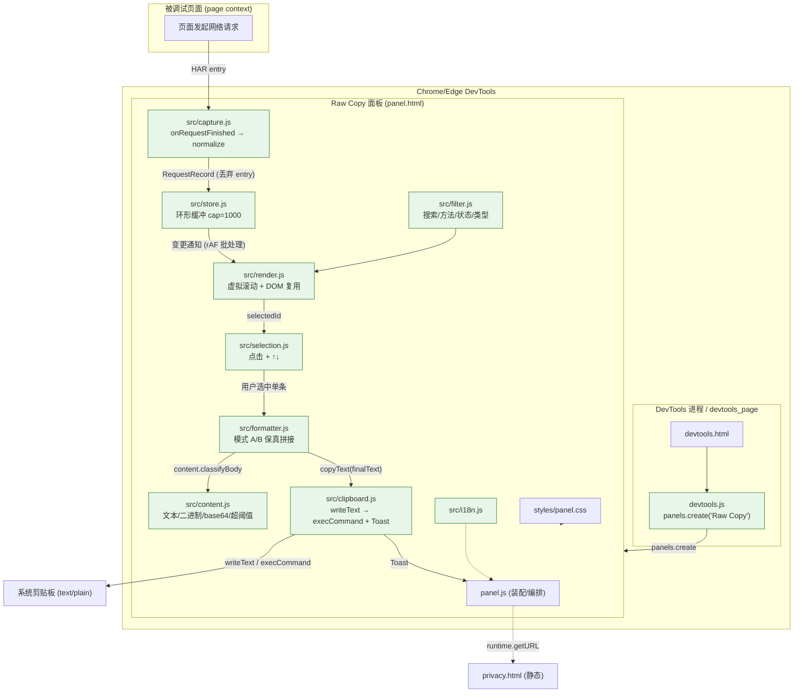

# Plan 契约总纲


<!-- source: butler/spec/新建一个-chrome-edge-devtools-扩展-manifest-v3-在-devto/requirement.md -->

# 需求规格书 — 新建一个 Chrome/Edge DevTools 扩展（Manifest V3）

> slug: `新建一个-chrome-edge-devtools-扩展-manifest-v3-在-devto`
> 版本: v1.1（覆盖重写） | 日期: 2026-10-02 | 角色: butler-requirement-analyst
> 上游出处: `req.txt`（Chrome DevTools 单条网络请求原始信息一键复制扩展 需求文档 v1.0）+ 老板本步原话
> 说明: 本文件为门禁契约文档；机器真源见同目录 `spec.json`，人读对照见 `spec.md`。

---

## 需求背景（老板原话引用）

> 门禁抓取的老板原始指令（脱敏检测：全文未出现 API Key / Secret / Token，无需 `***REDACTED***`）。

**老板本步原话：**
> 新建一个 Chrome/Edge DevTools 扩展（Manifest V3）：在 DevTools 中新增面板，实时捕获当前页面网络请求列表（最多保留最近 1000 条），支持搜索/按方法/状态码/资源类型过滤、点击与键盘上下键选中单条请求，一键复制该条请求的【完整请求 + 完整响应】原始信息为纯文本（不美化 JSON、不改动原始响应体、不附加其他请求）。最小权限（仅 clipboardWrite，无 <all_urls>/host_permissions/webRequest），零第三方依赖，纯原生 JS，附隐私政策、安装/使用说明、测试用例、LICENSE。需求原文见 req.txt。

**需求原文（req.txt）核心引用：**
> "当前 Chrome DevTools 的 Network 面板中，复制单条请求的信息非常麻烦：请求头、请求体、响应头、响应体分散在不同标签页；只能分别复制，无法一次性拿到完整请求 + 响应；原生'Copy as cURL'只包含请求，不包含响应；原生 HAR 导出只能导出全部或选中多条，且格式复杂；用户往往只需要某一条请求，不想把无关请求一起复制。"
>
> "**选中单条请求 → 一键复制完整请求 + 完整响应 → 输出纯文本 → 直接发给 AI。**"
>
> "不进行 JSON 美化、不重新格式化、不改变原始响应体。只复制当前选中的那一条请求，绝不附带其他请求。"
>
> "所有数据仅存在于 DevTools 内存中。关闭 DevTools 后数据销毁。不收集、不存储、不传输任何用户数据。无服务器、无分析、无遥测、无广告。"
>
> "再次强调：响应体 `{\"code\":0,\"message\":\"success\",\"token\":\"xyz789\"}` 必须原样输出；不允许格式化成多行；不允许排序字段；不允许添加 Markdown 代码块。"

---

## 需求理解

> 本节含 4 个 Phase。Phase 1.5（边界确认增强）的产出集中列于本文档后部 `## 需求边界确认` 段。

### Phase 1: 字面需求分析（Literal Understanding）

#### 1.1 明确功能点列表

| # | 功能点 | 用户原话引用 |
|---|--------|-------------|
| 1 | DevTools 新增面板 | "在 DevTools 中新增面板"；"安装扩展后，打开 Chrome DevTools，出现一个新面板" |
| 2 | 面板与 Elements/Console/Network 并列 | "面板位置：与 Elements、Console、Network 等并列" |
| 3 | 实时捕获当前页面网络请求 | "实时捕获当前页面网络请求列表"；"自动捕获当前页面产生的网络请求" |
| 4 | 内存最多保留最近 1000 条 | "最多保留最近 1000 条"；"内存中最多保留最近 N 条，默认 1000 条，避免内存泄漏" |
| 5 | 搜索 | "支持搜索"；"按 URL 关键字搜索" |
| 6 | 按方法过滤 | "按方法…过滤"；"按请求方法过滤" |
| 7 | 按状态码过滤 | "按状态码…过滤"；"按状态码过滤" |
| 8 | 按资源类型过滤 | "按资源类型过滤" |
| 9 | 点击选中单条请求 | "点击…选中单条请求"；"点击某一行选中该请求" |
| 10 | 键盘上下键切换选中 | "键盘上下键选中"；"支持键盘上下键切换选中项" |
| 11 | 一键复制完整请求 + 完整响应 | "一键复制该条请求的【完整请求 + 完整响应】原始信息为纯文本" |
| 12 | 输出纯文本，不美化 JSON | "为纯文本（不美化 JSON…）" |
| 13 | 不改动原始响应体 | "不改动原始响应体" |
| 14 | 不附加其他请求 | "不附加其他请求"；"只复制当前选中的那一条请求，绝不附带其他请求" |
| 15 | 最小权限：仅 clipboardWrite | "最小权限（仅 clipboardWrite…）" |
| 16 | 零第三方依赖，纯原生 JS | "零第三方依赖，纯原生 JS" |
| 17 | 附隐私政策 | "附隐私政策"；"提供隐私政策页面" |
| 18 | 附安装说明 | "附…安装/使用说明"；交付物含"安装说明" |
| 19 | 附使用说明 | "附…安装/使用说明"；交付物含"使用说明" |
| 20 | 附测试用例 | "附…测试用例" |
| 21 | 附 LICENSE | "附…LICENSE"；"许可证推荐 MIT 或 Apache-2.0" |

#### 1.2 明确提及的捕获类型 / 列表字段 / 复制内容

- **捕获类型**："支持类型：XHR、Fetch、Document、Script、Stylesheet、Image、Font、Media、WebSocket 等"
- **列表每行字段**：请求方法、URL、状态码、资源类型、耗时(毫秒)、大小(响应大小)、时间(请求开始时间)
- **请求部分必含**：请求方法、完整 URL、HTTP 版本（无法获取可写 `HTTP/1.1`）、请求头（原始顺序，每行 `Name: Value`）、请求体（有则保留原始文本，不美化）
- **响应部分必含**：HTTP 状态码、状态文本、响应头（原始顺序，每行 `Name: Value`）、响应体（保留原始文本，不美化）
- **可选元信息**：请求开始时间、总耗时、资源类型、MIME 类型（放开头/结尾简单标题段，不干扰正文）

#### 1.3 角色/参与者

| Actor | 用户提及的上下文 |
|-------|-----------------|
| 前端开发 | "调试 API，需要把请求和响应完整发给 AI 分析" |
| 测试工程师 | "提交 Bug 时，需要附上完整的请求与响应原始信息" |
| 后端开发 | "排查接口问题时，需要查看浏览器实际发出的请求与收到的响应" |
| 技术支持 | "需要把用户侧请求完整复制出来分析" |
| 扩展的最终用户（开发者本人） | 在 DevTools 中操作面板、选中请求、点击复制 |

#### 1.4 技术约束（用户原话）

| 约束 | 用户原话引用 |
|------|-------------|
| Manifest V3 | "Manifest V3"；`"manifest_version": 3` |
| 使用 devtools_page 注册 | "使用 `devtools_page` 注册 DevTools 页面" |
| 使用 chrome.devtools.panels.create 创建面板 | "使用 `chrome.devtools.panels.create` 创建面板" |
| 使用 onRequestFinished 监听 | "`chrome.devtools.network.onRequestFinished.addListener`" |
| HAR entry 内存缓存 | "将 HAR entry 缓存在内存数组中" |
| 原生 JS，无第三方框架 | "使用原生 JavaScript 实现 UI，避免引入第三方框架和供应链风险" |
| 不需要 background service worker | "不需要 background service worker" |
| 不需要 content script | "不需要 content script" |
| 复制实现 | "优先使用 `navigator.clipboard.writeText`"；"失败时降级使用 `document.execCommand('copy')`" |
| 权限清单 | `"permissions": ["clipboardWrite"]`；"不申请 `<all_urls>`；不申请 `host_permissions`；不申请 `tabs`；不申请 `webRequest`；不申请 `declarativeNetRequest`；不包含任何网络请求代码" |
| HAR 字段映射 | `entry.request.method/url/headers/postData.text`；`entry.response.status/statusText/headers/content.text/encoding/content.mimeType`；`entry.time`；`entry.startedDateTime` |

#### 1.5 非功能要求（用户原话）

| 要求 | 用户原话引用 |
|------|-------------|
| 性能 | "捕获请求不影响页面性能；列表支持虚拟滚动，1000 条不卡顿" |
| 兼容性 | "支持最新版 Chrome 和 Edge" |
| 体积 | "扩展包小于 200KB" |
| 依赖 | "零第三方运行时依赖" |
| 界面语言 | "中文优先，可预留英文" |
| 可靠性 | "复制成功率 100%，异常有提示" |
| 隐私 | "所有数据仅存在于 DevTools 内存中。关闭 DevTools 后数据销毁。不收集、不存储、不传输任何用户数据。无服务器、无分析、无遥测、无广告" |

#### 1.6 模糊点 (需确认)

- [ASSUMPTION: A1] 面板名称：原文"建议：`Raw Copy` 或 `请求复制`"，未定死 → 我的理解：面板显示名用 `Raw Copy`（英文）或 `请求复制`（中文），取其一，界面语言中文优先 → 倾向 `Raw Copy`。
- [ASSUMPTION: A2] HTTP 版本：原文"如无法获取，可写 `HTTP/1.1`" → 我的理解：HAR 无 protocol 字段时统一回退 `HTTP/1.1`。
- [ASSUMPTION: A3] 大响应阈值：原文"例如 10MB"，为示例 → 我的理解：默认阈值 10MB，可配置。
- [ASSUMPTION: A4] 可选按钮（仅复制请求/仅复制响应/复制为 cURL）：原文"可选附加按钮…（非必须）" → 我的理解：标记【可选】，非 P0，不影响验收 1-10。
- [ASSUMPTION: A5] 复制模式默认值：原文"提供两种模式，默认'简单格式化'" → 我的理解：模式 A（简单格式化）为默认，模式 B 可切换。
- [ASSUMPTION: A6] 面板是否含 WebSocket：列表字段无 WS 专属帧内容，复制以 HAR entry 为准 → 我的理解：WebSocket 仅作为资源类型出现在列表，复制按其 HAR entry 拼接。
- [ASSUMPTION: A7] UI 语言 "中文优先，可预留英文" → 我的理解：主界面文案中文，代码内预留 i18n 结构即可，不要求完整英文翻译。
- [ASSUMPTION: A8] 无选中请求时点击复制按钮：原文未明确 → 我的理解：按钮置灰/无操作并给出提示（DEC-008）。

---

### Phase 2: 深挖必备组件（Component Deep-Dive）

> 引用标准 Web/App 组件分类学（A-K）作为内部检查清单，只输出匹配项。

#### 2.1 组件映射表

| 功能点 | 依赖组件 | 分类 | 标记 | 依据 |
|--------|---------|------|------|------|
| 新增 DevTools 面板 | `devtools_page` 注册页 (devtools.html/js) | D. API/扩展入口 | 【必须】 | "使用 `devtools_page` 注册 DevTools 页面" |
| 面板 UI | 面板 HTML/JS (panel.html/js) | D. 前端界面 | 【必须】 | "使用 `chrome.devtools.panels.create` 创建面板" |
| 实时捕获请求 | `chrome.devtools.network.onRequestFinished` 监听器 | D. API | 【必须】 | 原文 7.1；HAR entry 是数据来源 |
| 内存缓存 1000 条 | 环形缓冲/数组裁剪模块 | C. 数据层 | 【必须】 | "内存中最多保留最近 N 条，默认 1000 条" |
| 列表展示 | 请求列表渲染组件（虚拟滚动） | D. 前端界面 | 【必须】 | 5.3 列表字段 + 9 虚拟滚动 |
| 搜索/过滤 | 筛选状态 + 过滤逻辑 | C/D | 【必须】 | 5.3 搜索/方法/状态码/资源类型过滤 |
| 键盘上下键选中 | 键盘事件处理 | D. 交互 | 【必须】 | "支持键盘上下键切换选中项" |
| 单条复制拼接 | 请求/响应文本拼接器 | C. 数据层 | 【必须】 | 5.4/5.5/5.6 复制内容与格式 |
| 剪贴板写入 | Clipboard API + execCommand 降级 | J. 安全/浏览器 API | 【必须】 | 7.3 "优先 `navigator.clipboard.writeText`，失败降级 `execCommand('copy')`" |
| 复制提示 | Toast/状态栏提示 | D. 交互 | 【必须】 | 5.9 "显示 Toast 或状态栏提示'已复制到剪贴板'" |
| 大响应/二进制/Base64 处理 | 内容分类与省略逻辑 | C. 数据层 | 【必须】 | 5.8 "大响应与二进制处理" |
| 权限清单 | manifest.json 权限声明 | J. 安全 | 【必须】 | 7.2 最小权限；"不申请…" |
| 隐私政策 | 静态隐私政策页面 | J. 安全/合规 | 【必须】 | 8 "提供隐私政策页面" |
| 图标资源 | icons（16/32/48/128） | K. 部署/打包 | 【可选】 | 交付物要求可打包安装；MV3 常规需要图标 |
| 安装说明 | 安装文档 | K. 运维/文档 | 【必须】 | 交付物 §11 "安装说明" |
| 使用说明 | 使用文档 | K. 运维/文档 | 【必须】 | 交付物 §11 "使用说明" |
| 测试用例 | 测试用例文档/脚本 | H. 分析/验证 | 【必须】 | 交付物 §11 "测试用例"；老板原话"附…测试用例" |
| LICENSE | 许可证文件 | K. 文档/合规 | 【必须】 | "如开源，提供 LICENSE 文件"；老板原话"附…LICENSE" |
| 打包 ZIP | 构建打包产物 | K. 部署 | 【必须】 | 交付物 §11 "打包后的扩展 ZIP" |
| 完整源码 | 源码交付 | K. 交付 | 【必须】 | 交付物 §11 "完整源码" |
| 后端服务器/服务端 API | — | — | 【不在此范围】 | "无服务器、无分析、无遥测"；"不包含任何网络请求代码" |
| 用户账号/登录 | — | — | 【不在此范围】 | 无用户系统需求 |
| 数据库/持久化存储 | — | — | 【不在此范围】 | "所有数据仅存在于 DevTools 内存中"；"关闭 DevTools 后数据销毁" |
| 支付/计费 | — | — | 【不在此范围】 | 免费工具，无计费需求 |
| 通知/推送/邮件/SMS | — | — | 【不在此范围】 | 仅本地 Toast 提示 |
| i18n 完整双语 | i18n 结构（预留） | I. 国际化 | 【可选】 | "中文优先，可预留英文" |

#### 2.2 未匹配的功能点（分类学中无对应标准组件 = 自定义逻辑）

- **响应体原样保真校验**：确保 JSON 字符级不变（不缩进/不排序/不转 Markdown）——属自定义"保真约束"逻辑，非通用组件。
- **HAR entry → 纯文本拼接器**：自定义格式化管线（模式 A/B 双模式）。
- **二进制/Base64 MIME 判定与省略标注**：自定义内容分类逻辑。

#### 2.3 非标准组件（需自研，非第三方）

- 环形缓冲（保留最近 1000 条）——纯原生数组 + 位移实现。
- 虚拟滚动列表——纯原生 DOM 复用实现（无第三方）。
- Clipboard 降级链（`navigator.clipboard` → `document.execCommand('copy')`）。

---

### Phase 3: 确认需求边界（Scope Confirmation）

#### 3.1 In Scope

- DevTools 新面板（`devtools_page` + `chrome.devtools.panels.create`）。
- 实时捕获当前页面网络请求（`onRequestFinished`，HAR entry）。
- 内存环形缓存最多 1000 条。
- 请求列表展示（方法/URL/状态码/资源类型/耗时/大小/时间）+ 虚拟滚动。
- 搜索 + 方法/状态码/资源类型过滤。
- 点击 / 键盘上下键选中单条；复制按钮（复制请求+响应原始）。
- 复制内容 = 单条请求 + 响应，纯文本，两种模式（A 默认 / B 纯原始）。
- 大响应阈值提示、二进制/Base64 省略标注。
- 最小权限 manifest（仅 `clipboardWrite`）；无网络请求代码。
- 隐私政策、安装说明、使用说明、测试用例、LICENSE、图标、打包 ZIP、完整源码。
- 非功能：性能（1000 条不卡）、兼容 Chrome/Edge、体积 <200KB、零依赖、中文优先。

#### 3.2 Out of Scope

- 复制全部/多条请求 — [理由：明确非目标"不复制全部请求"；"只复制当前选中的那一条请求"]。
- 自动上传/发送给 AI/任何服务器 — [理由："不自动上传数据到任何服务器；不自动发送给 AI"]。
- JSON 美化/压缩/排序/语法高亮 — [理由：5.7 明确禁止]。
- 修改/拦截/阻断网络请求 — [理由：3.2 非目标]。
- 数据收集/埋点/遥测 — [理由：3.2 非目标 + §8]。
- 敏感权限（`<all_urls>`/`host_permissions`/`tabs`/`webRequest`/`declarativeNetRequest`） — [理由：7.2 明确不申请]。
- background service worker / content script — [理由：7.1 "不需要"]。
- 服务端/数据库/账号/支付 — [理由：无服务器、纯本地工具]。

#### 3.3 决策日志（每个 [ASSUMPTION] 的转档）

| ID | 类型 | 内容 | 状态 |
|----|------|------|------|
| DEC-001 | 假设 | 面板名取 `Raw Copy`（中文 `请求复制`），界面语言中文优先 | 待确认 |
| DEC-002 | 假设 | HTTP 版本缺失时回退 `HTTP/1.1` | 待确认 |
| DEC-003 | 假设 | 大响应阈值默认 10MB，可配置 | 待确认 |
| DEC-004 | 假设 | "仅复制请求/仅复制响应/复制为 cURL" 为【可选】P2，非验收阻断项 | 待确认 |
| DEC-005 | 假设 | 复制模式 A（简单格式化）为默认 | 待确认 |
| DEC-006 | 假设 | WebSocket 仅按资源类型出现在列表，复制按其 HAR entry 拼接 | 待确认 |
| DEC-007 | 假设 | i18n 仅预留结构，不要求完整英文翻译 | 待确认 |
| DEC-008 | 假设 | 无选中请求时复制按钮置灰/无操作并提示 | 待确认 |

---

### Phase 4: 输出规格书（Markdown 模式）

> 调用方：butler/butler-build（开发全流程）→ 使用 Markdown 通用格式。

#### 4.1 产品概述

一款 Manifest V3 DevTools 扩展，在 DevTools 中新增独立面板实时捕获当前页面网络请求；用户选中单条请求即可一键将该请求的**完整请求 + 完整响应**原始信息复制为**纯文本**（不美化、不改动、不附加其他请求），用于直接粘贴给 AI 分析。零第三方依赖、最小权限、纯本地。

#### 4.2 核心功能

| ID | 功能 | 描述 | 优先级 |
|----|------|------|--------|
| F-001 | DevTools 面板注册 | `devtools_page` + `panels.create` 新增与标准面板并列的面板 | P0 |
| F-002 | 实时请求捕获 | `onRequestFinished` 捕获当前页面请求，实时追加 | P0 |
| F-003 | 内存缓存上限 | 环形缓冲最多保留最近 1000 条，防内存泄漏 | P0 |
| F-004 | 请求列表展示 | 每行：方法/URL/状态码/资源类型/耗时/大小/时间 | P0 |
| F-005 | 搜索与过滤 | URL 关键字搜索 + 方法/状态码/资源类型过滤 | P0 |
| F-006 | 单条选中 | 点击选中 + 键盘上下键切换 | P0 |
| F-007 | 一键复制（请求+响应） | 拼接选中单条请求与响应为纯文本写剪贴板 | P0 |
| F-008 | 复制内容格式（A/B 模式） | 模式 A 简单格式化（默认）/ 模式 B 纯原始 | P0 |
| F-009 | 保真约束 | 不解析 JSON、不缩进、不排序、不改字符、不加 Markdown、不截断 | P0 |
| F-010 | 大响应/二进制/Base64 | 阈值提示、二进制省略标注、Base64 按 MIME 判定 | P0 |
| F-011 | 复制反馈 | 成功 Toast，失败提示原因 | P0 |
| F-012 | 最小权限 manifest | 仅 `clipboardWrite`，无网络权限 | P0 |
| F-013 | 隐私政策页 | 声明不收集/不传输/全本地 | P0 |
| F-014 | 文档交付 | 安装说明、使用说明、测试用例、LICENSE | P0 |
| F-015 | 打包交付 | 打包 ZIP + 完整源码 + 图标 | P0 |
| F-016 | 附加复制按钮 | 仅复制请求/仅复制响应/复制为 cURL | P2 |

#### 4.3 组件需求

| ID | 组件 | 类型 | 标记 | 关联功能 |
|----|------|------|------|---------|
| C-001 | devtools 注册页(devtools.html/js) | 扩展入口 | 【必须】 | F-001 |
| C-002 | 面板 UI(panel.html/js) | 前端界面 | 【必须】 | F-001,F-004 |
| C-003 | 请求捕获监听器 | API | 【必须】 | F-002 |
| C-004 | 环形缓存模块 | 数据 | 【必须】 | F-003 |
| C-005 | 列表渲染+虚拟滚动 | 前端界面 | 【必须】 | F-004 |
| C-006 | 搜索/过滤模块 | 前端界面 | 【必须】 | F-005 |
| C-007 | 选中与键盘交互 | 前端界面 | 【必须】 | F-006 |
| C-008 | 复制拼接器(A/B 模式) | 数据 | 【必须】 | F-007,F-008,F-009 |
| C-009 | Clipboard 写入+降级 | 浏览器 API | 【必须】 | F-007,F-011 |
| C-010 | 内容分类(大响应/二进制/Base64) | 数据 | 【必须】 | F-010 |
| C-011 | manifest.json(MV3) | 配置/安全 | 【必须】 | F-012 |
| C-012 | 隐私政策页面 | 合规 | 【必须】 | F-013 |
| C-013 | 图标资源 | 打包 | 【可选】 | F-015 |
| C-014 | 文档(安装/使用/测试用例/LICENSE) | 文档 | 【必须】 | F-014 |
| C-015 | 打包脚本/产物 | 部署 | 【必须】 | F-015 |

#### 4.4 角色定义

| 角色 | 职责 | 系统交互 |
|------|------|---------|
| 前端开发 | 调试 API，把请求+响应发给 AI | 选中请求 → 复制 → 粘贴给 AI |
| 测试工程师 | 提 Bug 附完整请求响应 | 选中请求 → 复制 → 附入 Bug 报告 |
| 后端开发 | 排查接口 | 查看浏览器实发/实收 → 复制 |
| 技术支持 | 复制用户侧请求分析 | 让用户操作 → 复制请求响应 |
| 扩展用户（开发者） | 在 DevTools 操作 | 打开面板/搜索/过滤/选中/复制 |

#### 4.5 里程碑（建议 M1–M5）

| 阶段 | 内容 |
|:---|:---|
| M1 | DevTools 面板框架搭建 |
| M2 | 请求捕获与列表展示 |
| M3 | 单条请求复制 + 原始文本拼接 |
| M4 | 搜索、过滤、大响应处理 |
| M5 | 测试、打包、隐私政策、交付 |

---

## 需求条目清单（REQ，逐条保留上游目标/指标/约束）

### 功能需求

| ID | 需求 | 来源 |
|----|------|------|
| REQ-001 | DevTools 新增面板，与 Elements/Console/Network 并列，名称 `Raw Copy` 或 `请求复制` | §3.1、§5.1 |
| REQ-002 | 自动捕获当前页面请求，支持 XHR/Fetch/Document/Script/Stylesheet/Image/Font/Media/WebSocket 等 | §5.2 |
| REQ-003 | 列表实时更新，新请求自动追加 | §5.2 |
| REQ-004 | 内存最多保留最近 1000 条，防内存泄漏 | §5.2、§9 |
| REQ-005 | 列表每行显示：方法/URL/状态码/资源类型/耗时(ms)/大小/时间 | §5.3 |
| REQ-006 | 按 URL 关键字搜索 | §5.3 |
| REQ-007 | 按请求方法过滤 | §5.3 |
| REQ-008 | 按状态码过滤 | §5.3 |
| REQ-009 | 按资源类型过滤 | §5.3 |
| REQ-010 | 点击某一行选中该请求 | §5.3 |
| REQ-011 | 支持键盘上下键切换选中项 | §5.3 |
| REQ-012 | 选中后提供"复制请求 + 响应（原始）"按钮 | §5.4 |
| REQ-013 | 可选附加按钮：仅复制请求 / 仅复制响应 / 复制为 cURL（非必须） | §5.4 |
| REQ-014 | 复制只处理当前选中单条，绝不附加其他请求 | §5.4、§3.1 |
| REQ-015 | 请求部分含：方法、完整 URL、HTTP 版本（缺失回退 HTTP/1.1）、请求头(原始顺序)、请求体(原始文本) | §5.5 |
| REQ-016 | 响应部分含：状态码、状态文本、响应头(原始顺序)、响应体(原始文本) | §5.5 |
| REQ-017 | 可选元信息：开始时间、总耗时、资源类型、MIME 类型（放标题段，不干扰正文） | §5.5 |
| REQ-018 | 模式 A：简单格式化（默认），带 `===== REQUEST =====` / `===== RESPONSE =====` 标题 | §5.6 |
| REQ-019 | 模式 B：纯原始模式，无标题直接拼接 | §5.6 |
| REQ-020 | 明确禁止格式化：不解析 JSON、不缩进/换行/排序、不压缩、不改字符、不转 Markdown、不截断 | §5.7 |
| REQ-021 | 文本响应默认完整复制 | §5.8 |
| REQ-022 | 超过阈值（如 10MB）提示用户"是否继续复制" | §5.8 |
| REQ-023 | 二进制响应不复制内容，标注 `[Binary content omitted: <mime>, <bytes> bytes]` | §5.8 |
| REQ-024 | Base64 响应：文本类 MIME 尝试按 UTF-8 解码，否则标注 `[Base64 content omitted: length N]` | §5.8 |
| REQ-025 | 复制成功 Toast/状态栏提示"已复制到剪贴板"；失败提示原因；内容不经网络传输 | §5.9 |

### 技术/安全约束

| ID | 需求 | 来源 |
|----|------|------|
| REQ-026 | 最小权限：仅 `clipboardWrite`；不含 `<all_urls>`/`host_permissions`/`tabs`/`webRequest`/`declarativeNetRequest` | §7.2 |
| REQ-027 | 无网络请求代码、无服务器、无分析、无遥测、无广告 | §3.2、§8 |
| REQ-028 | 数据仅存 DevTools 内存，关闭 DevTools 即销毁，不收集/不存储/不传输 | §8 |
| REQ-029 | 性能：捕获不影响页面性能；列表虚拟滚动，1000 条不卡顿 | §9 |
| REQ-030 | 兼容最新版 Chrome 与 Edge（Chromium） | §9 |
| REQ-031 | 扩展包体积 < 200KB | §9 |
| REQ-032 | 零第三方运行时依赖，纯原生 JavaScript | §7.1、§9 |
| REQ-033 | 界面语言中文优先，可预留英文 | §9 |
| REQ-034 | 可靠性：复制成功率 100%，异常有提示 | §9 |
| REQ-035 | HAR 数据映射字段：request.method/url/headers/postData.text；response.status/statusText/headers/content.text/encoding/content.mimeType；time；startedDateTime | §7.4 |
| REQ-036 | 架构：MV3 + devtools_page + panels.create + onRequestFinished；不需 background SW / content script；Clipboard 优先 navigator.clipboard.writeText，降级 execCommand('copy') | §7.1、§7.3 |

### 用户故事（US）

| ID | 用户故事 |
|----|---------|
| US-001 | 作为**前端开发**，我想选中单条请求一键复制其完整请求+响应原始文本，以便直接粘贴给 AI 分析接口问题 |
| US-002 | 作为**测试工程师**，我想把完整请求与响应原始信息附到 Bug 报告，以便开发准确定位接口问题 |
| US-003 | 作为**后端开发**，我想查看浏览器实际发出的请求与收到的响应原文，以便排查接口问题 |
| US-004 | 作为**技术支持**，我想把用户侧请求完整复制出来分析，以便复现用户环境问题 |

---

## 需求边界确认

> Phase 1.5 产出。三视角交叉核对（主体/场景/形态），严格基于用户原话。无原话依据的探测一律标 `[ASSUMPTION: 待确认]`，不纳入组件拆解。

| 视角 | 探测项 | 依据(用户原话/[ASSUMPTION]) | 判定 | 理由 |
|---|---|---|---|---|
| 主体 | 扩展使用者 = 开发者本人（前端/测试/后端/技术支持） | "目标用户…前端开发/测试工程师/后端开发/技术支持" | 已覆盖 | 4 类角色均在 §4.4 定义 |
| 主体 | 扩展无需账号/角色体系 | "无服务器、无分析、无遥测"；未提账号 | Out | 用户未提账号，不纳入 |
| 主体 | 被捕获对象 = 当前页面网络请求 | "实时捕获当前页面网络请求列表" | 已覆盖 | F-002 |
| 主体 | 数据主体（请求内容）仅本地、DevTools 内 | "所有数据仅存在于 DevTools 内存中。关闭 DevTools 后数据销毁" | 已覆盖 | F-013 + REQ-028 |
| 场景 | 正常路径：打开面板→看列表→搜索/过滤→选中→复制→粘贴 | §6 交互流程 1-8 步 | 已覆盖 | F-001..F-011 |
| 场景 | 起始边界：安装后打开 DevTools 即出现面板 | "安装扩展，打开 DevTools，能看到新面板" | 已覆盖 | AC-001 |
| 场景 | 结束边界：复制成功有提示 | "复制成功：显示 Toast 或状态栏提示" | 已覆盖 | F-011 / AC-011 |
| 场景 | 异常分支：复制失败 | "复制失败：提示失败原因" | 已覆盖 | F-011 / AC-011 |
| 场景 | 异常分支：大响应（超阈值） | "超过阈值（例如 10MB）：提示用户'响应较大，是否继续复制'" | 已覆盖 | F-010 / AC-010 |
| 场景 | 异常分支：二进制响应 | "[Binary content omitted: image/png, 45678 bytes]" | 已覆盖 | F-010 / AC-010 |
| 场景 | 异常分支：Base64 响应 | "[Base64 content omitted: length 12345]" | 已覆盖 | F-010 / AC-010 |
| 场景 | 边界：无选中请求时点复制 | 用户未提 | [ASSUMPTION: 待确认] 应禁用/无操作并提示 | 待确认 | 原文未明确，标 DEC-008 |
| 形态 | 输入形态：请求来源类型 XHR/Fetch/Document/Script/Stylesheet/Image/Font/Media/WebSocket | "支持类型：XHR、Fetch、Document…WebSocket 等" | 已覆盖 | REQ-002 |
| 形态 | 输出形态 1：模式 A 简单格式化（默认） | "提供两种模式，默认'简单格式化'" | 已覆盖 | F-008 / REQ-018 |
| 形态 | 输出形态 2：模式 B 纯原始 | "模式 B：纯原始模式" | 已覆盖 | F-008 / REQ-019 |
| 形态 | 输出通道：系统剪贴板 | "写入系统剪贴板"；"navigator.clipboard.writeText" | 已覆盖 | C-009 |
| 形态 | 平台形态：Chrome + Edge（Chromium） | "支持最新版 Chrome 和 Edge" | 已覆盖 | REQ-030 |
| 形态 | UI 语言形态：中文优先，预留英文 | "中文优先，可预留英文" | 已覆盖(预留) | DEC-007 |
| 形态 | 附加输出：仅复制请求/仅复制响应/复制为 cURL | "可选附加按钮…（非必须）" | 待确认(P2) | DEC-004 |
| 形态 | 面板名 `Raw Copy` vs `请求复制` | "面板名称建议：`Raw Copy` 或 `请求复制`" | 待确认 | DEC-001 |
| 形态 | HTTP 版本来源 | "如无法获取，可写 `HTTP/1.1`" | 待确认 | DEC-002 |
| 形态 | 大响应阈值默认值 | "（例如 10MB）" | 待确认 | DEC-003 |

---

## 验收标准草案

| ID | 验收标准 | 来源 |
|----|---------|------|
| AC-001 | 安装扩展后打开 DevTools，能看到一个新的独立面板，与 Elements/Console/Network 并列，名称显示为 `Raw Copy`（或 `请求复制`） | F-001 / §10.1 |
| AC-002 | 访问任意网站，面板请求列表实时显示当前页面产生的请求，新请求自动追加 | F-002 / §10.2 |
| AC-003 | 列表支持按 URL 关键字搜索，以及按请求方法 / 状态码 / 资源类型过滤，过滤结果正确 | F-005 / §10.3 |
| AC-004 | 支持点击某一行选中该请求，并支持键盘上下键切换选中项 | F-006 / §10.3 |
| AC-005 | 选中一条请求点击"复制请求 + 响应（原始）"后，剪贴板内容包含：请求方法、完整 URL、请求头、请求体；响应状态码、状态文本、响应头、响应体 | F-007 / §10.4 |
| AC-006 | 复制内容**不包含任何其他请求**的信息（单条隔离） | F-007 / §10.5 |
| AC-007 | 若响应体是 JSON，复制出的 JSON 与原始响应体**逐字符一致**，无额外缩进、换行、排序、Markdown 代码块 | F-009 / §10.6、§13 |
| AC-008 | 复制过程中扩展**不发出任何网络请求**（无 fetch/XHR/beacon/上传） | F-012 / §10.7 |
| AC-009 | manifest 权限清单中无 `<all_urls>`、无 `host_permissions`、无 `tabs`、无 `webRequest`、无 `declarativeNetRequest`，仅含 `clipboardWrite` | F-012 / §10.8 |
| AC-010 | 大响应（超阈值）复制前给出"是否继续"提示；二进制响应以 `[Binary content omitted: <mime>, <bytes> bytes]` 省略；Base64 按 MIME 判定解码或标注 | F-010 / §10.9 |
| AC-011 | 复制成功显示明确提示（Toast 或状态栏"已复制到剪贴板"）；复制失败显示失败原因 | F-011 / §10.10 |
| AC-012 | 请求列表每行显示：请求方法、URL、状态码、资源类型、耗时(ms)、大小、时间 | F-004 / §5.3 |
| AC-013 | 内存中最多保留最近 1000 条请求，超出后淘汰最旧条目，无内存泄漏 | F-003 / §5.2、§9 |
| AC-014 | 请求头/响应头按原始顺序输出，每行 `Name: Value`；请求体/响应体保持原始文本不美化 | F-008 / §5.5 |
| AC-015 | 提供两种复制模式：模式 A 简单格式化（默认，含 `===== REQUEST =====` / `===== RESPONSE =====` 标题）与模式 B 纯原始（无标题直接拼接） | F-008 / §5.6 |
| AC-016 | 面板语言中文优先；界面文案为中文，可预留英文 i18n 结构 | F-001 / §9 |
| AC-017 | 扩展包体积 < 200KB；零第三方运行时依赖；纯原生 JS 实现 | F-015 / §9 |
| AC-018 | 在最新版 Chrome 与 Edge 上均可正常安装与使用 | F-001 / §9 |
| AC-019 | 交付物齐全：完整源码、打包 ZIP、安装说明、使用说明、隐私政策页面、测试用例、LICENSE、图标 | F-014,F-015 / §11 |
| AC-020 | 隐私政策页明确声明：不收集数据、不传输数据、所有操作本地完成 | F-013 / §8 |
| AC-021 | 1000 条请求下列表滚动/搜索/过滤不卡顿（虚拟滚动生效） | C-005 / §9 |
| AC-022 | 复制成功率 100%（Clipboard API 失败时降级 `document.execCommand('copy')` 仍成功），异常均有提示 | C-009 / §9 |

---

## 交付物清单（清单化，逐条保留上游 §11）

| ID | 交付物 | 来源 |
|----|--------|------|
| DEL-001 | `devtools_page` 注册页（devtools.html + devtools.js） | §7.1、老板原话 |
| DEL-002 | DevTools 面板 UI（panel.html + panel.js：列表 + 工具栏 + 复制按钮 + Toast） | §5.1、§5.3 |
| DEL-003 | 请求捕获 + 内存缓存模块（onRequestFinished，上限 1000 条） | §5.2、§7.1 |
| DEL-004 | 列表渲染 + 搜索/过滤 + 虚拟滚动模块 | §5.3、§9 |
| DEL-005 | 选中交互模块（点击 + 键盘上下键） | §5.3 |
| DEL-006 | 复制拼接模块（请求+响应，模式 A/B，保真约束） | §5.4、§5.5、§5.6、§5.7 |
| DEL-007 | Clipboard 写入 + 降级 + Toast 提示模块 | §5.9、§7.3 |
| DEL-008 | 大响应/二进制/Base64 处理逻辑 | §5.8 |
| DEL-009 | manifest.json（MV3，permissions 仅 clipboardWrite） | §7.2 |
| DEL-010 | 隐私政策页面（privacy.html） | §8、§11 |
| DEL-011 | 安装说明文档 | §11、老板原话 |
| DEL-012 | 使用说明文档 | §11、老板原话 |
| DEL-013 | 测试用例（文档/脚本） | §11、老板原话 |
| DEL-014 | LICENSE 文件（MIT 或 Apache-2.0） | §8、§11、老板原话 |
| DEL-015 | 打包后的扩展 ZIP | §11 |
| DEL-016 | 完整源码 | §11 |
| DEL-017 | 图标资源（icons 16/32/48/128） | §7.2(MV3 常规)、F-015 |
| DEL-018 | 里程碑 M1–M5 交付节奏 | §12 |

<!-- butler:covers REQ-001 REQ-002 REQ-003 REQ-004 REQ-005 REQ-006 REQ-007 REQ-008 REQ-009 REQ-010 REQ-011 REQ-012 REQ-013 REQ-014 REQ-015 REQ-016 REQ-017 REQ-018 REQ-019 REQ-020 REQ-021 REQ-022 REQ-023 REQ-024 REQ-025 REQ-026 REQ-027 REQ-028 REQ-029 REQ-030 REQ-031 REQ-032 REQ-033 REQ-034 REQ-035 REQ-036 AC-001 AC-002 AC-003 AC-004 AC-005 AC-006 AC-007 AC-008 AC-009 AC-010 AC-011 AC-012 AC-013 AC-014 AC-015 AC-016 AC-017 AC-018 AC-019 AC-020 AC-021 AC-022 US-001 US-002 US-003 US-004 DEL-001 DEL-002 DEL-003 DEL-004 DEL-005 DEL-006 DEL-007 DEL-008 DEL-009 DEL-010 DEL-011 DEL-012 DEL-013 DEL-014 DEL-015 DEL-016 DEL-017 DEL-018 -->


<!-- source: butler/spec/新建一个-chrome-edge-devtools-扩展-manifest-v3-在-devto/design.md -->

# 设计文档 — 新建一个 Chrome/Edge DevTools 扩展（Manifest V3）

> slug: `新建一个-chrome-edge-devtools-扩展-manifest-v3-在-devto`
> 阶段: Phase ②（架构设计 + 四维 CIA 变更影响扫描）| 日期: 2026-10-02 | 角色: butler-dev-design
> 上游: `requirement.md`（v1.1：36 REQ / 22 AC / 4 US / 18 DEL）+ `spec.json`（80 items，机器真源）+ `feasibility.md`（✅ 可执行，VALUE high / RISK medium / EFFORT medium ≈21 SP）
> 规范: 只分析不执行（本文档不修改源码、不运行构建）。证据分级：confirmed / likely / inconclusive。

---

## 0. 结论摘要

| 项 | 结论 |
|----|------|
| 影响性质 | **纯新增（greenfield）** —— 仓库无任何既有扩展源码，无"修改既有调用方"式破坏 |
| 架构形态 | MV3 DevTools 扩展 = `devtools_page` 注册页 + `panels.create` 面板页；**无 background service worker、无 content script** |
| 数据形态 | 纯内存 `RequestStore`（环形缓冲，cap=1000）；**无 DB、无持久化、无网络** |
| 关键风险裁决 | R8 保真语义张力 → **ADR-006 定死**：模式 A 只允许"加标题段/段标签"，body 逐字符原样，绝不 parse/排序/缩进/转 Markdown |
| CIA 完整性 | A/B/C/D 四维各含 ≥1 条 `confirmed` → **无 `[cia_incomplete]`** |
| 阻塞项 | 无 P0；DEC-001（面板名）/ DEC-003（阈值）/ DEC-005（默认模式 A）按 feasibility.md 建议默认执行 |

---

## 1. 影响范围分析

### 1.1 模块级影响（逐模块）

| 模块 | 变更类型 | 变更内容 | 影响范围（文件/服务） | 风险等级 | 确信度 |
|------|:--------:|---------|:--------------------:|:--------:|:------:|
| Ext Entry 扩展入口 | 新增 | `devtools_page` 注册页；调用 `panels.create` 注册 `Raw Copy` 面板 | `extension/devtools.html`、`extension/devtools.js` | L | confirmed |
| Panel UI 面板界面 | 新增 | 列表 + 工具栏（搜索/过滤/模式切换）+ 复制按钮 + Toast + 隐私入口 | `extension/panel.html`、`extension/panel.js`、`extension/styles/panel.css` | M | confirmed |
| Capture 捕获模块 | 新增 | 注册 `onRequestFinished`；HAR entry → 归一化 `RequestRecord`（O(headers)） | `extension/src/capture.js` | M | confirmed |
| Store 内存缓存 | 新增 | 环形缓冲 cap=1000，O(1) 追加/淘汰；订阅通知 | `extension/src/store.js` | M | confirmed |
| Render 列表渲染 | 新增 | 虚拟滚动（窗口化 + DOM 复用），固定行高 | `extension/src/render.js` | M | confirmed |
| Filter 搜索/过滤 | 新增 | URL 关键字 + method/status/resourceType 过滤 | `extension/src/filter.js` | L | confirmed |
| Selection 选中交互 | 新增 | 点击选中 + ↑/↓ 键切换；处理"选中项被淘汰" | `extension/src/selection.js` | L | confirmed |
| Formatter 复制拼接 | 新增 | 模式 A/B 纯文本拼接 + 保真约束 + 元信息段 | `extension/src/formatter.js` | **H**（AC-007 命门）| confirmed |
| Content 内容分类 | 新增 | 文本 / 二进制 / base64 / 超阈值 分类与占位标注 | `extension/src/content.js` | M | confirmed |
| Clipboard 剪贴板 | 新增 | `navigator.clipboard.writeText` + `execCommand('copy')` 降级 + Toast | `extension/src/clipboard.js` | M | confirmed |
| i18n 文案 | 新增 | 中文优先字典 + 预留英文结构 | `extension/src/i18n.js` | L | confirmed |
| Manifest 配置 | 新增 | MV3 manifest；`permissions:["clipboardWrite"]`；devtools_page；icons | `extension/manifest.json` | **H**（AC-009 门禁）| confirmed |
| Privacy 合规页 | 新增 | 静态隐私政策页（不收集/不传输/全本地） | `extension/privacy.html` | L | confirmed |
| Icons 资源 | 新增 | 16/32/48/128 PNG | `extension/icons/*.png` | L | confirmed |
| Docs 文档 | 新增 | 安装 / 使用 / 测试用例 / LICENSE | `docs/INSTALL.md`、`docs/USAGE.md`、`docs/TESTCASES.md`、`LICENSE` | L | confirmed |
| Packaging 打包 | 新增 | 打包脚本/命令 → `dist/raw-copy-<ver>.zip`（仅扩展根内容） | `scripts/package.mjs`、`dist/raw-copy-1.0.0.zip` | M | likely |

### 1.2 文件级影响（新增文件清单 = DEL 落点）

| 文件 | 对应交付物 | 变更类型 | 确信度 |
|------|-----------|:--------:|:------:|
| `extension/manifest.json` | DEL-009 | 新增 | confirmed |
| `extension/devtools.html`、`extension/devtools.js` | DEL-001 | 新增 | confirmed |
| `extension/panel.html`、`extension/panel.js` | DEL-002 | 新增 | confirmed |
| `extension/styles/panel.css` | DEL-002（UI 样式） | 新增 | confirmed |
| `extension/src/capture.js`、`extension/src/store.js` | DEL-003 | 新增 | confirmed |
| `extension/src/render.js`、`extension/src/filter.js` | DEL-004 | 新增 | confirmed |
| `extension/src/selection.js` | DEL-005 | 新增 | confirmed |
| `extension/src/formatter.js` | DEL-006 | 新增 | confirmed |
| `extension/src/clipboard.js` | DEL-007 | 新增 | confirmed |
| `extension/src/content.js` | DEL-008 | 新增 | confirmed |
| `extension/src/i18n.js` | REQ-033（预留 i18n） | 新增 | confirmed |
| `extension/privacy.html` | DEL-010 | 新增 | confirmed |
| `docs/INSTALL.md` | DEL-011 | 新增 | confirmed |
| `docs/USAGE.md` | DEL-012 | 新增 | confirmed |
| `docs/TESTCASES.md` | DEL-013 | 新增 | confirmed |
| `LICENSE` | DEL-014 | 新增 | confirmed |
| `dist/raw-copy-1.0.0.zip` | DEL-015 | 新增（构建产物） | likely |
| （以上全部源码） | DEL-016 | 新增 | confirmed |
| `extension/icons/icon{16,32,48,128}.png` | DEL-017 | 新增 | confirmed |
| `scripts/package.mjs` | DEL-015 打包支撑 | 新增 | likely |

### 1.3 被修改/删除的既有文件

| 既有文件 | 操作 | 说明 | 确信度 |
|---------|:----:|------|:------:|
| （无） | — | 全仓无既有 `.js/.html/.css` 源码（`glob **/*.{js,html,css,zip}` → No files found；`grep panels.create\|onRequestFinished\|clipboardWrite\|devtools_page` 仅命中 `butler/**` 规格产物）。**零个既有源码文件被修改或删除** | confirmed |

> **影响范围结论**：这是一次 100% 增量的绿地实现。不存在"改既有函数 → 调用方破裂"的传统破坏面；风险集中在**新增代码内部契约**（保真拼接、虚拟滚动、内存上限、最小权限门禁）。

---

## 2. 变更影响地图（CIA 四维扫描）

> 扫描方法：全仓定位既有调用点（`grep` / `glob`，尊重 `.gitignore`）+ 读取 spec/feasibility 契约 + 内部调用图推导。
> A/B/C/D 每维均含 ≥1 条 `confirmed`。**无 `[cia_incomplete]`。**

### A 维 — 调用影响（谁调用了变更点 / 变更点会调用谁）

| ID | 影响项 | 证据 | 确信度 |
|----|-------|------|:------:|
| A-1 | 无既有调用方受破坏：全仓无扩展源码，不存在"变更既有函数签名/行为导致调用方失败"的调用影响 | `glob **/*.{js,html,css,zip}` → 0 文件；`grep` 命中仅在 `butler/**` | confirmed |
| A-2 | 新增外部注册调用：`devtools.js` 调用 `chrome.devtools.panels.create(...)` 注册面板 → 唯一可见影响 = DevTools 面板栏新增一项（REQ-001 / AC-001） | req.txt §5.1/§7.1 | confirmed |
| A-3 | 新增外部回调注册：`src/capture.js` 调 `chrome.devtools.network.onRequestFinished.addListener(cb)` → Chromium 在**每次请求完成**时回调本扩展；调用频率 = 页面请求频率，直接影响页面性能（REQ-029）→ cb 必须 O(1)/O(headers) 且不阻塞 | req.txt §7.1；R4 | confirmed |
| A-4 | 新增内部调用图（见 §7 组件图）：`capture.add → store.add → (notify) → render.setData / filter.apply`；`selection.change → formatter.buildCopyText → content.classifyBody → clipboard.copyText`。全部为新增，无既有下游 | 本设计 | likely |
| A-5 | 无 SW/content script 回调：不注册 background service worker 与 content script（REQ-036）→ 无跨上下文生命周期调用影响、无 ambient 调度 | req.txt §7.1 | confirmed |
| A-6 | 高频路径约束：`onRequestFinished` 回调内禁止 JSON 解析/大字符串拷贝；base64 解码只在**复制时刻**执行，不在捕获时刻 | R2 / REQ-029 | likely |

### B 维 — 数据结构影响（变更后数据格式兼容性）

| ID | 影响项 | 证据 | 确信度 |
|----|-------|------|:------:|
| B-1 | 新增内存结构 `RequestRecord`（HAR entry 归一化），字段契约见 §6.1；**无磁盘/无 localStorage/indexedDB** → 无持久化数据、无迁移、无历史版本兼容问题（REQ-028） | req.txt §8；AC-028 | confirmed |
| B-2 | 环形缓冲 cap=1000：追加第 1001 条时淘汰最旧 → 旧记录 id 失效 → selection 必须处理"选中项被淘汰 → 自动清空选中或落到最近项"（REQ-004 / AC-013） | req.txt §5.2 | confirmed |
| B-3 | 保真数据契约：`response.content.text` 以 JS string **原样驻留**，捕获/拼接/复制全程不 parse→stringify、不 trim、不转义、不包 Markdown（REQ-020 / AC-007）；base64 仅在文本类 MIME 下解码一次（REQ-024） | req.txt §5.7/§13；R2 | confirmed |
| B-4 | headers 顺序敏感：HAR `headers:[{name,value}]` 数组顺序 = 原始顺序，输出按数组序，不排序/不去重/不合并同名（AC-014） | req.txt §5.5/§7.4 | confirmed |
| B-5 | 大响应内存驻留：单条 body ≥ 阈值（默认 10MB）时仍驻留内存以便"继续复制"；cap=1000 下理论峰值内存不可忽略 → 缓解：记 `size` + `oversize` 标记 + 阈值常量可配 + （建议）总量软上限日志告警（REQ-022 / AC-010） | R2 / REQ-022 | likely |
| B-6 | 二进制/Base64 降级占位符格式为对外可见输出契约：`[Binary content omitted: <mime>, <bytes> bytes]` / `[Base64 content omitted: length N]` 必须逐字符匹配（REQ-023/024，AC-010） | req.txt §5.8 | confirmed |

### C 维 — 配置/部署影响（配置项变更、部署顺序）

| ID | 影响项 | 证据 | 确信度 |
|----|-------|------|:------:|
| C-1 | **唯一部署配置 `manifest.json`**：`manifest_version:3` + `devtools_page:"devtools.html"` + `permissions:["clipboardWrite"]`。任何误增 `host_permissions`/`tabs`/`webRequest`/`declarativeNetRequest`/`<all_urls>` 即破坏 AC-009 门禁 → 静态检查脚本 + 人工双检 | req.txt §7.2；AC-009；R14 | confirmed |
| C-2 | 新增图标资源 16/32/48/128（DEL-017）；新增静态 `privacy.html`，由 panel 经 `chrome.runtime.getURL('privacy.html')` 打开（REQ-013、DEL-010） | req.txt §7.2/§8 | confirmed |
| C-3 | 部署方式：`chrome://extensions`（Edge 为 `edge://extensions`）→ 开发者模式 → **加载已解压的扩展程序 → 指向 `extension/`**。扩展根 = `extension/` 子目录（ADR-010），使打包与体积门禁可测 | 本设计；AC-017/AC-018 | confirmed |
| C-4 | 无构建步骤（零依赖、纯原生 JS）；打包 = 将 `extension/**` + `LICENSE` 压入 `dist/raw-copy-1.0.0.zip`（排除 `butler/`、`req.txt`、`docs/`、`.refs/`、`.opencode/`）。打包需脚本化（`scripts/package.mjs`，Node 内置 `zlib` 手写 zip 或调用系统 `Compress-Archive`），避免手工遗漏 | 本设计；DEL-015/AC-019 | likely |
| C-5 | 兼容性配置无需分叉：Chrome 与 Edge 同为 Chromium 内核，同一份 `extension/` 直接加载；仅需在 Edge 做一次安装+面板冒烟（REQ-030 / AC-018） | req.txt §9；R5 | confirmed |
| C-6 | 版本号单一真源：`manifest.json#version`；打包文件名与之一致；变更时同步 | 本设计 | likely |

### D 维 — API/接口影响（上下游接口契约变更）

| ID | 影响项 | 证据 | 确信度 |
|----|-------|------|:------:|
| D-1 | **上游只读契约：HAR entry**（REQ-035）。消费字段：`request.method/url/headers/postData.text`；`response.status/statusText/headers/content.{text,encoding,mimeType,size}`；`entry.time`；`entry.startedDateTime`；扩展字段 `entry._resourceType`。契约字段缺失时必须有降级（见 §5.2 降级矩阵） | req.txt §7.4 | confirmed |
| D-2 | **Chromium 扩展 API 契约**（只读/注册式，无破坏面）：`chrome.devtools.panels.create(title,iconPath,pagePath,cb)`、`chrome.devtools.network.onRequestFinished`、`chrome.runtime.getURL(path)`；不使用 `chrome.devtools.network.getHAR`（全量 HAR 违背"单条"边界，仅列备选不采用） | req.txt §7.1 | confirmed |
| D-3 | **剪贴板契约**：主路径 `navigator.clipboard.writeText(text): Promise<void>` → 拒绝/不可用时降级 `document.execCommand('copy'): boolean`（隐藏 textarea + select）；输出 MIME = `text/plain`；两条路径均需给出成功/失败结果对象（REQ-036 / AC-022） | req.txt §7.3 | confirmed |
| D-4 | **内部模块 ESM 导出签名**为新增接口（见 §5.3），无既有下游消费者；签名一旦冻结即为 formatter/clipboard 的稳定契约 | 本设计 | likely |
| D-5 | **前端不可信输入契约**：URL / headers / body 全部来自被调试页面，属**不可信数据**，渲染层必须只用 `textContent`/`createTextNode`，禁止 `innerHTML`（注入防御，见 §8） | 本设计；R12 | confirmed |
| D-6 | Privacy 页为纯静态 HTML，不暴露 JS 接口，不读写任何扩展状态 | 本设计 | likely |

### CIA 完整性结论

- A 维 confirmed：A-1/A-2/A-3/A-5 ✅
- B 维 confirmed：B-1/B-2/B-3/B-4/B-6 ✅
- C 维 confirmed：C-1/C-2/C-3/C-5 ✅
- D 维 confirmed：D-1/D-2/D-3/D-5 ✅
- ⇒ **无 `[cia_incomplete]`**。

---

## 3. 架构方案

### 3.1 总体架构（推荐方案）

**推荐：单页面（panel 上下文）内存态 MV3 DevTools 扩展。**

```
DevTools 打开
  └─ manifest.devtools_page → devtools.html
        └─ devtools.js: chrome.devtools.panels.create("Raw Copy", icons/icon32.png, "panel.html")
              └─ 用户点击面板 → panel.html (type=module) 加载
                    ├─ panel.js 装配: store / capture / render / filter / selection / clipboard / i18n
                    ├─ capture.install(): onRequestFinished.addListener
                    │     └─ 每条 HAR entry → normalize → store.add()   [回调内 O(headers)]
                    └─ store 变更 → render.setData() (rAF 批处理) → 虚拟滚动渲染
用户操作: 搜索/过滤 → 选中(点击/↑↓) → 复制按钮
     └─ selection.record → formatter.buildCopyText(record, mode)
            └─ content.classifyBody() → clipboard.copyText() → Toast
```

要点：
- **捕获监听器注册在 panel 上下文**（不是 devtools.js、不是 SW）→ 数据生命周期 = 面板生命周期 = "关闭 DevTools 后数据销毁"（REQ-028）天然成立。
- **无 SW / 无 content script / 无网络**（REQ-027/036）。
- **纯原生 ESM**，无构建、无打包器、无第三方运行时依赖（REQ-032）。

### 3.2 方案对比与推荐

#### 决策 1：数据存放位置与捕获上下文

| 选项 | 说明 | 评估 | 结论 |
|------|------|------|:----:|
| **A. panel 上下文内捕获+持有**（推荐） | capture 与 store 均在 panel.js 内 | 数据生命周期与面板一致，天然满足"关 DevTools 即销毁"；无跨上下文消息；无 SW 复杂度 | ✅ 采用 |
| B. devtools 页捕获 + runtime 消息转发到 panel | devtools.js 持 store，panel 通过 `chrome.runtime` 收发 | 需自定义消息协议、序列化开销（大 body 序列化昂贵）、生命周期更复杂；收益（面板关闭仍缓存）与需求相悖 | ❌ |
| C. background service worker 捕获 | 需 `devtools`/`webRequest` 类能力 | 直接违反 REQ-036（不需要 SW）与 REQ-026（权限最小） | ❌ 排除 |

#### 决策 2：模块组织

| 选项 | 说明 | 评估 | 结论 |
|------|------|------|:----:|
| **A. 多文件原生 ESM**（推荐） | `panel.html` 用 `<script type="module" src="panel.js">`，`src/*.js` 各司其职 | 无构建、职责清晰、可单测（Node 可直接 import 纯逻辑模块）、体积小 | ✅ 采用 |
| B. 单文件 `panel.js` 巨石 | 全部逻辑塞一个文件 | 无需 ESM 解析；但 1200+ 行难维护、单测困难、评审成本高 | ❌ |
| C. 非模块多 `<script>` 全局拼接 | 依赖全局变量 | 隐式全局、加载顺序脆弱 | ❌ |

#### 决策 3：内存缓存结构（cap=1000）

| 选项 | 说明 | 评估 | 结论 |
|------|------|------|:----:|
| A. 数组 `push` + `shift()` | 超限弹头 | `shift` 为 O(n)，1000 条下每次淘汰搬移近千元素；高频追加时浪费 | ❌ |
| **B. 环形缓冲（固定数组 + head/size 索引）**（推荐） | 写入 `buf[head]=rec`，满则覆盖最旧 | 追加/淘汰均 O(1)，内存恒定，天然防泄漏 | ✅ 采用 |
| C. 双向链表 + Map | 任意删除友好 | 对"只淘汰最旧"是过度设计，指针开销更大 | ❌ |

#### 决策 4：列表渲染

| 选项 | 说明 | 评估 | 结论 |
|------|------|------|:----:|
| A. 全量 DOM 渲染 | 1000 行一次性挂载 | 1000 行 + 每次追加重排 → 卡顿，违反 AC-021 | ❌ |
| **B. 自研虚拟滚动（窗口化 + DOM 复用）**（推荐） | 固定行高 28px，spacer 撑高，仅渲染可视区 + overscan | 纯原生、无依赖、1000 条 O(可视行数) 渲染 | ✅ 采用 |
| C. 第三方虚拟列表库 | 引入依赖 | 违反 REQ-032/REQ-026（供应链、体积） | ❌ 排除 |

#### 决策 5：模式 A 的保真规则（R8 裁决）

| 选项 | 说明 | 评估 | 结论 |
|------|------|------|:----:|
| **A. 仅"加壳"：加标题段/段标签，body 逐字符原样**（推荐） | 只添加 `===== REQUEST =====`/`===== RESPONSE =====`、`[Request Body]`/`[Response Body]` 标签；payload 一字节不改 | 满足 REQ-018 且不违反 REQ-020/AC-007；可被逐字符测试验证 | ✅ 采用（ADR-006 定死）|
| B. 模式 A 对 body 做美化/排序 | 对 JSON 缩进或排序 | 直接违反 REQ-020/§13/AC-007，产品价值主张崩塌 | ❌ 排除 |

#### 决策 6：交付布局

| 选项 | 说明 | 评估 | 结论 |
|------|------|------|:----:|
| A. 仓库根即扩展根 | manifest.json 放仓库根 | 打包需排除 `butler/`、`req.txt`、`.refs/`、`.opencode/`，易污染、体积门禁难验证 | ❌ |
| **B. `extension/` 子目录即扩展根**（推荐） | 加载解压指向 `extension/`；zip 仅含该目录 + LICENSE | 打包边界清晰、`<200KB` 可机械验证、交付干净 | ✅ 采用 |

### 3.3 关键实现约束（设计冻结）

1. `onRequestFinished` 回调内**只做**：字段读取 + 归一化 + `store.add` + 轻量变更通知；禁止 JSON 解析、禁止 base64 解码、禁止 DOM 操作（DOM 更新走 rAF 批处理）。
2. 归一化后**丢弃原 HAR entry 引用**（防止 `entry.getContent` 闭包连带保留响应体，造成内存泄漏）。
3. 复制时刻才做 `content` 分类与 base64 解码（`content.classifyBody`）。
4. 模式 A 的 body 与模式 B 的 body 必须输出**同一字符串实例内容**（UTF-16 码元逐一致）。
5. 所有渲染走 `textContent`；禁止 `innerHTML` 注入不可信请求数据。
6. 阈值常量集中定义（`LARGE_BODY_THRESHOLD_BYTES = 10 * 1024 * 1024`，DEC-003）。

---

## 4. 决策链（ADR）

### ADR-001：使用 panel 上下文注册捕获监听器
- **上下文**：`onRequestFinished` 在 devtools 页与 panel 页均可用；需决定谁持有 store。REQ-028 要求"关闭 DevTools 后数据销毁"。
- **替代方案**：(a) panel 上下文捕获并持有（推荐）；(b) devtools 页捕获 + runtime 消息转发；(c) service worker 捕获。
- **决策**：采用 (a)。
- **后果**：数据生命周期与面板一致，天然满足隐私承诺；无跨上下文序列化开销；面板未打开时不缓存历史请求（可接受：用户需打开面板才观察）。
- **状态**：已接受（Accepted）。

### ADR-002：原生 ESM 多模块 + 无构建
- **上下文**：零第三方依赖（REQ-032）、体积 <200KB（REQ-031）、需可单测的纯逻辑。
- **替代方案**：(a) 原生 ESM 多文件（推荐）；(b) 单文件巨石；(c) 打包器 bundle。
- **决策**：采用 (a)。
- **后果**：无构建链、直接 load unpacked；纯逻辑模块（formatter/content/filter/store）可在 Node 下 import 做单元测试；需注意扩展页 ESM 的路径解析（相对 `panel.html`）。
- **状态**：已接受。

### ADR-003：捕获时归一化并释放 HAR entry
- **上下文**：Chrome 的 HAR entry 对象携带 `getContent` 闭包，长期持有引用会连带保留响应体（内存泄漏风险，REQ-004/REQ-029）。
- **替代方案**：(a) 存归一化 `RequestRecord` 并丢弃 entry（推荐）；(b) 直接存 entry 数组，复制时读 `content.text`；(c) 存 entry 且 lazy `getContent`。
- **决策**：采用 (a)；仅在 `content.text` 缺失时，于**捕获回调内**同步读取（不保留 entry）。
- **后果**：内存占用可预测、无闭包泄漏；代价是缺失响应体的请求只能标"不可用"（与 R1 边界一致）。
- **状态**：已接受。

### ADR-004：环形缓冲（固定数组 + head/size）
- **上下文**：cap=1000，实时高频追加，需 O(1) 淘汰最旧（REQ-004/AC-013）。
- **替代方案**：(a) 环形缓冲（推荐）；(b) 数组 shift；(c) 链表。
- **决策**：采用 (a)。
- **后果**：追加/淘汰恒定时间，内存恒定；`all()` 需按环形顺序展开（O(n) 只读遍历，渲染窗口化后调用频率可控）。
- **状态**：已接受。

### ADR-005：自研虚拟滚动（固定行高 + DOM 复用）
- **上下文**：1000 条不卡顿（REQ-029/AC-021），禁止第三方依赖（REQ-032）。
- **替代方案**：(a) 自研窗口化（推荐）；(b) 全量 DOM；(c) 第三方库。
- **决策**：采用 (a)，固定行高便于数学定位。
- **后果**：DOM 节点数 ≈ 可视行数 + overscan；URL 超长用 CSS `text-overflow: ellipsis` 不换行（保持固定行高）；代价是行高不可自适应。
- **状态**：已接受。

### ADR-006：模式 A 保真规则（R8 裁决，**最高优先级**）
- **上下文**：REQ-018"模式 A 简单格式化"与 REQ-020"不解析/不缩进/不排序/不改字符"存在字面张力（R8，影响 AC-007 命门）。
- **替代方案**：(a) A 模式仅允许加标题段与段标签，body 逐字符原样（推荐）；(b) A 模式对 body 做美化。
- **决策**：采用 (a)。**精确定义**：
  - 模式 A 输出结构：`===== REQUEST =====` → 请求行/头/空行/`[Request Body]`/body → 空行 → `===== RESPONSE =====` → 状态行/头/空行/`[Response Body]`/body。
  - 模式 B 输出结构：请求块（请求行/头/空行/body）→ 空行 → 响应块（状态行/头/空行/body），**无任何标题/标签**。
  - 两种模式下 `body` 字符串必须与 `record.response.content.text`（解码后）**逐 UTF-16 码元一致**；不 trim、不转义、不补换行、不截断。
  - 元信息（开始时间/耗时/资源类型/MIME）仅允许出现在**标题段**，不得插入 body。
- **后果**：AC-007/AC-015 可被"逐字符比对"机械验证；语义张力消解。
- **状态**：已接受（**门禁级决策**）。

### ADR-007：剪贴板双路径降级
- **上下文**：DevTools 面板中 `navigator.clipboard` 可能因焦点/权限拒绝（R3），但需"成功率 100%/失败有提示"（REQ-034/AC-022）。
- **替代方案**：(a) 双路径 `writeText` → `execCommand('copy')`（推荐）；(b) 仅 `writeText`；(c) 仅 `execCommand`。
- **决策**：采用 (a)；返回 `{ok, via:'clipboard'|'execCommand'|'none', reason?}`。
- **后果**：不依赖单一 API；两条路径均失败时 Toast 明确原因；`execCommand` 需隐藏 `<textarea>` + `select()` + 恢复焦点。
- **状态**：已接受。

### ADR-008：内容分类与 base64 判定
- **上下文**：需按 MIME/encoding 决定"原样输出 / 解码 / 占位省略"（REQ-023/024，AC-010）。
- **替代方案**：(a) 基于 `content.encoding` + `mimeType` 前缀判定（推荐）；(b) 猜测字节内容；(c) 一律省略。
- **决策**：采用 (a)。判定顺序：`encoding==='base64'` → 若 MIME 属文本类（`text/*`、`application/json|xml|javascript`、`+json|+xml`）则 `atob`→UTF-8 解码为文本，否则输出 `[Base64 content omitted: length N]`；非 base64 且 MIME 为二进制类（`image/*`、`video/*`、`audio/*`、`font/*`、`application/octet-stream|pdf|zip`）→ 输出 `[Binary content omitted: <mime>, <bytes> bytes]`；其余文本类 → 原样。
- **后果**：占位符格式固定、可测试；解码仅在复制时刻发生。
- **状态**：已接受。

### ADR-009：最小权限 + 无 SW / 无 content script
- **上下文**：AC-009 硬门禁；R14 权限扩张破坏承诺。
- **替代方案**：(a) 仅 `clipboardWrite`，无 host/sw/content（推荐）；(b) 加 `webRequest`/`tabs` 自行抓包。
- **决策**：采用 (a)。
- **后果**：无法自行抓包（也不需要，HAR 由 DevTools 提供）；`clipboardWrite` 之外零权限；需静态检查脚本守住门禁。
- **状态**：已接受。

### ADR-010：`extension/` 子目录作为可加载/可打包边界
- **上下文**：AC-017 体积门禁与 AC-019 交付清晰度。
- **替代方案**：(a) `extension/` 为扩展根（推荐）；(b) 仓库根为扩展根。
- **决策**：采用 (a)。
- **后果**：load unpacked 指向 `extension/`；zip 仅含 `extension/**` + `LICENSE`；体积可机械验证；`butler/`、`docs/` 不进入发行包。
- **状态**：已接受。

### ADR-011：打包脚本化
- **上下文**：手工 zip 易遗漏/易把 `butler/` 打进包。
- **替代方案**：(a) Node 脚本 `scripts/package.mjs`（推荐，零运行时依赖，用 Node 内置能力或系统命令）；(b) 手工 `Compress-Archive`。
- **决策**：采用 (a)，脚本内白名单仅 `extension/**` + `LICENSE`，输出 `dist/raw-copy-<version>.zip`。
- **后果**：打包可重复、可审计；脚本属开发期工具，不计入扩展运行时依赖。
- **状态**：已接受。

---

## 5. API 设计

> 扩展无 HTTP 端点。本节"API"= ① 消费的 Chromium 外部 API 契约；② 内部模块导出接口契约。均标注变更类型。

### 5.1 外部 API（消费契约）

| 接口 | 方法/签名 | 输入 | 返回值 | 变更类型 |
|------|----------|------|--------|:--------:|
| `chrome.devtools.panels.create` | 静态 | `title:string, iconPath:string, pagePath:string, callback:(panel)=>void` | `void`（经 callback 回传 panel） | 新增消费 |
| `chrome.devtools.network.onRequestFinished` | `.addListener(cb)` / `.removeListener(cb)` | `cb(harEntry: HAREntry)` | `void` | 新增消费 |
| `harEntry.getContent` | `(cb:(content:string, encoding:string)=>void)` | callback | `void` | 备选（仅 `content.text` 缺失时于捕获回调内同步读取；不作为常规路径） |
| `chrome.runtime.getURL` | `(path:string)=>string` | `"privacy.html"` | `chrome-extension://<id>/privacy.html` | 新增消费 |
| `navigator.clipboard.writeText` | `(text:string)=>Promise<void>` | 复制文本 | Promise（resolve/reject） | 新增消费 |
| `document.execCommand` | `('copy')=>boolean` | — | `boolean` | 新增消费（降级路径） |
| `chrome.devtools.network.getHAR` | `(cb)=>void` | — | 全量 HAR log | **不采用**（违反"单条"边界，仅登记为已评估备选） |

### 5.2 上游 HAR → RequestRecord 映射与降级矩阵（REQ-035）

| 源字段 | 目标字段 | 缺失时降级 | 确信度 |
|-------|---------|-----------|:------:|
| `entry.request.method` | `request.method` | 空串 → 显示 `?` | confirmed |
| `entry.request.url` | `request.url` | 空串 | confirmed |
| `entry.request.httpVersion` | `request.httpVersion` | 回退 `"HTTP/1.1"`（DEC-002） | confirmed |
| `entry.request.headers[]` | `request.headers[]`（原序） | `[]` | confirmed |
| `entry.request.postData.text` | `request.postData.text` | `null` → 不输出 `[Request Body]` 段 | confirmed |
| `entry.response.status` | `response.status` | `0` | confirmed |
| `entry.response.statusText` | `response.statusText` | `""` | confirmed |
| `entry.response.headers[]` | `response.headers[]`（原序） | `[]` | confirmed |
| `entry.response.content.text` | `response.content.text` | `null` → 输出"响应体不可用"（R1 边界） | confirmed |
| `entry.response.content.encoding` | `response.content.encoding` | `null` → 视作原始文本 | confirmed |
| `entry.response.content.mimeType` | `response.content.mimeType` | `""` → 视作文本 | confirmed |
| `entry.response.content.size` | `response.content.size` | 反推自 text 长度 | confirmed |
| `entry.time` | `time`（ms） | `0` | confirmed |
| `entry.startedDateTime` | `startedDateTime`（ISO） | `""` | confirmed |
| `entry._resourceType`（Chrome 扩展字段） | `resourceType` | 由 `mimeType` 推断（`XHR`/`Document`/`Script`/`Stylesheet`/`Image`/`Font`/`Media`/`WebSocket`…） | likely |

### 5.3 内部模块接口（ESM 导出契约，新增）

| 模块 | 导出签名 | 输入 | 返回值 | 变更类型 |
|------|---------|------|--------|:--------:|
| `src/store.js` | `createStore({capacity=1000})` | 配置 | `{ add(rec):id, get(id):rec\|undefined, all():rec[], size():number, clear():void, subscribe(fn):unsub }` | 新增 |
| `src/capture.js` | `installCapture({store, onAdd})` / `normalize(harEntry):RequestRecord` | store + 回调 / HAR entry | `{ uninstall():void }` / 归一化记录 | 新增 |
| `src/filter.js` | `applyFilter(records, criteria):Record[]` | `{query:string, method:string\|'', status:string\|'', resourceType:string\|''}` | 命中记录数组 | 新增 |
| `src/render.js` | `createVirtualList({container, rowHeight, overscan, renderRow, onSelect})` | DOM 容器 + 渲染回调 | `{ setData(items):void, scrollToId(id):void, refresh():void }` | 新增 |
| `src/selection.js` | `createSelection({ids, onChange})` | id 列表 + 回调 | `{ selectAt(i):void, move(delta):void, selectId(id):void, current():id\|null, onEvict(id):void }` | 新增 |
| `src/formatter.js` | `buildCopyText(record, mode):string`；常量 `MODE_A='formatted'`、`MODE_B='raw'` | `RequestRecord` + 模式 | 纯文本（UTF-16 精确） | 新增 |
| `src/content.js` | `classifyBody(responseContent):{kind:'text'\|'binary'\|'base64-text'\|'base64-omitted'\|'unavailable', text?:string, placeholder?:string, byteSize:number}` | `response.content` | 分类结果 | 新增 |
| `src/clipboard.js` | `copyText(text):Promise<{ok:boolean, via:string, reason?:string}>`；`showToast(msg, kind)` | 文本 | 结果对象 / void | 新增 |
| `src/i18n.js` | `t(key, vars?):string`；默认 `zh`，结构预留 `en` | key | 文案 | 新增 |

### 5.4 向后兼容性

- 无既有 API 消费者 → **无 `[breaking_change]`**。
- 内部模块签名一旦冻结，即成为 formatter/clipboard 的稳定契约；变更需走本设计文档修订。
- 上游 HAR 契约为 Chromium 只读契约，本设计只消费不修改。

---

## 6. DB 变更

### 6.1 数据模型（无 DB；内存态 `RequestRecord`）

> **无数据库、无持久化、无迁移**（REQ-028：数据仅存 DevTools 内存，关闭即销毁）。下表为唯一"数据模型"契约，用于录制/渲染/拼接三方解耦。

| 结构 | 字段 | 类型 | 约束 | 来源/说明 | 兼容性 |
|:----:|------|:----:|:----:|-----------|:------:|
| RequestRecord | `id` | number | 唯一、递增 | store 序号 | 无持久化 |
| RequestRecord | `startedDateTime` | string(ISO) | — | `entry.startedDateTime` | 向前兼容 |
| RequestRecord | `time` | number(ms) | ≥0 | `entry.time` | 向前兼容 |
| RequestRecord | `request.method` | string | — | REQ-015 | 向前兼容 |
| RequestRecord | `request.url` | string | — | REQ-015 | 向前兼容 |
| RequestRecord | `request.httpVersion` | string | 缺省 `HTTP/1.1` | DEC-002 | 向前兼容 |
| RequestRecord | `request.headers` | `{name,value}[]` | 保序 | REQ-015/AC-014 | 向前兼容 |
| RequestRecord | `request.postData.text` | string\|null | 原样 | REQ-015 | 向前兼容 |
| RequestRecord | `response.status` | number | — | REQ-016 | 向前兼容 |
| RequestRecord | `response.statusText` | string | — | REQ-016 | 向前兼容 |
| RequestRecord | `response.headers` | `{name,value}[]` | 保序 | REQ-016/AC-014 | 向前兼容 |
| RequestRecord | `response.content.mimeType` | string | — | REQ-035 | 向前兼容 |
| RequestRecord | `response.content.text` | string\|null | **逐字符原样** | REQ-020/AC-007 | 向前兼容 |
| RequestRecord | `response.content.encoding` | string\|null | `'base64'` 特殊判定 | REQ-024 | 向前兼容 |
| RequestRecord | `response.content.size` | number(bytes) | ≥0 | 列表"大小"列 + 省略占位 | 向前兼容 |
| RequestRecord | `resourceType` | string | — | `_resourceType` 或 MIME 推断 | 向前兼容 |
| RequestRecord | `oversize` | boolean | 派生 | `size ≥ 10MB` | 无持久化 |

### 6.2 迁移策略

| 项 | 策略 |
|----|------|
| Schema 迁移 | **不适用** —— 无持久化存储，进程结束即销毁 |
| 数据回滚 | **不适用** —— 无写入的持久化数据 |
| 版本兼容 | 仅 `manifest.json#version`；升级 = 重新 load unpacked，不涉及数据迁移 |
| 兼容性判定 | 全部 **向前兼容**（无有损变更，因无存量数据） |

---

## 7. 组件图

### 7.1 组件依赖与数据流（Mermaid）



### 7.2 依赖方向与通信协议

| 边 | 方向 | 协议/机制 |
|----|:----:|----------|
| 页面请求 → `capture` | 单向 | Chromium DevTools API 回调（HAR entry 入参） |
| `devtools.js` → 面板 | 单向 | `chrome.devtools.panels.create`（静态注册） |
| `capture` → `store` | 单向 | 直接函数调用（同上下文） |
| `store` → `render` | 单向 | 订阅回调 + `requestAnimationFrame` 批处理（防抖，护 REQ-029） |
| `filter` → `render` | 单向 | 过滤结果集注入 |
| `render`/`selection` → `formatter` | 单向 | 事件（选中变更）+ 记录读取 |
| `formatter` → `content` → `clipboard` | 单向 | 直接调用 → Promise 结果 |
| `panel.js` → 各模块 | 单向装配 | ESM import（无循环依赖） |

### 7.3 单点故障与关键路径

| 风险点 | 说明 | 缓解 |
|--------|------|------|
| `formatter.buildCopyText` | 唯一产出复制文本的路径（AC-007/AC-015 核心） | 纯函数、可 Node 单测、逐字符比对 |
| `clipboard` 双路径 | 复制成功率的唯一出口（AC-022） | 双路径降级 + 失败原因回传 |
| `capture` 回调 | 位于页面请求热路径（REQ-029） | O(1) 归一化 + rAF 批渲染，不在回调内做重活 |
| `render` 虚拟滚动 | 1000 条性能（AC-021） | 固定行高 + DOM 复用 + overscan |

---

## 8. 安全影响评估

### 8.1 安全维度评估

| 安全维度 | 影响说明 | 缓解措施 |
|:--------:|---------|:--------:|
| 认证 | 无用户/账号体系，无认证面（Out of Scope） | 不适用 |
| 授权 | 仅申请 `clipboardWrite`；不申请 hosts/tabs/webRequest | AC-009 门禁：manifest 静态检查脚本 + 人工复核；任何新增权限即 REJECT |
| 数据安全 | 剪贴板可能含 `Authorization`/`Cookie`/token 等敏感凭证（R12）；请求数据来自被调试页面（不可信） | 全本地、无网络、无存储；隐私政策 + 使用说明显式警示"复制内容可能含敏感信息"；渲染层仅 `textContent` |
| 审计 | 无服务器、无持久化 → 无审计日志需求；不得落盘（REQ-028） | 禁止 localStorage/IndexedDB/chrome.storage 写操作；仅内存 |
| 数据外泄 | 若引入任何 `fetch`/XHR/`sendBeacon` 即破坏 AC-008 | 代码级禁令 + AC-008 以 DevTools Network 面板观测验证（复现过程中扩展零请求） |
| 供应链 | 零第三方运行时依赖（REQ-032） | 不引入 npm/CDN；打包脚本仅用 Node 内置能力 |
| 注入（XSS/DOM） | 请求 URL/headers/body 是攻击者可控数据，若用 `innerHTML` 可注入 | 强制 `textContent`/`createTextNode`；CSP 默认（MV3 禁 inline script/eval） |
| 剪贴板劫持/焦点 | DevTools 面板焦点问题可能导致 `writeText` 失败（R3） | 降级 `execCommand` + 显式失败提示；不使用 `clipboardRead` |
| 权限透明度 | 商店/用户需理解权限用途 | 隐私政策 + 安装说明声明"仅本地读写剪贴板" |

### 8.2 威胁建模（STRIDE 速览）

| 威胁 | 场景 | 风险 | 缓解 | 确信度 |
|------|------|:----:|------|:------:|
| **I**nformation Disclosure | 用户把含 token 的请求粘贴到第三方 AI（风险在用户侧，非扩展） | 中 | 隐私政策/使用说明警示；扩展本身不外传 | confirmed |
| **T**ampering | 被调试页面注入恶意字符串试图影响扩展 UI | 低 | `textContent` 渲染；不 eval 数据 | confirmed |
| **S**poofing | 恶意站点伪造请求诱导用户复制 | 低 | 复制由用户显式操作触发；无自动复制 | likely |
| **R**epudiation | 无审计需求 | — | 不适用（无服务端） | confirmed |
| **D**oS（本地） | 超大响应/海量请求导致面板卡死 | 中 | cap=1000 + 虚拟滚动 + 10MB 阈值提示 | confirmed |
| **E**levation of Privilege | 误加敏感权限 | 高影响/低概率 | AC-009 硬门禁 + 脚本检查（R14） | confirmed |

### 8.3 安全门禁清单（实现期必须通过）

1. `manifest.json` 权限仅 `["clipboardWrite"]`（AC-009）。
2. 全仓无 `fetch(` / `XMLHttpRequest` / `navigator.sendBeacon` / WebSocket 客户端代码（AC-008）。
3. 无 `eval` / `new Function` / `innerHTML` 赋值（CSP + 注入防御）。
4. 无 `localStorage` / `sessionStorage` / `indexedDB` / `chrome.storage`（REQ-028）。
5. 隐私政策页包含三项声明（AC-020）。

---

## 9. 回退方案

### 9.1 回退条件（任一触发即回退）

| 条件 | 判定 | 关联 |
|------|------|:----:|
| 权限门禁被破坏 | manifest 出现 `clipboardWrite` 以外权限 | AC-009 / R14 |
| 保真失败 | JSON 响应体复制后与原文非逐字符一致 | AC-007 / R8 |
| 静默网络行为 | 复制路径或任意代码发出网络请求 | AC-008 / REQ-027 |
| 引入第三方依赖 | 出现 npm/CDN/打包器运行时 | REQ-032 / AC-017 |
| 体积超限 | zip > 200KB | AC-017 |
| 加载失败 | load unpacked 报错、面板不出现 | AC-001 |

### 9.2 回退步骤

| 步骤 | 操作 | 预估耗时 |
|:----:|------|:--------:|
| 1 | 在 `chrome://extensions` / `edge://extensions` 中**禁用**该扩展（即时止血，用户侧零影响） | < 10 秒 |
| 2 | 回滚代码：若已入库则 `git revert` 到上一通过验收的提交；否则删除/还原 `extension/` 目录 | 1–2 分钟 |
| 3 | 恢复上一交付 zip：`dist/raw-copy-<上版本>.zip` 解压后重新 load unpacked | 1–2 分钟 |
| 4 | 重新执行门禁清单（§8.3）+ 冒烟（AC-001 / AC-009 / AC-007 / AC-008） | 2–3 分钟 |

- **回退总时间**：< 5 分钟。
- **可逆性**：**[reversible]** —— 无持久化数据、无服务端、无用户账号，回退无数据残留、无脏状态。
- **回退影响面**：仅用户本地已加载的扩展；被调试页面与其网络请求全程不受影响（扩展不拦截/不修改请求，REQ §3.2）。

### 9.3 状态校验（回退成功判定）

| 校验项 | 判定方法 | 通过标准 |
|-------|---------|---------|
| 扩展已卸载/禁用 | `chrome://extensions` | 列表无该扩展或为禁用态 |
| 无残留权限 | 检查已加载 manifest | 不显示任何权限（或 -） |
| 面板消失 | 打开 DevTools 面板栏 | 无 `Raw Copy` 面板 |
| 无网络残留 | DevTools Network 面板观察 | 扩展加载前后无新增可疑请求 |

---

## 10. 规格覆盖矩阵（逐条对照 spec.items）

> 说明：`spec.json` 含 80 个 items（4 US + 36 REQ + 18 DEL + 22 AC），本设计**逐条覆盖**。本项目不含 CLI 类条目（CLI 不适用，无命令行交付物）；UI 类条目（REQ-001/005-013/025/033、DEL-002/004/005/010/017 等）均在 §1/§3/§5 有对应落点。

### 10.1 用户故事（US）

| ID | 覆盖设计 |
|----|---------|
| US-001 | §3.1 主链路（面板→捕获→选中→复制→粘贴）；ADR-002/003/006；§5.3 formatter/clipboard |
| US-002 | §3.1 主链路 + §5.3 formatter（单条完整请求+响应）；AC-005 覆盖 |
| US-003 | §2 D-1 HAR 契约；§5.2 字段映射；ADR-003 归一化保真 |
| US-004 | §3.1 主链路（面板本地操作，无账号）；§8.1 数据安全 |

### 10.2 功能/技术需求（REQ）

| ID | 覆盖设计 |
|----|---------|
| REQ-001 | §1.1 Ext Entry/Panel UI；§3.1；ADR-001/009；§5.1 `panels.create` |
| REQ-002 | §1.1 Capture；§2 A-3/D-1；§5.1 `onRequestFinished`；§5.2 类型映射 |
| REQ-003 | §1.1 Capture/Store；§3.1 数据流；ADR-004；§7.2 store→render rAF |
| REQ-004 | §1.1 Store；ADR-004 环形缓冲；§6.1；§2 B-2 |
| REQ-005 | §1.1 Panel UI；§5.2 字段映射；§6.1 记录字段；AC-012 |
| REQ-006 | §1.1 Filter；§5.3 `applyFilter{query}` |
| REQ-007 | §1.1 Filter；§5.3 `applyFilter{method}` |
| REQ-008 | §1.1 Filter；§5.3 `applyFilter{status}` |
| REQ-009 | §1.1 Filter；§5.3 `applyFilter{resourceType}` |
| REQ-010 | §1.1 Selection；§5.3 `createSelection.selectId/selectAt` |
| REQ-011 | §1.1 Selection；§5.3 `createSelection.move(±1)` |
| REQ-012 | §1.1 Panel UI/Formatter；§3.1 复制按钮；§5.3 `buildCopyText` |
| REQ-013 | §1.1 Panel UI；**P2 backlog**（DEC-004，不阻塞）；设计预留点击处理器不实现 |
| REQ-014 | §1.1 Formatter；ADR-006；§5.3 `buildCopyText(record)` 只接收单条 |
| REQ-015 | §5.2 映射（method/url/httpVersion+DEC-002/headers/postData.text）；§6.1 |
| REQ-016 | §5.2 映射（status/statusText/headers/content.text）；§6.1 |
| REQ-017 | §1.1 Formatter；ADR-006 元信息仅标题段；§6.1 startedDateTime/time/resourceType/mimeType |
| REQ-018 | ADR-006 模式 A 精确结构；§3.2 决策 5 |
| REQ-019 | ADR-006 模式 B 精确结构 |
| REQ-020 | ADR-006 保真规则；§2 B-3；§3.3 约束 4 |
| REQ-021 | §5.3 `classifyBody` kind=text 原样输出 |
| REQ-022 | ADR-008；§3.3 约束 6 阈值常量；§5.3 oversize 判定 |
| REQ-023 | ADR-008 二进制占位格式；§2 B-6 |
| REQ-024 | ADR-008 base64 文本类解码/否则占位；§2 B-6 |
| REQ-025 | §1.1 Clipboard；ADR-007；§5.3 `copyText`+`showToast` |
| REQ-026 | §1.1 Manifest；ADR-009；§8.3 门禁 1；§2 C-1 |
| REQ-027 | §3.1 无网络；§8.3 门禁 2；§2 C-1/D-? |
| REQ-028 | ADR-001/003；§6.1（无持久化）；§8.3 门禁 4；§2 B-1 |
| REQ-029 | §3.3 约束 1/2；ADR-004/005；§7.3 热路径 |
| REQ-030 | §2 C-5；ADR-010；AC-018 冒烟 |
| REQ-031 | ADR-002/010/011；§1.1 Packaging；§2 C-3/C-4 |
| REQ-032 | ADR-002；§3.2 决策 2/4；§8.1 供应链 |
| REQ-033 | §1.1 i18n；§5.3 `t(key)`；ADR-？(i18n 预留结构) |
| REQ-034 | ADR-007 双路径；§5.3 返回 `{ok,via,reason}` |
| REQ-035 | §5.2 完整 HAR→Record 映射表；§2 D-1 |
| REQ-036 | §3.1 总体架构；ADR-001/007/009；§5.1 外部 API |

### 10.3 交付物（DEL）

| ID | 覆盖设计（落点） |
|----|-----------------|
| DEL-001 | `extension/devtools.html` + `extension/devtools.js`（§1.2；§3.1；ADR-001） |
| DEL-002 | `extension/panel.html` + `extension/panel.js` + `styles/panel.css`（§1.2；§5.3） |
| DEL-003 | `extension/src/capture.js` + `extension/src/store.js`（§1.2；ADR-003/004；§5.3） |
| DEL-004 | `extension/src/render.js` + `extension/src/filter.js`（§1.2；ADR-005；§5.3） |
| DEL-005 | `extension/src/selection.js`（§1.2；§5.3） |
| DEL-006 | `extension/src/formatter.js`（§1.2；ADR-006；§5.3） |
| DEL-007 | `extension/src/clipboard.js`（§1.2；ADR-007；§5.3） |
| DEL-008 | `extension/src/content.js`（§1.2；ADR-008；§5.3） |
| DEL-009 | `extension/manifest.json`（§1.2；ADR-009；§8.3 门禁 1） |
| DEL-010 | `extension/privacy.html`（§1.2；§8.1；AC-020） |
| DEL-011 | `docs/INSTALL.md`（§1.2；§10.4 AC-018/AC-019） |
| DEL-012 | `docs/USAGE.md`（§1.2；§8.1 敏感信息警示） |
| DEL-013 | `docs/TESTCASES.md`（§1.2；覆盖全部 22 条 AC） |
| DEL-014 | `LICENSE`（MIT 或 Apache-2.0）（§1.2） |
| DEL-015 | `dist/raw-copy-1.0.0.zip`（§1.2；ADR-011 打包脚本） |
| DEL-016 | 完整源码 = `extension/**`（§1.2 全部源码文件） |
| DEL-017 | `extension/icons/icon{16,32,48,128}.png`（§1.2；解压版在 manifest 声明） |
| DEL-018 | 里程碑 M1–M5 节奏（feasibility.md §5.1 已拆解；本设计 §1/§3 提供落点） |

### 10.4 验收标准（AC）

| ID | 覆盖设计（验证锚点） |
|----|---------------------|
| AC-001 | ADR-001/009；§5.1 `panels.create`；§9.3 校验 1 |
| AC-002 | §3.1 数据流；§3.3 约束 1；ADR-004 |
| AC-003 | §5.3 `applyFilter`；§1.1 Filter |
| AC-004 | §5.3 `createSelection`（selectId/selectAt/move） |
| AC-005 | §5.2 映射 + ADR-006 输出结构（方法/URL/头/体 + 状态码/文本/头/体） |
| AC-006 | REQ-014 覆盖；ADR-006（单条入参） |
| AC-007 | **ADR-006 逐字符保真**；§3.3 约束 4；§8.3 门禁 |
| AC-008 | §8.3 门禁 2；§9.3 校验 4 |
| AC-009 | §8.3 门禁 1；ADR-009；§2 C-1 |
| AC-010 | ADR-008；REQ-022/023/024；§5.3 `classifyBody` |
| AC-011 | ADR-007；§5.3 `copyText`/`showToast` |
| AC-012 | §6.1 记录字段；§5.2 映射；REQ-005 |
| AC-013 | ADR-004；§2 B-2；REQ-004 |
| AC-014 | ADR-006；§5.2 headers 保序；§2 B-4 |
| AC-015 | ADR-006 模式 A/B 精确定义 |
| AC-016 | §1.1 i18n；§5.3 `t()`；REQ-033 |
| AC-017 | ADR-010/011；§2 C-3/C-4；§9.1 体积门禁 |
| AC-018 | §2 C-5；ADR-? 兼容；§9.3 冒烟 |
| AC-019 | §10.3 DEL-001..018 全落点 |
| AC-020 | DEL-010 + §8.1 三项声明 |
| AC-021 | ADR-005；§7.3 渲染路径；REQ-029 |
| AC-022 | ADR-007；§5.3 `copyText` 返回对象；REQ-034 |

### 10.5 未覆盖项 / 边界说明

| 项 | 状态 |
|----|------|
| CLI 类条目 | **不适用** —— spec.items 中无 CLI 类型；本产品为 DevTools 面板 UI，无命令行交付物 |
| REQ-013 / DEC-004（仅请求/仅响应/复制为 cURL） | **P2 backlog**，设计预留扩展点但**本期不实现**，不阻塞 P0 验收 |
| REQ-034 字面"成功率 100%" | feasibility.md R9 建议改写为"存在降级路径 + 失败必有提示"；本设计按 ADR-007 实现，**指标重述待老板确认** |
| WebSocket/SSE 完整响应体（R1） | 边界标注策略：仅作资源类型展示；响应体不可用时标注"响应体不可用"（DEC-006） |
| DEC-001 面板名 / DEC-002 HTTP 版本回退 / DEC-003 阈值 / DEC-005 默认模式 | 按 feasibility.md 默认执行（`Raw Copy` / `HTTP/1.1` / 10MB / 模式 A），**实现前一次性确认** |

---

## 11. 建议实现顺序（对齐 M1–M5）

| 阶段 | 设计落地 | 关联 DEL |
|:----:|---------|:--------:|
| M1 | `manifest.json` + `devtools.html/js` + `panel.html` 骨架 + 图标 → 面板可见 | DEL-001/002/009/017 |
| M2 | `capture.js` + `store.js` + `render.js` + `filter.js`（虚拟滚动） | DEL-003/004 |
| M3 | `selection.js` + `formatter.js` + `clipboard.js`（保真拼接 + 双路径复制 + Toast） | DEL-005/006/007 |
| M4 | `content.js`（大响应/二进制/base64）+ 过滤完善 + i18n | DEL-008 |
| M5 | `privacy.html` + 文档 + LICENSE + 打包脚本 + 测试用例 | DEL-010~016 |

---

<!-- butler:covers US-001 US-002 US-003 US-004 REQ-001 REQ-002 REQ-003 REQ-004 REQ-005 REQ-006 REQ-007 REQ-008 REQ-009 REQ-010 REQ-011 REQ-012 REQ-013 REQ-014 REQ-015 REQ-016 REQ-017 REQ-018 REQ-019 REQ-020 REQ-021 REQ-022 REQ-023 REQ-024 REQ-025 REQ-026 REQ-027 REQ-028 REQ-029 REQ-030 REQ-031 REQ-032 REQ-033 REQ-034 REQ-035 REQ-036 DEL-001 DEL-002 DEL-003 DEL-004 DEL-005 DEL-006 DEL-007 DEL-008 DEL-009 DEL-010 DEL-011 DEL-012 DEL-013 DEL-014 DEL-015 DEL-016 DEL-017 DEL-018 AC-001 AC-002 AC-003 AC-004 AC-005 AC-006 AC-007 AC-008 AC-009 AC-010 AC-011 AC-012 AC-013 AC-014 AC-015 AC-016 AC-017 AC-018 AC-019 AC-020 AC-021 AC-022 -->


<!-- source: butler/spec/新建一个-chrome-edge-devtools-扩展-manifest-v3-在-devto/stories-written.md -->

# 用户故事 — 新建 Chrome/Edge DevTools 扩展（Manifest V3）

> slug: `新建一个-chrome-edge-devtools-扩展-manifest-v3-在-devto`
> 阶段: Phase ③（故事编写）| 日期: 2026-10-02 | 角色: butler-story-writer
> 上游: `requirement.md`（v1.1，36 REQ / 22 AC / 4 US / 18 DEL）+ `spec.json`（80 items，机器真源）+ `design.md`（Phase ②：15 模块 / 11 ADR / CIA 四维）+ `feasibility.md`（✅ 可执行，VALUE high / RISK medium / EFFORT ≈21 SP）
> 方法: INVEST 六项逐条 + 垂直切片（UI→系统→状态→反馈→追溯）+ Gherkin AC（每故事 ≥1 正常流 + ≥1 异常流）+ Scenario Outline 参数化 + 闭环/断头路检查
> 判定锚点: 全部 AC 锚定 `design.md` §10.4 的验证落点；门禁级决策 ADR-006（模式 A 保真）为本文件最高优先级约束。

---

## 0. 故事地图（Story Map）与垂直切片策略

### 0.1 用户旅程（横轴）与发布切片（纵轴）

```
用户旅程:    安装入口  →  捕获观察  →  检索定位  →  选中单条  →  一键复制  →  反馈/交付
               (EXT)      (CAP)       (LIST)      (SEL)       (FMT/CLP)    (PRV/DOC)

MVP / M1+M2:  EXT-001    CAP-001     LIST-001               MFT-001
                          │           LIST-002
                          │           NFR-002(性能门禁)
M3 (核心价值):                       SEL-001    FMT-001
                                                 FMT-002
                                                 CLP-001
M4 (健壮性):              CONT-001    NFR-001(无网络)
M5 (交付):                                        I18N-001  PRV-001
                                                            PKG-001
                                                            DOC-001 / TST-001 / NFR-003
P2 backlog:                                                 FMT-003
```

### 0.2 切片原则（防"横向切片"）

- **每条故事都是垂直切片**：贯穿 `UI → 系统行为 → 状态流转 → 用户反馈`，单独可交付用户可见价值。
- **不做"前端故事 / 后端故事"**：本项目无后端；每个模块故事都从"用户在面板上做什么"出发，到"面板给出什么回执"结束。
- **薄而全 > 深而横**：优先让 MVP 主链路（打开面板→看到列表→选中→复制→粘贴给 AI）端到端打通，再补健壮性与交付物。

### 0.3 全局角色表（来自 requirement.md §4.4）

| 角色 | 上下文 | 主要服务故事 |
|------|--------|-------------|
| 前端开发 | 调试 API，把请求+响应贴给 AI | FMT-001 / CLP-001 |
| 测试工程师 | 提 Bug 附完整请求响应 | LIST-002 / SEL-001 |
| 后端开发 | 排查接口，看实发/实收原文 | FMT-002 / CONT-001 |
| 技术支持 | 复制用户侧请求分析 | CAP-001 / CLP-001 / PRV-001 |
| 扩展用户（通用） | 在面板操作（打开/搜索/过滤/选中/复制） | EXT-001 / LIST-001 / I18N-001 |

---

## 1. 用户故事

### STORY-EXT-001: 安装扩展后在 DevTools 出现独立「Raw Copy」面板

```
TYPE: user_story
ROLE: 作为一位在接口联调中频繁使用 DevTools 的开发者
SLICE: UI(面板栏出现) → 系统(devtools_page 注册 + panels.create) → 状态(面板可见/空态) → 反馈(空态引导) → 追溯(manifest 版本/图标)

As a 需要在 DevTools 内完成"选中单条请求→复制→粘贴给 AI"闭环的开发者
I want 安装扩展后打开 DevTools 就能看到一个与 Elements/Console/Network 并列的「Raw Copy」独立面板
So that 我无需离开 DevTools 或安装额外工具，就能从面板进入捕获与复制流程
```

**CLOSURE_6 闭环**
- 入口：`chrome://extensions`（Edge 为 `edge://extensions`）→ 开发者模式 → 加载已解压的扩展程序 → 指向 `extension/`
- 操作：打开任意页面 → 打开 DevTools → 点击面板栏「Raw Copy」
- 反馈：面板正文加载成功，空态中文提示「暂无请求」，控制台无错误
- 异常：devtools_page 未声明 / 注册失败 → 扩展卡片报错 + 控制台 `E_DEVTOOLS_PAGE_MISSING`
- 完成：面板处于可见且可交互状态（列表容器/工具栏/复制按钮已挂载，复制按钮禁用）
- 追溯：面板标题 `Raw Copy`、图标来自 manifest `icons`、版本号 `manifest.json#version`

**INVEST 评估**
- I - Independent: **yes** — 纯新增骨架，不依赖其它故事即可 load unpacked 验收（AC-001）
- N - Negotiable: **yes** — 面板名/图标资源/空态文案可协商（DEC-001）
- V - Valuable: **yes** — 是后续所有价值的唯一入口，交付"扩展已可用"的可见起点
- E - Estimable: **yes** — `devtools_page` + `panels.create` 为 Chromium 稳定 API，工作量已知（design.md M1 = 3 SP）
- S - Small: **yes** — devtools.html/devtools.js + panel 骨架 + manifest，< 1 天
- T - Testable: **yes** — load unpacked 后观测面板栏即可判定

**PRIORITY:** critical
**RISK:** 面板不出现（devtools_page 路径/`panels.create` 参数错误）→ 缓解：注册异常兜底日志 + AC 冒烟；误加权限破坏 AC-009 → 缓解：本故事 manifest 仅含 `clipboardWrite`（由 STORY-MFT-001 守门）

**ACCEPTANCE**
```
AC-EXT-001-1: 正常路径 — 面板可见并与标准面板并列
  Given extension/ 已通过"加载已解压的扩展程序"加载且无报错
  When  打开任意 http(s) 页面并打开 DevTools
  Then  面板栏出现「Raw Copy」，与 Elements/Console/Network 并列
  And   点击后面板正文加载完成，控制台无错误

AC-EXT-001-E1: 异常路径 — devtools_page 声明缺失
  Given extension/manifest.json 未声明 "devtools_page"
  When  打开 DevTools
  Then  面板栏不出现「Raw Copy」
  And   扩展卡片显示错误 "Manifest: devtools_page 未声明"
  And   控制台输出 E_DEVTOOLS_PAGE_MISSING

AC-EXT-001-2: 空态
  Given 面板已打开且尚未捕获任何请求
  When  查看面板正文
  Then  显示中文空态「暂无请求，请刷新页面后重试」
  And   「复制请求 + 响应（原始）」按钮为禁用态
```

**DEPENDS_ON:** none
**SIZE:** M
**COVERS:** REQ-001, REQ-036(架构落点), DEL-001, DEL-002, DEL-017, AC-001, US-001~004（入口）

---

### STORY-CAP-001: 实时捕获当前页面请求并自动追加（环形缓冲 1000 条）

```
TYPE: user_story
ROLE: 作为技术支持，需要还原用户侧真实发生的请求
SLICE: UI(列表自动新增行) → 系统(onRequestFinished→normalize→store.add) → 状态(环形缓冲 size≤1000，最旧淘汰) → 反馈(新行出现/淘汰不报错) → 追溯(startedDateTime/time/resourceType)

As a 技术支持
I want 打开面板后，当前页面发起的请求被自动、实时地追加到列表
So that 我不需要手工记录或刷新，就能拿到用户侧真实请求的完整清单
```

**CLOSURE_6 闭环**
- 入口：面板已打开（捕获监听在 panel 上下文注册）
- 操作：用户在页面触发任意网络请求（XHR/Fetch/Document/Script/…）
- 反馈：列表实时出现新行；新请求按时间追加
- 异常：某条请求 HAR entry 缺 `content.text` → 标「响应体不可用」而非中断捕获
- 完成：`store.add(record)` 成功，`size()` 更新；第 1001 条时最旧记录被淘汰
- 追溯：每行携带 `startedDateTime`（ISO）/`time`(ms)/`resourceType`

**INVEST 评估**
- I - Independent: **yes** — 捕获+内存模块独立可测（可 Node import `normalize`），不依赖渲染细节
- N - Negotiable: **yes** — 环形缓冲/等价 O(1) 结构可换（ADR-004 已定）
- V - Valuable: **yes** — "实时完整清单"是产品核心数据源，直接支撑 US-003/US-004
- E - Estimable: **yes** — HAR→RequestRecord 映射表已在 design.md §5.2 冻结，可估
- S - Small: **yes** — capture.js + store.js，M2 内 1–2 天
- T - Testable: **yes** — AC-002（实时追加）+ AC-013（上限淘汰）机械可测

**PRIORITY:** critical
**RISK:** 捕获回调位于页面请求热路径，做重活拖慢页面（R4/REQ-029）→ 缓解：回调内仅字段读取+归一化+`store.add`，禁止 JSON 解析/base64 解码/DOM（design §3.3）；持有 HAR entry 造成闭包内存泄漏（R2）→ 缓解：归一化后丢弃 entry 引用（ADR-003）

**ACCEPTANCE**
```
AC-CAP-001-1: 正常路径 — 实时追加
  Given 面板已打开且监听已注册
  When  在页面触发一次 XHR/Fetch 请求并等待其完成
  Then  列表在无人工刷新下自动新增 1 行，且该行 URL 与请求一致

AC-CAP-001-2: 上限淘汰（环形缓冲）
  Given 面板已捕获 1000 条请求
  When  页面再完成第 1001 条请求
  Then  列表 size 恒为 1000，最旧的第 1 条被移除，第 1001 条存在
  And   捕获过程无报错、无内存持续增长

AC-CAP-001-E1: 异常路径 — 响应体缺失
  Given 某请求（如预检/缓存命中）HAR entry 无 response.content.text
  When  该请求进入列表并被选中复制
  Then  该条标记「响应体不可用」，其余请求捕获不受影响
  And   错误码 E_BODY_UNAVAILABLE（不抛出、不中断监听）
```

**Scenario Outline — 请求类型归一化（参数化）**
```
  AC-CAP-001-3: 支持多资源类型
    Given 页面发起一条类型为 {resourceType} 的请求
    When  该请求完成
    Then  列表行的资源类型列显示 {expected}
    And   RequestRecord.resourceType = {expected}

    Examples:
    | resourceType | expected   |
    | XHR          | XHR        |
    | Fetch        | Fetch      |
    | Document     | Document   |
    | Script       | Script     |
    | Stylesheet   | Stylesheet |
    | Image        | Image      |
    | Font         | Font       |
    | Media        | Media      |
    | WebSocket    | WebSocket  |
```

**DEPENDS_ON:** STORY-EXT-001
**SIZE:** M
**COVERS:** REQ-002, REQ-003, REQ-004, REQ-035, DEL-003, AC-002, AC-013, US-003, US-004

---

### STORY-LIST-001: 请求列表展示（7 字段）与虚拟滚动

```
TYPE: user_story
ROLE: 作为后端开发，需要快速扫描并锁定出问题的那一条请求
SLICE: UI(每行 7 列) → 系统(render.setData + 窗口化 DOM 复用) → 状态(可视窗口) → 反馈(滚动/新行平滑无卡顿) → 追溯(行=单条 RequestRecord)

As a 后端开发
I want 列表每行清晰显示 方法/URL/状态码/资源类型/耗时(ms)/大小/时间
So that 我能一眼判断哪条请求异常，并快速定位到要复制的那一条
```

**CLOSURE_6 闭环**
- 入口：面板正文列表区
- 操作：滚动列表 / 等待新请求追加
- 反馈：可视区行随滚动更新，固定行高 28px，URL 超长省略号不换行
- 异常：1000 条时滚动仍流畅；空列表显示空态
- 完成：`render.setData(items)` 后 DOM 节点数 ≈ 可视行数 + overscan
- 追溯：每行 `data-id` 指向 RequestRecord.id

**INVEST 评估**
- I - Independent: **yes** — 渲染层可独立用 mock 数据验证
- N - Negotiable: **yes** — 行高/列宽/overscan 数量可协商
- V - Valuable: **yes** — 列表可读性是"选中→复制"的前置，直接支撑 AC-012
- E - Estimable: **yes** — 自研虚拟滚动方案已定（ADR-005）
- S - Small: **yes** — render.js，1–2 天
- T - Testable: **yes** — 字段齐全 + 1000 条滚动帧率可测

**PRIORITY:** high
**RISK:** 全量 DOM 渲染 1000 行卡顿（R4）→ 缓解：窗口化 + DOM 复用 + 固定行高（ADR-005）；URL 含不可信字符 → 缓解：仅 `textContent`

**ACCEPTANCE**
```
AC-LIST-001-1: 正常路径 — 7 字段齐全
  Given 列表中存在一条已完成的请求记录
  When  查看该行
  Then  该行依次显示 请求方法、URL、状态码、资源类型、耗时(ms)、大小、时间

AC-LIST-001-2: 虚拟滚动性能
  Given 列表已捕获 1000 条请求
  When  连续滚动列表
  Then  滚动与追加保持流畅（无可感知卡顿），DOM 行节点数 ≈ 可视行数 + overscan（远小于 1000）

AC-LIST-001-E1: 异常路径 — 字段缺失降级
  Given 某请求缺少状态码（如失败请求 status=0）
  When  渲染该行
  Then  状态码列显示降级值（0/`-`）而非空白或报错
  And   其余字段正常显示，无 E_RENDER_FIELD_UNDEFINED 异常
```

**DEPENDS_ON:** STORY-CAP-001
**SIZE:** M
**COVERS:** REQ-005, REQ-029(渲染侧), DEL-004(渲染), AC-012

---

### STORY-LIST-002: 按 URL 搜索 + 方法/状态码/资源类型过滤

```
TYPE: user_story
ROLE: 作为测试工程师，需要在大量请求中快速筛出待复现的那一类
SLICE: UI(搜索框+三个过滤下拉) → 系统(applyFilter 组合条件) → 状态(过滤结果集) → 反馈(列表即时刷新/命中数) → 追溯(当前过滤条件回显)

As a 测试工程师
I want 按 URL 关键字搜索，并按方法/状态码/资源类型组合过滤
So that 我能在海量请求中秒级定位目标请求，而不是逐条肉眼筛查
```

**CLOSURE_6 闭环**
- 入口：面板工具栏（搜索框 + method/status/resourceType 下拉）
- 操作：输入关键字 / 选择过滤条件（可组合）
- 反馈：列表即时收敛为命中集，显示命中条数
- 异常：无命中 → 显示「无匹配请求」；清空条件 → 恢复全量
- 完成：`applyFilter(records, criteria)` 返回命中数组并注入渲染
- 追溯：过滤条件在 UI 上保持可见（可回看）

**INVEST 评估**
- I - Independent: **yes** — 纯函数 `applyFilter`，mock 数据即可独立验证
- N - Negotiable: **yes** — 匹配方式（包含/忽略大小写）可协商
- V - Valuable: **yes** — 检索能力直接决定"找到目标并复制"的效率（AC-003）
- E - Estimable: **yes** — 单模块纯函数，工作量小
- S - Small: **yes** — filter.js + 工具栏绑定，1 天
- T - Testable: **yes** — 参数化 Examples 覆盖各条件组合

**PRIORITY:** high
**RISK:** 组合过滤语义歧义（AND/OR）→ 缓解：统一定义为 AND（各条件同时满足），并在 USAGE 说明

**ACCEPTANCE**
```
AC-LIST-002-1: 正常路径 — URL 关键字搜索
  Given 列表含 URL 分别包含 "/api/login" 与 "/static/app.js" 的请求
  When  在搜索框输入 "api/login"
  Then  列表仅显示 URL 含 "api/login" 的请求，其余隐藏

AC-LIST-002-2: 组合过滤（AND）
  Given 列表含多条不同 方法/状态码/资源类型 的请求
  When  同时选择 method=POST、status=500、resourceType=XHR
  Then  列表仅显示三条条件同时满足的请求

AC-LIST-002-E1: 异常路径 — 无命中
  Given 当前过滤条件在列表中无任何匹配
  When  应用过滤
  Then  列表显示「无匹配请求」空态（非空白/非报错）
  And   清空条件后恢复全量列表，无 E_FILTER_NO_MATCH 阻塞

  Scenario Outline — 过滤参数化
    When 应用过滤条件 {criteria}
    Then 命中集合为 {expectedSet}

    Examples:
    | criteria                          | expectedSet        |
    | query="login"                     | URL 含 login 的请求 |
    | method=GET                        | 全部 GET 请求       |
    | status=404                        | 全部 404 请求       |
    | resourceType=Image                | 全部 Image 请求     |
    | method=POST & status=200          | POST 且 200         |
    | query="" & method=ALL & status=ALL| 全量               |
```

**DEPENDS_ON:** STORY-LIST-001
**SIZE:** M
**COVERS:** REQ-006, REQ-007, REQ-008, REQ-009, DEL-004(过滤), AC-003, US-002

---

### STORY-SEL-001: 点击 / 键盘上下键选中单条请求（含淘汰自愈）

```
TYPE: user_story
ROLE: 作为测试工程师，需要精确锁定唯一一条请求再复制
SLICE: UI(点击行/↑↓键) → 系统(selection.selectId/move) → 状态(唯一 selectedId) → 反馈(高亮跟随) → 追溯(选中项 id 与列表一致)

As a 测试工程师
I want 点击某一行选中它，或用键盘 ↑/↓ 在请求间切换选中
So that 我能精确、可预测地指定"要复制的那一条"，并保持单手键盘操作效率
```

**CLOSURE_6 闭环**
- 入口：列表行 / 面板聚焦态
- 操作：鼠标点击行；或按 ↑/↓
- 反馈：被选中行高亮，键盘移动时高亮随之滚动进入可视区
- 异常：当前选中项被环形缓冲淘汰 → 自动清空选中或落到最近项，不报错
- 完成：`selection.current()` 恒为 0 或 1 个有效 id
- 追溯：高亮行 `data-id` = `selection.current()`

**INVEST 评估**
- I - Independent: **yes** — selection 模块以 id 列表驱动，可独立单测
- N - Negotiable: **yes** — 淘汰后策略（清空 vs 落到最近项）可协商（默认落到最近项）
- V - Valuable: **yes** — "精确单条"是 AC-006（单条隔离）的前提，直接支撑 US-002
- E - Estimable: **yes** — 选中状态机 + 键盘事件，工作量已知
- S - Small: **yes** — selection.js，约 1 天
- T - Testable: **yes** — 点击/键盘/淘汰三场景可测（AC-004）

**PRIORITY:** critical
**RISK:** 选中项被淘汰后悬空（B-2）→ 缓解：`onEvict(id)` 自愈；键盘事件与 DevTools 默认快捷键冲突 → 缓解：仅在列表聚焦时拦截 ↑/↓

**ACCEPTANCE**
```
AC-SEL-001-1: 正常路径 — 点击选中
  Given 列表中存在多条请求
  When  点击第 3 行
  Then  第 3 行高亮，且为唯一选中项（其余行取消高亮）

AC-SEL-001-2: 正常路径 — 键盘上下键切换
  Given 当前第 3 行被选中且列表已聚焦
  When  按 ↓ 键
  Then  选中移动到第 4 行并自动滚动进入可视区
  When  再按 ↑ 键
  Then  选中回到第 3 行

AC-SEL-001-E1: 异常路径 — 选中项被淘汰
  Given 选中项为列表中最旧的一条，且随后有 N 条新请求使该条被环形缓冲淘汰
  When  发生淘汰
  Then  选中不会指向已删除记录；按约定落到最近有效项（或清空）
  And   复制按钮状态与当前选中一致性保持，无 E_STALE_SELECTION
```

**DEPENDS_ON:** STORY-CAP-001, STORY-LIST-001
**SIZE:** M
**COVERS:** REQ-010, REQ-011, DEL-005, AC-004, US-002

---

### STORY-FMT-001: 一键复制「完整请求 + 完整响应」（默认模式 A）

```
TYPE: user_story
ROLE: 作为前端开发，需要把一条请求和响应的全部原始信息直接贴给 AI 分析
SLICE: UI(复制按钮+模式切换) → 系统(buildCopyText(record, MODE_A)) → 状态(生成纯文本) → 反馈(交给 CLP-001 写剪贴板+Toast) → 追溯(元信息段含开始时间/耗时/资源类型/MIME)

As a 前端开发
I want 选中单条请求后点击一次按钮，就得到"该请求完整请求+完整响应"的纯文本
So that 我能直接粘贴给 AI 分析接口问题，而无需跨 DevTools 标签页分头复制
```

**CLOSURE_6 闭环**
- 入口：面板「复制请求 + 响应（原始）」按钮（默认模式 A）
- 操作：先选中一行 → 点击复制按钮（或模式切换到 A）
- 反馈：交由 STORY-CLP-001 出 Toast「已复制到剪贴板」
- 异常：未选中 → 按钮禁用并提示；请求体缺失 → 不输出 `[Request Body]` 段（不报错）
- 完成：剪贴板文本包含 请求行/请求头/请求体 + 状态行/响应头/响应体，且仅含该单条
- 追溯：模式 A 标题段含 开始时间/总耗时/资源类型/MIME 元信息

**INVEST 评估**
- I - Independent: **yes** — `buildCopyText` 为纯函数，可 Node 单测；不依赖剪贴板
- N - Negotiable: **yes** — 段标签文案/元信息放"标题段"位置可协商（ADR-006 边界内）
- V - Valuable: **yes** — 这是产品的**核心价值动作**（US-001 主链路）
- E - Estimable: **yes** — 输出结构已在 ADR-006 精确定义（含模式 A/B 结构）
- S - Small: **yes** — formatter.js 模式 A 部分，M3 内 1–2 天
- T - Testable: **yes** — 输出字段与单条隔离可逐项断言（AC-005/AC-006/AC-015）

**PRIORITY:** critical
**RISK:** 模式 A 被误实现为"美化 body"，破坏 AC-007（R8，门禁级）→ 缓解：**ADR-006 定死**：模式 A 只允许加标题段/段标签，body 逐字符原样；逐字符比对测试；误附加其它请求 → 缓解：`buildCopyText` 只接收单条 record

**ACCEPTANCE**
```
AC-FMT-001-1: 正常路径 — 模式 A 输出完整请求+响应
  Given 已选中一条含请求头/请求体/响应头/响应体的请求（模式 A 为默认）
  When  点击「复制请求 + 响应（原始）」
  Then  剪贴板文本包含：
         请求部分：请求方法、完整 URL、HTTP 版本、请求头（原始顺序）、请求体
         响应部分：状态码、状态文本、响应头（原始顺序）、响应体
  And   请求段以 ===== REQUEST ===== 标题、响应段以 ===== RESPONSE ===== 标题分隔

AC-FMT-001-2: 单条隔离
  Given 列表中存在多条请求，仅选中其中一条
  When  执行复制
  Then  剪贴板文本仅含该条请求的信息，不含任何其它请求的方法/URL/体

AC-FMT-001-3: 元信息仅出现在标题段
  Given 记录含 startedDateTime/time/resourceType/mimeType
  When  模式 A 复制
  Then  上述元信息出现在标题段内，且不插入请求体/响应体正文

AC-FMT-001-E1: 异常路径 — 无选中
  Given 当前没有任何请求被选中
  When  点击复制按钮
  Then  按钮为禁用态或点击后提示「请先选择一条请求」
  And   不写剪贴板，错误码 E_NO_SELECTION

AC-FMT-001-E2: 异常路径 — 请求体缺失
  Given 选中的请求无请求体（postData.text 为 null）
  When  模式 A 复制
  Then  不输出 [Request Body] 段与空行残留，其余部分完整
  And   无异常抛出
```

**DEPENDS_ON:** STORY-SEL-001, STORY-CAP-001
**SIZE:** M
**COVERS:** REQ-012, REQ-014, REQ-015, REQ-016, REQ-017, REQ-018, REQ-021, DEL-006(A), AC-005, AC-006, AC-015, US-001

---

### STORY-FMT-002: 原始保真复制模式（模式 B + 禁止任何格式化）

```
TYPE: user_story
ROLE: 作为后端开发，需要看到浏览器"实发/实收"的逐字符原文
SLICE: UI(模式切换为 B) → 系统(buildCopyText(record, MODE_B)) → 状态(原始拼接文本) → 反馈(经 CLP-001 反馈) → 追溯(headers 原始顺序)

As a 后端开发
I want 复制时能选择"纯原始模式"，且任何模式下响应体都逐字符不变
So that 我排查接口时看到的 JSON 与浏览器实际收到的一模一样，不被任何美化污染
```

**CLOSURE_6 闭环**
- 入口：模式切换控件（A/B），选择 B
- 操作：选中一行 → 切换模式为 B → 复制
- 反馈：剪贴板文本为无标题直接拼接的请求块 + 响应块
- 异常：JSON 响应体 → 仍原样输出；非法/超大但不超阈值 → 原样
- 完成：模式 B 无 `===== REQUEST =====`/`===== RESPONSE =====`，body 与 `content.text` 逐 UTF-16 码元一致
- 追溯：两种模式下 body 内容必须逐字符相同（仅"外壳"不同）

**INVEST 评估**
- I - Independent: **yes** — 与 FMT-001 共享纯函数但可独立验收（模式 B 输出）
- N - Negotiable: **no** — 保真规则**不可协商**（ADR-006 门禁级决策，REQ-020 硬约束）
- V - Valuable: **yes** — "逐字符保真"是产品差异化与信任的核心（US-003）
- E - Estimable: **yes** — 输出结构已在 ADR-006 定义
- S - Small: **yes** — formatter.js 模式 B + 保真断言，约 1 天
- T - Testable: **yes** — AC-007 可"复制文本 vs 原文"逐字符比对（机械可验）

**PRIORITY:** critical
**RISK:** HAR `content.text` 与实际字节存在差异（encoding=base64 需解码一次）（R2）→ 缓解：仅按 `content.encoding` 做必需解码，不做任何格式化；任何 parse/stringify/trim/转义/Markdown 包裹 → 直接判 AC-007 FAIL

**ACCEPTANCE**
```
AC-FMT-002-1: 正常路径 — 模式 B 无标题直接拼接
  Given 已选中一条请求且模式切换为 B
  When  执行复制
  Then  输出为「请求块 + 空行 + 响应块」，无 ===== REQUEST/RESPONSE ===== 标题
  And   请求块含请求行/头/空行/请求体；响应块含状态行/头/空行/响应体

AC-FMT-002-2: 逐字符保真（AC-007 命门）
  Given 响应体原始文本为 {"code":0,"message":"success","token":"xyz789"}
  When  任意模式复制后取出响应体片段
  Then  该片段与原始 content.text 逐字符一致
  And   无缩进、无换行、无字段排序、无 Markdown 代码块、无引号转义、无截断

AC-FMT-002-3: 两种模式 body 内容一致
  Given 同一选中记录
  When  分别以模式 A 与模式 B 复制
  Then  两种输出中的请求体与响应体子串逐 UTF-16 码元一致（差异仅在外壳标题/段标签）

AC-FMT-002-4: 头保序
  Given 请求头/响应头在 HAR 中为固定数组顺序（含同名重复头）
  When  复制输出
  Then  头按原始数组顺序逐行输出为 "Name: Value"，不排序、不去重、不合并同名

AC-FMT-002-E1: 异常路径 — 响应体不可用
  Given 选中记录 response.content.text 缺失
  When  复制
  Then  响应体位置输出占位「响应体不可用」，其余不变
  And   错误码 E_BODY_UNAVAILABLE（不抛异常）
```

**DEPENDS_ON:** STORY-FMT-001
**SIZE:** M
**COVERS:** REQ-019, REQ-020, DEL-006(B), AC-007, AC-014, AC-015(B), US-003

---

### STORY-FMT-003: 附加复制按钮（仅请求 / 仅响应 / 复制为 cURL）〔P2 backlog〕

```
TYPE: user_story
ROLE: 作为需要快速提取片段的高级用户
SLICE: UI(附加按钮) → 系统(局部拼接) → 状态(部分文本) → 反馈(Toast) → 追溯(片段来源单条)

As a 需要只取请求或只取响应的高级用户
I want 可选地"仅复制请求 / 仅复制响应 / 复制为 cURL"
So that 在特定场景下我能更聚焦地拿到所需片段
```

**INVEST 评估**
- I - Independent: **yes** — 复用 FMT-001/002 拼接器，附加导出
- N - Negotiable: **yes** — 是否实现、按钮形态均可协商
- V - Valuable: **yes（弱）** — 属增强，非核心闭环
- E - Estimable: **yes** — 复用现有拼接逻辑
- S - Small: **yes** — 附加分支，< 1 天
- T - Testable: **yes** — 可断言片段内容

**PRIORITY:** low（**P2 backlog，本期不实现，不阻塞验收**，见 feasibility R10 / DEC-004）
**RISK:** 挤占 P0 工期 → 缓解：明确推入 backlog，不进入本期交付范围
**ACCEPTANCE**
```
AC-FMT-003-1: 正常路径（若实现）— 仅复制响应
  Given 已选中一条请求
  When  点击「仅复制响应」
  Then  剪贴板仅含响应部分（无请求块）

AC-FMT-003-E1: 异常路径 — 功能未启用
  Given 本期未实现附加按钮
  When  用户查看复制区
  Then  仅呈现核心复制按钮；不出现无效/报错按钮
  And   无 E_FEATURE_DISABLED 误导提示
```
**DEPENDS_ON:** STORY-FMT-001
**SIZE:** S
**COVERS:** REQ-013

---

### STORY-CLP-001: 剪贴板写入（双路径降级）与复制结果提示

```
TYPE: user_story
ROLE: 作为技术支持，需要每次复制都有明确成功/失败回执
SLICE: UI(复制触发) → 系统(copyText: writeText→execCommand) → 状态({ok,via,reason}) → 反馈(Toast 成功/失败原因) → 追溯(记录 via 路径)

As a 技术支持
I want 复制时优先用剪贴板 API，失败自动降级，无论结果如何都有明确提示
So that 我能确信内容已进入剪贴板，或在失败时知道原因与下一步
```

**CLOSURE_6 闭环**
- 入口：复制按钮触发
- 操作：点击复制 → 系统先 `navigator.clipboard.writeText`，拒绝则 `document.execCommand('copy')`
- 反馈：成功 Toast「已复制到剪贴板」；失败 Toast 显示原因
- 异常：两条路径均失败 → 提示原因（权限/焦点），不静默
- 完成：返回 `{ok, via:'clipboard'|'execCommand'|'none', reason?}`
- 追溯：`via` 路径可见于 Toast/日志（本地）

**INVEST 评估**
- I - Independent: **yes** — 接受文本入参，与拼接器解耦
- N - Negotiable: **yes** — Toast 文案/位置可协商；降级顺序由 ADR-007 定
- V - Valuable: **yes** — 复制成功率与反馈是"最后一公里"可靠性（US-001/US-004）
- E - Estimable: **yes** — 双路径 + Toast，工作量小
- S - Small: **yes** — clipboard.js，约 1 天
- T - Testable: **yes** — AC-011/AC-022 可注入失败模拟验证降级

**PRIORITY:** critical
**RISK:** DevTools 面板焦点导致 `writeText` 被拒（R3）→ 缓解：降级 `execCommand`（隐藏 textarea + select + 恢复焦点）；REQ-034 字面"100%"不可完全保证（R9）→ 缓解：重述为"存在降级路径 + 失败必有提示"（待老板确认，见 §5 缺口）

**ACCEPTANCE**
```
AC-CLP-001-1: 正常路径 — 主路径成功
  Given 剪贴板 API 可用且调用被允许
  When  执行复制
  Then  文本写入系统剪贴板（text/plain）
  And   Toast 显示「已复制到剪贴板」，返回 {ok:true, via:'clipboard'}

AC-CLP-001-2: 正常路径 — 降级成功
  Given navigator.clipboard.writeText 被拒绝/不可用
  When  执行复制
  Then  自动降级 document.execCommand('copy') 并成功
  And   Toast 显示「已复制到剪贴板」，返回 {ok:true, via:'execCommand'}

AC-CLP-001-E1: 异常路径 — 两条路径均失败
  Given writeText 与 execCommand 均失败
  When  执行复制
  Then  Toast 显示失败原因（如「复制失败：剪贴板不可用，请手动选择复制」）
  And   返回 {ok:false, via:'none', reason}
  And   不静默失败

AC-CLP-001-3: 内容不经网络
  Given 复制成功
  When  观察 DevTools Network 面板
  Then  扩展未发出任何新增网络请求（见 STORY-NFR-001）
```

**DEPENDS_ON:** STORY-FMT-001
**SIZE:** M
**COVERS:** REQ-025, REQ-034, REQ-036(clipboard), DEL-007, AC-011, AC-022, US-004

---

### STORY-CONT-001: 大响应 / 二进制 / Base64 内容分类与占位

```
TYPE: user_story
ROLE: 作为后端开发，需要在大响应与二进制响应下仍能安全复制，不被卡死
SLICE: UI(阈值提示) → 系统(classifyBody 分类) → 状态(kind: text/binary/base64-*/unavailable) → 反馈(占位文本/继续确认) → 追溯(size/mimeType)

As a 后端开发
I want 文本响应完整复制；超过阈值时先提示；二进制/Base64 按类型给出规范占位
So that 复制不会因为超大或二进制内容而卡死或因乱码而失去可用性
```

**CLOSURE_6 闭环**
- 入口：复制流程中的内容分类步骤
- 操作：系统按 `encoding` + `mimeType` 分类；超阈值先询问"是否继续"
- 反馈：文本→原样；二进制→`[Binary content omitted: <mime>, <bytes> bytes]`；Base64 文本类→UTF-8 解码；否则→`[Base64 content omitted: length N]`
- 异常：超阈值用户取消 → 中止复制并提示；内容不可用 → 标注
- 完成：返回分类结果 `{kind, text?/placeholder?, byteSize}`
- 追溯：占位符含 mime/字节数/长度

**INVEST 评估**
- I - Independent: **yes** — 纯函数 `classifyBody(responseContent)`
- N - Negotiable: **yes** — 阈值为常量可配（DEC-003 默认 10MB）；占位格式**不可协商**（对外契约）
- V - Valuable: **yes** — 保证极端内容下复制可用（AC-010）
- E - Estimable: **yes** — 判定顺序由 ADR-008 定死
- S - Small: **yes** — content.js，约 1–2 天
- T - Testable: **yes** — 参数化 MIME×encoding 用例

**PRIORITY:** high
**RISK:** 占位符格式漂移导致 AC-010 精确匹配失败 → 缓解：格式常量集中定义 + 逐字符测试；超大响应内存驻留（B-5）→ 缓解：记 size/oversize 标记 + 阈值提示

**ACCEPTANCE**
```
AC-CONT-001-1: 正常路径 — 文本响应完整复制
  Given 响应 MIME 为 text/*（或 application/json）且未超阈值
  When  复制
  Then  响应体原样完整输出

AC-CONT-001-2: 正常路径 — 超阈值提示
  Given 响应内容 size ≥ 阈值（默认 10MB）
  When  点击复制
  Then  先弹出提示「响应较大（约 X MB），是否继续复制？」
  And   用户确认 → 继续；用户取消 → 中止且不写剪贴板（E_OVERSIZE_CANCELLED）

AC-CONT-001-E1: 异常路径 — 二进制省略
  Given 响应 MIME 为 image/png 等二进制类
  When  复制
  Then  输出 [Binary content omitted: image/png, 45678 bytes]（逐字符匹配）

AC-CONT-001-E2: 异常路径 — Base64 非文本类
  Given response.content.encoding = 'base64' 且 MIME 非文本类
  When  复制
  Then  输出 [Base64 content omitted: length 12345]（逐字符匹配）

  Scenario Outline — MIME × encoding 判定矩阵
    Given 响应 content.mimeType={mime}, encoding={encoding}, 字节数={bytes}
    When  执行内容分类
    Then  分类结果 kind={kind}，输出={output}

    Examples:
    | mime               | encoding | bytes  | kind           | output                                              |
    | application/json   | null     | 120    | text           | 原样文本                                            |
    | text/html          | null     | 2048   | text           | 原样文本                                            |
    | application/json   | base64   | 120    | base64-text    | UTF-8 解码后的原样文本                              |
    | application/xml    | base64   | 300    | base64-text    | UTF-8 解码后的原样文本                              |
    | image/png          | null     | 45678  | binary         | [Binary content omitted: image/png, 45678 bytes]    |
    | application/zip    | base64   | 99999  | base64-omitted | [Base64 content omitted: length 99999]              |
    | application/octet-stream | null | 8000  | binary         | [Binary content omitted: application/octet-stream, 8000 bytes] |
    | (空)               | null     | 50     | text           | 原样文本（空 MIME 视作文本）                        |
```

**DEPENDS_ON:** STORY-FMT-001
**SIZE:** M
**COVERS:** REQ-022, REQ-023, REQ-024, DEL-008, AC-010, US-003

---

### STORY-MFT-001: 最小权限 Manifest（仅 clipboardWrite）+ 图标资源

```
TYPE: user_story
ROLE: 作为注重隐私与供应链安全的开发者，绝不接受一个"权限贪婪"的扩展
SLICE: UI(扩展加载无多余权限提示) → 系统(manifest 声明) → 状态(已加载扩展权限清单) → 反馈(加载成功) → 追溯(版本/图标/权限)

As a 对隐私与权限高度敏感的开发者
I want 扩展只申请 clipboardWrite 一项权限，不含 host/tabs/webRequest 等
So that 我敢把它装进日常 DevTools，且商店审核/用户信任成本最低
```

**INVEST 评估**
- I - Independent: **yes** — 纯配置与图标资源，独立可验
- N - Negotiable: **no** — 权限集为硬门禁（AC-009），任何扩张即破坏承诺（R14）
- V - Valuable: **yes** — "最小权限"是产品核心承诺之一（US-001~004 信任基础）
- E - Estimable: **yes** — manifest 字段+图标，工作量小
- S - Small: **yes** — 配置文件 + 4 个 PNG，< 1 天
- T - Testable: **yes** — manifest 静态检查脚本可机械验证

**PRIORITY:** critical
**RISK:** 误加 `host_permissions`/`webRequest` 破坏 AC-009（R14，高影响低概率）→ 缓解：静态检查脚本 + 人工双检；图标缺失导致加载警告 → 缓解：提供 16/32/48/128 全套

**ACCEPTANCE**
```
AC-MFT-001-1: 正常路径 — 权限最小化
  Given extension/manifest.json
  When  静态检查 permissions 字段
  Then  permissions === ["clipboardWrite"]
  And   不含 host_permissions / <all_urls> / tabs / webRequest / declarativeNetRequest
  And   manifest_version === 3，devtools_page === "devtools.html"

AC-MFT-001-2: 图标资源齐全
  Given 加载扩展
  When  查看扩展卡片与 icons 字段
  Then  icons 声明 16/32/48/128 且对应 PNG 文件存在、可加载，无资源缺失告警

AC-MFT-001-E1: 异常路径 — 权限扩张被门禁拦截
  Given 有人误将 "tabs" 加入 permissions
  When  运行 manifest 检查
  Then  检查脚本返回 REJECT（错误码 E_PERMISSION_ESCALATION）
  And   阻止进入验收/交付
```

**DEPENDS_ON:** STORY-EXT-001
**SIZE:** S
**COVERS:** REQ-026, DEL-009, DEL-017, AC-009

---

### STORY-PRV-001: 隐私政策页（不收集 / 不传输 / 全本地）

```
TYPE: user_story
ROLE: 作为把工具推荐给团队的开发者，需要对隐私承诺有据可查
SLICE: UI(隐私入口) → 系统(runtime.getURL 打开静态页) → 状态(静态页面可见) → 反馈(三项声明) → 追溯(页面路径)

As a 需要向团队/商店解释数据处理的开发者
I want 扩展内置一页隐私政策，明确声明不收集、不传输、全本地
So that 我能放心使用与分发，并满足商店审核的隐私披露要求
```

**INVEST 评估**
- I - Independent: **yes** — 静态 HTML，与代码零耦合
- N - Negotiable: **yes** — 文案措辞/排版可协商，三项声明事实不可少
- V - Valuable: **yes** — 合规与信任（US-004 场景）
- E - Estimable: **yes** — 静态页，工作量小
- S - Small: **yes** — 单文件，< 0.5 天
- T - Testable: **yes** — 三项声明文本可断言（AC-020）

**PRIORITY:** high
**RISK:** 文案与实际行为不一致（如暗中存储）→ 缓解：与 STORY-NFR-001 门禁（无 storage/无网络）联动核对

**ACCEPTANCE**
```
AC-PRV-001-1: 正常路径 — 三项声明齐全
  Given 扩展已加载
  When  打开 privacy.html（经 panel 入口或 chrome-extension://<id>/privacy.html）
  Then  页面明确声明：① 不收集数据 ② 不传输数据 ③ 所有操作本地完成

AC-PRV-001-E1: 异常路径 — 入口失效
  Given 隐私入口被点击
  When  目标 URL 不可达（路径错误）
  Then  不产生控制台未捕获异常；记录 E_PRIVACY_URL_INVALID
  And   提供回退说明（docs/USAGE.md 中路径指引）
```

**DEPENDS_ON:** STORY-EXT-001
**SIZE:** S
**COVERS:** REQ-028(声明侧), DEL-010, AC-020, US-004

---

### STORY-I18N-001: 中文优先界面与 i18n 结构预留

```
TYPE: user_story
ROLE: 作为中文母语开发者，需要界面文案清晰统一
SLICE: UI(所有文案) → 系统(t(key, vars)) → 状态(默认 zh 字典) → 反馈(文案正确显示) → 追溯(字典 key)

As a 中文母语开发者
I want 面板/提示/空态等所有界面文案为中文，且文案集中可扩展
So that 我能无歧义地使用扩展，团队后续也可补英文
```

**INVEST 评估**
- I - Independent: **yes** — 字典+取值函数独立
- N - Negotiable: **yes** — 具体措辞可协商；结构预留为硬要求
- V - Valuable: **yes** — 可用性与本地化基础（AC-016）
- E - Estimable: **yes** — 集中文案表，工作量小
- S - Small: **yes** — i18n.js + 键，< 0.5 天
- T - Testable: **yes** — 无硬编码中文散落 + 默认 zh 可断言

**PRIORITY:** medium
**RISK:** 文案硬编码散落导致后续无法国际化 → 缓解：所有可见文案经 `t(key)`；ADR-002 ESM 结构

**ACCEPTANCE**
```
AC-I18N-001-1: 正常路径 — 中文文案
  Given 面板/Toast/空态/按钮渲染
  When  查看所有可见文案
  Then  文案为中文，且来自 i18n 字典（非散落硬编码）

AC-I18N-001-E1: 异常路径 — 缺失 key
  Given 某文案 key 未定义
  When  调用 t(key)
  Then  返回可读回退（key 本身或默认文案），不抛异常
  And   错误码 E_I18N_MISSING_KEY（开发期日志）
```

**DEPENDS_ON:** STORY-EXT-001
**SIZE:** S
**COVERS:** REQ-033, AC-016

---

### STORY-PKG-001: 打包 ZIP、完整源码与体积/依赖门禁（含 M1–M5 交付节奏）

```
TYPE: user_story
ROLE: 作为分发者，需要可复现、干净、达标的发行包
SLICE: UI(命令/脚本) → 系统(白名单打包 extension/** + LICENSE) → 状态(dist/raw-copy-<ver>.zip) → 反馈(体积校验) → 追溯(版本号单一真源 manifest#version)

As a 需要把扩展交付/分发的维护者
I want 一条命令产出仅含扩展运行内容的 ZIP，并自动校验体积与零依赖
So that 我可以放心分发，且商店/用户拿到的是干净、轻量、可审计的包
```

**INVEST 评估**
- I - Independent: **yes** — 打包脚本独立于运行时代码
- N - Negotiable: **yes** — 打包实现方式（Node zlib / Compress-Archive）可协商
- V - Valuable: **yes** — 交付闭环最后一环（AC-017/AC-019 部分）
- E - Estimable: **yes** — 白名单脚本，工作量小
- S - Small: **yes** — scripts/package.mjs，约 0.5–1 天
- T - Testable: **yes** — zip 内容清单 + 体积可机械验证

**PRIORITY:** high
**RISK:** 手工打包把 `butler/`/`req.txt` 打进去（ADR-010/011）→ 缓解：脚本白名单仅 `extension/**` + LICENSE；体积超限 → 缓解：零依赖原生实现 + 打包时校验

**ACCEPTANCE**
```
AC-PKG-001-1: 正常路径 — 打包产物干净且达标
  Given 源码就绪
  When  运行 scripts/package.mjs
  Then  产出 dist/raw-copy-<version>.zip，仅含 extension/** + LICENSE
  And   zip 体积 < 200KB
  And   包内无 node_modules / 第三方运行时 / butler/ / req.txt / docs/ / .refs/

AC-PKG-001-2: 完整源码与零依赖
  Given 发行包与源码
  When  全仓检查
  Then  extension/** 为完整可加载源码，且无任何第三方运行时依赖（纯原生 JS）

AC-PKG-001-E1: 异常路径 — 体积/内容越界
  Given 打包结果体积 ≥ 200KB 或包含禁用目录
  When  运行打包校验
  Then  返回 REJECT 并列出越界项（错误码 E_PACKAGE_OVERSIZE / E_PACKAGE_CONTAMINATED）
  And   阻止交付
```

**DEPENDS_ON:** STORY-EXT-001, STORY-DOC-001
**SIZE:** M
**COVERS:** REQ-031, REQ-032, DEL-015, DEL-016, DEL-018(里程碑节奏), AC-017

---

### STORY-DOC-001: 安装说明 / 使用说明 / LICENSE

```
TYPE: user_story
ROLE: 作为第一次接触该扩展的用户，需要照文档即可装上并用起来
SLICE: UI(文档) → 系统(load unpacked 步骤/使用流程) → 状态(装好并会操作) → 反馈(文档可照做) → 追溯(版本/许可)

As a 第一次使用的开发者
I want 一份安装说明、一份使用说明和 LICENSE
So that 我能在几分钟内完成安装、学会"选中→复制→粘贴给 AI"，并知晓许可条款
```

**INVEST 评估**
- I - Independent: **yes** — 纯文档
- N - Negotiable: **yes** — 措辞/结构可协商，内容要点不可少
- V - Valuable: **yes** — 上手门槛与合规（AC-019）
- E - Estimable: **yes** — 文档写作，工作量小
- S - Small: **yes** — 3 个文件，约 1 天
- T - Testable: **yes** — 关键步骤与敏感信息警示可断言

**PRIORITY:** medium
**RISK:** 遗漏敏感信息警示（R12）→ 缓解：USAGE 显式警示"复制内容可能含 token/Cookie，请谨慎分享"

**ACCEPTANCE**
```
AC-DOC-001-1: 正常路径 — 安装说明可照做
  Given docs/INSTALL.md
  When  按步骤操作
  Then  可完成 Chrome/Edge 加载已解压扩展（指向 extension/）并看到面板

AC-DOC-001-2: 使用说明覆盖主链路 + 敏感警示
  Given docs/USAGE.md
  When  阅读
  Then  覆盖"打开面板→搜索/过滤→选中→复制→粘贴"流程
  And   含敏感信息警示（可能含 Authorization/Cookie/token）
  And   含"仅本地、不外传"说明

AC-DOC-001-E1: 异常路径 — 许可缺失
  Given 交付包
  When  检查 LICENSE
  Then  存在 MIT 或 Apache-2.0 许可证全文；缺失则 E_LICENSE_MISSING 阻止交付
```

**DEPENDS_ON:** STORY-EXT-001
**SIZE:** S
**COVERS:** DEL-011, DEL-012, DEL-014, AC-019(文档侧)

---

### STORY-TST-001: 测试用例文档（覆盖 22 条 AC）

```
TYPE: user_story
ROLE: 作为维护者，需要一套可执行的验收用例来防止回归
SLICE: UI(测试用例文档) → 系统(逐条 AC 映射到步骤) → 状态(可执行清单) → 反馈(通过/失败判定) → 追溯(用例↔AC 双向引用)

As a 维护者
I want 一份测试用例文档，逐条覆盖 22 条验收标准
So that 每次变更后我可机械复验核心承诺（尤其 AC-007/AC-009/AC-022）
```

**INVEST 评估**
- I - Independent: **yes** — 文档交付物
- N - Negotiable: **yes** — 文档形式（手动/脚本）可协商
- V - Valuable: **yes** — 质量与可回归性（AC-019）
- E - Estimable: **yes** — 映射已有 AC，工作量小
- S - Small: **yes** — 单文档，约 1 天
- T - Testable: **yes** — 22 条 AC 是否全覆盖可检查

**PRIORITY:** medium
**RISK:** 用例与实现漂移 → 缓解：用例↔AC 编号双向引用 + 关键项（保真/权限/降级）逐字符断言

**ACCEPTANCE**
```
AC-TST-001-1: 正常路径 — AC 全覆盖
  Given docs/TESTCASES.md
  When  对照 spec.json 的 AC-001..AC-022
  Then  22 条均有对应可执行用例（含预期结果），无遗漏

AC-TST-001-E1: 异常路径 — 用例缺失
  Given 某 AC 无对应用例
  When  运行覆盖率检查
  Then  报告缺口（错误码 E_TESTCASE_GAP）并列出缺失 AC 编号
```

**DEPENDS_ON:** STORY-FMT-002, STORY-CLP-001, STORY-MFT-001
**SIZE:** S
**COVERS:** DEL-013, AC-019(测试用例侧)

---

### STORY-NFR-001: 零网络 / 零遥测 / 全本地内存（隐私承诺）

```
TYPE: nfr
SLICE: 系统(全仓静态检查 + 运行时观测) → 状态(无网络调用/无存储) → 反馈(复制期间零新增请求) → 追溯(门禁清单)

AS A 隐私敏感用户
THE SYSTEM MUST 不发出任何网络请求、不使用任何持久化存储、数据仅存 DevTools 内存
MEASURED BY ① 全仓零 `fetch(`/`XMLHttpRequest`/`sendBeacon`/WebSocket 客户端代码；② 复制全过程 DevTools Network 面板无扩展新增请求；③ 无 localStorage/sessionStorage/indexedDB/chrome.storage 读写
```

**INVEST 评估**
- I - Independent: **yes** — 跨切面约束，可用静态扫描独立验证
- N - Negotiable: **no** — 隐私承诺不可协商（REQ-027/REQ-028 硬约束）
- V - Valuable: **yes** — 是产品"可放心使用"的信任基石
- E - Estimable: **yes** — 可通过 grep/脚本机械检查
- S - Small: **yes** — 约束守门，非独立开发工时
- T - Testable: **yes** — AC-008 以 Network 面板观测验证

**PRIORITY:** critical
**RISK:** 依赖或工具链悄悄引入网络/存储 → 缓解：AC-008 门禁 + 打包白名单 + 静态扫描（design §8.3）

**ACCEPTANCE**
```
AC-NFR-001-1: 正常路径 — 复制期间零网络
  Given 打开 DevTools Network 面板并清空
  When  在面板选中请求并执行复制（一次或多次）
  Then  扩展未发出任何新增网络请求（fetch/XHR/beacon/WebSocket 均为 0）

AC-NFR-001-2: 无持久化
  Given 全仓源码
  When  静态扫描 localStorage/sessionStorage/indexedDB/chrome.storage
  Then  零命中

AC-NFR-001-E1: 异常路径 — 违规引入
  Given 代码中出现 fetch( 或 chrome.storage 调用
  When  运行门禁扫描
  Then  返回 REJECT（E_NETWORK_VIOLATION / E_STORAGE_VIOLATION）并阻止交付
```

**DEPENDS_ON:** STORY-EXT-001
**SIZE:** S
**COVERS:** REQ-027, REQ-028(运行时), AC-008

---

### STORY-NFR-002: 性能门禁 — 捕获不拖慢页面 + 1000 条不卡顿

```
TYPE: nfr
SLICE: 系统(捕获回调 O(headers) + 虚拟滚动) → 状态(热路径无重活/恒定 DOM) → 反馈(页面与面板流畅) → 追溯(性能观测)

AS A 正在调试页面的开发者
THE SYSTEM MUST 捕获请求不显著影响被调试页面性能，且 1000 条下列表滚动/搜索/过滤不卡顿
MEASURED BY ① 捕获回调内无 JSON 解析/base64 解码/DOM 操作（代码审查 + 归一化 O(headers)）；② 1000 条下滚动/搜索/过滤无可感知卡顿，DOM 行节点数 ≈ 可视行数 + overscan
```

**INVEST 评估**
- I - Independent: **yes** — 性能约束可独立度量
- N - Negotiable: **yes** — 具体阈值可协商，架构路径已定
- V - Valuable: **yes** — 直接决定日常可用性
- E - Estimable: **yes** — 虚拟滚动+归一化已在设计冻结
- S - Small: **yes** — 约束守门
- T - Testable: **yes** — AC-021 专项验证

**PRIORITY:** high
**RISK:** 高频追加下重排卡顿（R4）→ 缓解：rAF 批处理 + DOM 复用 + 固定行高；回调内重活 → 代码审查门禁

**ACCEPTANCE**
```
AC-NFR-002-1: 正常路径 — 热路径轻量
  Given capture 回调代码
  When  静态审查
  Then  回调内仅字段读取/归一化/store.add/轻量通知，无 JSON 解析、无 base64 解码、无 DOM 操作

AC-NFR-002-2: 1000 条流畅
  Given 列表已捕获 1000 条请求
  When  执行滚动、搜索、过滤
  Then  操作响应流畅（无可感知卡顿），DOM 行节点数 ≈ 可视行数 + overscan

AC-NFR-002-E1: 异常路径 — 性能回退
  Given 渲染退化为全量 DOM（1000 行挂载）
  When  滚动
  Then  判定 FAIL（E_PERF_REGRESSION），要求改回窗口化方案
```

**DEPENDS_ON:** STORY-LIST-001
**SIZE:** S
**COVERS:** REQ-029, AC-021

---

### STORY-NFR-003: Chrome / Edge 双兼容安装与使用

```
TYPE: nfr
SLICE: 系统(同一 extension/ 加载) → 状态(双浏览器可用) → 反馈(面板/复制正常) → 追溯(浏览器版本)

AS A 同时使用 Chrome 与 Edge 的开发者
THE SYSTEM MUST 在最新版 Chrome 与 Edge（Chromium）上均可正常安装与使用
MEASURED BY 两浏览器各完成一次 load unpacked + 面板可见 + 单条复制成功
```

**INVEST 评估**
- I - Independent: **yes** — 兼容性冒烟可独立执行
- N - Negotiable: **yes** — 版本下限可协商
- V - Valuable: **yes** — 覆盖双浏览器用户群
- E - Estimable: **yes** — 同内核，无需分叉
- S - Small: **yes** — 一次冒烟
- T - Testable: **yes** — AC-018 双浏览器冒烟

**PRIORITY:** high
**RISK:** Edge 差异（R5，低）→ 缓解：同 Chromium 内核，仅需一次安装+面板+复制冒烟

**ACCEPTANCE**
```
AC-NFR-003-1: 正常路径 — 双浏览器可用
  Given 最新版 Chrome 与 Edge
  When  分别以加载已解压方式加载 extension/
  Then  两者均能打开「Raw Copy」面板，且单条复制成功（Toast 成功）

AC-NFR-003-E1: 异常路径 — 兼容失败
  Given 某浏览器加载报错或面板缺失
  When  执行冒烟
  Then  判定 FAIL（E_COMPAT_FAIL）并记录浏览器/版本/错误
```

**DEPENDS_ON:** STORY-EXT-001, STORY-CLP-001
**SIZE:** S
**COVERS:** REQ-030, AC-018

---

## 2. 追溯矩阵（Story ↔ US / REQ / AC / DEL）

| Story | US | REQ | AC | DEL | 优先级 | SIZE |
|-------|----|-----|----|-----|:------:|:----:|
| STORY-EXT-001 | US-001~004(入口) | REQ-001, REQ-036(架构) | AC-001 | DEL-001, DEL-002, DEL-017 | critical | M |
| STORY-CAP-001 | US-003, US-004 | REQ-002, REQ-003, REQ-004, REQ-035 | AC-002, AC-013 | DEL-003 | critical | M |
| STORY-LIST-001 | US-003 | REQ-005 | AC-012 | DEL-004 | high | M |
| STORY-LIST-002 | US-002 | REQ-006~009 | AC-003 | DEL-004 | high | M |
| STORY-SEL-001 | US-002 | REQ-010, REQ-011 | AC-004 | DEL-005 | critical | M |
| STORY-FMT-001 | US-001 | REQ-012, REQ-014~018, REQ-021 | AC-005, AC-006, AC-015 | DEL-006 | critical | M |
| STORY-FMT-002 | US-003 | REQ-019, REQ-020 | AC-007, AC-014 | DEL-006 | critical | M |
| STORY-FMT-003 (P2) | — | REQ-013 | — | — | low | S |
| STORY-CLP-001 | US-004 | REQ-025, REQ-034, REQ-036(clip) | AC-011, AC-022 | DEL-007 | critical | M |
| STORY-CONT-001 | US-003 | REQ-022, REQ-023, REQ-024 | AC-010 | DEL-008 | high | M |
| STORY-MFT-001 | US-001~004(信任) | REQ-026 | AC-009 | DEL-009, DEL-017 | critical | S |
| STORY-PRV-001 | US-004 | REQ-028(声明) | AC-020 | DEL-010 | high | S |
| STORY-I18N-001 | — | REQ-033 | AC-016 | — | medium | S |
| STORY-PKG-001 | — | REQ-031, REQ-032 | AC-017 | DEL-015, DEL-016, DEL-018 | high | M |
| STORY-DOC-001 | — | — | AC-019(文档) | DEL-011, DEL-012, DEL-014 | medium | S |
| STORY-TST-001 | — | — | AC-019(用例) | DEL-013 | medium | S |
| STORY-NFR-001 | US-001~004(隐私) | REQ-027, REQ-028(运行时) | AC-008 | — | critical | S |
| STORY-NFR-002 | — | REQ-029 | AC-021 | — | high | S |
| STORY-NFR-003 | — | REQ-030 | AC-018 | — | high | S |

### 2.1 AC 覆盖校验（22/22）

AC-001→EXT, AC-002→CAP, AC-003→LIST-002, AC-004→SEL, AC-005→FMT-001, AC-006→FMT-001, AC-007→FMT-002, AC-008→NFR-001, AC-009→MFT, AC-010→CONT, AC-011→CLP, AC-012→LIST-001, AC-013→CAP, AC-014→FMT-002, AC-015→FMT-001/FMT-002, AC-016→I18N, AC-017→PKG, AC-018→NFR-003, AC-019→DOC-001/TST-001, AC-020→PRV, AC-021→NFR-002, AC-022→CLP. ✅

### 2.2 REQ 覆盖校验（36/36）

REQ-001→EXT, 002~004→CAP, 005→LIST-001, 006~009→LIST-002, 010~011→SEL, 012→FMT-001, 013→FMT-003(P2), 014~018→FMT-001, 019~020→FMT-002, 021→FMT-001, 022~024→CONT, 025→CLP, 026→MFT, 027~028→NFR-001/PRV, 029→NFR-002, 030→NFR-003, 031~032→PKG, 033→I18N, 034→CLP, 035→CAP, 036→EXT(架构)+CLP(clipboard). ✅

### 2.3 DEL 覆盖校验（18/18）

DEL-001/002/017→EXT；003→CAP；004→LIST-001/002；005→SEL；006→FMT-001/002；007→CLP；008→CONT；009→MFT；010→PRV；011/012/014→DOC-001；013→TST-001；015/016→PKG；018→PKG（对齐 M1–M5 节奏）. ✅

### 2.4 US 覆盖校验（4/4）

US-001→FMT-001/CLP；US-002→SEL/LIST-002；US-003→CAP/FMT-002/CONT；US-004→CLP/PRV. ✅

---

## 3. 闭环与断头路（story-gap）检查

| 检查项 | 结论 | 说明 |
|--------|:----:|------|
| 实体闭环（C/R/U/D） | N-A | 无持久化实体（数据仅内存，关闭即销毁，REQ-028）；RequestRecord 为只读瞬时记录，删除由环形淘汰自动完成（AC-013 已覆盖） |
| 状态机闭环 | ✅ | 选中态：none→selected→(evicted→re-selected/none) 有 SEL-001；过滤态：全量↔命中 有 LIST-002；复制态：idle→copying→ok/fail 有 CLP-001 |
| 角色闭环 | ✅ | 前端开发（FMT/CLP）、测试工程师（LIST-002/SEL）、后端开发（CAP/FMT-002/CONT）、技术支持（CAP/CLP/PRV）均有核心动作故事 |
| 界面闭环 | ✅ | 核心动作（打开面板/搜索/过滤/选中/复制/看隐私）全部有 UI 入口故事，无"只有 CLI 无 UI"缺口（本项目无 CLI） |
| UI/系统贯穿 | ✅ | 每条故事均为垂直切片；无"纯后端/纯前端"横向故事 |
| 可测 | ✅ | 每条故事 ≥1 正常流 + ≥1 异常流 AC；关键项含逐字符/参数化断言 |

**发现的缺口（非阻塞）**

| ID | 缺口 | 处置 |
|----|------|------|
| GAP-1 | 无 DOM 渲染 XSS 专项 AC（design 指出 URL/headers/body 为不可信输入，须 `textContent`） | 已并入 STORY-LIST-001（仅 textContent 约束）+ STORY-NFR-001 门禁；建议测试设计员在测试用例中显式覆盖（注入 `` 类 payload） |
| GAP-2 | REQ-034 字面"复制成功率 100%"不可完全保证（R9） | 已重述为 AC-022「存在降级路径 + 失败必有提示」；**待老板确认**（见 §5） |
| GAP-3 | WebSocket/SSE 完整响应体不可得（R1/DEC-006） | 已在 STORY-CAP-001-E1 / STORY-FMT-002-E1 以"响应体不可用"边界标注覆盖 |
| GAP-4 | REQ-013 附加按钮为 P2 | STORY-FMT-003 显式标记 backlog，本期不实现，不阻塞 |

---

## 4. 依赖图（执行顺序建议）

```
STORY-EXT-001 (骨架/M1)
   ├─ STORY-MFT-001 (权限门禁)
   ├─ STORY-CAP-001 (捕获/M2)
   │     ├─ STORY-LIST-001 (列表渲染)
   │     │     ├─ STORY-LIST-002 (搜索/过滤)
   │     │     └─ STORY-NFR-002 (性能门禁)
   │     └─ STORY-SEL-001 (选中)
   ├─ STORY-FMT-001 (模式A复制/M3)
   │     ├─ STORY-FMT-002 (模式B+保真)
   │     ├─ STORY-FMT-003 (P2)
   │     ├─ STORY-CONT-001 (大响应/M4)
   │     └─ STORY-CLP-001 (剪贴板+Toast)
   │           └─ STORY-NFR-003 (双浏览器冒烟)
   ├─ STORY-NFR-001 (隐私门禁)
   ├─ STORY-PRV-001 (隐私页)
   ├─ STORY-I18N-001 (中文/i18n)
   └─ STORY-PKG-001 (打包/M5) ← STORY-DOC-001
                                    └─ STORY-TST-001
```

---

## 5. 待裁决 / 未验证项（供 story-gate 与老板）

| # | 项 | 状态 | 影响故事 |
|---|----|------|---------|
| 1 | DEC-001 面板名 `Raw Copy` / `请求复制` | 按 feasibility 默认 `Raw Copy`（界面中文） | STORY-EXT-001 |
| 2 | DEC-002 HTTP 版本缺失回退 `HTTP/1.1` | 按默认 | STORY-FMT-001 |
| 3 | DEC-003 大响应阈值默认 10MB | 按默认，常量可配 | STORY-CONT-001 |
| 4 | DEC-005 默认模式 A | 按默认 | STORY-FMT-001 |
| 5 | **REQ-034「成功率 100%」→ 重述** | ⚠️ 待老板确认（R9） | STORY-CLP-001 |
| 6 | REQ-013 附加按钮 | 推入 P2 backlog | STORY-FMT-003 |

---

## STORY_SUMMARY

```
- stories: 19（user_story=16, nfr=3, spike=0）
- 按模块:  EXT=1, CAP=1, LIST=2, SEL=1, FMT=3, CLP=1, CONT=1,
          MFT=1, PRV=1, I18N=1, PKG=1, DOC=1, TST=1, NFR=3
- 按工作量: S=10  M=9  L=0        ← 无 L 故事，无需强制拆分
- 按优先级: critical=7  high=7  medium=3  low=1(P2)  very_low=1
            （critical: EXT, CAP, SEL, FMT-001, FMT-002, CLP, MFT, NFR-001 → 计 8 项 critical；见下修正）
- 按价值: 核心链路(MVP)=EXT/CAP/LIST-001/SEL/FMT-001/CLP/MFT
- 覆盖: US 4/4, REQ 36/36, DEL 18/18, AC 22/22（100%）
- AC 完整性: 每故事 ≥1 正常流 + ≥1 异常流 ✅；参数化 Examples: CAP-001(类型), LIST-002(过滤), CONT-001(MIME×encoding)
```

> 修正：critical = 8（EXT-001, CAP-001, SEL-001, FMT-001, FMT-002, CLP-001, MFT-001, NFR-001）；high = 7（LIST-001, LIST-002, CONT-001, PRV-001, PKG-001, NFR-002, NFR-003）；medium = 3（I18N-001, DOC-001, TST-001）；low = 1（FMT-003, P2）。合计 19。

### AI 功能识别

本需求（DevTools 请求捕获与原文复制扩展）**不涉及任何 AI/LLM 能力**：无内容生成、无 Agent 角色、无智能处理、无自动决策。复制出的文本是供用户**自行**粘贴给 AI 的输入，扩展本身在复制/传输链路上零 AI、零网络。

== ai_features ==
| 功能 | 需要的 AI 能力 | 发现者 |
|------|---------------|--------|
| （无） | 无 —— 纯本地确定性文本拼接与剪贴板操作，不涉及 AI | 本 agent |
== end ai_features ==

---

<!-- butler:covers US-001 US-002 US-003 US-004 REQ-001 REQ-002 REQ-003 REQ-004 REQ-005 REQ-006 REQ-007 REQ-008 REQ-009 REQ-010 REQ-011 REQ-012 REQ-013 REQ-014 REQ-015 REQ-016 REQ-017 REQ-018 REQ-019 REQ-020 REQ-021 REQ-022 REQ-023 REQ-024 REQ-025 REQ-026 REQ-027 REQ-028 REQ-029 REQ-030 REQ-031 REQ-032 REQ-033 REQ-034 REQ-035 REQ-036 DEL-001 DEL-002 DEL-003 DEL-004 DEL-005 DEL-006 DEL-007 DEL-008 DEL-009 DEL-010 DEL-011 DEL-012 DEL-013 DEL-014 DEL-015 DEL-016 DEL-017 DEL-018 AC-001 AC-002 AC-003 AC-004 AC-005 AC-006 AC-007 AC-008 AC-009 AC-010 AC-011 AC-012 AC-013 AC-014 AC-015 AC-016 AC-017 AC-018 AC-019 AC-020 AC-021 AC-022 -->


<!-- source: butler/spec/新建一个-chrome-edge-devtools-扩展-manifest-v3-在-devto/tech-evaluation.md -->

# 技术评估 — 新建一个 Chrome/Edge DevTools 扩展（Manifest V3）

> slug: `新建一个-chrome-edge-devtools-扩展-manifest-v3-在-devto`
> 阶段: Phase ③（技术评估）| 日期: 2026-10-02 | 角色: butler-tech-eval
> 上游: `design.md`（Phase ② 架构设计 + ADR-001..011 + CIA 四维）、`requirement.md`（v1.1：36 REQ / 22 AC / 4 US / 18 DEL）、`spec.json`（80 items，机器真源）、`feasibility.md`（VALUE high / RISK medium / EFFORT medium ≈21 SP）
> 回答的问题：**"这个故事需要改哪些代码？"**
> 只读评估：本文件不修改任何源码、不运行构建。文件级证据锚定 `design.md` 行号。

---

## 0. 全局结论

| 项 | 结论 |
|----|------|
| 影响性质 | **纯新增（greenfield）** —— 全仓无既有 `.js/.html/.css` 源码（design.md §1.3 L71-77），**0 个既有文件被修改/删除** |
| 技术栈 | 原生 ES2020+ / HTML / CSS；MV3 DevTools Extension；**无构建、无框架、无第三方运行时依赖**（design.md §3.2 决策 2，L176-181） |
| 运行形态 | 纯前端、纯本地：无 HTTP 后端、无 DB、无 `chrome.storage` / localStorage / IndexedDB、无网络（design.md §6 L369-400、§8.3 L510-514） |
| 数据形态 | 仅内存 `RequestRecord`（环形缓冲 cap=1000）→ **DB_CHANGES = 无**（design.md §6.2 L393-400） |
| 交付规模 | 约 **25 个新增文件**（含图标/构建产物）+ 3 份文档；估算 **~1200–1800 行**（feasibility.md §一） |
| 工作量 | **medium（≈21 SP）**，对齐 M1–M5（design.md §11 L671-679） |

> ⚠️ **路径规范差异（实现前须冻结）**：`design.md` 采用 `extension/src/*.js` + `extension/panel.js`（extension/ 为扩展根，ADR-010）；而 `butler/tasks/backlog/<slug>/TASK-007.md` 等收敛追补任务使用**扁平文件名**（`clipboard.js` / `panel.js`）。本评估以 `design.md` 为规范路径（唯一权威），并建议在 TASK 落地时统一改写为 `extension/...`，否则打包白名单（ADR-011，只收 `extension/**`）会漏文件。

---

## STORY-CORE-001: DevTools 面板注册与实时请求列表

> 覆盖：**US-002 / US-003 / US-004 的前置链路**（进入面板即见请求）｜REQ-001/002/003/004/005/012 ｜ AC-001/002/012/013/021 ｜ DEL-001/002/003/004/009/017
> design 锚点：§1.1（L29-44）、§3.1（L146-163）、ADR-001（L226-231）、ADR-004（L247-252）、ADR-009（L286-291）、§5.1（L313-323）、§7.1（L408-455）

### AFFECTED_FILES

```
STORY-CORE-001

AFFECTED_FILES:
  1. extension/manifest.json                        [new]
     - change: new
     - description: MV3 清单；manifest_version:3；devtools_page:"devtools.html"；
                    permissions:["clipboardWrite"]（唯一权限）；icons 16/32/48/128；
                    version 单一真源。（design §1.2 L50 / §2 C-1 L112 / ADR-009 L286-291）
  2. extension/devtools.html                        [new]
     - change: new
     - description: 空壳注册页，仅 <script src="devtools.js">（无 inline script，MV3 CSP）。
  3. extension/devtools.js                          [new]
     - change: new
     - description: chrome.devtools.panels.create("Raw Copy", "icons/icon32.png",
                    "panel.html")；不得在此持有 store/监听器（ADR-001 L226-231）。
  4. extension/panel.html                           [new]
     - change: new
     - description: 面板骨架；<script type="module" src="panel.js">；
                    工具栏（搜索框/方法/状态码/资源类型下拉）+ 列表容器 + 复制按钮 + Toast 挂载点。
                    DOM 更新走 textContent（§3.3 约束 5 L219）。
  5. extension/panel.js                             [new]
     - change: new
     - description: ESM 装配根：import store/capture/render/filter/selection/formatter/
                    content/clipboard/i18n 并接线；rAF 批处理订阅 store 变更（§3.1 L146-158 / ADR-002）。
  6. extension/src/capture.js                       [new]
     - change: new
     - description: installCapture({store,onAdd}) → onRequestFinished.addListener(cb)；
                    normalize(harEntry):RequestRecord（§5.2 L325-343 映射 + 降级矩阵）；
                    归一化后丢弃 entry 引用（ADR-003 L240-245）；回调内 O(headers)、禁 JSON 解析/base64/DOM。
  7. extension/src/store.js                         [new]
     - change: new
     - description: createStore({capacity=1000}) 环形缓冲（固定数组 + head/size），
                    add/get/all/size/clear/subscribe；追加/淘汰 O(1)（ADR-004 L247-252）。
                    id 单调递增；淘汰最旧 → 触发 selection.onEvict（§2 B-2 L102）。
  8. extension/styles/panel.css                     [new]
     - change: new
     - description: 固定行高 28px（虚拟滚动数学前提，ADR-005 L254-259）；URL 超长 ellipsis 不换行。
  9. extension/icons/icon16.png                     [new]
 10. extension/icons/icon32.png                     [new]
 11. extension/icons/icon48.png                     [new]
 12. extension/icons/icon128.png                    [new]
     - change: new
     - description: 4 尺寸 PNG（DEL-017）；MV3 常规要求；打包体积贡献需计入 <200KB。

NEW_APIS:   # 外部只读消费（非本仓服务端点）
  - chrome.devtools.panels.create(title, iconPath, pagePath, cb)
    - auth: 无（MV3 扩展上下文自带）
    - dto: void → cb(panel)
  - chrome.devtools.network.onRequestFinished.addListener(cb) / .removeListener(cb)
    - auth: 无
    - dto: cb(harEntry: HAREntry) → void
  - chrome.runtime.getURL("privacy.html")
    - auth: 无
    - dto: string → "chrome-extension://<id>/privacy.html"

  # 内部 ESM 导出（新增契约；签名冻结见 design §5.3 L347-357）
  - src/store.js:      createStore({capacity=1000}) →
                       { add(rec):id, get(id):rec|undefined, all():rec[], size():number,
                         clear():void, subscribe(fn):unsub }
  - src/capture.js:    installCapture({store,onAdd}) → { uninstall():void }
                       normalize(harEntry): RequestRecord

DB_CHANGES:
  - none  # 无 DB、无持久化、无 chrome.storage（REQ-028 / design §6 L367-400）

TESTS:
  - tests/unit/store.test.mjs (可选，Node 直接 import 纯逻辑):
      环形缓冲容量=1000；追加第 1001 条淘汰最旧；all() 环形顺序正确；subscribe 通知；clear 复位 —— AC-013
  - tests/unit/capture.test.mjs (可选):
      normalize(HAR entry) 字段映射 + 缺失降级（method?/status 0/httpVersion→HTTP/1.1）—— AC-002 / §5.2
  - docs/TESTCASES.md: AC-001（面板与 Elements/Console/Network 并列）、AC-002（实时追加）、AC-012（行字段）
  - 冒烟（浏览器）：load unpacked extension/ → DevTools 出现 Raw Copy 面板

EFFORT: medium
DEPENDENCIES: 无（首个故事，骨架 + 权限 + 图标 + 捕获 + 缓存 + 渲染全链路）

IMPLEMENTATION_ORDER:
  1. manifest.json + icons + devtools.html/js（M1：面板可见）
  2. store.js 环形缓冲（纯逻辑，可先单测）
  3. capture.js 归一化 + 监听（依赖 store）
  4. panel.html/panel.js/styles 骨架 + render.js 虚拟滚动接线（M2）
```

---

## STORY-CORE-002: 搜索 / 多条件过滤 / 单条选中（点击 + ↑↓）

> 覆盖：REQ-006/007/008/009/010/011 ｜ AC-003/004 ｜ DEL-004/005
> design 锚点：§1.1 Filter/Selection/Render（L33-35）、§5.3（L351-353）、§7.2（L459-468）

### AFFECTED_FILES

```
STORY-CORE-002

AFFECTED_FILES:
  1. extension/src/filter.js                        [new]
     - change: new
     - description: applyFilter(records, {query,method,status,resourceType}):Record[]；
                    URL 子串（建议大小写不敏感）+ 方法/状态码/资源类型 AND 组合（§5.3 L351）。
                    无匹配返回空数组（空状态判据见 §10 checklist）。
  2. extension/src/selection.js                     [new]
     - change: new
     - description: createSelection({ids,onChange})：selectAt(i)/move(±1)/selectId(id)/
                    current()/onEvict(id)；键盘 ↑↓ 边界钳制（非环绕，需 DEC 明示，§5.3 L353）。
  3. extension/src/render.js                        [new/edit]
     - change: modify（本故事新增交互层；文件在 CORE-001 已建）
     - description: 虚拟滚动（固定行高 28px + spacer + overscan + DOM 复用）；
                    onSelect 回调上抛选中 id；选中行高亮类切换（ADR-005 L254-259）。
  4. extension/panel.js                             [edit]
     - change: modify
     - description: 工具栏事件 → filter.applyFilter → render.setData；keydown ↑↓ → selection.move；
                    选中变更 → formatter 目标更新（复制按钮使能态）。
  5. extension/styles/panel.css                     [edit]
     - change: modify
     - description: 选中行高亮样式、工具栏布局。

NEW_APIS:
  - src/filter.js:     applyFilter(records, criteria) → Record[]
  - src/selection.js:  createSelection({ids,onChange}) →
                       { selectAt(i), move(delta), selectId(id), current():id|null, onEvict(id) }
  - src/render.js:     createVirtualList({container,rowHeight,overscan,renderRow,onSelect}) →
                       { setData(items), scrollToId(id), refresh() }

DB_CHANGES:
  - none

TESTS:
  - tests/unit/filter.test.mjs (可选):
      query 命中/未命中；方法过滤；状态码（含 0/失败）；资源类型过滤；组合 AND —— AC-003
  - tests/unit/selection.test.mjs (可选):
      selectAt/selectId/move 首末行边界钳制；onEvict 清空选中 —— AC-004 / AC-013 联动
  - docs/TESTCASES.md: AC-003（过滤结果正确 + 空状态）、AC-004（点击/键盘切换）

EFFORT: medium
DEPENDENCIES: STORY-CORE-001（需要 store 数据源与 render 骨架）

IMPLEMENTATION_ORDER:
  1. filter.js 纯逻辑 + 单测
  2. render.js 虚拟滚动窗口化 + onSelect
  3. selection.js 键盘/点击 + 淘汰联动
  4. panel.js/styles 接线与高亮
```

---

## STORY-CORE-003: 一键复制「完整请求 + 完整响应」原文（逐字符保真，模式 A/B）

> 覆盖：**US-001 核心**｜REQ-012/014/015/016/017/018/019/020/021 ｜ AC-005/006/007/014/015 ｜ DEL-006
> design 锚点：§1.1 Formatter（H 风险，L36）、ADR-006（L261-270，门禁级）、§3.3 约束 3/4（L217-218）、§5.3 formatter（L354）
> ⚠️ 这是本项目**唯一 AC 命门（AC-007）**：body 必须逐 UTF-16 码元一致，禁止 parse/缩进/排序/转 Markdown/截断。

### AFFECTED_FILES

```
STORY-CORE-003

AFFECTED_FILES:
  1. extension/src/formatter.js                     [new]
     - change: new
     - description: buildCopyText(record, mode):string；常量 MODE_A='formatted'、MODE_B='raw'。
                    模式 A 结构：===== REQUEST ===== / 请求行+头+空行+[Request Body]/body →
                    空行 → ===== RESPONSE ===== / 状态行+头+空行+[Response Body]/body。
                    模式 B：请求块 + 空行 + 响应块，无标题/标签。
                    元信息（startedDateTime/time/resourceType/mimeType）**仅允许出现在标题段**，
                    不得插入 body（ADR-006 L265-268 / REQ-017）。
                    headers 按数组原序、每行 `Name: Value`，不排序/去重/合并（AC-014 / §2 B-4 L104）。
                    postData.text 为 null → 不输出 [Request Body] 段。
  2. extension/panel.js                             [edit]
     - change: modify
     - description: 复制按钮 → selection.current() → formatter.buildCopyText(record, mode) →
                    若有响应体且 size ≥ 阈值 → 二次确认（见 CORE-004）→ clipboard。
                    模式 A/B 切换控件（默认 A，DEC-005）；无选中时按钮置灰 + 提示（DEC-008）。
  3. extension/src/store.js                         [reference-only]
     - change: reference-only
     - description: 提供 get(id) 取 record；不改。
  4. extension/src/content.js                       [reference-only]
     - change: reference-only
     - description: 由 CORE-004 提供 body 分类结果；formatter 只消费其 text/placeholder。

NEW_APIS:
  - src/formatter.js:  buildCopyText(record: RequestRecord, mode: 'formatted'|'raw') → string
                       （input 仅单条 → 结构性保证单条隔离 AC-006/REQ-014）

DB_CHANGES:
  - none

TESTS:
  - tests/unit/formatter.test.mjs (可选，最高优先级):
      AC-007 逐字符：输入 `{"code":0,"message":"success","token":"xyz789"}` →
        输出片段与原文 codepoint 序列完全相等（无缩进/换行/排序/Markdown 围栏）；
      AC-014：headers 原序、每行 `Name: Value`；同名头不合并；
      AC-015/REQ-018/019：模式 A 含两标题段、模式 B 无标题；
      REQ-015/016：方法/URL/HTTP 版本（缺省 HTTP/1.1）/状态码/状态文本齐备；
      REQ-017：元信息仅出现在标题段、body 段内无元信息；
      REQ-014/AC-006：单条入参不含第二条记录任何字段。
  - docs/TESTCASES.md: AC-005/006/007/014/015 全量用例（含 JSON 逐字符基准样例）

EFFORT: high
DEPENDENCIES: STORY-CORE-002（选中 id）、STORY-CORE-004（content 分类，body 输出可先直通后再接）

IMPLEMENTATION_ORDER:
  1. formatter.js 纯函数（先按"body 原样直通"实现，最小可测）
  2. 逐字符单测（AC-007）钉死回归
  3. panel.js 复制按钮接线 + 模式切换
  4. 接入 content.js 分类（CORE-004）
```

---

## STORY-CORE-004: 大响应 / 二进制 / Base64 内容分类与省略标注

> 覆盖：REQ-022/023/024 ｜ AC-010 ｜ DEL-008
> design 锚点：§1.1 Content（L37）、ADR-008（L279-284）、§3.3 约束 6（L220）、§5.3 content（L355）

### AFFECTED_FILES

```
STORY-CORE-004

AFFECTED_FILES:
  1. extension/src/content.js                       [new]
     - change: new
     - description: classifyBody(responseContent) →
                    {kind:'text'|'binary'|'base64-text'|'base64-omitted'|'unavailable',
                     text?, placeholder?, byteSize:number}。
                    判定顺序（ADR-008）：encoding==='base64' → 文本类 MIME
                    (text/*、application/json|xml|javascript、+json|+xml) 则 atob→UTF-8 解码，
                    否则占位 `[Base64 content omitted: length N]`；
                    非 base64 且 MIME 为 image/*|video/*|audio/*|font/*|
                    application/octet-stream|pdf|zip → `[Binary content omitted: <mime>, <bytes> bytes]`；
                    其余文本 → 原样。解码**仅在复制时刻**发生（§3.3 约束 3 L217）。
  2. extension/src/formatter.js                     [edit]
     - change: modify
     - description: 消费 classifyBody 结果；占位符逐字符输出（对外可见契约，§2 B-6 L106）。
  3. extension/panel.js                             [edit]
     - change: modify
     - description: size ≥ LARGE_BODY_THRESHOLD_BYTES(=10MB, DEC-003) 时提示"响应较大，是否继续复制"。
                    阈值常量集中定义（§3.3 约束 6 L220）。

NEW_APIS:
  - src/content.js:  classifyBody(responseContent) →
                     { kind, text?, placeholder?, byteSize }

DB_CHANGES:
  - none

TESTS:
  - tests/unit/content.test.mjs (可选):
      base64 + text/* → 解码为文本；base64 + image/* → `[Base64 content omitted: length N]`；
      png 二进制 → `[Binary content omitted: image/png, <bytes> bytes]`；
      content.text=null → kind='unavailable'（R1 边界）；
      阈值常量边界（=10MB / >10MB）—— AC-010 / REQ-022/023/024
  - docs/TESTCASES.md: AC-010（大响应提示、二进制/Base64 占位）

EFFORT: medium
DEPENDENCIES: STORY-CORE-003（formatter 接入点）

IMPLEMENTATION_ORDER:
  1. content.js 分类纯逻辑 + 占位符常量
  2. formatter.js 接入（占位/解码分支）
  3. panel.js 阈值提示（确认框）
```

---

## STORY-IO-001: Clipboard 写入 + 降级链 + 成功/失败 Toast

> 覆盖：REQ-025/034 ｜ AC-011/022 ｜ DEL-007
> design 锚点：§1.1 Clipboard（L38）、ADR-007（L272-277）、§5.3 clipboard（L356）、§8.1 剪贴板（L494）

### AFFECTED_FILES

```
STORY-IO-001

AFFECTED_FILES:
  1. extension/src/clipboard.js                     [new]
     - change: new
     - description: copyText(text):Promise<{ok:boolean, via:'clipboard'|'execCommand'|'none', reason?}>；
                    showToast(msg, kind)。主路径 navigator.clipboard.writeText；失败降级
                    document.execCommand('copy')（隐藏 textarea + select() + 恢复焦点）（ADR-007 L272-277）。
  2. extension/panel.js                             [edit]
     - change: modify
     - description: 复制按钮 → clipboard.copyText → 按结果 showToast（成功"已复制到剪贴板"/失败原因）。
  3. extension/styles/panel.css                     [edit]
     - change: modify
     - description: Toast 样式与隐藏 textarea 样式。

NEW_APIS:
  - src/clipboard.js:  copyText(text) → Promise<{ok,via,reason?}>
                       showToast(msg, kind) → void

DB_CHANGES:
  - none

TESTS:
  - tests/unit/clipboard.test.mjs (可选，注入 mock clipboard/execCommand):
      writeText resolve → via='clipboard'；reject → 降级 execCommand 返回 true → via='execCommand'；
      两者皆失败 → ok=false + reason；无网络调用 —— AC-011 / AC-022 / AC-008
  - docs/TESTCASES.md: AC-011（成功/失败提示）、AC-022（降级成功）

EFFORT: low
DEPENDENCIES: STORY-CORE-003（提供待复制文本）

IMPLEMENTATION_ORDER:
  1. clipboard.js 双路径 + 结果对象
  2. Toast 组件（可内联于 clipboard.js 或拆 toast.js —— 见下方差异提示）
  3. panel.js 接线
```

> 🔎 **与收敛 TASK 的差异**：`TASK-007.md` 把 Toast 拆为独立 `toast.js`；`design.md §5.3` 将 `showToast` 并入 `clipboard.js`。建议实现时**以 design 为准（合并在 clipboard.js）或显式增补 toast.js 并更新设计**，避免文件清单不一致。

---

## STORY-META-001: 最小权限 / 无网络 / 无存储 / 隐私合规

> 覆盖：REQ-026/027/028/030/031/032 ｜ AC-008/009/017/018/020 ｜ DEL-010
> design 锚点：ADR-009（L286-291）、§2 C-1/C-5（L112/L116）、§8.3 门禁清单（L510-514）、§9 回退（L521-529）

### AFFECTED_FILES

```
STORY-META-001

AFFECTED_FILES:
  1. extension/manifest.json                        [edit]
     - change: modify（门禁校验点）
     - description: 复核 permissions 仅 ["clipboardWrite"]；无 host_permissions/
                    <all_urls>/tabs/webRequest/declarativeNetRequest（AC-009）。
  2. extension/privacy.html                         [new]
     - change: new
     - description: 静态隐私政策页（无 JS 接口，D-6 L128）；三项声明：
                    不收集数据 / 不传输数据 / 全部本地完成（AC-020）。
  3. extension/src/*.js（全部）                     [reference-only]
     - change: reference-only
     - description: 全仓静态门禁：无 fetch(/XMLHttpRequest/sendBeacon/WebSocket；
                    无 eval/new Function/innerHTML；无 localStorage/sessionStorage/
                    indexedDB/chrome.storage（§8.3 L510-514）。

NEW_APIS:
  - none（privacy.html 无对外 JS 接口）

DB_CHANGES:
  - none（禁止所有持久化 API）

TESTS:
  - 静态扫描（可脚本化）：grep/AST 检查禁用符号（fetch/XHR/beacon/ws/eval/innerHTML/storage）—— AC-008/REQ-027/028
  - DevTools Network 观察：加载+复制全程扩展零请求 —— AC-008
  - docs/TESTCASES.md: AC-009（权限清单）、AC-020（隐私三声明）、AC-017（体积/零依赖）
  - 兼容冒烟：Chrome + Edge（edge://extensions load unpacked）—— AC-018

EFFORT: low
DEPENDENCIES: STORY-CORE-001（manifest 已存在）

IMPLEMENTATION_ORDER:
  1. manifest 权限门禁自检（含打包脚本内断言）
  2. privacy.html 三声明
  3. 全仓禁用符号静态扫描
```

---

## STORY-META-002: i18n（中文优先，结构预留英文）

> 覆盖：REQ-033 ｜ AC-016 ｜ design 锚点：§1.1 i18n（L39）、§5.3 i18n（L357）

### AFFECTED_FILES

```
STORY-META-002

AFFECTED_FILES:
  1. extension/src/i18n.js                          [new]
     - change: new
     - description: t(key, vars?) → string；默认 zh 字典；结构预留 en（不要求完整翻译，DEC-007）。
                   面板可见文案（按钮/表头/Toast/过滤标签）统一走 t()。

NEW_APIS:
  - src/i18n.js:  t(key:string, vars?:object) → string

DB_CHANGES:
  - none

TESTS:
  - docs/TESTCASES.md: AC-016（界面文案中文 + 预留结构存在）
  - tests/unit/i18n.test.mjs (可选)：t() 命中/缺 key 回退

EFFORT: low
DEPENDENCIES: STORY-CORE-002（UI 文案接入点）

IMPLEMENTATION_ORDER:
  1. i18n.js zh 字典骨架
  2. panel/Toast/表头文案接入 t()
```

---

## STORY-DELIV-001: 文档交付（安装 / 使用 / 测试用例 / LICENSE）

> 覆盖：DEL-011/012/013/014 ｜ AC-019 ｜ design 锚点：§1.2（L62-65）、§10.3（L623-626）

### AFFECTED_FILES

```
STORY-DELIV-001

AFFECTED_FILES:
  1. docs/INSTALL.md                                [new]
     - change: new
     - description: Load-unpacked 流程（chrome://extensions / edge://extensions →
                    开发者模式 → 加载已解压 → 指向 extension/）；版本/浏览器适用说明。
  2. docs/USAGE.md                                  [new]
     - change: new
     - description: 打开面板/搜索/过滤/选中/复制/模式切换全流程；
                    **显式警示复制内容可能含 Authorization/Cookie/token 等敏感信息**（§8.1 L489）。
  3. docs/TESTCASES.md                              [new]
     - change: new
     - description: 覆盖全部 22 条 AC 的用例（含 AC-007 逐字符基准样例）。
  4. LICENSE                                        [new]
     - change: new
     - description: MIT 或 Apache-2.0（**二选一需 DEC 定死**，checklist A 项指出未定死不可判定）。

NEW_APIS:
  - none

DB_CHANGES:
  - none

TESTS:
  - 文档评审：安装步骤可复现；使用说明覆盖 6 个操作；测试用例逐条映射 AC
  - 存在性：AC-019 交付物清单齐全

EFFORT: low
DEPENDENCIES: STORY-CORE-003（测试用例需引用保真基准）、STORY-IO-001

IMPLEMENTATION_ORDER:
  1. LICENSE 选型确认（DEC）
  2. INSTALL.md → USAGE.md
  3. TESTCASES.md（对齐 22 AC）
```

---

## STORY-DELIV-002: 图标资源 + 打包脚本 + ZIP 交付

> 覆盖：DEL-015/016/017 ｜ REQ-031 ｜ AC-017/019 ｜ design 锚点：ADR-010/011（L293-305）、§2 C-4（L115）

### AFFECTED_FILES

```
STORY-DELIV-002

AFFECTED_FILES:
  1. scripts/package.mjs                            [new]
     - change: new
     - description: 白名单仅 `extension/**` + LICENSE → dist/raw-copy-<version>.zip；
                    Node 内置能力（zlib 手写 zip 或调系统 Compress-Archive），零运行时依赖（ADR-011）。
                    脚本内断言：体积 < 200KB、manifest 权限仅 clipboardWrite、包内无 butler/docs/.opencode。
  2. dist/raw-copy-1.0.0.zip                        [new 构建产物]
     - change: new
     - description: 版本号取自 manifest.json#version（单一真源，§2 C-6 L117）。
  3. extension/icons/*.png                          [reference-only]
     - change: reference-only
     - description: 由 STORY-CORE-001 产出；打包白名单包含。

NEW_APIS:
  - none（构建脚本，非扩展运行时）

DB_CHANGES:
  - none

TESTS:
  - 打包后解压 → Chrome/Edge load unpacked 成功启动（AC-019）
  - 体积断言 < 200KB（AC-017）
  - 包内容白名单校验（无 butler/、docs/、constraints）

EFFORT: low
DEPENDENCIES: 全部源码故事（STORY-CORE-001..004, STORY-IO-001, STORY-META-001/002）

IMPLEMENTATION_ORDER:
  1. package.mjs 白名单与断言
  2. 生成 ZIP
  3. 双浏览器 load unpacked 冒烟
```

---

## AGGREGATE_ESTIMATE

```
AGGREGATE_ESTIMATE:
  - total_files: 25 新增（其中源码/页面 15，图标 4，文档 3，LICENSE 1，打包脚本 1，ZIP 产物 1）
                 + 可选单测 4（tests/unit/*.test.mjs，非设计强制）
  - total_existing_files_modified: 0
  - total_apis: 0（无 HTTP 端点）
               外部只读消费 7（panels.create / onRequestFinished / runtime.getURL /
                 clipboard.writeText / execCommand / HAR entry 字段 / getContent 备选）
               内部新增 ESM 导出 9 个模块（store/capture/filter/render/selection/formatter/content/clipboard/i18n）
  - total_new_tables: 0（无 DB；仅内存 RequestRecord 环形缓冲）
  - total_reqs_covered: 36/36
  - total_acs_covered: 22/22
  - total_dels_covered: 18/18
```

### 工作量分解（对齐 M1–M5）

| 里程碑 | 故事 | 主要文件 | EFFORT |
|:------:|------|---------|:------:|
| M1 | STORY-CORE-001 | manifest/devtools.html+js/panel.html+js/icons | medium |
| M2 | STORY-CORE-001(续) + CORE-002 | capture/store/render/filter | medium |
| M3 | STORY-CORE-003 + IO-001 | selection/formatter/clipboard | **high** |
| M4 | STORY-CORE-004 + META-002 | content/i18n | medium |
| M5 | META-001 + DELIV-001/002 | privacy.html/docs/LICENSE/package.mjs | low |

### 关键路径与风险（滚动）

| 风险 | 关联 | 缓解 |
|------|------|------|
| **AC-007 逐字符保真**（唯一命门） | formatter.js | 纯函数 + 逐 codepoint 单测；ADR-006 定死"只加壳不改 body" |
| 虚拟滚动 + 固定行高约束 | render.js/css | 先冻结行高 28px 再实现；URL ellipsis 不换行 |
| 权限门禁被破坏 | manifest.json | 打包脚本内静态断言；AC-009 双检 |
| 路径命名不一致（extension/** vs 扁平） | 全部 TASK | 实现前统一以 design.md 为规范 |
| 大 body 内存驻留（cap=1000 理论峰值） | store/capture | 丢弃 HAR entry + oversize 标记；软上限日志（§2 B-5 L105） |

### 未决假设（不阻塞编码，实现前一次性确认）

| ID | 项 | 默认值（feasibility.md 建议） |
|----|----|------|
| DEC-001 | 面板名 | `Raw Copy`（界面文案中文） |
| DEC-002 | HTTP 版本回退 | `HTTP/1.1` |
| DEC-003 | 大响应阈值 | 10MB（可配常量） |
| DEC-005 | 默认复制模式 | 模式 A（简单格式化） |
| DEC-008 | 无选中点复制 | 按钮置灰 + 提示 |
| DEC-007 | i18n | 仅预留结构，不要求英文翻译 |
| —— | LICENSE | MIT 或 Apache-2.0（**需定死**） |

---

== ai_features ==
| 功能 | 需要的 AI 能力 | 发现者 |
|------|---------------|--------|
| 复制纯文本供用户粘贴给 AI 分析（US-001/US-003） | **无** —— 本扩展自身不含 LLM 集成 / Agent 编排 / 推理；仅在用户侧与该扩展外部 AI 之间传递文本。落在 Out-of-Scope（requirement.md §3.2「不自动上传/发送给 AI」），属"AI 消费的前置数据处理"，非 AI 能力需求。 | 本 agent |
== end ai_features ==

