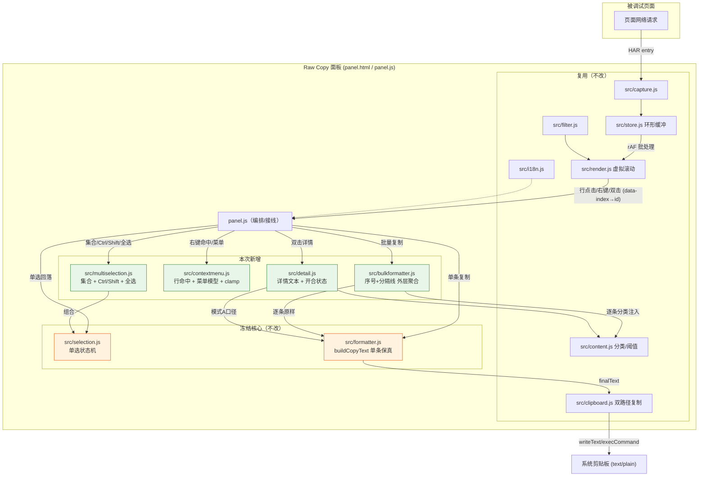

# 设计文档 — 在现有 Raw Copy（Chrome/Edge DevTools MV3）基础上做功能增强

> slug: `在现有-raw-copy-chrome-edge-devtools-mv3-扩展-基础上做功能增`
> 阶段: Phase ②（架构设计 + 四维 CIA 变更影响扫描）| 日期: 2026-10-02 | 角色: butler-dev-design
> 上游: `requirement.md`（v1.0，53 条机器真源）+ `spec.json`（4 US / 24 REQ / 8 DEL / 17 AC = 53 items）+ `feasibility.md`（✅ 可执行，VALUE high / RISK medium / EFFORT medium≈19 SP+2）
> 规范: **只分析不执行**（本文档不修改源码、不运行构建）。证据分级：confirmed / likely / inconclusive。
> 基线: `butler/spec/新建一个-chrome-edge-devtools-扩展-manifest-v3-在-devto/design.md`（ADR-001..011 命名空间延续）

---

## 0. 结论摘要

| 项 | 结论 |
|----|------|
| 影响性质 | **增量增强（incremental）** —— 在既有 `extension/` 上叠加，**不新增权限、不新增网络、不变更技术栈** |
| 架构形态 | 保持 MV3 DevTools 面板单页面（panel 上下文）；新增 **3 个纯逻辑模块 + 1 个多选包装模块**，全部走既有复制管线 |
| 冻结契约 | `src/formatter.js`（`buildCopyText`）与 `src/selection.js`（单选状态机）**字节级冻结、禁止改动**；单选复制输出逐字符不变（AC-007 / DEC-007） |
| 关键架构裁决 | 多选不侵入 `selection.js`，改由**新增 `src/multiselection.js` 组合式包装**单选核心（ADR-012）→ 直接降低 feasibility R-02 回归风险 |
| 右键菜单权限 | **必须面板内自绘 DOM 菜单**（`contextmenu` + 定位 + Esc/失焦关闭），**零 `contextMenus` 权限**（AC-012 / feasibility R-03 硬约束，ADR-013） |
| CIA 完整性 | A/B/C/D 四维各含 ≥1 条 `confirmed` → **无 `[cia_incomplete]`** |
| 待裁决项 | DEC-001..004 / A-1..A-6 / R-06 全部在本设计**拍板定稿**（见 §4 ADR-012..020），无阻塞 |

---

## 影响范围分析

### 1.1 模块级影响（逐模块）

| 模块 | 变更类型 | 变更内容 | 影响范围（文件/服务） | 风险等级 | 确信度 |
|------|:--------:|---------|:--------------------:|:--------:|:------:|
| Panel 编排 | 修改 | 右键委托、多选接线、详情容器接线、批量复制入口、`renderRow` 高亮改集合判定 | `extension/panel.js`（主接线面，891 行） | **H** | confirmed |
| Panel 结构 | 修改 | 新增工具栏多选按钮/计数、自绘菜单容器、详情抽屉容器 | `extension/panel.html` | M | confirmed |
| Panel 样式 | 修改 | 菜单/详情抽屉/多选高亮/按钮样式；沿用 token | `extension/styles/panel.css` | L | confirmed |
| i18n 文案 | 修改 | 新增 右键菜单 / 多选 / 详情 键集（zh + en 对齐） | `extension/src/i18n.js`（`dict`，26 行） | L | confirmed |
| Selection 单选 | **冻结** | **不改动**——保持 `selectAt/move/selectId/current/onEvict/setIds/reset` 逐字节不变 | `extension/src/selection.js` | **H**（若误改）| confirmed |
| 多选包装 | 新增 | 组合 `createSelection`，叠加选中集合 + Ctrl 切换 + Shift 范围 + 全选 + 回落单选 | `extension/src/multiselection.js`（新） | **H** | confirmed |
| 右键菜单逻辑 | 新增 | 行命中判定（`data-index`→recordId）+ 菜单模型 + 视口定位 clamp（纯逻辑） | `extension/src/contextmenu.js`（新） | M | confirmed |
| 批量拼接器 | 新增 | 外层聚合：序号 + 分隔线 + 每条各自 `buildCopyText` 原样块 | `extension/src/bulkformatter.js`（新） | M | confirmed |
| 详情视图逻辑 | 新增 | 详情文本构建（复用 formatter 模式 A 口径）+ 容器开合状态机 | `extension/src/detail.js`（新） | M | confirmed |
| Formatter 拼接 | **冻结** | **不改动**——`buildCopyText(record, mode, options)` 单条入参不变 | `extension/src/formatter.js` | **H**（若误改）| confirmed |
| Content 分类 | 不变（复用） | 详情与批量复制共用 `classifyBody/isOverThreshold` | `extension/src/content.js` | L | confirmed |
| Clipboard | 不变（复用） | 全部新入口复用 `copyText`（双路径降级） | `extension/src/clipboard.js` | L | confirmed |
| Manifest 配置 | 修改（仅版本号） | 权限维持 `["clipboardWrite"]`；**不得新增任何权限** | `extension/manifest.json`（14 行） | **H**（AC-012 门禁）| confirmed |
| 测试 | 新增/扩展 | 4 个新测试文件 + i18n 对齐校验 + 既有 11 文件全量回归 | `tests/*.test.mjs` | M | confirmed |
| 文档 | 修改 | USAGE/INSTALL 新增右键/多选/详情三节 + 需求覆盖说明 | `docs/USAGE.md`、`docs/INSTALL.md` | L | confirmed |
| 打包/门禁 | 不变（复用） | `scripts/package.mjs`（体积+零依赖）、`check-zero-network.mjs`、`check-syntax.mjs`、`check-manifest.mjs` 继续生效 | `scripts/*.mjs` | L | confirmed |

### 1.2 文件级影响（新增文件 = DEL 落点）

| 文件 | 对应交付物 | 变更类型 | 确信度 |
|------|-----------|:--------:|:------:|
| `extension/src/contextmenu.js` | DEL-001（右键菜单逻辑） | 新增 | confirmed |
| `extension/src/multiselection.js` | DEL-002（selection 多选扩展） | 新增 | confirmed |
| `extension/src/bulkformatter.js` | DEL-003（多记录拼接器） | 新增 | confirmed |
| `extension/src/detail.js` | DEL-004（双击明细视图逻辑） | 新增 | confirmed |
| `extension/panel.js` | DEL-001/002/004/005（接线面） | 修改 | confirmed |
| `extension/panel.html` | DEL-001/004/005（菜单/详情/工具栏容器） | 修改 | confirmed |
| `extension/styles/panel.css` | DEL-001/004/005（样式） | 修改 | confirmed |
| `extension/src/i18n.js` | DEL-006（i18n 新键） | 修改 | confirmed |
| `tests/contextmenu.test.mjs` | DEL-007 | 新增 | confirmed |
| `tests/bulkformatter.test.mjs` | DEL-007 | 新增 | confirmed |
| `tests/detail.test.mjs` | DEL-007 | 新增 | confirmed |
| `tests/multiselection.test.mjs` | DEL-007 | 新增 | confirmed |
| `docs/USAGE.md` / `docs/INSTALL.md` | DEL-008 | 修改 | confirmed |

### 1.3 被修改/删除的既有源码文件

| 既有文件 | 操作 | 说明 | 确信度 |
|---------|:----:|------|:------:|
| `extension/src/selection.js` | **不改** | 结论：改用组合式新模块（§4 ADR-012），既有 13 条测试**零改动**即可回归 | confirmed |
| `extension/src/formatter.js` | **不改** | 保真契约冻结；批量拼接只在**外层**调用 | confirmed |
| `extension/src/capture.js` / `store.js` / `render.js` / `filter.js` / `content.js` / `clipboard.js` | 不改 | 记录模型、虚拟滚动、过滤、分类、剪贴板全部沿用 | confirmed |
| `extension/manifest.json` | 仅版本号 | 权限清单字节不变（AC-012） | confirmed |

> **影响范围结论**：本次是"接线型"增量。破坏面集中在 `panel.js`（唯一 UI 编排中心）与 `i18n.js`（键集对齐）；`selection.js`/`formatter.js` 两大高风险模块通过"新增包装 + 外层聚合"实现**零侵入**，把 feasibility R-01/R-02 从"改既有"降级为"不动既有"。

### 1.4 逐条对照 spec.items 的落点

见 §10「规格覆盖矩阵（逐条对照 spec.items）」。**53 条全覆盖**，本项目 **无 CLI 类条目**（spec.json 中无 `type:"cli"`）。

---

## 变更影响地图 (CIA)

> 扫描方法：全仓定位既有调用点（内置 `grep`/`glob`，尊重 `.gitignore`）+ 直接读取源码契约 + 调用图推导。
> A/B/C/D **每维均含 ≥1 条 `confirmed`**。**无 `[cia_incomplete]`。**

### A 维 — 调用影响（谁调用了变更点 / 变更点会调用谁）

| ID | 影响项 | 证据（文件:行） | 确信度 |
|----|-------|----------------|:------:|
| A-1 | `panel.js` 是 `createSelection` 的**唯一生产消费者**；多选改造必须同步更新其 6 处调用点 | `extension/panel.js:26`（import）、`:508`（创建）、`:527`（onSelect）、`:586`（setIds）、`:638`（点击）、`:697-699`（onEvict） | confirmed |
| A-2 | `panel.js` 的 `renderRow` 用 `activeSelection.current() === rec.id` 判定高亮；集合化后必须改为"是否在选中集合内" | `extension/panel.js:416-426`；`.row.is-selected` 样式 `extension/styles/panel.css:231` | confirmed |
| A-3 | `buildCopyText` 被 `panel.js:184` 与 3 个测试文件消费；批量复制必须**只在外层循环调用**，不得改签名/行为 | `extension/panel.js:184`；`tests/formatter.test.mjs`（24 用例）、`tests/enrich.test.mjs:169` | confirmed |
| A-4 | 详情视图与批量复制将复用 `classifyBody` / `isOverThreshold`；其纯函数签名不变，新增消费者无回改 | `extension/panel.js:29,152-167,771`；`extension/src/content.js:278,338` | confirmed |
| A-5 | 既有 11 个测试文件调用被冻结模块（selection 13 用例、formatter 24 用例 golden 等），是回归门禁的调用基线 | `tests/selection.test.mjs`、`tests/formatter.test.mjs`、`tests/{store,filter,render,content,clipboard,enrich,capture,i18n}.test.mjs` | confirmed |
| A-6 | 新增内部调用边：`panel → multiselection → selection`（包装）；`panel/contextmenu → bulkformatter → formatter`（聚合）；`panel/detail → formatter + content`（复用）——全部为新增，无既有下游 | 本设计 §7 组件图 | likely |

### B 维 — 数据结构影响（变更后数据格式兼容性）

| ID | 影响项 | 证据 | 确信度 |
|----|-------|------|:------:|
| B-1 | 选中模型由**标量** `selectedId` 扩展为 **`{anchorId, selectedIds:Set}`**；所有依赖"单一选中"的逻辑（高亮、↑↓、`getSelected()`、淘汰联动）需重新审视线程一致性 | `extension/panel.js:85,508-518`；`extension/src/selection.js:77`（`selectedId` 标量） | confirmed |
| B-2 | 单条复制输出字符串**逐字符冻结**；批量输出为**新增复合字符串**（序号+分隔线+各条原样块），二者互不污染 | `extension/src/formatter.js:293`；`tests/formatter.test.mjs:227,247`（golden） | confirmed |
| B-3 | i18n `dict` 新增键后，zh/en 键集必须严格相等（既有 `i18n.test.mjs` 校验逻辑） | `extension/src/i18n.js:26`（dict）、`:232`（回退）、`tests/i18n.test.mjs` | confirmed |
| B-4 | 详情视图以 `recordId` 为真源（非行索引/DOM）；记录被淘汰时须失效清理，与 `selection.setIds` 失效语义同源 | `extension/src/selection.js:224-231`（setIds 失效清理先例）；`extension/panel.js:897`（`setIds` 调用） | likely |
| B-5 | **无持久化/无 DB**：所有新增状态（集合、详情 id、菜单开合）均驻留 DevTools 内存，关闭即销毁；**无数据迁移、无版本兼容问题** | `extension/src/store.js`（纯内存环形缓冲）；`scripts/check-zero-network.mjs` 禁 `chrome.storage/localStorage/indexedDB` | confirmed |
| B-6 | 批量输出结构为**确定性契约**：`N` 段，段边界由分隔标记唯一确定，段内为该条 `buildCopyText` 原样（模式 A/B 各自成立），不得跨条拼接 | REQ-009/010/011；本设计 §4 ADR-015 | confirmed |

### C 维 — 配置/部署影响（配置项变更、部署顺序）

| ID | 影响项 | 证据 | 确信度 |
|----|-------|------|:------:|
| C-1 | `manifest.json` 权限维持 `["clipboardWrite"]`；**右键菜单不得走 `chrome.contextMenus`**（否则被迫新增权限，破坏 AC-012） | `extension/manifest.json:7`；`scripts/package.mjs:399-405`（权限断言）；feasibility R-03 | confirmed |
| C-2 | 打包门禁：`scripts/package.mjs` 断言解压后总体积 < 200KB + 零第三方依赖；新增 4 个原生 JS 模块使体积小幅上升，但远低于阈值（现状压缩 51.16KB，feasibility §3.1 R-09） | `scripts/package.mjs:46-47,339-357` | likely |
| C-3 | 零网络/零持久化门禁：`check-zero-network.mjs` 逐行扫描 `extension/**/*.{js,html}` 禁用 `fetch(`/XHR/`sendBeacon`/`chrome.storage`/`localStorage`/`analytics` 等关键字；新增模块与自绘菜单**不得触发任一命中**（含变量/注释命名） | `scripts/check-zero-network.mjs:30-63` | confirmed |
| C-4 | 语法门禁：`check-syntax.mjs` 扫描扩展 JS；4 个新模块须为合法 ESM | `scripts/check-syntax.mjs`（存在） | confirmed |
| C-5 | 部署方式不变：`chrome://extensions` / `edge://extensions` → 开发者模式 → 重新加载已解压扩展 `extension/`；**无构建步骤** | 基线 design.md ADR-010；`extension/manifest.json:6`（devtools_page） | confirmed |
| C-6 | 版本号单一真源 `manifest.json#version`；本次增强建议 bump patch（如 `1.0.0` → `1.1.0`），打包名随之变化 | `scripts/package.mjs:291-299` | likely |

### D 维 — API/接口影响（上下游接口契约变更）

| ID | 影响项 | 证据 | 确信度 |
|----|-------|------|:------:|
| D-1 | **新增内部 ESM 契约**：`multiselection.js`、`contextmenu.js`、`bulkformatter.js`、`detail.js` 四个模块导出（见 §API 设计 3.2）；无既有消费者，纯新增 | 本设计 | confirmed |
| D-2 | **修改 `panel.js` 导出面**：保留 `els/getSelected/buildCurrentCopy/getLastCopyText/...` 向后兼容，**新增** `getSelectedIds/copySelection` 等；既有测试/调用不受影响 | `extension/panel.js:836-846`（default export） | confirmed |
| D-3 | **DOM 契约新增**：`panel.html` 新增多选按钮/菜单容器/详情抽屉的稳定 id；既有 id（`#list-body`/`#copy-btn`/`#toast`…）**不得改名** | `extension/panel.html:14`（"do not rename" 约定）、`:50-68`（`els` 查询） | confirmed |
| D-4 | `formatter.buildCopyText(record, mode, options):string` 签名与行为**冻结**（AC-007/015）；批量拼接以它为最小原样单元 | `extension/src/formatter.js:293` | confirmed |
| D-5 | `clipboard.copyText(text):Promise<{ok,via,reason}>` 契约冻结；所有新复制入口（右键/批量/详情内）统一复用它 | `extension/src/clipboard.js:188-211` | confirmed |
| D-6 | **不新增任何 Chromium 浏览器 API 消费**：不引入 `chrome.contextMenus`、不引入新 storage/messaging；右键菜单 = `addEventListener('contextmenu')` + DOM | 本设计 ADR-013；AC-012 | confirmed |
| D-7 | **上游只读契约 HAR entry / RequestRecord 不变**；`store.add/get/all`、`applyFilter`、`virtualList.setData` 契约不变 | 基线 design.md §5.2；`extension/src/store.js:632-646` | confirmed |

### CIA 完整性结论

- A 维 confirmed：A-1/A-2/A-3/A-4/A-5 ✅
- B 维 confirmed：B-1/B-2/B-3/B-5/B-6 ✅
- C 维 confirmed：C-1/C-3/C-4/C-5 ✅
- D 维 confirmed：D-1/D-2/D-3/D-4/D-5/D-6/D-7 ✅
- ⇒ **无 `[cia_incomplete]`**。

---

## 架构方案

### 3.1 总体架构（推荐方案）

**推荐：保持单页面内存态 MV3 结构，在既有模块之上"新增包装 + 外层聚合 + DOM 自绘 UI"，零侵入既有核心。**

```
DevTools 面板 (panel.html / panel.js)
  ├─ 既有：store / capture / filter / render / content / clipboard / i18n   [不变]
  ├─ 冻结：selection.js（单选状态机）/ formatter.js（buildCopyText）        [不改]
  └─ 新增：
       ├─ multiselection.js  ← 包装 selection.js，叠加 集合/Ctrl/Shift/全选
       ├─ contextmenu.js     ← 行命中判定 + 菜单模型 + 视口 clamp（纯逻辑）
       ├─ bulkformatter.js   ← 外层聚合 buildCopyText 原样块（序号+分隔线）
       └─ detail.js          ← 详情文本构建（复用 formatter 模式 A 口径）

三条新交互链路：
  右键行 → contextmenu 命中 recordId → 菜单项 → (单选) buildCurrentCopy → copyText
                                          └ (批量) bulkformatter.join(selectedIds) → copyText
  Ctrl/Shift/全选 → multiselection.toggleAt/rangeTo/selectAll → 计数渲染
  双击行 → 记录 recordId → detail.buildDetailText → 抽屉渲染（textContent）→ 关闭返回
```

要点：
- **不新增权限、不新增网络、不新增依赖、不新增浏览器 API**（D-6 / AC-012 / AC-013）。
- 复制主链路**唯一出口**仍是 `formatter.buildCopyText → clipboard.copyText`；新入口只做"取哪条/哪些条"的选择，不复制拼接逻辑（R-01 缓解）。
- 选中真源按 **recordId** 存储（非 DOM/行索引），天然规避虚拟滚动回收风险（feasibility R-05）。

### 3.2 方案对比与推荐

#### 决策 A1：多选状态机的落点

| 选项 | 说明 | 评估 | 结论 |
|------|------|------|:----:|
| A. 就地扩展 `selection.js`（feasibility 建议） | 直接改标量为集合 | 需改写 275 行核心；13 条既有测试与 AC-007 冻结契约同处一个文件，回归面大（R-02 高） | ❌ |
| **B. 新增 `multiselection.js` 组合式包装**（推荐） | 内部持有 `createSelection` 作单选核心，外层叠加 `Set` | `selection.js` 零改动，13 条测试零改动即回归；多选逻辑独立可单测；职责清晰 | ✅ 采用 |
| C. 完全重写选中模块 | 抛弃旧状态机 | 丢弃已验证的边界语义（clamp/失效清理/回调隔离），风险最高 | ❌ |

#### 决策 A2：右键菜单实现方式

| 选项 | 说明 | 评估 | 结论 |
|------|------|------|:----:|
| A. `chrome.contextMenus` | 浏览器原生菜单 | **被迫新增 `contextMenus` 权限** → 直接违反 AC-012 / 最小权限 | ❌ 排除 |
| **B. 面板内自绘 DOM 菜单**（推荐） | `contextmenu` 事件 + 定位 + Esc/失焦/滚动关闭 | 零权限；可精确承载多选/批量项；样式与主题一致 | ✅ 采用 |
| C. 借 `document.execCommand`/原生 `<menu>` | 实验性元素 | 兼容性无保证、样式不可控 | ❌ |

#### 决策 A3：详情视图容器形态

| 选项 | 说明 | 评估 | 结论 |
|------|------|------|:----:|
| A. 新窗口 / 新标签页 | 独立页展示 | 需新入口与传参；破坏"面板内可关闭返回列表"的轻量语义 | ❌ |
| **B. 面板内覆盖式抽屉（overlay drawer）**（推荐） | `#app` 内 `position:absolute; inset:0`，头部含关闭按钮 + Esc | 零权限、可关闭返回、列表保持挂载（冻结），实现最简、可访问性可控 | ✅ 采用 |
| C. 列表下方内嵌详情区（分栏） | 列表与详情并排 | 虚拟滚动容器高度需重算、行高契约受扰，改动面更大 | ❌ |

#### 决策 A4：多选复制拼接结构

| 选项 | 说明 | 评估 | 结论 |
|------|------|------|:----:|
| A. 仅空行分隔 | `block1\n\nblock2` | 无序号、边界不清，违反 REQ-009「清晰分隔/序号」 | ❌ |
| **B. 序号 + 分隔线 + 每条各自原样块**（推荐） | 每条前加 `===== #{i}/{N} =====` 独立行 | 确定性可逐字符断言（AC-006）；每条内部为冻结的 `buildCopyText` 原样 | ✅ 采用 |
| C. 外层再套全局标题段 | 额外 `===== BULK =====` | 增加无用壳，且与模式 B「纯原始」语义冲突 | ❌ |

#### 决策 A5：批量拼接的数据来源

| 选项 | 说明 | 评估 | 结论 |
|------|------|------|:----:|
| A. 复制一份 formatter 逻辑到 bulkformatter | 重写拼接 | 双份保真逻辑 → 必然漂移，违反单一真源 | ❌ 排除 |
| **B. 只调用冻结的 `buildCopyText` 逐条生成**（推荐） | 外层 `for` 循环 | 保真契约集中在一处；批量与单选天然一致 | ✅ 采用 |

### 3.3 关键实现约束（设计冻结）

1. **`formatter.js` 与 `selection.js` 不得修改**（门禁级）；批量/多选只在新增模块内实现。
2. 所有渲染（列表行、菜单项、详情文本）必须用 `textContent`/`createTextNode`，**禁止 `innerHTML`**（不可信请求数据）。
3. 选中集合与详情均以 **recordId** 为真源；记录淘汰时同步清理（`onEvict`）。
4. 右键菜单**只允许** DOM 自绘；禁止 `chrome.contextMenus` / 新增任何权限。
5. 所有复制入口统一调用 `clipboard.copyText`（其内部已含 `writeText → execCommand` 降级）。
6. 目录与 manifest 不得引入 `fetch`/XHR/`sendBeacon`/storage 关键字（`check-zero-network.mjs` 会命中）。
7. 新增 i18n 键必须 zh/en 同时补齐（键集相等）。
8. 大响应阈值确认在多选下**一次确认覆盖本批**（见 ADR-016）。

---

## 决策链 (ADR)

> ADR 编号延续基线（ADR-001..011），本增强从 **ADR-012** 起。

### ADR-012：多选采用组合式包装模块，冻结 `selection.js`
- **上下文**：selection 由单选扩为集合是本次改动面最大项（feasibility R-02 高风险）；`selection.js` 承载 AC-007 冻结契约相关的选中语义，且已有 13 条测试。
- **替代方案**：(a) 就地扩展 `selection.js`；(b) 新增 `multiselection.js` 组合式包装（推荐）；(c) 完全重写。
- **决策**：采用 (b)。`multiselection.js` 内部 `createSelection` 作单选核心，外层维护 `Set<id>` 与 anchor。
- **后果**：`selection.js` 与 13 条测试**零改动**；多选逻辑独立可单测；代价是 panel 需从 `createSelection` 切换到 `createMultiSelection`（接线改动，集中在一处）。
- **状态**：已接受。（**取代 feasibility §4 T2「直接扩展 selection.js」的措辞，理由：降低回归风险**。）

### ADR-013：右键菜单使用面板内自绘 DOM，禁止 `chrome.contextMenus`
- **上下文**：AC-012 要求权限仍仅 `clipboardWrite`；feasibility R-03 指出误用 `chrome.contextMenus` 会新增权限。
- **替代方案**：(a) `chrome.contextMenus`；(b) 面板内自绘 DOM 菜单（推荐）。
- **决策**：采用 (b)。监听 `#list-body` 的 `contextmenu`，`preventDefault`，命中 `.row[data-index]` → 记录 id，渲染绝对定位菜单；支持 Esc / 点击他处 / 滚动 / 失焦关闭；位置贴近视口边缘时做 clamp。
- **后果**：零新权限；菜单样式可控；需自行实现键盘可达性（ArrowUp/Down + Enter + Esc）。
- **状态**：已接受（**门禁级：任何 `chrome.contextMenus` 引用 = REJECT**）。

### ADR-014：多选交互语义定稿（解决 A-1/A-2/A-3/A-6）
- **上下文**：requirement.md 的 A-1/A-2/A-3/A-6 与 checklist 的歧义项待定稿。
- **决策**（精确语义）：
  - **范围基准**：`N` 与「全选」均以**当前过滤后可见列表**为准（A-1/A-2 采纳默认），与虚拟列表 `data-index` 同源。
  - **点击语义**：单击（无修饰）= 单选替换；`Ctrl`/`Cmd`+单击 = 切换该行在集合中的存在；`Shift`+单击 = 以 anchor 为起点、按**可见列表顺序**的闭区间范围选择（自动跳过被过滤隐藏项）。
  - **anchor**：最近一次非 Shift 点击/切换的行；集合清空后 anchor 失效。
  - **↑↓ 键**：仍为**单选移动**，且**清空集合**回落单选（R-007 明确）。
  - **右键**：右键即把该行设为**单选选中**（替换集合），再弹菜单（与"右键即选中该行"一致）。
  - **双击**：双击前必发一次 click（该行先被单选选中，集合被替换）；双击仅追加"打开详情"，**不再次改动选中集合**（A-6）。
  - **「复制选中(N)」入口**：工具栏按钮常驻（N=0 时禁用）；右键菜单在 N≥2 时追加该项。二者等价（A-3 采纳"并存等价"）。
- **后果**：多选、单选、键盘、右键行为互不冲突，可被 AC-004/005 机械验证。
- **状态**：已接受。

### ADR-015：批量复制输出模板 + N=1 边界
- **上下文**：AC-006「清晰分隔、无混淆」需可逐字符断言；checklist 追问 N=1 经批量入口是否加分隔。
- **决策**（精确模板）：
  - 当 `N ≥ 2`：输出 = `join('\n\n', blocks)`，其中 `block_i = "===== #" + i + "/" + N + " =====" + "\n" + buildCopyText(record_i, mode, {responseBody_i})`，`i` 从 1 起、十进制无补零。
  - 当 `N == 1`：**委托单选路径**，输出与单选复制**逐字符一致**（不加序号/分隔线）。
  - 顺序 = **可见列表顺序**（与选中集合在可见列表中的下标升序一致），非点击先后（解决 checklist「多选复制顺序」歧义）。
- **后果**：多段输出可断言为"N 个 `===== #i/N =====` 标记 + N 个原样块"；单选契约不受批量影响。
- **状态**：已接受。

### ADR-016：多选时大响应阈值确认 = 一次确认覆盖本批（解决 R-06）
- **上下文**：feasibility R-06 要求本阶段拍板；默认建议"一次确认、覆盖本批"。
- **替代方案**：(a) 逐条 N 次确认；(b) 一次确认覆盖本批（推荐）；(c) 多选时不确认。
- **决策**：采用 (b)。批量复制前，若批内**任一条** `isOverThreshold` → 弹**一次** `confirm`（文案含超限条数与最大体积），用户取消则整批不复制。
- **后果**：避免 N 次弹窗打扰；行为确定可测（AC-014 覆盖批量场景）。
- **状态**：已接受。

### ADR-017：详情视图内容口径与容器
- **上下文**：REQ-014 要求明细与复制口径一致、原始文本；A-4 规定 A/B 只影响复制产物。
- **决策**：详情文本 = `buildCopyText(record, MODE_A, {responseBody: classifyBody(...)})`（即"复制口径"的模式 A 渲染），放入滚动 `<pre>` 以 `textContent` 显示；**不随面板 A/B 切换而变**（A-4）。容器 = 面板内覆盖式抽屉（ADR A3），关闭方式 = 关闭按钮 / `Esc` / 点击遮罩。
- **后果**：详情与复制产物逐字符同源，AC-009 可机械验证；无需新 fragment 逻辑；大响应/二进制/Base64 分类复用 `content.classifyBody`（AC-014 在详情同样成立）。
- **状态**：已接受。

### ADR-018：详情与选中集合的失效清理策略
- **上下文**：虚拟滚动 + 环形缓冲淘汰下，详情/集合可能指向已淘汰记录（feasibility R-05 / checklist）。
- **决策**：
  - 详情打开记录被淘汰（`store` 发 `evict` 或 `add.evicted`）→ **自动关闭详情**并提示 `selection.evicted` 同义文案（新增 `detail.evicted`）。
  - 选中集合随 `setIds`（过滤变化）剪枝：移除不在新可见列表的 id；随 `onEvict` 移除被淘汰 id；计数 `N` 实时更新。
  - 过滤变化**保留仍可见的选中项**，剔除不可见项（与 A-1 可见范围一致）。
- **后果**：无悬挂引用、无幽灵选中；N 与实际可复制集合恒一致。
- **状态**：已接受。

### ADR-019：详情/菜单/多选的 UI 状态全部内存态，不持久化
- **上下文**：REQ-014/028 要求零持久化、关闭 DevTools 即销毁。
- **决策**：菜单开合、详情 recordId、选中集合均放 `panel.js` 模块级状态与纯逻辑模块，不写 `chrome.storage/localStorage`。
- **后果**：天然满足隐私承诺；无迁移；`check-zero-network.mjs` 门禁不受影响。
- **状态**：已接受。

### ADR-020：面板新导出与 DOM id 的向后兼容策略
- **上下文**：AC-015 要求基线用例全回归；`panel.html` 明确 id 为稳定契约。
- **决策**：既有导出与 id 一律不改名；新增能力以**追加**方式暴露（新导出名、新 id、新 `data-i18n` 键）。
- **后果**：既有 `scripts/check-panel-shell.mjs` 与面板契约测试可通过；新增断言仅追加。
- **状态**：已接受。

---

## API 设计

> 本扩展为 DevTools 面板，**无 HTTP 端点、无服务端**。下表"API"= ① 新增内部 ESM 模块接口（主契约）；② `panel.js` 导出变更；③ 新增 DOM 元素契约；④ 消费的 Chromium API（**无新增**）。

### 4.1 外部/浏览器 API（消费契约）

| 接口 | 输入 | 返回值 | 变更类型 |
|------|------|--------|:--------:|
| `chrome.devtools.network.onRequestFinished` | `cb(harEntry)` | `void` | **不变**（沿用） |
| `navigator.clipboard.writeText` | `text:string` | `Promise<void>` | **不变**（沿用，经 `clipboard.copyText`） |
| `document.execCommand('copy')` | `'copy'` | `boolean` | **不变**（降级路径） |
| `HTMLElement.addEventListener('contextmenu')` | `cb(event)` | `void` | **新增消费**（DOM 事件，零权限） |
| `HTMLElement.addEventListener('dblclick')` | `cb(event)` | `void` | **新增消费**（DOM 事件，零权限） |
| `KeyboardEvent`（`Escape`/`ArrowUp`/`ArrowDown`/`Enter`） | — | — | **新增消费**（键盘事件，零权限） |
| `chrome.contextMenus` | — | — | **明确不采用**（否则新增权限，违反 AC-012） |

### 4.2 内部模块接口（ESM 导出契约）

| 模块 | 导出签名 | 输入 | 返回值 | 变更类型 |
|------|---------|------|--------|:--------:|
| `src/multiselection.js`（新） | `createMultiSelection({ids, onChange})` | `ids:Array`、`onChange?(primaryId,index,ids)` | `{ selectAt(i), toggleAt(i), rangeTo(i), selectAll(), clear(), move(d), current(), selectedIds(), has(id), count(), setIds(ids), onEvict(id), ids(), size() }` | **新增** |
| `src/contextmenu.js`（新） | `resolveRowId(event, listBodyEl)` / `createMenuModel({hasSelection, count, canCopyRequestOnly})` / `clampPosition({x,y,w,h,vw,vh})` | 事件/上下文/尺寸 | `id\|null` / 菜单项模型 / `{left,top}` | **新增** |
| `src/bulkformatter.js`（新） | `joinBlocks(blocks, N)` / `buildBulkCopyText(records, mode, resolveBody)` | 记录数组 + 模式 | 批量纯文本 | **新增** |
| `src/detail.js`（新） | `buildDetailText(record, resolveBody)` / `createDetailView({container, onClose})` | 记录 | 详情文本（模式 A 口径）/ `{open(id), close(), isOpen(), currentId()}` | **新增** |
| `src/formatter.js` | `buildCopyText(record, mode, options)` | 单条记录 | `string` | **冻结不变** |
| `src/selection.js` | `createSelection({ids, onChange})` | id 列表 | 单选状态机（见基线） | **冻结不变** |
| `src/content.js` | `classifyBody` / `isOverThreshold` | `responseContent` | 分类 / 布尔 | **不变**（新增消费者） |
| `src/clipboard.js` | `copyText(text)` / `showToast(msg,kind)` | 文本 | `Promise<{ok,via,reason}>` | **不变**（新增消费者） |

### 4.3 `panel.js` 导出变更

| 导出 | 输入 | 返回值 | 变更类型 |
|------|------|--------|:--------:|
| `getSelected()` | — | `record\|null` | **不变**（向后兼容） |
| `buildCurrentCopy(mode)` | `mode?` | `string\|null` | **不变** |
| `getCopyMode()/setCopyMode()` / `showToast()` / `applyI18n()` / `els` / `getLastCopyText()` | — | — | **不变** |
| `getSelectedIds()`（新） | — | `Array<id>` | **新增** |
| `copySelection(mode)`（新） | `mode?` | `Promise<{ok,count,reason}>` | **新增** |
| `openDetail(id)` / `closeDetail()`（新） | `id` | `boolean` | **新增** |
| `openContextMenu(event)`（新） | 事件 | `void` | **新增** |

> 向后兼容性：**无 `[breaking_change]`** —— 全部为追加式；冻结模块签名与行为不变。

### 4.4 新增 DOM 元素契约（`panel.html`）

| 元素 id | 用途 | 关联 |
|---------|------|------|
| `#multiselect-actions` | 多选工具栏容器（全选/复制选中(N)/计数） | DEL-005 / REQ-008 |
| `#select-all-btn` | 「全选」按钮 | REQ-008 |
| `#copy-selected-btn` | 「复制选中(N)」按钮（N=0 禁用） | REQ-008 |
| `#selected-count` | 选中计数渲染节点 | REQ-008 / AC-005 |
| `#context-menu` | 自绘右键菜单容器（`role="menu"`，初始 hidden） | DEL-001 / REQ-001 |
| `#detail-pane` | 详情抽屉容器（`position:absolute; inset:0`，初始 hidden） | DEL-004 / REQ-015 |
| `#detail-body` | 详情文本 `<pre>`（`textContent` 注入） | REQ-013/014 |
| `#detail-close` | 详情关闭按钮 | REQ-015 |

> 既有 id 一律不改名（ADR-020）；新增文案全部经 `data-i18n*` 注入。

---

## DB 变更

> **本扩展无数据库、无持久化、无迁移**（REQ-014/028；`check-zero-network.mjs` 禁用 storage/indexedDB）。下表为"内存态数据模型"契约，用于模块解耦与测试。

### 6.1 内存状态模型变更

| 状态 | 存储位置 | 变更 | 字段/类型 | 兼容性 |
|:----:|---------|:----:|----------|:------:|
| 选中集合 | `multiselection.js` | **新增** | `selectedIds:Set<number>` | 无持久化 |
| 选中锚点 | `multiselection.js` | **新增** | `anchorId:number\|null` | 无持久化 |
| 单选主选 | `selection.js`（复用） | 不变 | `selectedId:number\|null`（作主/锚，供高亮与 `getSelected`） | 向前兼容 |
| 详情打开项 | `panel.js` + `detail.js` | **新增** | `detailRecordId:number\|null` | 无持久化 |
| 菜单开合 | `panel.js` + `contextmenu.js` | **新增** | `{open:boolean, x,y, targetId}` | 无持久化 |
| RequestRecord | `store.js` | **不变** | 见基线 design.md §6.1 | 向前兼容 |
| 批量输出 | 运行时字符串 | **新增** | `string`（模板见 ADR-015） | 不落盘 |

### 6.2 迁移策略

| 项 | 策略 |
|----|------|
| Schema 迁移 | **不适用** —— 无持久化存储 |
| 数据回滚 | **不适用** —— 无写入的持久化数据 |
| 版本兼容 | 仅 `manifest.json#version`；升级 = 重新 load unpacked |
| 兼容性判定 | 全部 **向前兼容**（无存量数据、无有损变更） |

---

## 组件图

### 7.1 组件依赖与数据流（Mermaid）



### 7.2 依赖方向与通信协议

| 边 | 方向 | 协议/机制 |
|----|:----:|----------|
| `render` 行事件 → `panel.js` | 单向 | DOM 事件委托（`click`/`contextmenu`/`dblclick`，`data-index`→`data-id`） |
| `panel` → `multiselection` → `selection` | 单向 | 直接函数调用（组合包装，无循环依赖） |
| `panel`/`contextmenu` → `bulkformatter` → `formatter` | 单向 | 纯函数调用（逐条，不反向） |
| `detail` → `formatter` + `content` | 单向 | 复用模式 A 拼接与内容分类 |
| `formatter` → `clipboard` | 单向 | 生成文本 → `Promise` 结果 |
| `store` → `panel`（淘汰事件） | 单向 | 订阅回调（`evict`/`add.evicted`）驱动集合/详情失效清理 |

### 7.3 单点故障与关键路径

| 风险点 | 说明 | 缓解 |
|--------|------|------|
| `formatter.buildCopyText` | 唯一产出保真文本的路径（单选冻结 + 批量逐条复用） | 纯函数、逐字符 golden、批量不重写 |
| `multiselection` 集合一致性 | N 与真实可复制集合漂移的风险 | recordId 真源 + `setIds`/`onEvict` 双剪枝 + 单测 |
| `renderRow` 高亮判定 | 多选高亮需集合判定，遗漏则高亮错 | 改为 `has(id)` + `refresh()`；回归既有渲染测试 |
| 自绘菜单定位 | 视口边缘溢出/滚动残留 | `clampPosition` 纯函数 + 关闭时机枚举 |
| 详情引用淘汰记录 | 悬挂 id | ADR-018 自动关闭 + 提示 |

---

## 安全影响评估

### 8.1 安全维度评估

| 安全维度 | 影响说明 | 缓解措施 |
|:--------:|---------|:--------:|
| 认证 | 无账号体系，无认证面 | 不适用 |
| 授权 | 新增右键/多选/详情**不得新增权限**；右键禁走 `chrome.contextMenus` | manifest 仍 `["clipboardWrite"]`；`scripts/package.mjs:399-405` 断言 + `check-manifest.mjs`；ADR-013 门禁 |
| 数据安全 | 批量复制会一次性把**多条**请求（可能含 `Authorization`/`Cookie`/token）写入剪贴板；详情在屏展示敏感原文 | 全本地、无网络、无存储；由用户显式操作触发；USAGE 警示"批量内容可能含多份敏感凭证" |
| 审计 | 无服务端、无持久化 → 无审计日志需求 | 禁止 storage/localStorage/indexedDB（`check-zero-network.mjs`） |
| 数据外泄 | 任何新代码引入网络即破坏 AC-013 | 零网络门禁逐行扫描；自绘菜单/详情仅用 DOM API |
| 供应链 | 零第三方依赖 | 4 个新模块纯原生 ESM；`package.mjs` 依赖审计须 `external.length === 0` |
| 注入（XSS/DOM） | 请求 URL/headers/body 为攻击者可控数据；菜单项/详情若用 `innerHTML` 可注入 | 强制 `textContent`/`createTextNode`；菜单项文案来自 `t()` 常量 |
| 本地 DoS | 批量复制超大响应导致字符串拼接/剪贴板压力 | 一次阈值确认覆盖本批（ADR-016）；逐条原样不改写 |
| 焦点/权限 | DevTools 焦点导致 `writeText` 失败 | 复用既有双路径降级 + 失败 Toast |

### 8.2 威胁建模（STRIDE 速览，聚焦本次新增面）

| 威胁 | 场景 | 风险 | 缓解 | 确信度 |
|------|------|:----:|------|:------:|
| **I**nformation Disclosure | 批量复制把多条含凭证请求一次带出；用户粘贴到第三方 | 中 | 用户显式触发；USAGE 警示；扩展不外传（零网络门禁） | confirmed |
| **T**ampering | 被调试页面构造恶意 URL/正文影响菜单或详情渲染 | 低 | `textContent` 渲染；菜单文案来自常量字典 | confirmed |
| **S**poofing | 恶意页面伪造内容诱导批量复制 | 低 | 复制/查看均需用户显式操作；无自动复制 | likely |
| **R**epudiation | 无审计需求 | — | 不适用（无服务端） | confirmed |
| **D**oS（本地） | 选中大量超大响应批量复制致卡顿 | 中 | 一次阈值确认 + cap=1000 + 虚拟滚动 | likely |
| **E**levation of Privilege | 实现期误用 `chrome.contextMenus` 扩权 | 高影响/中概率 | ADR-013 硬门禁 + manifest 断言 + CIA D-6 | confirmed |

### 8.3 安全门禁清单（实现期必须通过）

1. `manifest.json` 权限仍严格 `["clipboardWrite"]`（AC-012）。
2. 全仓无 `chrome.contextMenus` 引用（ADR-013）。
3. 无 `fetch(`/`XMLHttpRequest`/`sendBeacon`/WebSocket；无 `chrome.storage`/`localStorage`/`indexedDB`（AC-013 / REQ-014）。
4. 无 `innerHTML` 赋值（详情/菜单/列表统一 `textContent`）。
5. 新增模块 import 全为相对路径，`third-party deps = 0`（AC-016）。
6. `formatter.js`/`selection.js` 保持未改动（`git diff` 校验）。

---

## 回退方案

### 9.1 回退条件（任一触发即回退）

| 条件 | 判定 | 关联 |
|------|------|:----:|
| 权限门禁被破坏 | manifest 出现 `clipboardWrite` 以外权限，或出现 `chrome.contextMenus` | AC-012 / ADR-013 |
| 冻结契约被破坏 | `formatter.js` / `selection.js` 被改动，或单选复制与 golden 非逐字符一致 | AC-007 / ADR-012 |
| 多选拼接混淆 | 批量输出段数 ≠ N 或出现跨条拼接 | AC-006 / ADR-015 |
| 静默网络行为 | 任意新代码发出网络请求 | AC-013 |
| 引入第三方依赖 / 体积超限 | 出现外部 import 或解压后 ≥ 200KB | AC-016 |
| 基线回归失败 | 既有 11 个测试文件任一失败 | AC-015 |

### 9.2 回退步骤

| 步骤 | 操作 | 预估耗时 |
|:----:|------|:--------:|
| 1 | 在 `chrome://extensions` / `edge://extensions` **禁用**该扩展（即时止血） | < 10 秒 |
| 2 | 回滚代码：`git revert` 到基线里程碑提交（保留基线 1.0.0）或移除本次新增文件（`multiselection.js`/`contextmenu.js`/`bulkformatter.js`/`detail.js`），还原 `panel.js`/`panel.html`/`panel.css`/`i18n.js`/`docs/*` | 1–2 分钟 |
| 3 | 重新加载：`extension/` load unpacked（解压上一交付 zip 亦可） | 1–2 分钟 |
| 4 | 重跑门禁：4 个 scripts + 既有 11 测试文件 + 3 条新冒烟（右键/多选/双击） | 2–3 分钟 |

- **回退总时间**：< 5 分钟。
- **可逆性**：**[reversible]** —— 无持久化数据、无服务端、无账号，回退无残留、无脏状态。
- **回退影响面**：仅用户本地已加载扩展；被调试页面与其网络请求全程不受影响（扩展不拦截/不修改请求）。

### 9.3 状态校验（回退成功判定）

| 校验项 | 判定方法 | 通过标准 |
|-------|---------|---------|
| 扩展权限无残留 | 检查已加载 manifest | 仅 `clipboardWrite` |
| 冻结模块复原 | `git diff HEAD -- extension/src/formatter.js extension/src/selection.js` | 无输出（无差异） |
| 面板恢复基线 | 打开 DevTools 面板 | 列表/搜索/过滤/单选/单条复制正常；无右键菜单/详情抽屉 |
| 基线回归 | `node --test tests/*.test.mjs` | 全部 PASS |
| 无网络/无依赖 | `node scripts/check-zero-network.mjs` + `node scripts/package.mjs` | 双 PASS |

---

## 10. 规格覆盖矩阵（逐条对照 spec.items）

> `spec.json` 含 **53** items（4 US + 24 REQ + 8 DEL + 17 AC）。本设计**逐条覆盖，无遗漏**。
> **CLI 类条目：不适用**（spec.json 中无 CLI 类型；产品为 DevTools 面板 UI，无命令行交付物）。
> **UI 类条目重点核对**：REQ-001/002/003/005/006/007/008/013/015/016/017 与 DEL-001/002/004/005/006 均在 §1/§3/§4 有明确落点。

### 10.1 用户故事（US）

| ID | 覆盖设计 |
|----|---------|
| US-001 | §3.1 右键链路 + ADR-013/014；`src/contextmenu.js` + `buildCurrentCopy` |
| US-002 | §3.2 决策 A4/A5 + ADR-015；`src/multiselection.js` + `src/bulkformatter.js` |
| US-003 | ADR-017/018；`src/detail.js` + `#detail-pane` |
| US-004 | §3.1 全链路（右键/多选复用复制管线）；§8.1 数据安全 |

### 10.2 功能/技术需求（REQ）

| ID | 覆盖设计 |
|----|---------|
| REQ-001 | §1.1 Panel 修改；`#context-menu`（§4.4）；ADR-013；`contextmenu.js` 行命中 |
| REQ-002 | §3.2 决策 A2；菜单主项「复制请求 + 响应（原始）」复用 `buildCurrentCopy` |
| REQ-003 | `contextmenu.js` 菜单模型含「仅复制请求」「仅复制响应」（P2），复用 formatter 两种 body 注入 |
| REQ-004 | ADR-014 右键复用复制管线；`panel.onCopyClick`/`buildCurrentCopy`（§3.1） |
| REQ-005 | 底部按钮保留（§1.1 不改动 `#copy-btn`）；右键为主入口（ADR-013/DEL-001） |
| REQ-006 | ADR-014；`multiselection.toggleAt/rangeTo`（§4.2） |
| REQ-007 | ADR-012/014；`multiselection.move` 清空集合回落单选；`selection.move` 冻结 |
| REQ-008 | `#select-all-btn`/`#copy-selected-btn`/`#selected-count`（§4.4）；ADR-014；DEL-005 |
| REQ-009 | ADR-015 精确模板（序号 + 分隔线）；`bulkformatter.joinBlocks` |
| REQ-010 | ADR-015 段内 = 各自 `buildCopyText`（模式 A/B 语义保持） |
| REQ-011 | ADR-015（段边界唯一）；`bulkformatter` 逐条聚合，无跨条拼接 |
| REQ-012 | ADR-012（`selection.js` 冻结）；AC-007 golden 回归；§3.3 约束 1 |
| REQ-013 | `#detail-pane`/`#detail-body`（§4.4）；ADR-017；`detail.buildDetailText` 六要素 |
| REQ-014 | ADR-017（模式 A 口径 = 复制口径，不美化/不改动响应体） |
| REQ-015 | §3.2 决策 A3 覆盖式抽屉；ADR-017 关闭方式（按钮/Esc/遮罩） |
| REQ-016 | ADR-014（单击=选中，双击=查看）；`#list-body` click/dblclick 分流 |
| REQ-017 | §4.3 `openDetail` + `#detail-pane` 内「复制请求+响应」按钮（P2），复用 `buildCurrentCopy` |
| REQ-018 | §1.1 Manifest 修改（仅版本号）；ADR-009 延续；MV3 不变 |
| REQ-019 | ADR-012/020；4 个纯原生模块，零第三方依赖；`package.mjs` 审计 |
| REQ-020 | §1.1 Manifest；AC-012 门禁；ADR-013（禁 `contextMenus`）；§8.3 门禁 1/2 |
| REQ-021 | §3.1 无网络；§8.3 门禁 3；`check-zero-network.mjs` |
| REQ-022 | ADR-015/017（批量与详情均复用 `buildCopyText` 保真 body，不二次处理） |
| REQ-023 | ADR-017；`content.classifyBody/isOverThreshold` 复用（大响应/二进制/Base64 规则不变） |
| REQ-024 | §10.4 非目标覆盖声明落点；ADR-014（范围基准）；DEL-008 文档更新 |

### 10.3 交付物（DEL）

| ID | 覆盖设计（落点） |
|----|-----------------|
| DEL-001 | `extension/src/contextmenu.js` + `panel.html#context-menu` + `panel.js` 右键委托（ADR-013；§1.2） |
| DEL-002 | `extension/src/multiselection.js`（组合 `selection.js`）+ `panel.js` 接线（ADR-012/014；§4.2） |
| DEL-003 | `extension/src/bulkformatter.js`（ADR-015 模板；§4.2；§6.1 批量输出） |
| DEL-004 | `extension/src/detail.js` + `panel.html#detail-pane/#detail-body/#detail-close`（ADR-017；§1.2） |
| DEL-005 | `panel.html#multiselect-actions/#select-all-btn/#copy-selected-btn/#selected-count`（§4.4；REQ-008） |
| DEL-006 | `extension/src/i18n.js` 新增键（`contextmenu.*`/`multi.*`/`detail.*`），zh/en 对齐（ADR-014；§10.5 门禁） |
| DEL-007 | `tests/{contextmenu,bulkformatter,detail,multiselection}.test.mjs` + i18n 键集校验 + 既有 11 文件全量回归（§9.1；ADR-012/015） |
| DEL-008 | `docs/USAGE.md` / `docs/INSTALL.md` 新增右键/多选/详情三节 + 「多选覆盖原非目标」说明（REQ-024 / AC-017） |

### 10.4 验收标准（AC）

| ID | 覆盖设计（验证锚点） |
|----|---------------------|
| AC-001 | ADR-013；§4.4 `#context-menu`；DEL-001；`contextmenu.resolveRowId` |
| AC-002 | REQ-004 覆盖；右键主项复用 `buildCurrentCopy`（与 `#copy-btn` 同源，逐字符一致） |
| AC-003 | REQ-003 覆盖；P2 菜单项与对应 body 注入等价 |
| AC-004 | ADR-014 四语义（单击/Ctrl/Shift/↑↓）；`multiselection` + 冻结 `selection.move` |
| AC-005 | `#select-all-btn`/`#selected-count`；ADR-014 可见范围；ADR-018 剪枝实时更新 N |
| AC-006 | ADR-015 模板（N 段 + `#i/N` 标记 + 段内原样）；顺序=可见列表序 |
| AC-007 | ADR-012；`selection.js`/`formatter.js` 冻结；`tests/formatter.test.mjs` golden 回归 |
| AC-008 | ADR-017；`detail.buildDetailText` 六要素（方法+URL/请求头/请求体/状态码+状态文本/响应头/响应体） |
| AC-009 | ADR-017 复用 `buildCopyText(MODE_A, {responseBody})`；`<pre>` `textContent` 渲染 |
| AC-010 | ADR-014（单击不打开）+ ADR-017 关闭方式；`detail.close()` |
| AC-011 | REQ-017 覆盖（P2 详情内复制复用 `buildCurrentCopy`） |
| AC-012 | §8.3 门禁 1/2；ADR-013；`manifest.json` 不变；`package.mjs` 权限断言 |
| AC-013 | §8.3 门禁 3；`check-zero-network.mjs`；§3.3 约束 6 |
| AC-014 | ADR-016（一次确认覆盖本批）；ADR-017（详情复用 `classifyBody`）；REQ-023 |
| AC-015 | §9.1 回归条件；ADR-012/020（追加式变更）；既有 11 测试文件全量回归 |
| AC-016 | ADR-012；`package.mjs` 体积 + 零依赖审计（§8.3 门禁 5） |
| AC-017 | REQ-024 覆盖；DEL-008 文档（USAGE 记录多选覆盖原非目标 + 单条仍为默认主场景） |

### 10.5 未覆盖项 / 边界说明

| 项 | 状态 |
|----|------|
| CLI 类条目 | **不适用** —— spec.json 无 CLI 类型；无命令行交付物 |
| REQ-003 / REQ-017（P2） | **纳入本迭代但非发布阻塞**：设计已定，实现可延后，缺失不影响 P0 验收 |
| WebSocket/SSE 完整响应体 | 沿用基线（客观不可获取正文 → 标注）；本次不改 |
| `复制为 cURL` | req.txt 标"非必须"，本次未提及 → **Out**，不纳入 |
| DEC-001..004 / A-1..A-6 / R-06 | **全部在本设计拍板**（ADR-012..018），无遗留待确认 |

---

## 11. 建议实现顺序（对齐 T1–T5）

| 阶段 | 设计落地 | 关联 | 说明 |
|:----:|---------|:----:|------|
| T2（先做，风险最高） | `multiselection.js` + `panel.js` 集合接线 + `renderRow` 集合高亮 | DEL-002 | 独立 TASK + `selection.js` 13 用例全回归 |
| T1 | `contextmenu.js` + `#context-menu` + 右键委托（含 P2 仅请求/仅响应） | DEL-001 | 零权限硬约束写入 TASK |
| T3 | `bulkformatter.js`（ADR-015 模板）+ 批量入口接线 | DEL-003 | 只做外层聚合，不触碰 formatter |
| T4 | `detail.js` + `#detail-pane` + 双击分流（含 P2 详情内复制） | DEL-004 | 复用 `content.js`；recordId 真源 |
| T5 | i18n 新键 + 4 新测试 + 既有回归 + 门禁 + 文档 | DEL-006/007/008 | AC-004/007/012/015/016 门禁 |

---

<!-- butler:covers US-001 US-002 US-003 US-004 REQ-001 REQ-002 REQ-003 REQ-004 REQ-005 REQ-006 REQ-007 REQ-008 REQ-009 REQ-010 REQ-011 REQ-012 REQ-013 REQ-014 REQ-015 REQ-016 REQ-017 REQ-018 REQ-019 REQ-020 REQ-021 REQ-022 REQ-023 REQ-024 DEL-001 DEL-002 DEL-003 DEL-004 DEL-005 DEL-006 DEL-007 DEL-008 AC-001 AC-002 AC-003 AC-004 AC-005 AC-006 AC-007 AC-008 AC-009 AC-010 AC-011 AC-012 AC-013 AC-014 AC-015 AC-016 AC-017 -->
