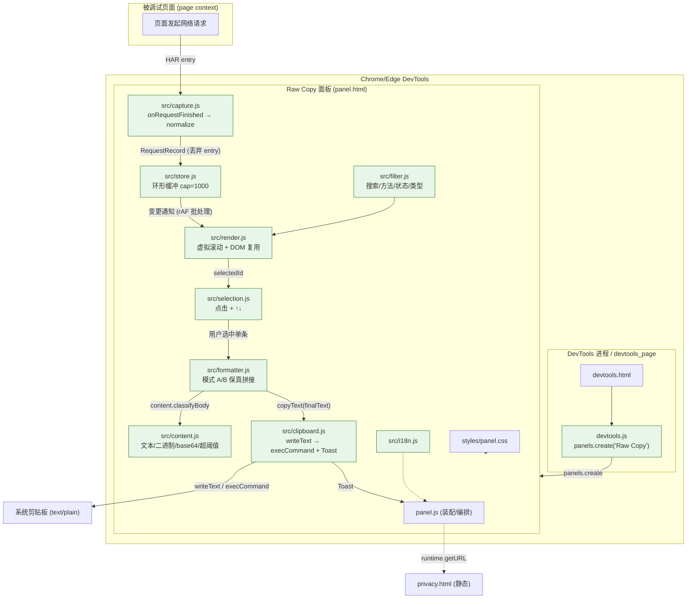

# 设计文档 — 新建一个 Chrome/Edge DevTools 扩展（Manifest V3）

> slug: `新建一个-chrome-edge-devtools-扩展-manifest-v3-在-devto`
> 阶段: Phase ②（架构设计 + 四维 CIA 变更影响扫描）| 日期: 2026-10-02 | 角色: butler-dev-design
> 上游: `requirement.md`（v1.1：36 REQ / 22 AC / 4 US / 18 DEL）+ `spec.json`（80 items，机器真源）+ `feasibility.md`（✅ 可执行，VALUE high / RISK medium / EFFORT medium ≈21 SP）
> 规范: 只分析不执行（本文档不修改源码、不运行构建）。证据分级：confirmed / likely / inconclusive。

---

## 0. 结论摘要

| 项 | 结论 |
|----|------|
| 影响性质 | **纯新增（greenfield）** —— 仓库无任何既有扩展源码，无"修改既有调用方"式破坏 |
| 架构形态 | MV3 DevTools 扩展 = `devtools_page` 注册页 + `panels.create` 面板页；**无 background service worker、无 content script** |
| 数据形态 | 纯内存 `RequestStore`（环形缓冲，cap=1000）；**无 DB、无持久化、无网络** |
| 关键风险裁决 | R8 保真语义张力 → **ADR-006 定死**：模式 A 只允许"加标题段/段标签"，body 逐字符原样，绝不 parse/排序/缩进/转 Markdown |
| CIA 完整性 | A/B/C/D 四维各含 ≥1 条 `confirmed` → **无 `[cia_incomplete]`** |
| 阻塞项 | 无 P0；DEC-001（面板名）/ DEC-003（阈值）/ DEC-005（默认模式 A）按 feasibility.md 建议默认执行 |

---

## 1. 影响范围分析

### 1.1 模块级影响（逐模块）

| 模块 | 变更类型 | 变更内容 | 影响范围（文件/服务） | 风险等级 | 确信度 |
|------|:--------:|---------|:--------------------:|:--------:|:------:|
| Ext Entry 扩展入口 | 新增 | `devtools_page` 注册页；调用 `panels.create` 注册 `Raw Copy` 面板 | `extension/devtools.html`、`extension/devtools.js` | L | confirmed |
| Panel UI 面板界面 | 新增 | 列表 + 工具栏（搜索/过滤/模式切换）+ 复制按钮 + Toast + 隐私入口 | `extension/panel.html`、`extension/panel.js`、`extension/styles/panel.css` | M | confirmed |
| Capture 捕获模块 | 新增 | 注册 `onRequestFinished`；HAR entry → 归一化 `RequestRecord`（O(headers)） | `extension/src/capture.js` | M | confirmed |
| Store 内存缓存 | 新增 | 环形缓冲 cap=1000，O(1) 追加/淘汰；订阅通知 | `extension/src/store.js` | M | confirmed |
| Render 列表渲染 | 新增 | 虚拟滚动（窗口化 + DOM 复用），固定行高 | `extension/src/render.js` | M | confirmed |
| Filter 搜索/过滤 | 新增 | URL 关键字 + method/status/resourceType 过滤 | `extension/src/filter.js` | L | confirmed |
| Selection 选中交互 | 新增 | 点击选中 + ↑/↓ 键切换；处理"选中项被淘汰" | `extension/src/selection.js` | L | confirmed |
| Formatter 复制拼接 | 新增 | 模式 A/B 纯文本拼接 + 保真约束 + 元信息段 | `extension/src/formatter.js` | **H**（AC-007 命门）| confirmed |
| Content 内容分类 | 新增 | 文本 / 二进制 / base64 / 超阈值 分类与占位标注 | `extension/src/content.js` | M | confirmed |
| Clipboard 剪贴板 | 新增 | `navigator.clipboard.writeText` + `execCommand('copy')` 降级 + Toast | `extension/src/clipboard.js` | M | confirmed |
| i18n 文案 | 新增 | 中文优先字典 + 预留英文结构 | `extension/src/i18n.js` | L | confirmed |
| Manifest 配置 | 新增 | MV3 manifest；`permissions:["clipboardWrite"]`；devtools_page；icons | `extension/manifest.json` | **H**（AC-009 门禁）| confirmed |
| Privacy 合规页 | 新增 | 静态隐私政策页（不收集/不传输/全本地） | `extension/privacy.html` | L | confirmed |
| Icons 资源 | 新增 | 16/32/48/128 PNG | `extension/icons/*.png` | L | confirmed |
| Docs 文档 | 新增 | 安装 / 使用 / 测试用例 / LICENSE | `docs/INSTALL.md`、`docs/USAGE.md`、`docs/TESTCASES.md`、`LICENSE` | L | confirmed |
| Packaging 打包 | 新增 | 打包脚本/命令 → `dist/raw-copy-<ver>.zip`（仅扩展根内容） | `scripts/package.mjs`、`dist/raw-copy-1.0.0.zip` | M | likely |

### 1.2 文件级影响（新增文件清单 = DEL 落点）

| 文件 | 对应交付物 | 变更类型 | 确信度 |
|------|-----------|:--------:|:------:|
| `extension/manifest.json` | DEL-009 | 新增 | confirmed |
| `extension/devtools.html`、`extension/devtools.js` | DEL-001 | 新增 | confirmed |
| `extension/panel.html`、`extension/panel.js` | DEL-002 | 新增 | confirmed |
| `extension/styles/panel.css` | DEL-002（UI 样式） | 新增 | confirmed |
| `extension/src/capture.js`、`extension/src/store.js` | DEL-003 | 新增 | confirmed |
| `extension/src/render.js`、`extension/src/filter.js` | DEL-004 | 新增 | confirmed |
| `extension/src/selection.js` | DEL-005 | 新增 | confirmed |
| `extension/src/formatter.js` | DEL-006 | 新增 | confirmed |
| `extension/src/clipboard.js` | DEL-007 | 新增 | confirmed |
| `extension/src/content.js` | DEL-008 | 新增 | confirmed |
| `extension/src/i18n.js` | REQ-033（预留 i18n） | 新增 | confirmed |
| `extension/privacy.html` | DEL-010 | 新增 | confirmed |
| `docs/INSTALL.md` | DEL-011 | 新增 | confirmed |
| `docs/USAGE.md` | DEL-012 | 新增 | confirmed |
| `docs/TESTCASES.md` | DEL-013 | 新增 | confirmed |
| `LICENSE` | DEL-014 | 新增 | confirmed |
| `dist/raw-copy-1.0.0.zip` | DEL-015 | 新增（构建产物） | likely |
| （以上全部源码） | DEL-016 | 新增 | confirmed |
| `extension/icons/icon{16,32,48,128}.png` | DEL-017 | 新增 | confirmed |
| `scripts/package.mjs` | DEL-015 打包支撑 | 新增 | likely |

### 1.3 被修改/删除的既有文件

| 既有文件 | 操作 | 说明 | 确信度 |
|---------|:----:|------|:------:|
| （无） | — | 全仓无既有 `.js/.html/.css` 源码（`glob **/*.{js,html,css,zip}` → No files found；`grep panels.create\|onRequestFinished\|clipboardWrite\|devtools_page` 仅命中 `butler/**` 规格产物）。**零个既有源码文件被修改或删除** | confirmed |

> **影响范围结论**：这是一次 100% 增量的绿地实现。不存在"改既有函数 → 调用方破裂"的传统破坏面；风险集中在**新增代码内部契约**（保真拼接、虚拟滚动、内存上限、最小权限门禁）。

---

## 2. 变更影响地图（CIA 四维扫描）

> 扫描方法：全仓定位既有调用点（`grep` / `glob`，尊重 `.gitignore`）+ 读取 spec/feasibility 契约 + 内部调用图推导。
> A/B/C/D 每维均含 ≥1 条 `confirmed`。**无 `[cia_incomplete]`。**

### A 维 — 调用影响（谁调用了变更点 / 变更点会调用谁）

| ID | 影响项 | 证据 | 确信度 |
|----|-------|------|:------:|
| A-1 | 无既有调用方受破坏：全仓无扩展源码，不存在"变更既有函数签名/行为导致调用方失败"的调用影响 | `glob **/*.{js,html,css,zip}` → 0 文件；`grep` 命中仅在 `butler/**` | confirmed |
| A-2 | 新增外部注册调用：`devtools.js` 调用 `chrome.devtools.panels.create(...)` 注册面板 → 唯一可见影响 = DevTools 面板栏新增一项（REQ-001 / AC-001） | req.txt §5.1/§7.1 | confirmed |
| A-3 | 新增外部回调注册：`src/capture.js` 调 `chrome.devtools.network.onRequestFinished.addListener(cb)` → Chromium 在**每次请求完成**时回调本扩展；调用频率 = 页面请求频率，直接影响页面性能（REQ-029）→ cb 必须 O(1)/O(headers) 且不阻塞 | req.txt §7.1；R4 | confirmed |
| A-4 | 新增内部调用图（见 §7 组件图）：`capture.add → store.add → (notify) → render.setData / filter.apply`；`selection.change → formatter.buildCopyText → content.classifyBody → clipboard.copyText`。全部为新增，无既有下游 | 本设计 | likely |
| A-5 | 无 SW/content script 回调：不注册 background service worker 与 content script（REQ-036）→ 无跨上下文生命周期调用影响、无 ambient 调度 | req.txt §7.1 | confirmed |
| A-6 | 高频路径约束：`onRequestFinished` 回调内禁止 JSON 解析/大字符串拷贝；base64 解码只在**复制时刻**执行，不在捕获时刻 | R2 / REQ-029 | likely |

### B 维 — 数据结构影响（变更后数据格式兼容性）

| ID | 影响项 | 证据 | 确信度 |
|----|-------|------|:------:|
| B-1 | 新增内存结构 `RequestRecord`（HAR entry 归一化），字段契约见 §6.1；**无磁盘/无 localStorage/indexedDB** → 无持久化数据、无迁移、无历史版本兼容问题（REQ-028） | req.txt §8；AC-028 | confirmed |
| B-2 | 环形缓冲 cap=1000：追加第 1001 条时淘汰最旧 → 旧记录 id 失效 → selection 必须处理"选中项被淘汰 → 自动清空选中或落到最近项"（REQ-004 / AC-013） | req.txt §5.2 | confirmed |
| B-3 | 保真数据契约：`response.content.text` 以 JS string **原样驻留**，捕获/拼接/复制全程不 parse→stringify、不 trim、不转义、不包 Markdown（REQ-020 / AC-007）；base64 仅在文本类 MIME 下解码一次（REQ-024） | req.txt §5.7/§13；R2 | confirmed |
| B-4 | headers 顺序敏感：HAR `headers:[{name,value}]` 数组顺序 = 原始顺序，输出按数组序，不排序/不去重/不合并同名（AC-014） | req.txt §5.5/§7.4 | confirmed |
| B-5 | 大响应内存驻留：单条 body ≥ 阈值（默认 10MB）时仍驻留内存以便"继续复制"；cap=1000 下理论峰值内存不可忽略 → 缓解：记 `size` + `oversize` 标记 + 阈值常量可配 + （建议）总量软上限日志告警（REQ-022 / AC-010） | R2 / REQ-022 | likely |
| B-6 | 二进制/Base64 降级占位符格式为对外可见输出契约：`[Binary content omitted: <mime>, <bytes> bytes]` / `[Base64 content omitted: length N]` 必须逐字符匹配（REQ-023/024，AC-010） | req.txt §5.8 | confirmed |

### C 维 — 配置/部署影响（配置项变更、部署顺序）

| ID | 影响项 | 证据 | 确信度 |
|----|-------|------|:------:|
| C-1 | **唯一部署配置 `manifest.json`**：`manifest_version:3` + `devtools_page:"devtools.html"` + `permissions:["clipboardWrite"]`。任何误增 `host_permissions`/`tabs`/`webRequest`/`declarativeNetRequest`/`<all_urls>` 即破坏 AC-009 门禁 → 静态检查脚本 + 人工双检 | req.txt §7.2；AC-009；R14 | confirmed |
| C-2 | 新增图标资源 16/32/48/128（DEL-017）；新增静态 `privacy.html`，由 panel 经 `chrome.runtime.getURL('privacy.html')` 打开（REQ-013、DEL-010） | req.txt §7.2/§8 | confirmed |
| C-3 | 部署方式：`chrome://extensions`（Edge 为 `edge://extensions`）→ 开发者模式 → **加载已解压的扩展程序 → 指向 `extension/`**。扩展根 = `extension/` 子目录（ADR-010），使打包与体积门禁可测 | 本设计；AC-017/AC-018 | confirmed |
| C-4 | 无构建步骤（零依赖、纯原生 JS）；打包 = 将 `extension/**` + `LICENSE` 压入 `dist/raw-copy-1.0.0.zip`（排除 `butler/`、`req.txt`、`docs/`、`.refs/`、`.opencode/`）。打包需脚本化（`scripts/package.mjs`，Node 内置 `zlib` 手写 zip 或调用系统 `Compress-Archive`），避免手工遗漏 | 本设计；DEL-015/AC-019 | likely |
| C-5 | 兼容性配置无需分叉：Chrome 与 Edge 同为 Chromium 内核，同一份 `extension/` 直接加载；仅需在 Edge 做一次安装+面板冒烟（REQ-030 / AC-018） | req.txt §9；R5 | confirmed |
| C-6 | 版本号单一真源：`manifest.json#version`；打包文件名与之一致；变更时同步 | 本设计 | likely |

### D 维 — API/接口影响（上下游接口契约变更）

| ID | 影响项 | 证据 | 确信度 |
|----|-------|------|:------:|
| D-1 | **上游只读契约：HAR entry**（REQ-035）。消费字段：`request.method/url/headers/postData.text`；`response.status/statusText/headers/content.{text,encoding,mimeType,size}`；`entry.time`；`entry.startedDateTime`；扩展字段 `entry._resourceType`。契约字段缺失时必须有降级（见 §5.2 降级矩阵） | req.txt §7.4 | confirmed |
| D-2 | **Chromium 扩展 API 契约**（只读/注册式，无破坏面）：`chrome.devtools.panels.create(title,iconPath,pagePath,cb)`、`chrome.devtools.network.onRequestFinished`、`chrome.runtime.getURL(path)`；不使用 `chrome.devtools.network.getHAR`（全量 HAR 违背"单条"边界，仅列备选不采用） | req.txt §7.1 | confirmed |
| D-3 | **剪贴板契约**：主路径 `navigator.clipboard.writeText(text): Promise<void>` → 拒绝/不可用时降级 `document.execCommand('copy'): boolean`（隐藏 textarea + select）；输出 MIME = `text/plain`；两条路径均需给出成功/失败结果对象（REQ-036 / AC-022） | req.txt §7.3 | confirmed |
| D-4 | **内部模块 ESM 导出签名**为新增接口（见 §5.3），无既有下游消费者；签名一旦冻结即为 formatter/clipboard 的稳定契约 | 本设计 | likely |
| D-5 | **前端不可信输入契约**：URL / headers / body 全部来自被调试页面，属**不可信数据**，渲染层必须只用 `textContent`/`createTextNode`，禁止 `innerHTML`（注入防御，见 §8） | 本设计；R12 | confirmed |
| D-6 | Privacy 页为纯静态 HTML，不暴露 JS 接口，不读写任何扩展状态 | 本设计 | likely |

### CIA 完整性结论

- A 维 confirmed：A-1/A-2/A-3/A-5 ✅
- B 维 confirmed：B-1/B-2/B-3/B-4/B-6 ✅
- C 维 confirmed：C-1/C-2/C-3/C-5 ✅
- D 维 confirmed：D-1/D-2/D-3/D-5 ✅
- ⇒ **无 `[cia_incomplete]`**。

---

## 3. 架构方案

### 3.1 总体架构（推荐方案）

**推荐：单页面（panel 上下文）内存态 MV3 DevTools 扩展。**

```
DevTools 打开
  └─ manifest.devtools_page → devtools.html
        └─ devtools.js: chrome.devtools.panels.create("Raw Copy", icons/icon32.png, "panel.html")
              └─ 用户点击面板 → panel.html (type=module) 加载
                    ├─ panel.js 装配: store / capture / render / filter / selection / clipboard / i18n
                    ├─ capture.install(): onRequestFinished.addListener
                    │     └─ 每条 HAR entry → normalize → store.add()   [回调内 O(headers)]
                    └─ store 变更 → render.setData() (rAF 批处理) → 虚拟滚动渲染
用户操作: 搜索/过滤 → 选中(点击/↑↓) → 复制按钮
     └─ selection.record → formatter.buildCopyText(record, mode)
            └─ content.classifyBody() → clipboard.copyText() → Toast
```

要点：
- **捕获监听器注册在 panel 上下文**（不是 devtools.js、不是 SW）→ 数据生命周期 = 面板生命周期 = "关闭 DevTools 后数据销毁"（REQ-028）天然成立。
- **无 SW / 无 content script / 无网络**（REQ-027/036）。
- **纯原生 ESM**，无构建、无打包器、无第三方运行时依赖（REQ-032）。

### 3.2 方案对比与推荐

#### 决策 1：数据存放位置与捕获上下文

| 选项 | 说明 | 评估 | 结论 |
|------|------|------|:----:|
| **A. panel 上下文内捕获+持有**（推荐） | capture 与 store 均在 panel.js 内 | 数据生命周期与面板一致，天然满足"关 DevTools 即销毁"；无跨上下文消息；无 SW 复杂度 | ✅ 采用 |
| B. devtools 页捕获 + runtime 消息转发到 panel | devtools.js 持 store，panel 通过 `chrome.runtime` 收发 | 需自定义消息协议、序列化开销（大 body 序列化昂贵）、生命周期更复杂；收益（面板关闭仍缓存）与需求相悖 | ❌ |
| C. background service worker 捕获 | 需 `devtools`/`webRequest` 类能力 | 直接违反 REQ-036（不需要 SW）与 REQ-026（权限最小） | ❌ 排除 |

#### 决策 2：模块组织

| 选项 | 说明 | 评估 | 结论 |
|------|------|------|:----:|
| **A. 多文件原生 ESM**（推荐） | `panel.html` 用 `<script type="module" src="panel.js">`，`src/*.js` 各司其职 | 无构建、职责清晰、可单测（Node 可直接 import 纯逻辑模块）、体积小 | ✅ 采用 |
| B. 单文件 `panel.js` 巨石 | 全部逻辑塞一个文件 | 无需 ESM 解析；但 1200+ 行难维护、单测困难、评审成本高 | ❌ |
| C. 非模块多 `<script>` 全局拼接 | 依赖全局变量 | 隐式全局、加载顺序脆弱 | ❌ |

#### 决策 3：内存缓存结构（cap=1000）

| 选项 | 说明 | 评估 | 结论 |
|------|------|------|:----:|
| A. 数组 `push` + `shift()` | 超限弹头 | `shift` 为 O(n)，1000 条下每次淘汰搬移近千元素；高频追加时浪费 | ❌ |
| **B. 环形缓冲（固定数组 + head/size 索引）**（推荐） | 写入 `buf[head]=rec`，满则覆盖最旧 | 追加/淘汰均 O(1)，内存恒定，天然防泄漏 | ✅ 采用 |
| C. 双向链表 + Map | 任意删除友好 | 对"只淘汰最旧"是过度设计，指针开销更大 | ❌ |

#### 决策 4：列表渲染

| 选项 | 说明 | 评估 | 结论 |
|------|------|------|:----:|
| A. 全量 DOM 渲染 | 1000 行一次性挂载 | 1000 行 + 每次追加重排 → 卡顿，违反 AC-021 | ❌ |
| **B. 自研虚拟滚动（窗口化 + DOM 复用）**（推荐） | 固定行高 28px，spacer 撑高，仅渲染可视区 + overscan | 纯原生、无依赖、1000 条 O(可视行数) 渲染 | ✅ 采用 |
| C. 第三方虚拟列表库 | 引入依赖 | 违反 REQ-032/REQ-026（供应链、体积） | ❌ 排除 |

#### 决策 5：模式 A 的保真规则（R8 裁决）

| 选项 | 说明 | 评估 | 结论 |
|------|------|------|:----:|
| **A. 仅"加壳"：加标题段/段标签，body 逐字符原样**（推荐） | 只添加 `===== REQUEST =====`/`===== RESPONSE =====`、`[Request Body]`/`[Response Body]` 标签；payload 一字节不改 | 满足 REQ-018 且不违反 REQ-020/AC-007；可被逐字符测试验证 | ✅ 采用（ADR-006 定死）|
| B. 模式 A 对 body 做美化/排序 | 对 JSON 缩进或排序 | 直接违反 REQ-020/§13/AC-007，产品价值主张崩塌 | ❌ 排除 |

#### 决策 6：交付布局

| 选项 | 说明 | 评估 | 结论 |
|------|------|------|:----:|
| A. 仓库根即扩展根 | manifest.json 放仓库根 | 打包需排除 `butler/`、`req.txt`、`.refs/`、`.opencode/`，易污染、体积门禁难验证 | ❌ |
| **B. `extension/` 子目录即扩展根**（推荐） | 加载解压指向 `extension/`；zip 仅含该目录 + LICENSE | 打包边界清晰、`<200KB` 可机械验证、交付干净 | ✅ 采用 |

### 3.3 关键实现约束（设计冻结）

1. `onRequestFinished` 回调内**只做**：字段读取 + 归一化 + `store.add` + 轻量变更通知；禁止 JSON 解析、禁止 base64 解码、禁止 DOM 操作（DOM 更新走 rAF 批处理）。
2. 归一化后**丢弃原 HAR entry 引用**；仅独立异步 enrich 步骤可在**有界队列**内临时持有该 entry（`getContent` 回调/超时后立即释放），防止 `entry.getContent` 闭包连带长期保留响应体，造成内存泄漏（ADR-003，2026-10-02 修订）。
3. 复制时刻才做 `content` 分类与 base64 解码（`content.classifyBody`）。
4. 模式 A 的 body 与模式 B 的 body 必须输出**同一字符串实例内容**（UTF-16 码元逐一致）。
5. 所有渲染走 `textContent`；禁止 `innerHTML` 注入不可信请求数据。
6. 阈值常量集中定义（`LARGE_BODY_THRESHOLD_BYTES = 10 * 1024 * 1024`，DEC-003）。

---

## 4. 决策链（ADR）

### ADR-001：使用 panel 上下文注册捕获监听器
- **上下文**：`onRequestFinished` 在 devtools 页与 panel 页均可用；需决定谁持有 store。REQ-028 要求"关闭 DevTools 后数据销毁"。
- **替代方案**：(a) panel 上下文捕获并持有（推荐）；(b) devtools 页捕获 + runtime 消息转发；(c) service worker 捕获。
- **决策**：采用 (a)。
- **后果**：数据生命周期与面板一致，天然满足隐私承诺；无跨上下文序列化开销；面板未打开时不缓存历史请求（可接受：用户需打开面板才观察）。
- **状态**：已接受（Accepted）。

### ADR-002：原生 ESM 多模块 + 无构建
- **上下文**：零第三方依赖（REQ-032）、体积 <200KB（REQ-031）、需可单测的纯逻辑。
- **替代方案**：(a) 原生 ESM 多文件（推荐）；(b) 单文件巨石；(c) 打包器 bundle。
- **决策**：采用 (a)。
- **后果**：无构建链、直接 load unpacked；纯逻辑模块（formatter/content/filter/store）可在 Node 下 import 做单元测试；需注意扩展页 ESM 的路径解析（相对 `panel.html`）。
- **状态**：已接受。

### ADR-003：捕获时归一化并释放 HAR entry（2026-10-02 修订）
- **上下文**：Chrome 的 HAR entry 对象携带 `getContent` 闭包，长期持有引用会连带保留响应体（内存泄漏风险，REQ-004/REQ-029）；且 `onRequestFinished` 的 HAR entry 按 Chromium 设计默认**不含** `response.content.text`，正文须经异步 `getContent` 获取（RC-2）。
- **替代方案**：(a) 存归一化 `RequestRecord` 并丢弃 entry（推荐）；(b) 直接存 entry 数组，复制时读 `content.text`；(c) 存 entry 且 lazy `getContent`。
- **决策**：采用 (a)；归一化后**另设独立异步 enrich 步骤**（不在捕获回调内同步读取）：仅当 `record.responseContent.text` 为空/`null` 且 `harEntry.getContent` 为函数时，调用 `getContent` **双形态**（回调 `(content, encoding)` / Promise `{content, encoding}`）取回正文，`applyContent` 后原地回填同一记录并立即释放 entry；enrich 设有并发上限、待处理队列上限与超时兜底，**不长期驻留 entry**（REQ-008）。
- **后果**：内存占用可预测、无闭包泄漏；正文客观存在时（含 401 等错误响应）复制可取得逐字符完整正文（REQ-010/AC-012）；占位仅保留给「客观不可获取 / 二进制省略 / 超预算降级」。（2026-10-02 修订）
- **状态**：已接受（**2026-10-02 修订：原「捕获回调内同步读取」措辞与 `getContent` 异步 API 矛盾，改为独立异步 enrich**）。

### ADR-004：环形缓冲（固定数组 + head/size）
- **上下文**：cap=1000，实时高频追加，需 O(1) 淘汰最旧（REQ-004/AC-013）。
- **替代方案**：(a) 环形缓冲（推荐）；(b) 数组 shift；(c) 链表。
- **决策**：采用 (a)。
- **后果**：追加/淘汰恒定时间，内存恒定；`all()` 需按环形顺序展开（O(n) 只读遍历，渲染窗口化后调用频率可控）。
- **状态**：已接受。

### ADR-005：自研虚拟滚动（固定行高 + DOM 复用）
- **上下文**：1000 条不卡顿（REQ-029/AC-021），禁止第三方依赖（REQ-032）。
- **替代方案**：(a) 自研窗口化（推荐）；(b) 全量 DOM；(c) 第三方库。
- **决策**：采用 (a)，固定行高便于数学定位。
- **后果**：DOM 节点数 ≈ 可视行数 + overscan；URL 超长用 CSS `text-overflow: ellipsis` 不换行（保持固定行高）；代价是行高不可自适应。
- **状态**：已接受。

### ADR-006：模式 A 保真规则（R8 裁决，**最高优先级**）
- **上下文**：REQ-018"模式 A 简单格式化"与 REQ-020"不解析/不缩进/不排序/不改字符"存在字面张力（R8，影响 AC-007 命门）。
- **替代方案**：(a) A 模式仅允许加标题段与段标签，body 逐字符原样（推荐）；(b) A 模式对 body 做美化。
- **决策**：采用 (a)。**精确定义**：
  - 模式 A 输出结构：`===== REQUEST =====` → 请求行/头/空行/`[Request Body]`/body → 空行 → `===== RESPONSE =====` → 状态行/头/空行/`[Response Body]`/body。
  - 模式 B 输出结构：请求块（请求行/头/空行/body）→ 空行 → 响应块（状态行/头/空行/body），**无任何标题/标签**。
  - 两种模式下 `body` 字符串必须与 `record.response.content.text`（解码后）**逐 UTF-16 码元一致**；不 trim、不转义、不补换行、不截断。
  - 元信息（开始时间/耗时/资源类型/MIME）仅允许出现在**标题段**，不得插入 body。
- **后果**：AC-007/AC-015 可被"逐字符比对"机械验证；语义张力消解。
- **状态**：已接受（**门禁级决策**）。

### ADR-007：剪贴板双路径降级
- **上下文**：DevTools 面板中 `navigator.clipboard` 可能因焦点/权限拒绝（R3），但需"成功率 100%/失败有提示"（REQ-034/AC-022）。
- **替代方案**：(a) 双路径 `writeText` → `execCommand('copy')`（推荐）；(b) 仅 `writeText`；(c) 仅 `execCommand`。
- **决策**：采用 (a)；返回 `{ok, via:'clipboard'|'execCommand'|'none', reason?}`。
- **后果**：不依赖单一 API；两条路径均失败时 Toast 明确原因；`execCommand` 需隐藏 `<textarea>` + `select()` + 恢复焦点。
- **状态**：已接受。

### ADR-008：内容分类与 base64 判定
- **上下文**：需按 MIME/encoding 决定"原样输出 / 解码 / 占位省略"（REQ-023/024，AC-010）。
- **替代方案**：(a) 基于 `content.encoding` + `mimeType` 前缀判定（推荐）；(b) 猜测字节内容；(c) 一律省略。
- **决策**：采用 (a)。判定顺序：`encoding==='base64'` → 若 MIME 属文本类（`text/*`、`application/json|xml|javascript`、`+json|+xml`）则 `atob`→UTF-8 解码为文本，否则输出 `[Base64 content omitted: length N]`；非 base64 且 MIME 为二进制类（`image/*`、`video/*`、`audio/*`、`font/*`、`application/octet-stream|pdf|zip`）→ 输出 `[Binary content omitted: <mime>, <bytes> bytes]`；其余文本类 → 原样。
- **后果**：占位符格式固定、可测试；解码仅在复制时刻发生。
- **状态**：已接受。

### ADR-009：最小权限 + 无 SW / 无 content script
- **上下文**：AC-009 硬门禁；R14 权限扩张破坏承诺。
- **替代方案**：(a) 仅 `clipboardWrite`，无 host/sw/content（推荐）；(b) 加 `webRequest`/`tabs` 自行抓包。
- **决策**：采用 (a)。
- **后果**：无法自行抓包（也不需要，HAR 由 DevTools 提供）；`clipboardWrite` 之外零权限；需静态检查脚本守住门禁。
- **状态**：已接受。

### ADR-010：`extension/` 子目录作为可加载/可打包边界
- **上下文**：AC-017 体积门禁与 AC-019 交付清晰度。
- **替代方案**：(a) `extension/` 为扩展根（推荐）；(b) 仓库根为扩展根。
- **决策**：采用 (a)。
- **后果**：load unpacked 指向 `extension/`；zip 仅含 `extension/**` + `LICENSE`；体积可机械验证；`butler/`、`docs/` 不进入发行包。
- **状态**：已接受。

### ADR-011：打包脚本化
- **上下文**：手工 zip 易遗漏/易把 `butler/` 打进包。
- **替代方案**：(a) Node 脚本 `scripts/package.mjs`（推荐，零运行时依赖，用 Node 内置能力或系统命令）；(b) 手工 `Compress-Archive`。
- **决策**：采用 (a)，脚本内白名单仅 `extension/**` + `LICENSE`，输出 `dist/raw-copy-<version>.zip`。
- **后果**：打包可重复、可审计；脚本属开发期工具，不计入扩展运行时依赖。
- **状态**：已接受。

---

## 5. API 设计

> 扩展无 HTTP 端点。本节"API"= ① 消费的 Chromium 外部 API 契约；② 内部模块导出接口契约。均标注变更类型。

### 5.1 外部 API（消费契约）

| 接口 | 方法/签名 | 输入 | 返回值 | 变更类型 |
|------|----------|------|--------|:--------:|
| `chrome.devtools.panels.create` | 静态 | `title:string, iconPath:string, pagePath:string, callback:(panel)=>void` | `void`（经 callback 回传 panel） | 新增消费 |
| `chrome.devtools.network.onRequestFinished` | `.addListener(cb)` / `.removeListener(cb)` | `cb(harEntry: HAREntry)` | `void` | 新增消费 |
| `harEntry.getContent` | 回调 `(cb:(content:string, encoding:string)=>void)`；Promise `()=>Promise<{content:string, encoding:string}>` | callback / 无参 | `void` / Promise | **常规路径**（正文缺失时的必达步骤，REQ-001/REQ-010，2026-10-02 修订）：捕获层独立异步 enrich 调用，取回正文后原地回填同一记录；仅 `typeof getContent === 'function'` 时触发，不长期驻留 entry |
| `chrome.runtime.getURL` | `(path:string)=>string` | `"privacy.html"` | `chrome-extension://<id>/privacy.html` | 新增消费 |
| `navigator.clipboard.writeText` | `(text:string)=>Promise<void>` | 复制文本 | Promise（resolve/reject） | 新增消费 |
| `document.execCommand` | `('copy')=>boolean` | — | `boolean` | 新增消费（降级路径） |
| `chrome.devtools.network.getHAR` | `(cb)=>void` | — | 全量 HAR log | **不采用**（违反"单条"边界，仅登记为已评估备选） |

### 5.2 上游 HAR → RequestRecord 映射与降级矩阵（REQ-035）

| 源字段 | 目标字段 | 缺失时降级 | 确信度 |
|-------|---------|-----------|:------:|
| `entry.request.method` | `request.method` | 空串 → 显示 `?` | confirmed |
| `entry.request.url` | `request.url` | 空串 | confirmed |
| `entry.request.httpVersion` | `request.httpVersion` | 回退 `"HTTP/1.1"`（DEC-002） | confirmed |
| `entry.request.headers[]` | `request.headers[]`（原序） | `[]` | confirmed |
| `entry.request.postData.text` | `request.postData.text` | `null` → 不输出 `[Request Body]` 段 | confirmed |
| `entry.response.status` | `response.status` | `0` | confirmed |
| `entry.response.statusText` | `response.statusText` | `""` | confirmed |
| `entry.response.headers[]` | `response.headers[]`（原序） | `[]` | confirmed |
| `entry.response.content.text` | `response.content.text` | `null` 且 `getContent` 可获取 → **必达取回**（异步 enrich，原地回填，含 401 等错误响应）；仅「客观不可获取 / 二进制省略 / 超预算降级」才输出占位（R1 边界，2026-10-02 修订） | confirmed |
| `entry.response.content.encoding` | `response.content.encoding` | `null` → 视作原始文本 | confirmed |
| `entry.response.content.mimeType` | `response.content.mimeType` | `""` → 视作文本 | confirmed |
| `entry.response.content.size` | `response.content.size` | 反推自 text 长度 | confirmed |
| `entry.time` | `time`（ms） | `0` | confirmed |
| `entry.startedDateTime` | `startedDateTime`（ISO） | `""` | confirmed |
| `entry._resourceType`（Chrome 扩展字段） | `resourceType` | 由 `mimeType` 推断（`XHR`/`Document`/`Script`/`Stylesheet`/`Image`/`Font`/`Media`/`WebSocket`…） | likely |

### 5.3 内部模块接口（ESM 导出契约，新增）

| 模块 | 导出签名 | 输入 | 返回值 | 变更类型 |
|------|---------|------|--------|:--------:|
| `src/store.js` | `createStore({capacity=1000})` | 配置 | `{ add(rec):id, get(id):rec\|undefined, all():rec[], size():number, clear():void, subscribe(fn):unsub }` | 新增 |
| `src/capture.js` | `installCapture({store, onAdd})` / `normalize(harEntry):RequestRecord` | store + 回调 / HAR entry | `{ uninstall():void }` / 归一化记录 | 新增 |
| `src/filter.js` | `applyFilter(records, criteria):Record[]` | `{query:string, method:string\|'', status:string\|'', resourceType:string\|''}` | 命中记录数组 | 新增 |
| `src/render.js` | `createVirtualList({container, rowHeight, overscan, renderRow, onSelect})` | DOM 容器 + 渲染回调 | `{ setData(items):void, scrollToId(id):void, refresh():void }` | 新增 |
| `src/selection.js` | `createSelection({ids, onChange})` | id 列表 + 回调 | `{ selectAt(i):void, move(delta):void, selectId(id):void, current():id\|null, onEvict(id):void }` | 新增 |
| `src/formatter.js` | `buildCopyText(record, mode):string`；常量 `MODE_A='formatted'`、`MODE_B='raw'` | `RequestRecord` + 模式 | 纯文本（UTF-16 精确） | 新增 |
| `src/content.js` | `classifyBody(responseContent):{kind:'text'\|'binary'\|'base64-text'\|'base64-omitted'\|'unavailable', text?:string, placeholder?:string, byteSize:number}` | `response.content` | 分类结果 | 新增 |
| `src/clipboard.js` | `copyText(text):Promise<{ok:boolean, via:string, reason?:string}>`；`showToast(msg, kind)` | 文本 | 结果对象 / void | 新增 |
| `src/i18n.js` | `t(key, vars?):string`；默认 `zh`，结构预留 `en` | key | 文案 | 新增 |

### 5.4 向后兼容性

- 无既有 API 消费者 → **无 `[breaking_change]`**。
- 内部模块签名一旦冻结，即成为 formatter/clipboard 的稳定契约；变更需走本设计文档修订。
- 上游 HAR 契约为 Chromium 只读契约，本设计只消费不修改。

---

## 6. DB 变更

### 6.1 数据模型（无 DB；内存态 `RequestRecord`）

> **无数据库、无持久化、无迁移**（REQ-028：数据仅存 DevTools 内存，关闭即销毁）。下表为唯一"数据模型"契约，用于录制/渲染/拼接三方解耦。

| 结构 | 字段 | 类型 | 约束 | 来源/说明 | 兼容性 |
|:----:|------|:----:|:----:|-----------|:------:|
| RequestRecord | `id` | number | 唯一、递增 | store 序号 | 无持久化 |
| RequestRecord | `startedDateTime` | string(ISO) | — | `entry.startedDateTime` | 向前兼容 |
| RequestRecord | `time` | number(ms) | ≥0 | `entry.time` | 向前兼容 |
| RequestRecord | `request.method` | string | — | REQ-015 | 向前兼容 |
| RequestRecord | `request.url` | string | — | REQ-015 | 向前兼容 |
| RequestRecord | `request.httpVersion` | string | 缺省 `HTTP/1.1` | DEC-002 | 向前兼容 |
| RequestRecord | `request.headers` | `{name,value}[]` | 保序 | REQ-015/AC-014 | 向前兼容 |
| RequestRecord | `request.postData.text` | string\|null | 原样 | REQ-015 | 向前兼容 |
| RequestRecord | `response.status` | number | — | REQ-016 | 向前兼容 |
| RequestRecord | `response.statusText` | string | — | REQ-016 | 向前兼容 |
| RequestRecord | `response.headers` | `{name,value}[]` | 保序 | REQ-016/AC-014 | 向前兼容 |
| RequestRecord | `response.content.mimeType` | string | — | REQ-035 | 向前兼容 |
| RequestRecord | `response.content.text` | string\|null | **逐字符原样** | REQ-020/AC-007 | 向前兼容 |
| RequestRecord | `response.content.encoding` | string\|null | `'base64'` 特殊判定 | REQ-024 | 向前兼容 |
| RequestRecord | `response.content.size` | number(bytes) | ≥0 | 列表"大小"列 + 省略占位 | 向前兼容 |
| RequestRecord | `resourceType` | string | — | `_resourceType` 或 MIME 推断 | 向前兼容 |
| RequestRecord | `oversize` | boolean | 派生 | `size ≥ 10MB` | 无持久化 |

### 6.2 迁移策略

| 项 | 策略 |
|----|------|
| Schema 迁移 | **不适用** —— 无持久化存储，进程结束即销毁 |
| 数据回滚 | **不适用** —— 无写入的持久化数据 |
| 版本兼容 | 仅 `manifest.json#version`；升级 = 重新 load unpacked，不涉及数据迁移 |
| 兼容性判定 | 全部 **向前兼容**（无有损变更，因无存量数据） |

---

## 7. 组件图

### 7.1 组件依赖与数据流（Mermaid）



### 7.2 依赖方向与通信协议

| 边 | 方向 | 协议/机制 |
|----|:----:|----------|
| 页面请求 → `capture` | 单向 | Chromium DevTools API 回调（HAR entry 入参） |
| `devtools.js` → 面板 | 单向 | `chrome.devtools.panels.create`（静态注册） |
| `capture` → `store` | 单向 | 直接函数调用（同上下文） |
| `store` → `render` | 单向 | 订阅回调 + `requestAnimationFrame` 批处理（防抖，护 REQ-029） |
| `filter` → `render` | 单向 | 过滤结果集注入 |
| `render`/`selection` → `formatter` | 单向 | 事件（选中变更）+ 记录读取 |
| `formatter` → `content` → `clipboard` | 单向 | 直接调用 → Promise 结果 |
| `panel.js` → 各模块 | 单向装配 | ESM import（无循环依赖） |

### 7.3 单点故障与关键路径

| 风险点 | 说明 | 缓解 |
|--------|------|------|
| `formatter.buildCopyText` | 唯一产出复制文本的路径（AC-007/AC-015 核心） | 纯函数、可 Node 单测、逐字符比对 |
| `clipboard` 双路径 | 复制成功率的唯一出口（AC-022） | 双路径降级 + 失败原因回传 |
| `capture` 回调 | 位于页面请求热路径（REQ-029） | O(1) 归一化 + rAF 批渲染，不在回调内做重活 |
| `render` 虚拟滚动 | 1000 条性能（AC-021） | 固定行高 + DOM 复用 + overscan |

---

## 8. 安全影响评估

### 8.1 安全维度评估

| 安全维度 | 影响说明 | 缓解措施 |
|:--------:|---------|:--------:|
| 认证 | 无用户/账号体系，无认证面（Out of Scope） | 不适用 |
| 授权 | 仅申请 `clipboardWrite`；不申请 hosts/tabs/webRequest | AC-009 门禁：manifest 静态检查脚本 + 人工复核；任何新增权限即 REJECT |
| 数据安全 | 剪贴板可能含 `Authorization`/`Cookie`/token 等敏感凭证（R12）；请求数据来自被调试页面（不可信） | 全本地、无网络、无存储；隐私政策 + 使用说明显式警示"复制内容可能含敏感信息"；渲染层仅 `textContent` |
| 审计 | 无服务器、无持久化 → 无审计日志需求；不得落盘（REQ-028） | 禁止 localStorage/IndexedDB/chrome.storage 写操作；仅内存 |
| 数据外泄 | 若引入任何 `fetch`/XHR/`sendBeacon` 即破坏 AC-008 | 代码级禁令 + AC-008 以 DevTools Network 面板观测验证（复现过程中扩展零请求） |
| 供应链 | 零第三方运行时依赖（REQ-032） | 不引入 npm/CDN；打包脚本仅用 Node 内置能力 |
| 注入（XSS/DOM） | 请求 URL/headers/body 是攻击者可控数据，若用 `innerHTML` 可注入 | 强制 `textContent`/`createTextNode`；CSP 默认（MV3 禁 inline script/eval） |
| 剪贴板劫持/焦点 | DevTools 面板焦点问题可能导致 `writeText` 失败（R3） | 降级 `execCommand` + 显式失败提示；不使用 `clipboardRead` |
| 权限透明度 | 商店/用户需理解权限用途 | 隐私政策 + 安装说明声明"仅本地读写剪贴板" |

### 8.2 威胁建模（STRIDE 速览）

| 威胁 | 场景 | 风险 | 缓解 | 确信度 |
|------|------|:----:|------|:------:|
| **I**nformation Disclosure | 用户把含 token 的请求粘贴到第三方 AI（风险在用户侧，非扩展） | 中 | 隐私政策/使用说明警示；扩展本身不外传 | confirmed |
| **T**ampering | 被调试页面注入恶意字符串试图影响扩展 UI | 低 | `textContent` 渲染；不 eval 数据 | confirmed |
| **S**poofing | 恶意站点伪造请求诱导用户复制 | 低 | 复制由用户显式操作触发；无自动复制 | likely |
| **R**epudiation | 无审计需求 | — | 不适用（无服务端） | confirmed |
| **D**oS（本地） | 超大响应/海量请求导致面板卡死 | 中 | cap=1000 + 虚拟滚动 + 10MB 阈值提示 | confirmed |
| **E**levation of Privilege | 误加敏感权限 | 高影响/低概率 | AC-009 硬门禁 + 脚本检查（R14） | confirmed |

### 8.3 安全门禁清单（实现期必须通过）

1. `manifest.json` 权限仅 `["clipboardWrite"]`（AC-009）。
2. 全仓无 `fetch(` / `XMLHttpRequest` / `navigator.sendBeacon` / WebSocket 客户端代码（AC-008）。
3. 无 `eval` / `new Function` / `innerHTML` 赋值（CSP + 注入防御）。
4. 无 `localStorage` / `sessionStorage` / `indexedDB` / `chrome.storage`（REQ-028）。
5. 隐私政策页包含三项声明（AC-020）。

---

## 9. 回退方案

### 9.1 回退条件（任一触发即回退）

| 条件 | 判定 | 关联 |
|------|------|:----:|
| 权限门禁被破坏 | manifest 出现 `clipboardWrite` 以外权限 | AC-009 / R14 |
| 保真失败 | JSON 响应体复制后与原文非逐字符一致 | AC-007 / R8 |
| 静默网络行为 | 复制路径或任意代码发出网络请求 | AC-008 / REQ-027 |
| 引入第三方依赖 | 出现 npm/CDN/打包器运行时 | REQ-032 / AC-017 |
| 体积超限 | zip > 200KB | AC-017 |
| 加载失败 | load unpacked 报错、面板不出现 | AC-001 |

### 9.2 回退步骤

| 步骤 | 操作 | 预估耗时 |
|:----:|------|:--------:|
| 1 | 在 `chrome://extensions` / `edge://extensions` 中**禁用**该扩展（即时止血，用户侧零影响） | < 10 秒 |
| 2 | 回滚代码：若已入库则 `git revert` 到上一通过验收的提交；否则删除/还原 `extension/` 目录 | 1–2 分钟 |
| 3 | 恢复上一交付 zip：`dist/raw-copy-<上版本>.zip` 解压后重新 load unpacked | 1–2 分钟 |
| 4 | 重新执行门禁清单（§8.3）+ 冒烟（AC-001 / AC-009 / AC-007 / AC-008） | 2–3 分钟 |

- **回退总时间**：< 5 分钟。
- **可逆性**：**[reversible]** —— 无持久化数据、无服务端、无用户账号，回退无数据残留、无脏状态。
- **回退影响面**：仅用户本地已加载的扩展；被调试页面与其网络请求全程不受影响（扩展不拦截/不修改请求，REQ §3.2）。

### 9.3 状态校验（回退成功判定）

| 校验项 | 判定方法 | 通过标准 |
|-------|---------|---------|
| 扩展已卸载/禁用 | `chrome://extensions` | 列表无该扩展或为禁用态 |
| 无残留权限 | 检查已加载 manifest | 不显示任何权限（或 -） |
| 面板消失 | 打开 DevTools 面板栏 | 无 `Raw Copy` 面板 |
| 无网络残留 | DevTools Network 面板观察 | 扩展加载前后无新增可疑请求 |

---

## 10. 规格覆盖矩阵（逐条对照 spec.items）

> 说明：`spec.json` 含 80 个 items（4 US + 36 REQ + 18 DEL + 22 AC），本设计**逐条覆盖**。本项目不含 CLI 类条目（CLI 不适用，无命令行交付物）；UI 类条目（REQ-001/005-013/025/033、DEL-002/004/005/010/017 等）均在 §1/§3/§5 有对应落点。

### 10.1 用户故事（US）

| ID | 覆盖设计 |
|----|---------|
| US-001 | §3.1 主链路（面板→捕获→选中→复制→粘贴）；ADR-002/003/006；§5.3 formatter/clipboard |
| US-002 | §3.1 主链路 + §5.3 formatter（单条完整请求+响应）；AC-005 覆盖 |
| US-003 | §2 D-1 HAR 契约；§5.2 字段映射；ADR-003 归一化保真 |
| US-004 | §3.1 主链路（面板本地操作，无账号）；§8.1 数据安全 |

### 10.2 功能/技术需求（REQ）

| ID | 覆盖设计 |
|----|---------|
| REQ-001 | §1.1 Ext Entry/Panel UI；§3.1；ADR-001/009；§5.1 `panels.create` |
| REQ-002 | §1.1 Capture；§2 A-3/D-1；§5.1 `onRequestFinished`；§5.2 类型映射 |
| REQ-003 | §1.1 Capture/Store；§3.1 数据流；ADR-004；§7.2 store→render rAF |
| REQ-004 | §1.1 Store；ADR-004 环形缓冲；§6.1；§2 B-2 |
| REQ-005 | §1.1 Panel UI；§5.2 字段映射；§6.1 记录字段；AC-012 |
| REQ-006 | §1.1 Filter；§5.3 `applyFilter{query}` |
| REQ-007 | §1.1 Filter；§5.3 `applyFilter{method}` |
| REQ-008 | §1.1 Filter；§5.3 `applyFilter{status}` |
| REQ-009 | §1.1 Filter；§5.3 `applyFilter{resourceType}` |
| REQ-010 | §1.1 Selection；§5.3 `createSelection.selectId/selectAt` |
| REQ-011 | §1.1 Selection；§5.3 `createSelection.move(±1)` |
| REQ-012 | §1.1 Panel UI/Formatter；§3.1 复制按钮；§5.3 `buildCopyText` |
| REQ-013 | §1.1 Panel UI；**P2 backlog**（DEC-004，不阻塞）；设计预留点击处理器不实现 |
| REQ-014 | §1.1 Formatter；ADR-006；§5.3 `buildCopyText(record)` 只接收单条 |
| REQ-015 | §5.2 映射（method/url/httpVersion+DEC-002/headers/postData.text）；§6.1 |
| REQ-016 | §5.2 映射（status/statusText/headers/content.text）；§6.1 |
| REQ-017 | §1.1 Formatter；ADR-006 元信息仅标题段；§6.1 startedDateTime/time/resourceType/mimeType |
| REQ-018 | ADR-006 模式 A 精确结构；§3.2 决策 5 |
| REQ-019 | ADR-006 模式 B 精确结构 |
| REQ-020 | ADR-006 保真规则；§2 B-3；§3.3 约束 4 |
| REQ-021 | §5.3 `classifyBody` kind=text 原样输出 |
| REQ-022 | ADR-008；§3.3 约束 6 阈值常量；§5.3 oversize 判定 |
| REQ-023 | ADR-008 二进制占位格式；§2 B-6 |
| REQ-024 | ADR-008 base64 文本类解码/否则占位；§2 B-6 |
| REQ-025 | §1.1 Clipboard；ADR-007；§5.3 `copyText`+`showToast` |
| REQ-026 | §1.1 Manifest；ADR-009；§8.3 门禁 1；§2 C-1 |
| REQ-027 | §3.1 无网络；§8.3 门禁 2；§2 C-1/D-? |
| REQ-028 | ADR-001/003；§6.1（无持久化）；§8.3 门禁 4；§2 B-1 |
| REQ-029 | §3.3 约束 1/2；ADR-004/005；§7.3 热路径 |
| REQ-030 | §2 C-5；ADR-010；AC-018 冒烟 |
| REQ-031 | ADR-002/010/011；§1.1 Packaging；§2 C-3/C-4 |
| REQ-032 | ADR-002；§3.2 决策 2/4；§8.1 供应链 |
| REQ-033 | §1.1 i18n；§5.3 `t(key)`；ADR-？(i18n 预留结构) |
| REQ-034 | ADR-007 双路径；§5.3 返回 `{ok,via,reason}` |
| REQ-035 | §5.2 完整 HAR→Record 映射表；§2 D-1 |
| REQ-036 | §3.1 总体架构；ADR-001/007/009；§5.1 外部 API |

### 10.3 交付物（DEL）

| ID | 覆盖设计（落点） |
|----|-----------------|
| DEL-001 | `extension/devtools.html` + `extension/devtools.js`（§1.2；§3.1；ADR-001） |
| DEL-002 | `extension/panel.html` + `extension/panel.js` + `styles/panel.css`（§1.2；§5.3） |
| DEL-003 | `extension/src/capture.js` + `extension/src/store.js`（§1.2；ADR-003/004；§5.3） |
| DEL-004 | `extension/src/render.js` + `extension/src/filter.js`（§1.2；ADR-005；§5.3） |
| DEL-005 | `extension/src/selection.js`（§1.2；§5.3） |
| DEL-006 | `extension/src/formatter.js`（§1.2；ADR-006；§5.3） |
| DEL-007 | `extension/src/clipboard.js`（§1.2；ADR-007；§5.3） |
| DEL-008 | `extension/src/content.js`（§1.2；ADR-008；§5.3） |
| DEL-009 | `extension/manifest.json`（§1.2；ADR-009；§8.3 门禁 1） |
| DEL-010 | `extension/privacy.html`（§1.2；§8.1；AC-020） |
| DEL-011 | `docs/INSTALL.md`（§1.2；§10.4 AC-018/AC-019） |
| DEL-012 | `docs/USAGE.md`（§1.2；§8.1 敏感信息警示） |
| DEL-013 | `docs/TESTCASES.md`（§1.2；覆盖全部 22 条 AC） |
| DEL-014 | `LICENSE`（MIT 或 Apache-2.0）（§1.2） |
| DEL-015 | `dist/raw-copy-1.0.0.zip`（§1.2；ADR-011 打包脚本） |
| DEL-016 | 完整源码 = `extension/**`（§1.2 全部源码文件） |
| DEL-017 | `extension/icons/icon{16,32,48,128}.png`（§1.2；解压版在 manifest 声明） |
| DEL-018 | 里程碑 M1–M5 节奏（feasibility.md §5.1 已拆解；本设计 §1/§3 提供落点） |

### 10.4 验收标准（AC）

| ID | 覆盖设计（验证锚点） |
|----|---------------------|
| AC-001 | ADR-001/009；§5.1 `panels.create`；§9.3 校验 1 |
| AC-002 | §3.1 数据流；§3.3 约束 1；ADR-004 |
| AC-003 | §5.3 `applyFilter`；§1.1 Filter |
| AC-004 | §5.3 `createSelection`（selectId/selectAt/move） |
| AC-005 | §5.2 映射 + ADR-006 输出结构（方法/URL/头/体 + 状态码/文本/头/体） |
| AC-006 | REQ-014 覆盖；ADR-006（单条入参） |
| AC-007 | **ADR-006 逐字符保真**；§3.3 约束 4；§8.3 门禁 |
| AC-008 | §8.3 门禁 2；§9.3 校验 4 |
| AC-009 | §8.3 门禁 1；ADR-009；§2 C-1 |
| AC-010 | ADR-008；REQ-022/023/024；§5.3 `classifyBody` |
| AC-011 | ADR-007；§5.3 `copyText`/`showToast` |
| AC-012 | §6.1 记录字段；§5.2 映射；REQ-005 |
| AC-013 | ADR-004；§2 B-2；REQ-004 |
| AC-014 | ADR-006；§5.2 headers 保序；§2 B-4 |
| AC-015 | ADR-006 模式 A/B 精确定义 |
| AC-016 | §1.1 i18n；§5.3 `t()`；REQ-033 |
| AC-017 | ADR-010/011；§2 C-3/C-4；§9.1 体积门禁 |
| AC-018 | §2 C-5；ADR-? 兼容；§9.3 冒烟 |
| AC-019 | §10.3 DEL-001..018 全落点 |
| AC-020 | DEL-010 + §8.1 三项声明 |
| AC-021 | ADR-005；§7.3 渲染路径；REQ-029 |
| AC-022 | ADR-007；§5.3 `copyText` 返回对象；REQ-034 |

### 10.5 未覆盖项 / 边界说明

| 项 | 状态 |
|----|------|
| CLI 类条目 | **不适用** —— spec.items 中无 CLI 类型；本产品为 DevTools 面板 UI，无命令行交付物 |
| REQ-013 / DEC-004（仅请求/仅响应/复制为 cURL） | **P2 backlog**，设计预留扩展点但**本期不实现**，不阻塞 P0 验收 |
| REQ-034 字面"成功率 100%" | feasibility.md R9 建议改写为"存在降级路径 + 失败必有提示"；本设计按 ADR-007 实现，**指标重述待老板确认** |
| WebSocket/SSE 完整响应体（R1） | WebSocket/SSE 等**客观不可获取**正文 → 仅作资源类型展示 / 标注"响应体不可用"（DEC-006）；**文本类正文缺失 → `getContent` 必达取回**，不再产出占位（2026-10-02 修订，见 ADR-003 / §5.2） |
| DEC-001 面板名 / DEC-002 HTTP 版本回退 / DEC-003 阈值 / DEC-005 默认模式 | 按 feasibility.md 默认执行（`Raw Copy` / `HTTP/1.1` / 10MB / 模式 A），**实现前一次性确认** |

---

## 11. 建议实现顺序（对齐 M1–M5）

| 阶段 | 设计落地 | 关联 DEL |
|:----:|---------|:--------:|
| M1 | `manifest.json` + `devtools.html/js` + `panel.html` 骨架 + 图标 → 面板可见 | DEL-001/002/009/017 |
| M2 | `capture.js` + `store.js` + `render.js` + `filter.js`（虚拟滚动） | DEL-003/004 |
| M3 | `selection.js` + `formatter.js` + `clipboard.js`（保真拼接 + 双路径复制 + Toast） | DEL-005/006/007 |
| M4 | `content.js`（大响应/二进制/base64）+ 过滤完善 + i18n | DEL-008 |
| M5 | `privacy.html` + 文档 + LICENSE + 打包脚本 + 测试用例 | DEL-010~016 |

---

<!-- butler:covers US-001 US-002 US-003 US-004 REQ-001 REQ-002 REQ-003 REQ-004 REQ-005 REQ-006 REQ-007 REQ-008 REQ-009 REQ-010 REQ-011 REQ-012 REQ-013 REQ-014 REQ-015 REQ-016 REQ-017 REQ-018 REQ-019 REQ-020 REQ-021 REQ-022 REQ-023 REQ-024 REQ-025 REQ-026 REQ-027 REQ-028 REQ-029 REQ-030 REQ-031 REQ-032 REQ-033 REQ-034 REQ-035 REQ-036 DEL-001 DEL-002 DEL-003 DEL-004 DEL-005 DEL-006 DEL-007 DEL-008 DEL-009 DEL-010 DEL-011 DEL-012 DEL-013 DEL-014 DEL-015 DEL-016 DEL-017 DEL-018 AC-001 AC-002 AC-003 AC-004 AC-005 AC-006 AC-007 AC-008 AC-009 AC-010 AC-011 AC-012 AC-013 AC-014 AC-015 AC-016 AC-017 AC-018 AC-019 AC-020 AC-021 AC-022 -->
