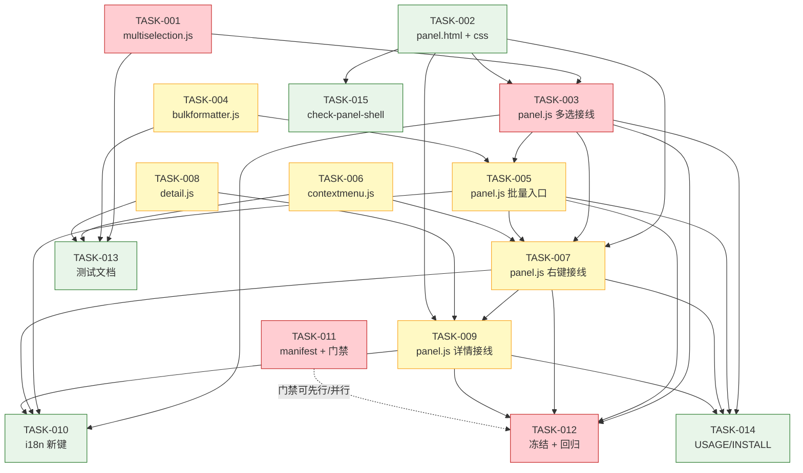

# 依赖图 — 在现有 Raw Copy 基础上做功能增强

> slug: `在现有-raw-copy-chrome-edge-devtools-mv3-扩展-基础上做功能增`
> 生成: butler-task-decomposer（Phase ③.5）| 2026-10-02
> TASK 数: 15 | 依赖类型: 数据依赖（模块接口）/ 文件依赖（panel.js 串行）/ 逻辑依赖（门禁收口）

---

## 1. TASK 一览

| TASK | 标题 | agent | est | weight | depends-on | covers |
|------|------|-------|:---:|:------:|-----------|--------|
| TASK-001 | `multiselection.js` 多选包装 + 单测 | butler-developer | M | heavy | N/A | REQ-006 REQ-007 DEL-002 AC-004 US-002 |
| TASK-002 | 面板 DOM 容器与样式（工具栏/菜单/详情） | butler-developer | S | light | N/A | REQ-001 REQ-008 REQ-015 DEL-001 DEL-004 DEL-005 |
| TASK-003 | `panel.js` 多选接线 | butler-developer | M | heavy | TASK-001, TASK-002 | REQ-006 REQ-007 AC-004 US-002 |
| TASK-004 | `bulkformatter.js` 多记录拼接器 + 单测 | butler-developer | S | standard | N/A | REQ-009 REQ-010 REQ-011 REQ-022 DEL-003 AC-006 US-002 |
| TASK-005 | `panel.js` 批量复制入口 `copySelection` | butler-developer | S | standard | TASK-003, TASK-004 | REQ-008 REQ-009 DEL-005 AC-005 AC-006 AC-014 US-002 |
| TASK-006 | `contextmenu.js` 右键菜单逻辑 + 单测 | butler-developer | S | standard | N/A | REQ-001 REQ-002 REQ-003 REQ-004 DEL-001 AC-001 AC-003 US-001 US-004 |
| TASK-007 | `panel.js` 右键菜单接线（含 P2） | butler-developer | M | standard | TASK-006, TASK-002, TASK-003, TASK-005 | REQ-001..005 DEL-001 AC-001 AC-002 AC-003 US-001 US-004 |
| TASK-008 | `detail.js` 明细视图逻辑 + 单测 | butler-developer | S | standard | N/A | REQ-013 REQ-014 DEL-004 AC-008 AC-009 US-003 |
| TASK-009 | `panel.js` 双击详情接线（含 P2 + 淘汰关闭） | butler-developer | M | standard | TASK-008, TASK-002, TASK-007 | REQ-013..017 DEL-004 AC-008..011 US-003 |
| TASK-010 | i18n 新增键 + 键集断言 | butler-developer | S | light | TASK-003, TASK-005, TASK-007, TASK-009 | DEL-006 REQ-001 REQ-008 REQ-013 |
| TASK-011 | manifest 版本 + 权限/零网络/零依赖/体积门禁 | butler-config-changer | S | heavy | N/A | REQ-018..021 DEL-007 AC-012 AC-013 AC-016 US-004 |
| TASK-012 | 冻结契约守护 + 基线全量回归 | butler-tester | M | heavy | TASK-003, TASK-005, TASK-007, TASK-009 | REQ-012 REQ-022 REQ-023 AC-007 AC-014 AC-015 US-004 |
| TASK-013 | 测试文档（test-cases.md + README） | butler-doc-writer | S | light | TASK-001, TASK-004, TASK-006, TASK-008 | DEL-007 AC-015 |
| TASK-014 | 使用/安装文档 + 需求覆盖声明 | butler-doc-writer | S | light | TASK-003, TASK-005, TASK-007, TASK-009 | REQ-024 DEL-008 AC-017 US-004 |
| TASK-015 | `check-panel-shell.mjs` requiredIds 追加（可选） | butler-developer | S | light | TASK-002 | DEL-007 REQ-001 REQ-015 |

---

## 2. Mermaid 依赖图

---

## 3. 依赖类型说明

| 边 | 类型 | 说明 |
|----|------|------|
| TASK-001 → TASK-003 | 数据依赖 | panel 需要 `createMultiSelection` 接口 |
| TASK-002 → TASK-003/007/009/015 | 文件依赖（DOM 契约） | 接线需新增的稳定 id 先存在 |
| TASK-003/005/007/009 之间 | **文件依赖（panel.js 串行）** | 四者同改 `panel.js`，必须按序执行，避免冲突 |
| TASK-004 → TASK-005 | 数据依赖 | 批量入口调用 `buildBulkCopyText` |
| TASK-006 → TASK-007 | 数据依赖 | 右键接线调用 `resolveRowId`/`createMenuModel`/`clampPosition` |
| TASK-008 → TASK-009 | 数据依赖 | 详情接线调用 `buildDetailText`/`createDetailView` |
| TASK-007 → TASK-009 | 数据依赖（复用） | 详情复用 `contextmenu.resolveRowId` 行命中 |
| TASK-003/005/007/009 → TASK-010 | 逻辑依赖 | i18n 键名以接线实际用到的为准 |
| TASK-003/005/007/009 → TASK-012/014 | 逻辑依赖 | 回归与文档需功能面就绪 |
| TASK-001/004/006/008 → TASK-013 | 逻辑依赖 | 测试文档需 4 个新测试文件 |
| TASK-011 | 无依赖（可并行） | manifest 版本 + 门禁，随时可跑 |

## 4. 无环校验

- 拓扑排序：`{T1,T2,T4,T6,T8,T11} → {T3,T15} → {T5} → {T7} → {T9} → {T10,T12,T14} ; {T13}`。
- **无循环依赖**（DAG 成立）；`panel.js` 串行为文件依赖的有向链，非环。

## 5. 关键路径

`T1 → T3 → T5 → T7 → T9 → T12`（多选→批量→右键→详情→回归），为最长链，也是 release 阻塞路径。
建议执行顺序（对齐 design §11 T2→T1→T3→T4→T5）：
`T2, T1, T4, T6, T8, T11`（可并行）→ `T3` → `T5` → `T7` → `T9` → `T10` → `T12` → `T13, T14, T15`。
