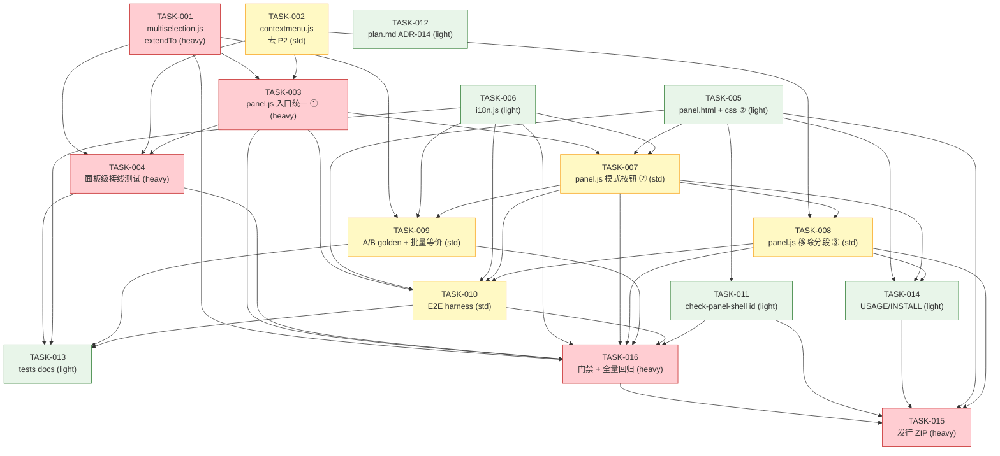

# 依赖图 — Raw Copy v1.1.0 三项修复/调整（多选漏条 / 复制模式按钮化 / 移除分段复制）

> slug: `对现有-raw-copy-chrome-edge-devtools-mv3-扩展-v1-1-0-`
> 生成: butler-task-decomposer（Phase ③.5）| 2026-10-02
> TASK 数: 16 | 依赖类型: 数据依赖（新接口 `extendTo`）/ 文件依赖（`panel.js` 串行、`tests/contextmenu.test.mjs` 串行）/ 逻辑依赖（门禁与文档收口）
> 输入: `butler/spec/对现有-raw-copy-chrome-edge-devtools-mv3-扩展-v1-1-0-/{spec.json, 02-solution-design.md}`
> 方案: 02-solution-design 方案 A（推荐，23/25）

---

## 1. TASK 一览

| TASK | 标题 | agent | est | weight | depends-on | covers |
|------|------|-------|:---:|:------:|-----------|--------|
| TASK-001 | `multiselection.js` additive `extendTo` + 混合修饰键单测 | butler-rf-fixer | M | heavy | N/A | DEL-002 DEL-009 REQ-004 AC-004 AC-006 |
| TASK-002 | `contextmenu.js` 移除 P2 + 保批量可达 + 注释对齐 + 单测清理 | butler-rf-fixer | M | standard | N/A | DEL-003 DEL-015 REQ-003 REQ-008 REQ-009 AC-009 AC-010 |
| TASK-003 | `panel.js` 入口语义统一 + 修饰键分派顺序（①） | butler-rf-fixer | M | heavy | TASK-001 TASK-002 | DEL-001 REQ-001 REQ-002 REQ-003 REQ-012 AC-001 AC-002 AC-003 |
| TASK-004 | 面板级接线测试 + 混合修饰键并集 + 0/1/N 边界 | butler-rf-fixer | M | heavy | TASK-001 TASK-002 TASK-003 | DEL-008 REQ-005 REQ-013 AC-001 AC-002 AC-003 AC-004 AC-006 AC-013 |
| TASK-005 | `panel.html` + `panel.css` 模式 A/B 双按钮、删 toggle/分段按钮 | butler-rf-fixer | S | light | N/A | DEL-005 DEL-006 REQ-006 AC-007 |
| TASK-006 | `i18n.js` 模式键新增 + P2 键清理 + 键集断言 | butler-rf-fixer | S | light | N/A | DEL-007 DEL-010 REQ-006 REQ-008 REQ-009 AC-009 AC-010 |
| TASK-007 | `panel.js` 模式 A/B 双按钮接线（②，动作即模式） | butler-rf-fixer | M | standard | TASK-003 TASK-005 TASK-006 | DEL-004 REQ-006 REQ-007 REQ-012 AC-003 AC-007 AC-008 |
| TASK-008 | `panel.js` 彻底移除分段复制（③） | butler-rf-fixer | M | standard | TASK-002 TASK-007 | REQ-008 REQ-009 AC-009 AC-010 |
| TASK-009 | A/B golden + 批量入口等价/边界断言 | butler-rf-fixer | S | standard | TASK-001 TASK-006 TASK-007 | DEL-011 REQ-005 REQ-007 REQ-013 AC-003 AC-005 AC-008 |
| TASK-010 | E2E harness 更新（A/B 按钮 + 多选右键 + 混合修饰键） | butler-rf-fixer | M | standard | TASK-003 TASK-005 TASK-006 TASK-007 TASK-008 | DEL-012 REQ-013 AC-013 AC-014 |
| TASK-011 | `check-panel-shell.mjs` id 清单同步 | butler-rf-fixer | S | light | TASK-005 | DEL-013 REQ-015 AC-014 |
| TASK-012 | `plan.md` ADR-014 重裁 + 联合可满足性核对 | butler-doc-writer | S | light | N/A | DEL-014 REQ-014 AC-017 |
| TASK-013 | `tests/test-cases.md` + `README.md` 同步 | butler-doc-writer | S | light | TASK-004 TASK-006 TASK-009 TASK-010 | DEL-016 REQ-014 AC-017 |
| TASK-014 | `docs/USAGE.md` + `INSTALL.md` 同步 | butler-doc-writer | S | light | TASK-005 TASK-007 TASK-008 | DEL-017 REQ-014 |
| TASK-015 | 重新打包发行 ZIP（版本 + 体积/零依赖/读回门禁） | butler-config-changer | S | heavy | TASK-005 TASK-008 TASK-011 TASK-014 TASK-016 | DEL-018 REQ-016 AC-016 |
| TASK-016 | 约束门禁校验 + 全量回归基线（264/264） | butler-tester | M | heavy | TASK-001 TASK-003 TASK-004 TASK-006 TASK-007 TASK-008 TASK-009 TASK-010 TASK-011 | REQ-010 REQ-011 REQ-013 AC-011 AC-012 AC-015 |

**覆盖统计**：51/51 spec ID（REQ 16/16 · DEL 18/18 · AC 17/17），无孤立 ID。

---

## 2. Mermaid 依赖图

---

## 3. 依赖类型说明

| 边 | 类型 | 说明 |
|----|------|------|
| TASK-001 → TASK-003 | 数据依赖 | `panel.js` 分派调用新接口 `multi.extendTo` |
| TASK-002 → TASK-003 | 数据依赖 | `openMenuAt` 签名收窄（去 `canCopyRequestOnly`）后调用点同步 |
| TASK-003 → TASK-007 → TASK-008 | **文件依赖（panel.js 串行）** | 三者同改 `panel.js`，必须按 ①②③ 顺序执行，避免冲突 |
| TASK-002 → TASK-004 | 文件依赖（`tests/contextmenu.test.mjs` 串行） | 同测文件先由 TASK-002 清 P2，再由 TASK-004 加接线用例 |
| TASK-001/002/003 → TASK-004 | 逻辑依赖 | 面板级接线测试需入口契约与 `extendTo` 就绪 |
| TASK-005/006 → TASK-007 | 数据依赖 | 按钮 id 契约 + i18n 键契约先存在 |
| TASK-005 → TASK-011 | 文件依赖（id 契约） | 门禁清单须与最终 DOM id 一致 |
| TASK-007 → TASK-009 / TASK-010 | 逻辑依赖 | golden 与 E2E 需 ② 接线完成 |
| TASK-008 → TASK-010 / TASK-014 | 逻辑依赖 | E2E/文档需 ③ 移除定稿 |
| TASK-004/009/010/006 → TASK-013 | 逻辑依赖 | 测试文档需用例与键集就绪 |
| TASK-016 → TASK-015 | 逻辑依赖（门禁收口） | 发行打包前必须先过约束门禁与全量回归 |
| TASK-012 | 无依赖（可并行） | ADR 文档重裁，随时可写 |

---

## 4. 无环校验

- 拓扑排序：
  `{T1,T2,T5,T6,T12} → {T3,T11} → {T7,T4} → {T8,T9,T14} → {T10} → {T13} → {T16} → {T15}`
  （同一花括号内可并行；`T4` 需 T1/T2/T3 全就绪。）
- 唯一「环风险」边 `T3→T7→T8` 是 **同一文件的有向串行链**，非环；`T16→T15` 为门禁收口有向边。
- **无循环依赖**（DAG 成立）。

## 5. 关键路径

`T1 → T3 → T7 → T8 → T10 → T13 → T16 → T15`（模型 → 入口 → 模式 → 移除 → E2E → 文档 → 门禁 → 发行），为最长链，也是 release 阻塞路径。

建议执行顺序：
`T1, T2, T5, T6, T12`（并行）→ `T3, T11` → `T7, T4` → `T8, T9, T14` → `T10` → `T13` → `T16` → `T15`。

## 6. 阶段与发布

- **发布阻塞（P0）**：① `T1→T3→T4`；门禁 `T16`。
- **同批交付（需求 ②③）**：`T5/T6→T7→T8`，`T9/T10/T11`。
- **收口**：`T12/T13/T14` 文档；`T15` 发行。
