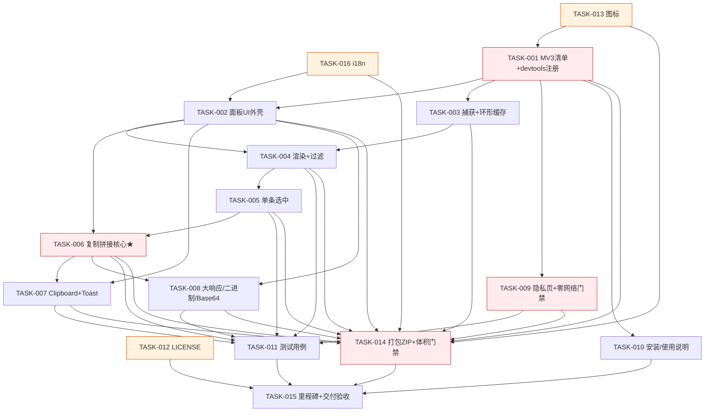

# 依赖图 — 新建 Chrome/Edge DevTools MV3 扩展

> slug: `新建一个-chrome-edge-devtools-扩展-manifest-v3-在-devto`
> 真源: `butler/spec/<slug>/spec.json`（80 items）+ `butler/plan/<slug>/plan.md`（requirement/design/stories/tech-eval）
> 说明: DAG 无环；`depends-on` 见各 `TASK-N.md` frontmatter。

## 1. Mermaid 依赖图

## 2. 关键路径（最长链）

`TASK-013 → TASK-001 → TASK-002 → TASK-004 → TASK-005 → TASK-006 → TASK-007/TASK-008 → TASK-011 → TASK-015`

以及交付收口链：`... → TASK-014 → TASK-015`。

- 关键路径含 AC-007 命门（TASK-006）与安全门禁（TASK-001/009/014），任何一环失败都阻塞 `TASK-015` 交付验收。
- `TASK-010 / TASK-012 / TASK-016 / TASK-013` 为可并行起点。

## 3. 并行批次（拓扑分层）

| 批次 | 可并行 TASK |
|:----:|-------------|
| L0 | TASK-012, TASK-013, TASK-016 |
| L1 | TASK-001 |
| L2 | TASK-002, TASK-003, TASK-009, TASK-010 |
| L3 | TASK-004 |
| L4 | TASK-005 |
| L5 | TASK-006 |
| L6 | TASK-007, TASK-008, TASK-011 |
| L7 | TASK-014 |
| L8 | TASK-015 |

> 注：`TASK-006` 依赖 `TASK-005`（选中）与 `TASK-002`（面板接线）；`TASK-008` 在 `TASK-006` 之后接入 content 分类（formatter 可先"body 原样直通"）。无循环依赖。

## 4. 循环依赖检测

对全部 `depends-on` 边做拓扑校验：**无环（DAG）**。
