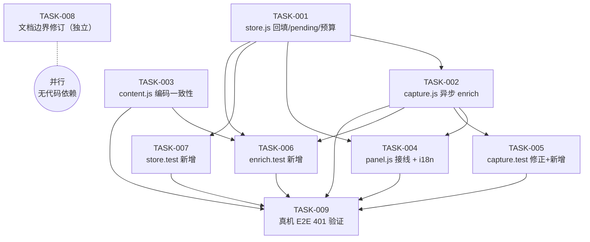

# 依赖图 — 缺陷-raw-copy-扩展复制出的内容里-response-body-显示为-响应体不可用-丢

> 真源：`butler/tasks/backlog/<slug>/TASK-*.md` 的 `depends-on`。
> 拓扑为 **DAG（无环）**。`TASK-008`（文档）为独立支线，可全程并行。

## 依赖类型说明

| 边 | 类型 | 说明 |
|----|------|------|
| T1 → T2 | 数据/接口 | capture 使用 store 新增的 `update` / `markPending` / `resolvePending` / 预算 |
| T1 → T4 | 接口 | panel 订阅 `update` 事件、调用 `awaitPending` |
| T1 → T6 / T7 | 接口 | 测试针对 store 新 API |
| T2 → T4 | 逻辑 | panel 的 pending 分支/复制竞态依赖 enrich 行为 |
| T2 → T5 | 逻辑 | 测试断言基于 capture 的新 enrich 语义 |
| T2 → T6 | 逻辑 | enrich 专项测试 |
| T3 → T6 | 逻辑 | base64 + 文本 MIME 用例依赖分类一致性 |
| T2..T7 → T9 | 验证 | 真机 E2E 在全部实现/测试就位后执行 |
| T8 | 无 | 文档修订，独立并行 |

## 并行批次（建议）

1. **批次 1**：TASK-001、TASK-003、TASK-008（互不冲突）
2. **批次 2**：TASK-002、TASK-007（T2 依赖 T1）
3. **批次 3**：TASK-004、TASK-005、TASK-006
4. **批次 4**：TASK-009（终验）

## 循环依赖检测

- 检测方法：对 `depends-on` 建图后做 Kahn 拓扑排序。
- 结果：**无环**（所有节点均可被线性化）；无 `[circular_dependency]`。
